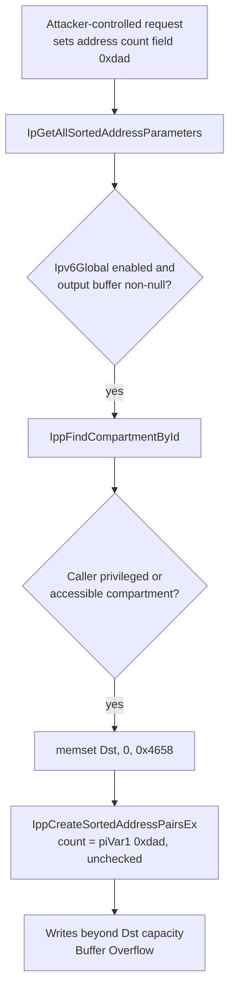

# CVE-2026-49177

**CVE:** CVE-2026-49177  
**Title:** Windows TCP/IP Information Disclosure Vulnerability  
**Source:** [https://msrc.microsoft.com/update-guide/vulnerability/CVE-2026-49177](https://msrc.microsoft.com/update-guide/vulnerability/CVE-2026-49177)  
**Component(s):** tcpip.sys  
**Patched Date:** 2026-07-14T07:00:00  
**CWE:** Out-of-bounds read in Windows TCP/IP allows an authorized attacker to disclose information locally.  

Download Patched & Vulnerable Components:

```bash
# tcpip.sys
wget https://msdl.microsoft.com/download/symbols/tcpip.sys/F74AE133359000/tcpip.sys -O tcpip.sys.10.0.26100.8737 # vulnerable
wget https://msdl.microsoft.com/download/symbols/tcpip.sys/319D847235A000/tcpip.sys -O tcpip.sys.10.0.26100.8875 # patched
```

## Version Tracking Analysis

**Command:**

```
python ghidra_scripts\ghidra_vt_wrapper.py --old-binary ./reports/2026-Jul/CVE-2026-49177/tcpip.sys.10.0.26100.8737 --new-binary ./reports/2026-Jul/CVE-2026-49177/tcpip.sys.10.0.26100.8875 --project-dir ./reports/2026-Jul/CVE-2026-49177/ghidra_project --project-name tcpip.sys_CVE-2026-49177 --ghidra-dir C:\Tools\ghidra_11.4.2_PUBLIC_20250826\ghidra_11.4.2_PUBLIC --output-dir ./reports/2026-Jul/CVE-2026-49177/ghidra_project/vt_results --max-memory 16g
```

Patched Functions: 4 | New Functions: 38 | Removed Functions: 30 | Total Matches: 48041 | Accepted Matches: 40902

### Patched Functions

| Function Name | Source Address | Dest Address | Similarity | Confidence |
| --- | --- | --- | --- | --- |
| `IppReassemblyInterfaceCleanup` | `140097ed0` | `1400759c0` | 0.864 | 10.0 |
| `IppDeleteSitePrefixes` | `1400981c4` | `140075b68` | 0.683 | 10.0 |
| `IpGetAllSortedAddressParameters` | `1400b4210` | `140148810` | 0.631 | 10.0 |
| `RawBindEndpointInspectComplete` | `140086c90` | `140055d00` | 0.624 | 10.0 |

### New Functions

*Showing 10 of 38 new functions*

| Function Name | Address |
| --- | --- |
| `FUN_14005140f` | `14005140f` |
| `FUN_1400bdf7a` | `1400bdf7a` |
| `caseD_24` | `1400e62e8` |
| `Feature_1204007226__private_IsEnabledDeviceUsageNoInline` | `14016cf8c` |
| `Feature_1204007226__private_IsEnabledFallback` | `14016cfc4` |
| `Feature_4272399675__private_IsEnabledDeviceUsageNoInline` | `1401915c4` |
| `Feature_4272399675__private_IsEnabledFallback` | `1401915fc` |
| `Feature_3999242553__private_IsEnabledDeviceUsageNoInline` | `1401a60ac` |
| `Feature_3999242553__private_IsEnabledFallback` | `1401a60e4` |
| `Feature_3131548987__private_IsEnabledDeviceUsageNoInline` | `1401c0a90` |

### Removed Functions

*Showing 10 of 30 removed functions*

| Function Name | Address |
| --- | --- |
| `FUN_1400516ff` | `1400516ff` |
| `FUN_1400c434a` | `1400c434a` |
| `caseD_24` | `1400e3c28` |
| `_guard_dispatch_icall` | `1401c2db0` |
| `FUN_1401c6e96` | `1401c6e96` |
| `FUN_1401c8989` | `1401c8989` |
| `FUN_1401cb554` | `1401cb554` |
| `FUN_1401cceb6` | `1401cceb6` |
| `FUN_1401ccede` | `1401ccede` |
| `FUN_1401cd652` | `1401cd652` |

---

# AI Technical Analysis

## Vulnerability Identification

**Core Vulnerable Function(s):**
- `IpGetAllSortedAddressParameters()` - Uses an
  attacker-influenced entry count (`piVar1[0xdad]`) to drive
  `IppCreateSortedAddressPairsEx()` against a fixed-size output
  buffer (`_Dst`, 0x4658 bytes) without validating the count
  against the buffer's actual capacity, permitting a buffer
  overflow.

**Supporting Changes:**
- `RawBindEndpointInspectComplete()` - Purely cosmetic
  decompiler-visible differences (stack variable renames such
  as `local_88` -> `uStack_88`, relocated jump-target literals,
  renamed `DAT_*` globals) produced by relinking the binary at a
  new base; no control-flow or logic change.

**Unrelated Changes:**
- `IppDeleteSitePrefixes()` - Empty diff; no code modified.
- `IppReassemblyInterfaceCleanup()` - Empty diff; no code
  modified.
- `InetWakeRemovePortEntryIfPresent()` (new) - Generic circular
  doubly linked list unlink helper with a corruption assertion
  (`swi 0x29`); not invoked from the vulnerable path shown.
- `caseD_24()` (new) - Trivial `switch` case stub that returns
  the constant `1`; not security relevant.

---

## Root Cause Analysis

The flaw is a classic missing-bounds-check leading to a
buffer overflow. `IpGetAllSortedAddressParameters()` reads a
caller-supplied entry count, `piVar1[0xdad]`, out of an input
parameter block and forwards it directly to
`IppCreateSortedAddressPairsEx()`, which uses that count to
populate a fixed-capacity output buffer, `_Dst`, allocated and
zeroed by the caller with `memset(_Dst,0,0x4658)`. The
invariant the code implicitly (and incorrectly) assumes is that
`piVar1[0xdad]` never exceeds the number of entries `_Dst` can
hold; nothing in the pre-patch code enforces that assumption.

Vulnerable code:

```c
if ((*(int *)(param_1 + 0x20) == 0) && (_Dst != (void *)0x0)) {
  lVar4 = IppFindCompartmentById(&Ipv6Global);
  if (lVar4 != 0) {
    if ((*piVar1 == 0) ||
        (cVar2 = IppIsCompartmentAccessibleByThread(lVar4,0,1),
         cVar2 != '\0')) {
      memset(_Dst,0,0x4658);
      uVar3 = IppCreateSortedAddressPairsEx
                (lVar4,piVar1[0xdae],_Dst,(longlong)_Dst + 14000,
                 piVar1 + 1,piVar1[0xdad],
                 (longlong)_Dst + 0x36b4,(longlong)_Dst + 0x4654);
    }
    ...
```

`_Dst` is sized for exactly 0x4658 (18008) bytes. The end
markers passed alongside it, `_Dst + 14000` and
`_Dst + 0x36b4` (14004) and `_Dst + 0x4654` (18004), are
region-boundary hints consumed *inside*
`IppCreateSortedAddressPairsEx()`, but the count that drives how
many source/destination pairs get produced,
`piVar1[0xdad]`, is passed through with no upper limit. Dividing
the buffer size by the patched limit (`0x4658 / 0x1f5 ~= 36`
bytes) indicates each address-pair record consumes roughly one
sockaddr-pair's worth of storage, and the pre-patch code allowed
`piVar1[0xdad]` to specify far more records than that,
correspondence with the caller-controlled address list length
that ultimately backs `piVar1 + 1`. Any caller able to set this
count (through the ioctl/request structure feeding `param_1`)
could force the routine to write past the end of `_Dst`,
corrupting adjacent kernel memory in `tcpip.sys`.

---

## Execution and Trigger Flow

An attacker reaches this code by issuing a request that
resolves to `IpGetAllSortedAddressParameters()` in `tcpip.sys`,
supplying an input parameter block whose `0xdad` dword-index
field encodes the number of address entries to sort (this
field, together with the array at `piVar1 + 1`, models a
user-suppliable address list, consistent with sorted-address
requests such as `SIO_ADDRESS_LIST_SORT`-style IOCTLs). The
function first validates that IPv6 is enabled
(`Ipv6Global != '\0'`) and that the caller's request flag at
`param_1 + 0x20` is zero and an output buffer at `param_1 + 0x38`
is non-null. It then locates the network compartment via
`IppFindCompartmentById()` and, if the caller is not privileged
(`*piVar1 == 0`) or passes an accessibility check, proceeds to
zero the 0x4658-byte output buffer and calls
`IppCreateSortedAddressPairsEx()` with the unchecked count
`piVar1[0xdad]`. Because no earlier guard clamps this count
relative to the buffer's real capacity, a sufficiently large
value drives writes past the end of `_Dst`. Depending on where
`_Dst` is allocated (stack or pool), this overflow can corrupt
adjacent kernel data structures or control data, yielding a
denial of service or a route toward remote code execution in
kernel context, since `tcpip.sys` runs at elevated IRQL/kernel
privilege and processes this logic without further validation
of the attacker-influenced count.



---

## Patch Analysis

```diff
+  if ((Feature_4272399675__private_featureState & 0x10) == 0) {
+    uVar3 = Feature_4272399675__private_IsEnabledDeviceUsageNoInline();
+  }
+  else {
+    uVar3 = Feature_4272399675__private_featureState & 1;
+  }
+  if ((uVar3 == 0) || ((uint)piVar1[0xdad] < 0x1f5)) {
     if (Ipv6Global == '\0') {
       return 0xc00000bb;
     }
     if ((*(int *)(param_1 + 0x20) == 0) && (_Dst != (void *)0x0)) {
       lVar5 = IppFindCompartmentById(&Ipv6Global);
       if (lVar5 != 0) {
         ...
         IppDereferenceCompartment(lVar5);
         return uVar4;
       }
       return 0xc0000225;
     }
   }
   return 0xc000000d;
```

The patch inserts an explicit gate before any of the
buffer-populating logic runs. It first evaluates a feature-flag
state (`Feature_4272399675__private_featureState`), either
reading a cached bit or calling
`Feature_4272399675__private_IsEnabledDeviceUsageNoInline()` to
determine `uVar3`. The critical change is the compound
condition `(uVar3 == 0) || ((uint)piVar1[0xdad] < 0x1f5)`: when
the feature is enabled (`uVar3 != 0`), the legacy sorting path
now only executes if the caller-supplied entry count,
`piVar1[0xdad]`, is strictly less than `0x1f5` (501 entries). If
the count is at or above that threshold, the function falls
through to `return 0xc000000d` (`STATUS_INVALID_PARAMETER`)
without ever calling `memset()` or
`IppCreateSortedAddressPairsEx()`, so the previously unbounded
count can no longer reach the fixed-size `_Dst` buffer.

This is an effective, minimally invasive fix: it caps the
attacker-controlled quantity at the exact scale the 0x4658-byte
buffer can safely absorb, cutting off the overflow path at its
origin rather than attempting to harden the downstream sorting
routine. The gate is placed ahead of every subsequent branch
that reaches `_Dst`, so all call paths into the legacy sort
routine inherit the bound. Because the check rejects the
request outright (`STATUS_INVALID_PARAMETER`) rather than
truncating or clamping the count, it avoids partial/inconsistent
processing that could itself introduce new bugs.

Security impact: the patch eliminates a kernel-mode
out-of-bounds write reachable from an attacker-influenced
address-count parameter in `tcpip.sys`, closing a vulnerability
that could otherwise lead to memory corruption, denial of
service, or potential escalation to remote/local code execution
in kernel context.