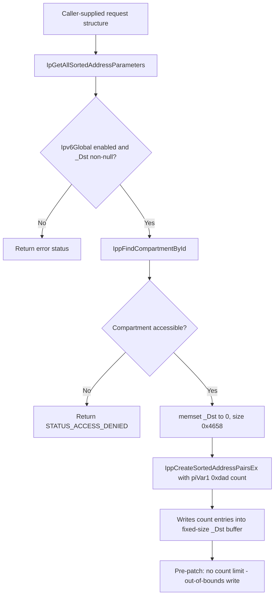

# CVE-2026-49177

**CVE:** CVE-2026-49177  
**Title:** Windows TCP/IP Information Disclosure Vulnerability  
**Source:** [https://msrc.microsoft.com/update-guide/vulnerability/CVE-2026-49177](https://msrc.microsoft.com/update-guide/vulnerability/CVE-2026-49177)  
**Component(s):** tcpip.sys  
**Patched Date:** 2026-07-14T07:00:00  
**CWE:** Out-of-bounds read in Windows TCP/IP allows an authorized attacker to disclose information locally.  

---

## Related CVEs (Same Component)

This report covers 4 CVEs affecting the same component(s):

- **CVE-2026-49177**  
- CVE-2026-54999  
- CVE-2026-50306  
- CVE-2026-50307  

### Detailed Information

#### CVE-2026-54999

**Title:** Windows TCP/IP Remote Code Execution Vulnerability  
**Source:** [https://msrc.microsoft.com/update-guide/vulnerability/CVE-2026-54999](https://msrc.microsoft.com/update-guide/vulnerability/CVE-2026-54999)  
**Patched Date:** 2026-07-14T07:00:00  
**CWE:** Concurrent execution using shared resource with improper synchronization ('race condition') in Windows TCP/IP allows an unauthorized attacker to execute code over an adjacent network.  

#### CVE-2026-50306

**Title:** Windows TCP/IP Elevation of Privilege Vulnerability  
**Source:** [https://msrc.microsoft.com/update-guide/vulnerability/CVE-2026-50306](https://msrc.microsoft.com/update-guide/vulnerability/CVE-2026-50306)  
**Patched Date:** 2026-07-14T07:00:00  
**CWE:** Use after free in Windows TCP/IP allows an authorized attacker to elevate privileges locally.  

#### CVE-2026-50307

**Title:** Windows TCP/IP Elevation of Privilege Vulnerability  
**Source:** [https://msrc.microsoft.com/update-guide/vulnerability/CVE-2026-50307](https://msrc.microsoft.com/update-guide/vulnerability/CVE-2026-50307)  
**Patched Date:** 2026-07-14T07:00:00  
**CWE:** Use after free in Windows TCP/IP allows an authorized attacker to elevate privileges locally.  

---

Download Patched & Vulnerable Components:

```bash
# tcpip.sys
wget https://msdl.microsoft.com/download/symbols/tcpip.sys/F74AE133359000/tcpip.sys -O tcpip.sys.10.0.26100.8737 # vulnerable
wget https://msdl.microsoft.com/download/symbols/tcpip.sys/319D847235A000/tcpip.sys -O tcpip.sys.10.0.26100.8875 # patched
```

## Version Tracking Analysis

**Command:**

```
python ghidra_scripts\ghidra_vt_wrapper.py --old-binary ./reports/2026-Jul/CVE-2026-49177/tcpip.sys.10.0.26100.8737 --new-binary ./reports/2026-Jul/CVE-2026-49177/tcpip.sys.10.0.26100.8875 --project-dir ./reports/2026-Jul/CVE-2026-49177/ghidra_project --project-name tcpip.sys_CVE-2026-49177 --ghidra-dir C:\Tools\ghidra_11.4.2_PUBLIC_20250826\ghidra_11.4.2_PUBLIC --output-dir ./reports/2026-Jul/CVE-2026-49177/ghidra_project/vt_results --max-memory 16g
```

Patched Functions: 4 | New Functions: 38 | Removed Functions: 30 | Total Matches: 48041 | Accepted Matches: 40902

### Patched Functions

| Function Name | Source Address | Dest Address | Similarity | Confidence |
| --- | --- | --- | --- | --- |
| `IppReassemblyInterfaceCleanup` | `140097ed0` | `1400759c0` | 0.864 | 10.0 |
| `IppDeleteSitePrefixes` | `1400981c4` | `140075b68` | 0.683 | 10.0 |
| `IpGetAllSortedAddressParameters` | `1400b4210` | `140148810` | 0.631 | 10.0 |
| `RawBindEndpointInspectComplete` | `140086c90` | `140055d00` | 0.624 | 10.0 |

### New Functions

*Showing 10 of 38 new functions*

| Function Name | Address |
| --- | --- |
| `FUN_14005140f` | `14005140f` |
| `FUN_1400bdf7a` | `1400bdf7a` |
| `caseD_24` | `1400e62e8` |
| `Feature_1204007226__private_IsEnabledDeviceUsageNoInline` | `14016cf8c` |
| `Feature_1204007226__private_IsEnabledFallback` | `14016cfc4` |
| `Feature_4272399675__private_IsEnabledDeviceUsageNoInline` | `1401915c4` |
| `Feature_4272399675__private_IsEnabledFallback` | `1401915fc` |
| `Feature_3999242553__private_IsEnabledDeviceUsageNoInline` | `1401a60ac` |
| `Feature_3999242553__private_IsEnabledFallback` | `1401a60e4` |
| `Feature_3131548987__private_IsEnabledDeviceUsageNoInline` | `1401c0a90` |

### Removed Functions

*Showing 10 of 30 removed functions*

| Function Name | Address |
| --- | --- |
| `FUN_1400516ff` | `1400516ff` |
| `FUN_1400c434a` | `1400c434a` |
| `caseD_24` | `1400e3c28` |
| `_guard_dispatch_icall` | `1401c2db0` |
| `FUN_1401c6e96` | `1401c6e96` |
| `FUN_1401c8989` | `1401c8989` |
| `FUN_1401cb554` | `1401cb554` |
| `FUN_1401cceb6` | `1401cceb6` |
| `FUN_1401ccede` | `1401ccede` |
| `FUN_1401cd652` | `1401cd652` |

---

# AI Technical Analysis

## Vulnerability Identification

**Core Vulnerable Function(s):**
- `IpGetAllSortedAddressParameters()` - Missing upper-bound
  validation on an attacker/caller-controlled address count
  (`piVar1[0xdad]`) that is passed directly into
  `IppCreateSortedAddressPairsEx()` alongside a fixed-size,
  0x4658-byte output buffer (`_Dst`). Prior to the patch, no
  code path limited this count, allowing the sort routine to
  write past the end of the allocated buffer.

**Supporting Changes:**
- None identified. The diff for this function contains only the
  vulnerable/patched logic itself; the caller that supplies
  `param_1` is not included in the provided diffs.

**Unrelated Changes:**
- `RawBindEndpointInspectComplete()` - Pure decompiler/compiler
  artifacts: local variable renames (`local_88` to `uStack_88`,
  `local_40` to `plStack_40`, `local_30` to `uStack_30`) and
  updated absolute return-address/jump-target literals and
  `DAT_*` offsets. These shifts are consistent with the binary
  being relinked after code was added elsewhere (e.g. the real
  fix in `IpGetAllSortedAddressParameters`), not a logic change
  in this function.
- `IppDeleteSitePrefixes()` - Empty diff; no functional change.
- `IppReassemblyInterfaceCleanup()` - Empty diff; no functional
  change.
- `caseD_24()` - Trivial new switch-case stub returning a
  constant (`1`); not security relevant.
- `InetWakeRemovePortEntryIfPresent()` - Generic doubly-linked
  list unlink helper with a consistency assertion
  (`swi(0x29)`/`swi(3)`). It is new code but is a self-contained
  list-removal utility unrelated to the address-sorting count
  validation that defines this CVE.

---

## Root Cause Analysis

The vulnerability is a missing bounds check on a caller-supplied
element count that is used to drive writes into a fixed-size
output buffer. The invariant that was violated is: "the number
of address-pair entries written by `IppCreateSortedAddressPairsEx`
must never exceed the capacity of `_Dst`." Before the patch, this
invariant was never enforced by `IpGetAllSortedAddressParameters`,
so the count field flowed unchecked from the request structure
straight into the buffer-filling routine.

Vulnerable code:

```c
piVar1 = *(int **)(param_1 + 0x10);
_Dst = *(void **)(param_1 + 0x38);
if (Ipv6Global == '\0') {
  return 0xc00000bb;
}
if ((*(int *)(param_1 + 0x20) == 0) && (_Dst != (void *)0x0)) {
  lVar4 = IppFindCompartmentById(&Ipv6Global);
  if (lVar4 != 0) {
    if ((*piVar1 == 0) ||
        (cVar2 = IppIsCompartmentAccessibleByThread(lVar4,0,1),
         cVar2 != '\0')) {
      memset(_Dst,0,0x4658);
      uVar3 = IppCreateSortedAddressPairsEx
                (lVar4,piVar1[0xdae],_Dst,(longlong)_Dst + 14000,
                 piVar1 + 1,piVar1[0xdad],
                 (longlong)_Dst + 0x36b4,(longlong)_Dst + 0x4654);
    }
    ...
```

`_Dst` is zeroed with a hard-coded size of `0x4658` (18008)
bytes, and that same fixed-size region is then handed to
`IppCreateSortedAddressPairsEx` together with `piVar1[0xdad]`,
which is the number of address entries to sort and emit.
`piVar1` is a caller/request-supplied parameter block, so
`piVar1[0xdad]` is effectively attacker-influenced. Nothing in
this function (nor, per the diff, in `IppCreateSortedAddressPairsEx`'s
call site) clamps that value before it is used to iterate and
write entries into `_Dst`. Given the buffer is only large enough
for roughly 500 entries (0x4658 / ~36 bytes per entry), any count
value above that threshold causes the sort routine to write
address-pair structures past the end of `_Dst`, corrupting
adjacent kernel memory. The only gating logic present was
unrelated to size - it checked compartment accessibility
(`IppIsCompartmentAccessibleByThread`) and administrative flags
(`*piVar1 == 0`), neither of which bounds the entry count.

---

## Execution and Trigger Flow

An attacker-reachable request path in `tcpip.sys` populates a
request structure whose fields are read by
`IpGetAllSortedAddressParameters`: a pointer to a parameter block
(`piVar1`) at offset `0x10`, a flags field at offset `0x20`, and
an output buffer pointer (`_Dst`) at offset `0x38`. The function
validates that IPv6 is globally enabled and that the output
buffer is non-null, resolves the network compartment via
`IppFindCompartmentById`, and checks that the requesting context
is allowed to access that compartment. Once these checks pass,
it zeroes the fixed-size output buffer and calls
`IppCreateSortedAddressPairsEx`, forwarding the unvalidated count
field `piVar1[0xdad]` as the number of entries to produce. If a
caller supplies a `piVar1[0xdad]` value larger than the buffer
can hold, `IppCreateSortedAddressPairsEx` writes sorted
address-pair entries beyond the end of the `0x4658`-byte `_Dst`
allocation, corrupting adjacent memory in the driver's address
space. Because this occurs inside `tcpip.sys`, successful
exploitation of the resulting memory corruption can lead to
kernel-mode memory corruption and potential privilege escalation
or denial of service.



---

## Patch Analysis

Patched logic (unified diff):

```diff
+  if ((Feature_4272399675__private_featureState & 0x10) == 0) {
+    uVar3 = Feature_4272399675__private_IsEnabledDeviceUsageNoInline();
+  }
+  else {
+    uVar3 = Feature_4272399675__private_featureState & 1;
+  }
+  if ((uVar3 == 0) || ((uint)piVar1[0xdad] < 0x1f5)) {
     if (Ipv6Global == '\0') {
       return 0xc00000bb;
     }
     if ((*(int *)(param_1 + 0x20) == 0) && (_Dst != (void *)0x0)) {
       ...
       memset(_Dst,0,0x4658);
       uVar4 = IppCreateSortedAddressPairsEx(...);
       ...
     }
+  }
   return 0xc000000d;
```

The patch introduces a feature-gated bounds check ahead of the
existing logic. It first evaluates a feature-flag state
(`Feature_4272399675__private_featureState`), either reading it
directly or resolving it via
`Feature_4272399675__private_IsEnabledDeviceUsageNoInline()`. If
the feature is disabled (`uVar3 == 0`), behavior falls back to
the original, unbounded path. If the feature is enabled, the
function additionally requires that the caller-supplied entry
count `piVar1[0xdad]` be strictly less than `0x1f5` (501
decimal) before proceeding into the compartment lookup and
`IppCreateSortedAddressPairsEx` call. If the count is 501 or
greater, the function now short-circuits directly to
`return 0xc000000d` (`STATUS_INVALID_PARAMETER`), never reaching
the `memset`/sort call, and therefore never writing into `_Dst`
with an oversized count.

This effectively caps the number of address-pair entries written
into the fixed `0x4658`-byte buffer to a value consistent with
its actual capacity (roughly 500 entries at ~36 bytes each),
closing the out-of-bounds write. The fix is a targeted,
input-validation patch: it does not change buffer sizes,
allocation strategy, or the sorting algorithm itself, only the
admission of the count parameter that drives how much is written.
The feature-flag gating suggests a staged/controlled rollout
mechanism typical of Windows servicing, rather than a
correctness concern with the check itself.

Overall, this closes an out-of-bounds write in a kernel network
driver reachable via a request-derived count field, eliminating
the primary memory-corruption vector described above while
preserving legacy behavior when the associated feature is
disabled.