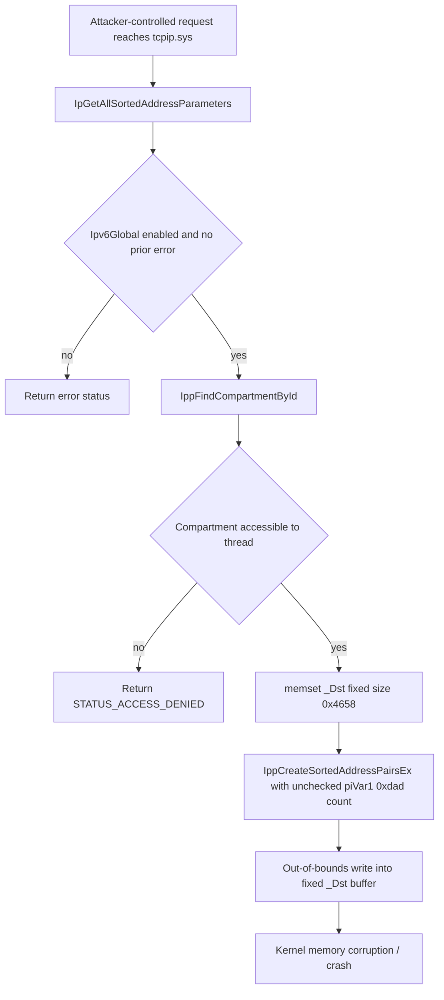

# CVE-2026-49177

**CVE:** CVE-2026-49177  
**Title:** Windows TCP/IP Information Disclosure Vulnerability  
**Source:** [https://msrc.microsoft.com/update-guide/vulnerability/CVE-2026-49177](https://msrc.microsoft.com/update-guide/vulnerability/CVE-2026-49177)  
**Component(s):** tcpip.sys  
**Patched Date:** 2026-07-14T07:00:00  
**CWE:** Out-of-bounds read in Windows TCP/IP allows an authorized attacker to disclose information locally.  

Download Patched & Vulnerable Components:

```bash
# tcpip.sys
wget https://msdl.microsoft.com/download/symbols/tcpip.sys/F74AE133359000/tcpip.sys -O tcpip.sys.10.0.26100.8737 # vulnerable
wget https://msdl.microsoft.com/download/symbols/tcpip.sys/319D847235A000/tcpip.sys -O tcpip.sys.10.0.26100.8875 # patched
```

## Version Tracking Analysis

**Command:**

```
python ghidra_scripts\ghidra_vt_wrapper.py --old-binary ./reports/2026-Jul/CVE-2026-49177/tcpip.sys.10.0.26100.8737 --new-binary ./reports/2026-Jul/CVE-2026-49177/tcpip.sys.10.0.26100.8875 --project-dir ./reports/2026-Jul/CVE-2026-49177/ghidra_project --project-name tcpip.sys_CVE-2026-49177 --ghidra-dir C:\Tools\ghidra_11.4.2_PUBLIC_20250826\ghidra_11.4.2_PUBLIC --output-dir ./reports/2026-Jul/CVE-2026-49177/ghidra_project/vt_results --max-memory 16g
```

Patched Functions: 4 | New Functions: 38 | Removed Functions: 30 | Total Matches: 48041 | Accepted Matches: 40902

### Patched Functions

| Function Name | Source Address | Dest Address | Similarity | Confidence |
| --- | --- | --- | --- | --- |
| `IppReassemblyInterfaceCleanup` | `140097ed0` | `1400759c0` | 0.864 | 10.0 |
| `IppDeleteSitePrefixes` | `1400981c4` | `140075b68` | 0.683 | 10.0 |
| `IpGetAllSortedAddressParameters` | `1400b4210` | `140148810` | 0.631 | 10.0 |
| `RawBindEndpointInspectComplete` | `140086c90` | `140055d00` | 0.624 | 10.0 |

### New Functions

*Showing 10 of 38 new functions*

| Function Name | Address |
| --- | --- |
| `FUN_14005140f` | `14005140f` |
| `FUN_1400bdf7a` | `1400bdf7a` |
| `caseD_24` | `1400e62e8` |
| `Feature_1204007226__private_IsEnabledDeviceUsageNoInline` | `14016cf8c` |
| `Feature_1204007226__private_IsEnabledFallback` | `14016cfc4` |
| `Feature_4272399675__private_IsEnabledDeviceUsageNoInline` | `1401915c4` |
| `Feature_4272399675__private_IsEnabledFallback` | `1401915fc` |
| `Feature_3999242553__private_IsEnabledDeviceUsageNoInline` | `1401a60ac` |
| `Feature_3999242553__private_IsEnabledFallback` | `1401a60e4` |
| `Feature_3131548987__private_IsEnabledDeviceUsageNoInline` | `1401c0a90` |

### Removed Functions

*Showing 10 of 30 removed functions*

| Function Name | Address |
| --- | --- |
| `FUN_1400516ff` | `1400516ff` |
| `FUN_1400c434a` | `1400c434a` |
| `caseD_24` | `1400e3c28` |
| `_guard_dispatch_icall` | `1401c2db0` |
| `FUN_1401c6e96` | `1401c6e96` |
| `FUN_1401c8989` | `1401c8989` |
| `FUN_1401cb554` | `1401cb554` |
| `FUN_1401cceb6` | `1401cceb6` |
| `FUN_1401ccede` | `1401ccede` |
| `FUN_1401cd652` | `1401cd652` |

---

# AI Technical Analysis

## Vulnerability Identification

**Core Vulnerable Function(s):**
- `IpGetAllSortedAddressParameters()` - Missing validation of an
  attacker/caller-supplied address count (`piVar1[0xdad]`) before it
  is passed into `IppCreateSortedAddressPairsEx()`, which writes
  sorted address pairs into a fixed-size output buffer (`_Dst`,
  zeroed for `0x4658` bytes). An oversized count allows the sort
  routine to write past the bounds of `_Dst`.

**Supporting Changes:**
- None. The patch is fully contained within
  `IpGetAllSortedAddressParameters()`; no caller was modified to
  pass additional validated state.

**Unrelated Changes:**
- `RawBindEndpointInspectComplete()` - The diff only renames stack
  variables (`local_88` to `uStack_88`, `local_40` to `plStack_40`,
  `local_30` to `uStack_30`) and shifts embedded return-address
  literals due to recompilation/relinking. Control flow and logic
  are byte-for-byte identical; this is decompiler/build artifact
  noise, not a security fix.
- `IppDeleteSitePrefixes()` - Empty diff, no modification shown.
- `IppReassemblyInterfaceCleanup()` - Empty diff, no modification
  shown.
- `caseD_24()` - Trivial new switch-case stub returning a constant
  `1`; unrelated to address sorting.
- `InetWakeRemovePortEntryIfPresent()` - New doubly-linked-list
  unlink helper with a standard corruption check
  (`__fastfail`/`swi(0x29)` on inconsistent links). It follows the
  same list-integrity pattern already used elsewhere in `tcpip.sys`
  but is not implicated in the buffer overflow being patched.

---

## Root Cause Analysis

The vulnerability is a missing bounds check on a caller-controlled
element count prior to a fixed-size buffer fill operation. The
function trusted an input structure field, `piVar1[0xdad]`, as the
number of address entries to sort and forwarded it directly to
`IppCreateSortedAddressPairsEx()` without ever comparing it against
the capacity of the destination buffer, violating the implicit
invariant that the entry count must fit within the pre-zeroed
`0x4658`-byte (17,752-byte) `_Dst` region.

Vulnerable code:

```c
piVar1 = *(int **)(param_1 + 0x10);
_Dst = *(void **)(param_1 + 0x38);
if (Ipv6Global == '\0') {
  return 0xc00000bb;
}
if ((*(int *)(param_1 + 0x20) == 0) && (_Dst != (void *)0x0)) {
  lVar4 = IppFindCompartmentById(&Ipv6Global);
  if (lVar4 != 0) {
    if ((*piVar1 == 0) ||
        (cVar2 = IppIsCompartmentAccessibleByThread(lVar4,0,1),
         cVar2 != '\0')) {
      memset(_Dst,0,0x4658);
      uVar3 = IppCreateSortedAddressPairsEx
                (lVar4,piVar1[0xdae],_Dst,(longlong)_Dst + 14000,
                 piVar1 + 1,piVar1[0xdad],
                 (longlong)_Dst + 0x36b4,(longlong)_Dst + 0x4654);
    }
    else {
      uVar3 = 0xc0000225;
    }
    IppDereferenceCompartment(lVar4);
    return uVar3;
  }
  return 0xc0000225;
}
return 0xc000000d;
```

`piVar1` is a pointer into the caller-supplied input structure at
offset `+0x10`, and `_Dst` is the caller-supplied output buffer at
offset `+0x38`. After a compartment-accessibility check on `*piVar1`,
the code zeroes `_Dst` for exactly `0x4658` bytes and then calls
`IppCreateSortedAddressPairsEx()`, passing `piVar1[0xdad]` as the
element count and `piVar1 + 1` as the source array, along with three
computed offsets into `_Dst` (`+14000`, `+0x36b4`, `+0x4654`) that
mark internal region boundaries within the fixed output buffer. No
statement anywhere in this path constrains `piVar1[0xdad]` to a
maximum value, so if the caller sets it larger than the buffer can
hold, `IppCreateSortedAddressPairsEx()` will iterate that many times
and write sorted address/pair data past the end of the fixed-size
regions inside `_Dst`, corrupting adjacent memory.

---

## Execution and Trigger Flow

An attacker reaches this code path through a user-mode request that
resolves to `IpGetAllSortedAddressParameters()` in `tcpip.sys`,
supplying an input structure (`param_1`) whose `+0x10` field points
to a caller-controlled parameter block and whose `+0x38` field
points to a fixed-size output buffer. The function first validates
that IPv6 is enabled (`Ipv6Global`) and that no error code is
already present at `param_1+0x20`, then resolves the network
compartment via `IppFindCompartmentById()`. It checks whether the
compartment is accessible to the requesting thread and, if so,
zero-fills the destination buffer for a constant size and invokes
`IppCreateSortedAddressPairsEx()`, forwarding the attacker-supplied
count field `piVar1[0xdad]` unchecked. Because this count is never
compared against the buffer's actual capacity, an attacker can set
it to an arbitrarily large value relative to the fixed `0x4658`-byte
allocation, causing the sort routine to write address-pair entries
beyond the buffer's boundaries. Since this executes in kernel
context inside `tcpip.sys`, the resulting out-of-bounds write can
corrupt adjacent kernel memory, leading to a system crash (denial of
service) or, depending on heap layout and exploitation primitives
available to the attacker, potential kernel memory corruption
suitable for privilege escalation.



---

## Patch Analysis

Patched code introduces a feature-gated bounds check before the
sort/memset path is allowed to execute:

```diff
+  if ((Feature_4272399675__private_featureState & 0x10) == 0) {
+    uVar3 = Feature_4272399675__private_IsEnabledDeviceUsageNoInline();
+  }
+  else {
+    uVar3 = Feature_4272399675__private_featureState & 1;
+  }
+  if ((uVar3 == 0) || ((uint)piVar1[0xdad] < 0x1f5)) {
     if (Ipv6Global == '\0') {
       return 0xc00000bb;
     }
     if ((*(int *)(param_1 + 0x20) == 0) && (_Dst != (void *)0x0)) {
       ... /* unchanged original body, including memset and
             IppCreateSortedAddressPairsEx call */
     }
+  }
   return 0xc000000d;
```

The patch adds a feature-flag lookup
(`Feature_4272399675__private_featureState` /
`Feature_4272399675__private_IsEnabledDeviceUsageNoInline()`) to
determine whether the new validation is active, then gates the
entire original code path behind a condition that requires either
the feature to be disabled or `piVar1[0xdad]` (the address count) to
be strictly less than `0x1f5` (501 decimal). Only when this
condition holds does the function proceed to the compartment lookup,
buffer zeroing, and call into `IppCreateSortedAddressPairsEx()`; if
the count is `0x1f5` or greater with the feature enabled, the
function falls straight through to `return 0xc000000d`
(`STATUS_INVALID_PARAMETER`), skipping the sort call entirely. This
effectively caps the number of address entries that can be processed
per request to the number that safely fits within the fixed
`0x4658`-byte output buffer's internal regions.

The fix directly addresses the root cause by preventing the
unchecked count from ever reaching `IppCreateSortedAddressPairsEx()`
when it exceeds the buffer's known safe capacity, rather than
attempting to enlarge the buffer or make the sort routine
bounds-aware internally. Gating the check behind a feature flag
suggests a staged/controlled rollout (e.g., via Windows feature
management) rather than a purely unconditional fix, which is a
common Microsoft servicing pattern but means the mitigation's
effectiveness depends on the feature state at runtime. Assuming the
feature is enabled, the check reliably eliminates the out-of-bounds
write vector described above by rejecting the malformed request
early with a standard error code.

This change closes the kernel out-of-bounds write in
`tcpip.sys`, removing the primary path to denial-of-service or
potential local privilege escalation via corrupted kernel memory in
the IPv6 address-sorting code.