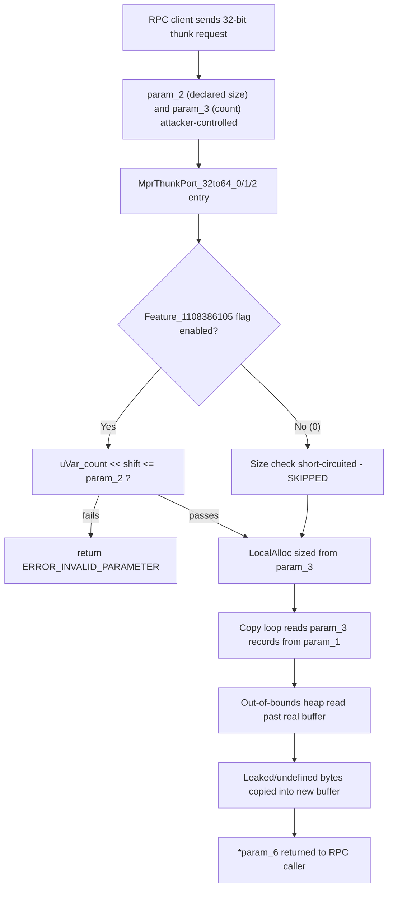

# CVE-2026-49791

**CVE:** CVE-2026-49791  
**Title:** Windows Routing and Remote Access Service (RRAS) Elevation of Privilege Vulnerability  
**Source:** [https://msrc.microsoft.com/update-guide/vulnerability/CVE-2026-49791](https://msrc.microsoft.com/update-guide/vulnerability/CVE-2026-49791)  
**Component(s):** mprapi.dll  
**Patched Date:** 2026-07-14T07:00:00  
**CWE:** Improper link resolution before file access ('link following') in Windows Routing and Remote Access Service (RRAS) allows an authorized attacker to elevate privileges locally.  

---

## Related CVEs (Same Component)

This report covers 3 CVEs affecting the same component(s):

- **CVE-2026-49791**  
- CVE-2026-50451  
- CVE-2026-57096  

### Detailed Information

#### CVE-2026-50451

**Title:** Windows Routing and Remote Access Service (RRAS) Elevation of Privilege Vulnerability  
**Source:** [https://msrc.microsoft.com/update-guide/vulnerability/CVE-2026-50451](https://msrc.microsoft.com/update-guide/vulnerability/CVE-2026-50451)  
**Patched Date:** 2026-07-14T07:00:00  
**CWE:** Missing authentication for critical function in Windows Routing and Remote Access Service (RRAS) allows an authorized attacker to elevate privileges locally.  

#### CVE-2026-57096

**Title:** Windows Routing and Remote Access Service (RRAS) Elevation of Privilege Vulnerability  
**Source:** [https://msrc.microsoft.com/update-guide/vulnerability/CVE-2026-57096](https://msrc.microsoft.com/update-guide/vulnerability/CVE-2026-57096)  
**Patched Date:** 2026-07-14T07:00:00  
**CWE:** Heap-based buffer overflow in Windows Routing and Remote Access Service (RRAS) allows an authorized attacker to elevate privileges locally.  

---

Download Patched & Vulnerable Components:

```bash
# mprapi.dll
wget https://msdl.microsoft.com/download/symbols/mprapi.dll/3C9247C684000/mprapi.dll -O mprapi.dll.10.0.26100.7705 # vulnerable
wget https://msdl.microsoft.com/download/symbols/mprapi.dll/290F8AC484000/mprapi.dll -O mprapi.dll.10.0.26100.7920 # patched
```

## Version Tracking Analysis

**Command:**

```
python ghidra_scripts\ghidra_vt_wrapper.py --old-binary ./reports/2026-Jul/CVE-2026-49791/mprapi.dll.10.0.26100.7705 --new-binary ./reports/2026-Jul/CVE-2026-49791/mprapi.dll.10.0.26100.7920 --project-dir ./reports/2026-Jul/CVE-2026-49791/ghidra_project --project-name mprapi.dll_CVE-2026-49791 --ghidra-dir C:\Tools\ghidra_11.4.2_PUBLIC_20250826\ghidra_11.4.2_PUBLIC --output-dir ./reports/2026-Jul/CVE-2026-49791/ghidra_project/vt_results --max-memory 16g
```

Patched Functions: 4 | New Functions: 9 | Removed Functions: 17 | Total Matches: 18331 | Accepted Matches: 7660

### Patched Functions

| Function Name | Source Address | Dest Address | Similarity | Confidence |
| --- | --- | --- | --- | --- |
| `FUN_180045300` | `180045300` | `180044960` | 0.988 | 1.0 |
| `MprThunkPort_32to64_0` | `1800327e4` | `1800327a8` | 0.908 | 10.0 |
| `MprThunkPort_32to64_2` | `180032b3c` | `180032ad4` | 0.877 | 10.0 |
| `MprThunkPort_32to64_1` | `1800329f8` | `1800329a8` | 0.747 | 10.0 |

### New Functions

| Function Name | Address |
| --- | --- |
| `operator_delete` | `180002861` |
| `what` | `1800028d0` |
| `~exception` | `1800028dc` |
| `exception` | `1800028e8` |
| `exception` | `1800028f4` |
| `exception` | `180002900` |
| `GdiGradientFill` | `180044990` |
| `MulDiv` | `1800449d0` |
| `_guard_dispatch_icall` | `180056370` |

### Removed Functions

*Showing 10 of 17 removed functions*

| Function Name | Address |
| --- | --- |
| `operator_delete` | `180002861` |
| `what` | `1800028d0` |
| `~exception` | `1800028dc` |
| `exception` | `1800028e8` |
| `exception` | `1800028f4` |
| `exception` | `180002900` |
| `Feature_1108386105__private_IsEnabledDeviceUsageNoInline` | `1800305a4` |
| `wil_details_FeatureReporting_RecordUsageInCache` | `180032f64` |
| `wil_details_FeatureReporting_ReportUsageToService` | `180033258` |
| `wil_details_FeatureReporting_ReportUsageToServiceDirect` | `180033374` |

---

# AI Technical Analysis

## Vulnerability Identification

**Core Vulnerable Function(s):**
- `MprThunkPort_32to64_0()` - bounds check on the caller-supplied
  size parameter was conditionally skipped, allowing an
  out-of-bounds read from the source buffer.
- `MprThunkPort_32to64_1()` - identical flawed pattern; size
  validation gated behind a feature flag before it executed.
- `MprThunkPort_32to64_2()` - identical flawed pattern, same
  root cause, larger per-record copy loop.

**Supporting Changes:**
- None. All three functions receive the same structural fix;
  there is no separate "caller" or "helper" function in this
  diff set that merely invokes the vulnerable routines.

**Unrelated Changes:**
- `operator_delete()`, `exception::what()`, `exception::~exception()`,
  `exception::exception()` (x2) - these are compiler-generated
  RTTI/exception-handling thunks recovered by the decompiler
  (self-referential jump-table stubs). They carry no logic
  changes relevant to this CVE and are artifacts of binary
  diffing, not part of the fix.

---

## Root Cause Analysis

The vulnerability is a conditionally-executed bounds check
(CWE-20: Improper Input Validation) that leads to an
out-of-bounds heap read (CWE-125). Each thunk converts an
array of 32-bit RPC structures at `param_1` into a newly
allocated array of 64-bit structures, iterating `param_3`
times. Before trusting `param_3` as an iteration count, the
code must confirm that the caller-declared buffer size
`param_2` actually covers that many source records. In the
vulnerable version this confirmation was optional.

Vulnerable code (`MprThunkPort_32to64_1`, representative of
all three):

```c
else if (uVar6 * 0x48 < 0x100000000) {
    uVar1 = Feature_1108386105__private_IsEnabledDeviceUsageNoInline();
    if ((uVar1 == 0) || (uVar6 << 6 <= (ulonglong)param_2)) {
        pvVar2 = LocalAlloc(0x40, uVar6 * 0x48 & 0xffffffff);
        ...
        do {
            /* copy 14 dwords per record from param_1 into pvVar2 */
            uVar6 = uVar6 - 1;
            puVar3 = puVar3 + 0x12;
            puVar4 = puVar4 + 0x10;
        } while (uVar6 != 0);
    }
    else {
        uVar5 = 0x57;
    }
}
```

`uVar6` holds `param_3` widened to `ulonglong`. `uVar6 << 6`
(equivalently `uVar6 * 64`) is the number of bytes the source
buffer must contain to legitimately back `param_3` 32-bit
records. The intended guard is `uVar6 << 6 <= param_2`. However
this guard is only one operand of an `||` expression whose
first operand is `uVar1 = Feature_1108386105__private_
IsEnabledDeviceUsageNoInline()`. Because `||` short-circuits,
when the feature flag returns `0` (disabled), the whole
expression evaluates true unconditionally and the size
comparison against `param_2` is never evaluated. Execution
falls straight into `LocalAlloc` sized from `param_3` and the
copy loop that dereferences `param_1` for `uVar6` iterations,
each pulling 14+ DWORD/QWORD fields per record. If the real
buffer behind `param_1` is smaller than `param_3` implies,
the loop walks past its end, reading adjacent heap memory
into the freshly allocated output buffer that is then handed
back to the caller via `*param_6`.

---

## Execution and Trigger Flow

These `MprThunkPort_32to64_*` routines are 32-bit-to-64-bit
RPC parameter thunks inside `mprapi.dll`, invoked when a
32-bit (WOW64) client issues an RPC call against the 64-bit
Routing and Remote Access / Multiprotocol Router service.
The RPC runtime unmarshals the 32-bit request into a stack or
heap buffer and calls the matching thunk, passing the element
count (`param_3`) and a size/buffer-length value (`param_2`)
derived from the wire data. An attacker who can reach this RPC
interface controls both values independently: they can send a
request declaring a large `param_3` (record count) while the
actual marshalled payload backing `param_1` corresponds to a
much smaller `param_2`. On a target where the
`Feature_1108386105` rollout flag is off, the thunk skips the
`uVar6 << 6 <= param_2` check entirely, allocates an output
buffer sized for the attacker-chosen `param_3`, and loops that
many times reading fixed-size records starting at `param_1`.
Because the real input buffer is smaller, later iterations
read past its bounds into adjacent heap memory. That
over-read data is copied into the newly allocated buffer and
returned to the RPC caller through `*param_6`, enabling
information disclosure of heap contents, or triggering an
access violation on unmapped memory (denial of service) if
the over-read crosses a page boundary.



---

## Patch Analysis

Patched code (`MprThunkPort_32to64_1`, representative of all
three; identical restructuring in `_0` and `_2`):

```diff
-    uVar1 = Feature_1108386105__private_IsEnabledDeviceUsageNoInline();
-    if ((uVar1 == 0) || (uVar6 << 6 <= (ulonglong)param_2)) {
-      pvVar2 = LocalAlloc(0x40,uVar6 * 0x48 & 0xffffffff);
-      if (pvVar2 == (HLOCAL)0x0) {
-        uVar5 = 8;
+    if ((param_2 & 0xffffffff) < uVar5 << 6) {
+      uVar4 = 0x57;
+    }
+    else {
+      pvVar1 = LocalAlloc(0x40,uVar5 * 0x48 & 0xffffffff);
+      if (pvVar1 == (HLOCAL)0x0) {
+        uVar4 = 8;
       }
       else {
         ... copy loop unchanged ...
       }
-    }
-    else {
-      uVar5 = 0x57;
     }
```

The patch removes the call to
`Feature_1108386105__private_IsEnabledDeviceUsageNoInline()`
and eliminates the `||` short-circuit that previously let the
feature-flag state bypass validation. The size check is
inverted and hoisted to run first and unconditionally: `if
((param_2 & 0xffffffff) < uVar5 << 6)` now always executes,
returning `0x57` (`ERROR_INVALID_PARAMETER`) whenever the
caller-declared buffer size is insufficient for `param_3`
records, before any allocation or copy occurs. The parameter
type change from `uint param_2` to `ulonglong param_2` (with
the comparison masked via `& 0xffffffff`) also removes
ambiguity in how the 32-bit size value is widened for the
64-bit comparison, ensuring consistent zero-extension rather
than relying on implicit conversions. Functionally, valid
callers whose buffers were already large enough are
unaffected; only inputs that previously slipped through the
disabled-feature-flag bypass are now correctly rejected.

This is an effective, complete fix: the invariant `required
source bytes <= param_2` is now enforced on every call path,
independent of any feature flag or A/B rollout state, closing
the CWE-20/CWE-125 gap. Because the check happens before
`LocalAlloc` and before the copy loop touches `param_1`, no
out-of-bounds memory access can occur once the patch is
applied. The change is minimal and localized, carrying low
regression risk while removing an attacker-reachable heap
over-read that could disclose process memory or crash the
`mprapi.dll`-hosted service.