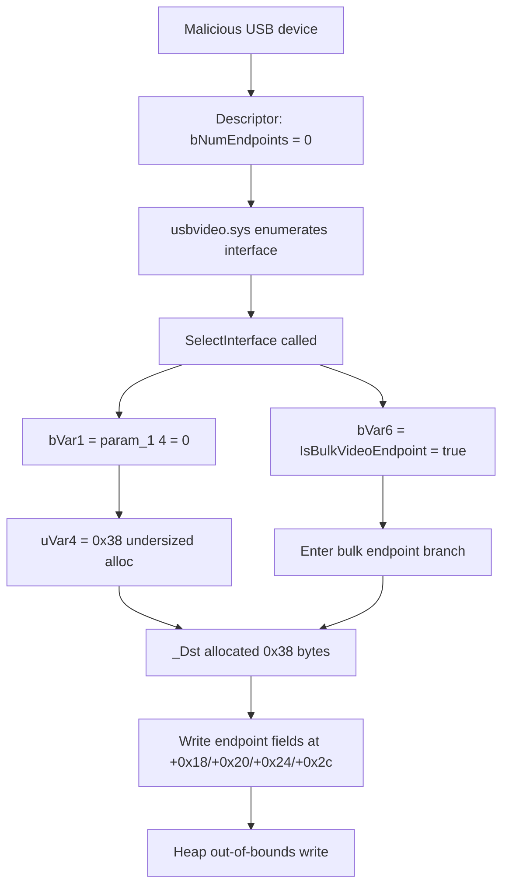

# CVE-2026-49804

**CVE:** CVE-2026-49804  
**Title:** Windows USB Video Driver Elevation of Privilege Vulnerability  
**Source:** [https://msrc.microsoft.com/update-guide/vulnerability/CVE-2026-49804](https://msrc.microsoft.com/update-guide/vulnerability/CVE-2026-49804)  
**Component(s):** usbvideo.sys  
**Patched Date:** 2026-07-14T07:00:00  
**CWE:** Heap-based buffer overflow in Windows USB Video Driver allows an unauthorized attacker to elevate privileges with a physical attack.  

Download Patched & Vulnerable Components:

```bash
# usbvideo.sys
wget https://msdl.microsoft.com/download/symbols/usbvideo.sys/E42178A265000/usbvideo.sys -O usbvideo.sys.10.0.26100.8737 # vulnerable
wget https://msdl.microsoft.com/download/symbols/usbvideo.sys/A35F97EF65000/usbvideo.sys -O usbvideo.sys.10.0.26100.8875 # patched
```

## Version Tracking Analysis

**Command:**

```
python ghidra_scripts\ghidra_vt_wrapper.py --old-binary ./reports/2026-Jul/CVE-2026-49804/usbvideo.sys.10.0.26100.8737 --new-binary ./reports/2026-Jul/CVE-2026-49804/usbvideo.sys.10.0.26100.8875 --project-dir ./reports/2026-Jul/CVE-2026-49804/ghidra_project --project-name usbvideo.sys_CVE-2026-49804 --ghidra-dir C:\Tools\ghidra_11.4.2_PUBLIC_20250826\ghidra_11.4.2_PUBLIC --output-dir ./reports/2026-Jul/CVE-2026-49804/ghidra_project/vt_results --max-memory 16g
```

Patched Functions: 2 | New Functions: 3 | Removed Functions: 1 | Total Matches: 5522 | Accepted Matches: 5187

### Patched Functions

| Function Name | Source Address | Dest Address | Similarity | Confidence |
| --- | --- | --- | --- | --- |
| `CStreamFormatPlugin::MuteSample` | `14001aef0` | `14001af40` | 0.995 | 1.0 |
| `SelectInterface` | `1400134a8` | `1400134a8` | 0.832 | 10.0 |

### New Functions

| Function Name | Address |
| --- | --- |
| `Feature_1924908344__private_IsEnabledDeviceUsageNoInline` | `14001e6f4` |
| `Feature_1924908344__private_IsEnabledFallback` | `14001e72c` |
| `_guard_dispatch_icall` | `1400416a0` |

### Removed Functions

| Function Name | Address |
| --- | --- |
| `_guard_dispatch_icall` | `1400415f0` |

---

# AI Technical Analysis

## Vulnerability Identification

**Core Vulnerable Function(s):**
- `SelectInterface()` - Allocates a heap buffer (`_Dst`) whose size
  is computed from an unvalidated, device-supplied endpoint count
  (`bVar1`, `param_1[4]`) while a second, independently derived
  condition (`bVar6`, from `IsBulkVideoEndpoint()`) can indicate a
  bulk video pipe is present even when the descriptor reports zero
  endpoints. This mismatch lets downstream code write endpoint
  fields past the bounds of an undersized allocation.

**Supporting Changes:**
- `SelectInterface()` (WPP tracing argument fix) - Corrects the
  parameters passed to `WPP_SF_qSdq()` (`pcVar12`, `lVar13` instead
  of the previously mismatched `lVar12`/`param_2` ordering). This is
  a logging-correctness fix, not the vulnerability itself.
- `SelectInterface()` (`memmove` -> `memcpy`) - Cosmetic/compiler
  intrinsic difference in the decompiled output; the copy source
  and destination do not overlap in either version, so this is not
  security-relevant.

**Unrelated Changes:**
- `CUncompressedFormatPlugin::PinNotifyStateChange()` (shown as a
  diff against `CStreamFormatPlugin::MuteSample()`) - Both symbols
  decompile to an identical one-line stub (`return 0;`). This diff
  is an artifact of decompiler/symbol re-resolution between binary
  versions, not an actual code change, and carries no security
  relevance.

---

## Root Cause Analysis

The flaw is a missing consistency check between an
attacker/device-controlled descriptor field used to size a heap
allocation and a separately derived runtime condition used to
decide what that allocation must actually contain. The driver
trusts `bNumEndpoints` from the USB interface descriptor to compute
buffer size, but then independently determines endpoint semantics
(bulk video pipe) from live pipe state, without verifying the two
agree.

Vulnerable code (before patch):

```c
bVar6 = IsBulkVideoEndpoint(*(longlong *)(param_2 + 0x20),param_1);
bVar1 = param_1[4];
uVar4 = ((uint)bVar1 + (uint)bVar1 * 2) * 8 + 0x38;
_Dst = (undefined2 *)ExAllocatePoolWithTag(0x600,uVar4,0x56425355);
```

`param_1` is a USB interface descriptor; `param_1[4]` corresponds
to the standard `bNumEndpoints` field. `bVar1` is used directly,
without a lower-bound check, to compute `uVar4`, the size passed to
`ExAllocatePoolWithTag()`. When `bVar1` is `0`, `uVar4` collapses to
the fixed header size `0x38`, with no room reserved for per-
endpoint entries (each `0x18` bytes). Separately, `bVar6` is set by
`IsBulkVideoEndpoint()`, which inspects the active pipe context at
`*(longlong*)(param_2 + 0x20)` rather than the descriptor's endpoint
count. If a malicious or malformed device reports `bNumEndpoints ==
0` in its interface descriptor while the pipe subsystem still
recognizes an active bulk video endpoint, `bVar6` is `true` and
`bVar1` is `0` simultaneously. The unpatched code has no check for
this combination and proceeds into the bulk-handling branch, which
writes endpoint-specific fields (offsets `0x18`, `0x20`, `0x24`,
`0x2c` within `_Dst`) that lie beyond the `0x38`-byte buffer that
was actually allocated, producing an out-of-bounds heap write.

---

## Execution and Trigger Flow

An attacker controls a USB device (physical or emulated/virtual
USB) that the Windows USB video class driver (`usbvideo.sys`)
enumerates. During interface/alternate-setting selection, the
driver calls `SelectInterface()`, passing an interface descriptor
(`param_1`) it parsed from the device's descriptor set. The
attacker crafts this descriptor so that `bNumEndpoints`
(`param_1[4]`) is `0`. Independently, the driver's pipe layer has
already associated the interface with a bulk endpoint recognized as
a "bulk video" pipe, so `IsBulkVideoEndpoint()` returns true for the
pipe context at `param_2 + 0x20`. `SelectInterface()` computes the
allocation size purely from the (attacker-controlled) `bNumEndpoints`
value, yielding a minimal `0x38`-byte buffer, then proceeds down the
bulk-endpoint code path because `bVar6` is true. That path assumes
endpoint entries exist in `_Dst` and writes fields into offsets that
only a properly sized (`bNumEndpoints >= 1`) allocation would cover,
corrupting adjacent heap memory. This can be used to corrupt pool
metadata or adjacent allocations, leading to a kernel-mode heap
overflow and potential privilege escalation or denial of service.



---

## Patch Analysis

The patch inserts an explicit validation gate immediately after
`bVar6` and `bVar1` are computed, before any allocation occurs:

```diff
   bVar6 = IsBulkVideoEndpoint(*(longlong *)(param_2 + 0x20),param_1);
   bVar1 = param_1[4];
+  uVar7 = Feature_1924908344__private_IsEnabledDeviceUsageNoInline();
+  if ((((int)uVar7 != 0) && (bVar6)) && (bVar1 == 0)) {
+    if ((undefined **)WPP_GLOBAL_Control == &WPP_GLOBAL_Control) {
+      return 0xc0000010;
+    }
+    if ((byte)WPP_GLOBAL_Control[0x29] < 2) {
+      return 0xc0000010;
+    }
+    WPP_SF_q(*(undefined8 *)(WPP_GLOBAL_Control + 0x18),0x2d,
+             &WPP_6291d939e0953b28a8ccbc7b2ac58f8e_Traceguids,param_2);
+    return 0xc0000010;
+  }
   uVar4 = ((uint)bVar1 + (uint)bVar1 * 2) * 8 + 0x38;
   _Dst = (undefined2 *)ExAllocatePoolWithTag(0x600,uVar4,0x56425355);
```

The new check tests exactly the inconsistent state identified as
the root cause: `bVar6` true (the pipe is recognized as a bulk
video endpoint) combined with `bVar1 == 0` (the descriptor claims
zero endpoints). When both hold, the function short-circuits and
returns `0xc0000010` (an `NTSTATUS` failure code, consistent with
other error returns in this function such as after the
`ExFreePoolWithTag` cleanup paths) before ever calling
`ExAllocatePoolWithTag()`. This guarantees that the bulk-endpoint
code path, which unconditionally writes per-endpoint fields into
`_Dst`, can only be reached when `bVar1` is large enough to have
sized `_Dst` for at least one endpoint entry. The check is gated by
`Feature_1924908344__private_IsEnabledDeviceUsageNoInline()`, a
feature-flag/telemetry helper, indicating this fix ships behind
Microsoft's staged feature-rollout mechanism rather than as an
unconditional code path. The fix is a targeted, minimal input-
validation patch: it does not change the size-calculation formula
or the allocation call itself, only adds a precondition that
rejects the malformed descriptor/pipe-state combination outright.
Combined with the separate `memmove`-to-`memcpy` and WPP tracing
argument corrections (unrelated to the overflow), the effective
security fix is entirely contained in this new bounds-consistency
check, closing the kernel-mode heap buffer overflow reachable from
a malicious USB video device descriptor.