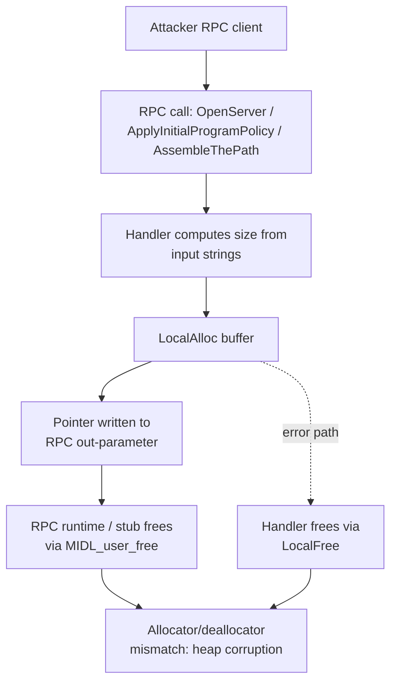

# CVE-2026-50369

**CVE:** CVE-2026-50369  
**Title:** Windows Remote Desktop Services Elevation of Privilege Vulnerability  
**Source:** [https://msrc.microsoft.com/update-guide/vulnerability/CVE-2026-50369](https://msrc.microsoft.com/update-guide/vulnerability/CVE-2026-50369)  
**Component(s):** termsrv.dll  
**Patched Date:** 2026-07-14T07:00:00  
**CWE:** Use after free in Windows Remote Desktop Services allows an authorized attacker to elevate privileges over a network.  

---

## Related CVEs (Same Component)

This report covers 2 CVEs affecting the same component(s):

- **CVE-2026-50369**  
- CVE-2026-58626  

### Detailed Information

#### CVE-2026-58626

**Title:** Windows Remote Desktop Services Remote Code Execution Vulnerability  
**Source:** [https://msrc.microsoft.com/update-guide/vulnerability/CVE-2026-58626](https://msrc.microsoft.com/update-guide/vulnerability/CVE-2026-58626)  
**Patched Date:** 2026-07-14T07:00:00  
**CWE:** Use after free in Windows Remote Desktop Services allows an authorized attacker to execute code over a network.  

---

Download Patched & Vulnerable Components:

```bash
# termsrv.dll
wget https://msdl.microsoft.com/download/symbols/termsrv.dll/9C9A9FCA13A000/termsrv.dll -O termsrv.dll.10.0.26100.8521 # vulnerable
wget https://msdl.microsoft.com/download/symbols/termsrv.dll/0B8D1ED713C000/termsrv.dll -O termsrv.dll.10.0.26100.8737 # patched
```

## Version Tracking Analysis

**Command:**

```
python ghidra_scripts\ghidra_vt_wrapper.py --old-binary ./reports/2026-Jul/CVE-2026-50369/termsrv.dll.10.0.26100.8521 --new-binary ./reports/2026-Jul/CVE-2026-50369/termsrv.dll.10.0.26100.8737 --project-dir ./reports/2026-Jul/CVE-2026-50369/ghidra_project --project-name termsrv.dll_CVE-2026-50369 --ghidra-dir C:\Tools\ghidra_11.4.2_PUBLIC_20250826\ghidra_11.4.2_PUBLIC --output-dir ./reports/2026-Jul/CVE-2026-50369/ghidra_project/vt_results --max-memory 16g
```

Patched Functions: 44 | New Functions: 98 | Removed Functions: 14 | Total Matches: 105508 | Accepted Matches: 24307

### Patched Functions

*Showing top 10 of 44 patched functions*

| Function Name | Source Address | Dest Address | Similarity | Confidence |
| --- | --- | --- | --- | --- |
| `RpcGetCurrentSessionConfigData` | `18000dd10` | `18000dd80` | 0.988 | 10.0 |
| `RpcGetCurrentSessionProtocolLastInputTime` | `18000cf20` | `18000cfa0` | 0.988 | 10.0 |
| `CConnectionEx::CConnectionEx` | `180019d90` | `180019d80` | 0.987 | 10.0 |
| `CConnectionEx::QueryVirtualChannelModuleData` | `180037510` | `180036ef0` | 0.986 | 1.0 |
| `RpcGetConnectionProperty` | `18000f590` | `18000f5f0` | 0.982 | 10.0 |
| `RpcGetClientData` | `180008b90` | `180008b90` | 0.980 | 10.0 |
| `RpcGetAllListeners` | `18000b4d0` | `18000b530` | 0.980 | 10.0 |
| `RpcGetSessionProtocolLastInputTime` | `180009710` | `180009700` | 0.975 | 10.0 |
| `RpcGetConfigData` | `180008450` | `180008460` | 0.972 | 10.0 |
| `CUserProfile::AssembleThePath` | `1800662ec` | `1800662cc` | 0.947 | 10.0 |

### New Functions

*Showing 10 of 98 new functions*

| Function Name | Address |
| --- | --- |
| `LCRPC_HANDLE_EXCLUSIVE_rundown` | `180019450` |
| `~unique_storage<wil::details::resource_policy<_RTL_SRWLOCK*___ptr64,void_(__cdecl*)(_RTL_SRWLOCK*___ptr64),&void___cdecl_ReleaseSRWLockShared(struct__RTL_SRWLOCK*___ptr64),wistd::integral_constant<unsigned___int64,1>,_RTL_SRWLOCK*___ptr64,_RTL_SRWLOCK*___ptr64,0,std::nullptr_t>_>` | `18002ce10` |
| `__tailMerge_faultrep_dll` | `18002fb77` |
| `NdrAsyncServerCall` | `18002fc40` |
| `Ndr64AsyncServerCallAll` | `18002fc50` |
| `RtlNtStatusToDosErrorNoTeb` | `180032a70` |
| `GetCurrentFeatureEnabledState` | `180034a68` |
| `GetTrailerMagic` | `180034e7c` |
| `MIDL_user_allocate_secure` | `180035088` |
| `__private_IsEnabled` | `180036138` |

### Removed Functions

*Showing 10 of 14 removed functions*

| Function Name | Address |
| --- | --- |
| `GetCurrentFeatureEnabledState` | `180040a20` |
| `GetCurrentFeatureEnabledState` | `180040af4` |
| `GetCurrentFeatureEnabledState` | `180040b78` |
| `__private_IsEnabled` | `18004b5dc` |
| `GetCachedFeatureEnabledState` | `1800c3434` |
| `GetCurrentFeatureEnabledState` | `1800c3564` |
| `__private_IsEnabled` | `1800c7d44` |
| `_guard_dispatch_icall` | `1800c9ca0` |
| `filt$0` | `1800cc09d` |
| `filt$0` | `1800cc0c4` |

---

# AI Technical Analysis

## Vulnerability Identification

**Core Vulnerable Function(s):**
- `RpcLicensingOpenServer()` - allocates an RPC out-parameter
  context object with `LocalAlloc()` instead of the RPC-runtime
  allocator, creating an allocator/deallocator mismatch.
- `ApplyTSAllowPolicyToInitialProgram()` - allocates the
  out-parameter policy string buffer with `LocalAlloc()` /
  `LocalFree()` instead of `MIDL_user_allocate()` /
  `MIDL_user_free()`, same root cause as above.
- `CUserProfile::AssembleThePath()` - allocates the assembled
  path buffer returned through an out-parameter with
  `LocalAlloc()` / `LocalFree()` instead of the RPC-owned
  allocator pair, same root cause as above.

**Supporting Changes:**
- `LCRPC_HANDLE_EXCLUSIVE_rundown()` - new context-handle
  rundown routine; validates a trailer magic value via
  `GetTrailerMagic()` before wiping and freeing the handle
  buffer with `LocalFree()`. Illustrates the memory-ownership
  contract that the vulnerable functions violated by not using
  the RPC-runtime-owned allocator for buffers that cross the
  RPC boundary.

**Unrelated Changes:**
- `FeatureImpl<...UxAccOptimization>::GetCurrentFeatureEnabledState()`
  and `FeatureImpl<...UxPerfImp>::GetCurrentFeatureEnabledState()`
  - hardcode the `FEATURE_CHANGE_TIME` argument to `3` instead of
  reinterpreting the output pointer `param_1` as that argument.
  This is a feature-flighting logic correction, not a memory
  safety issue.
- `~unique_storage<...RTL_SRWLOCK...>()`, `__tailMerge_faultrep_dll()`,
  `NdrAsyncServerCall()`, `Ndr64AsyncServerCallAll()` - RPC/CRT
  stub thunks and a lock-guard destructor, present only as
  decompiler artifacts from the rebuilt binary; no logic changed.

---

## Root Cause Analysis

The vulnerability is a mismatched memory-management-routine
defect (CWE-762). Several RPC server-side handler functions in
`termsrv.dll` allocate buffers that are returned to callers
through RPC `[out]` parameters using the Win32 local-heap API
`LocalAlloc()`, then release them on error paths with
`LocalFree()`. RPC out-parameters of pointer type are owned by
the NDR marshaling layer once the server call returns; that
layer, and any code cooperating with it (including generic
error/cleanup paths reused across the RPC interface), assumes
buffers were produced by the interface's declared user allocator,
`MIDL_user_allocate()`/`MIDL_user_free()`. Passing a
`LocalAlloc()`-obtained pointer into a path that ultimately frees
it via `MIDL_user_free()` (or vice versa) violates the
allocator/deallocator pairing invariant.

Representative vulnerable code from
`ApplyTSAllowPolicyToInitialProgram()`:

```c
uBytes = local_110 + local_108[0] + 0xc;
hMem = LocalAlloc(0x40,uBytes);
if (hMem == (ushort *)0x0) goto LAB_180054b9d;
...
*param_3 = hMem;
*param_4 = (int)local_118;
goto LAB_180054d73;
...
_DbgPrintMessage(8,pcVar4,(ulonglong)uVar1,"ApplyTSAllowPolicyToInitialProgram");
LocalFree(hMem);
```

`hMem` is sized from two attacker-influenced string lengths
(`local_110`, `local_108[0]`) and allocated with
`LocalAlloc(0x40, uBytes)` (`0x40` = `LMEM_ZEROINIT`). On the
success path the raw pointer is written directly into
`*param_3`, an RPC `[out]` parameter, without ever crossing
`MIDL_user_allocate()`. The identical pattern appears in
`RpcLicensingOpenServer()` (`puVar1 = LocalAlloc(0x40,4);
*param_2 = puVar1;`) and `CUserProfile::AssembleThePath()`
(`puVar5 = LocalAlloc(0x40,uVar7*2); *local_res18 = puVar5;`).
Because the RPC stub/runtime code that eventually reclaims this
"user-allocated" memory calls `MIDL_user_free()`, not
`LocalFree()`, the heap that actually owns the block and the
heap the free routine operates on can diverge, corrupting heap
metadata.

---

## Execution and Trigger Flow

An attacker first establishes an RPC connection to the Terminal
Services RPC interface hosted by `termsrv.dll` (this interface
backs licensing negotiation, initial-program policy application,
and user-profile path resolution during RDP session setup). The
attacker invokes the corresponding RPC method — the licensing
open call, the allow-initial-program policy call, or the
profile-path assembly call — supplying parameters (for
`ApplyTSAllowPolicyToInitialProgram`, attacker/session-controlled
program and argument strings) that reach the vulnerable handler.

Inside the handler, the function computes a buffer size from
those inputs and calls `LocalAlloc()` to obtain the buffer. The
pointer is written into an RPC `[out]` parameter and the function
returns success (or, on a downstream failure, calls `LocalFree()`
directly). Once control returns to the RPC runtime, NDR marshals
the `[out]` pointer back to the client and reclaims the
server-side copy using `MIDL_user_free()`, the allocator
contractually paired with `MIDL_user_allocate()` for that
interface, not with `LocalAlloc()`. This free-routine mismatch
corrupts heap bookkeeping structures, which an attacker can
leverage, through repeated or crafted RPC calls, to achieve
memory corruption and potentially remote code execution in the
`termsrv.dll` service process.



---

## Patch Analysis

The patch replaces the Win32 local-heap allocator/deallocator
pair with the RPC interface's declared user allocator pair in
all three affected functions:

```diff
-  puVar1 = LocalAlloc(0x40,4);
+  puVar1 = MIDL_user_allocate(4);
```

```diff
-      uBytes = local_110 + local_108[0] + 0xc;
-      hMem = LocalAlloc(0x40,uBytes);
-      if (hMem == (ushort *)0x0) goto LAB_180054b9d;
+      size = local_110 + local_108[0] + 0xc;
+      puVar4 = MIDL_user_allocate(size);
+      if (puVar4 == (ushort *)0x0) goto LAB_180054bfd;
...
-      LocalFree(hMem);
+      MIDL_user_free(puVar4);
```

```diff
-              puVar5 = LocalAlloc(0x40,uVar7 * 2);
+              puVar5 = MIDL_user_allocate(uVar7 * 2);
...
-                LocalFree(puVar5);
+                MIDL_user_free(puVar5);
```

Technically, each patch swaps both the allocation call and every
corresponding error-path free call so the buffer's entire
lifecycle uses `MIDL_user_allocate()`/`MIDL_user_free()`
consistently, restoring the allocator/deallocator pairing that
RPC `[out]` parameters require. `MIDL_user_allocate()` is the
allocator the RPC runtime itself uses when it needs to allocate
memory on behalf of the interface, and `MIDL_user_free()` is the
matching release routine invoked by NDR unmarshaling and by the
runtime's own cleanup paths; by aligning the manual allocation
sites with this contract, both the success path (buffer handed
back through the out-parameter) and the failure path (buffer
freed locally inside the handler) now operate on memory owned by
a single, consistent allocator.

This is an effective, minimal-risk fix: it does not change
buffer sizing, input validation, or control flow, so it carries
low regression risk while directly closing the heap-management
inconsistency. The label renumbering visible in the diffs
(`LAB_180054b9d` -> `LAB_180054bfd`, etc.) is purely a byproduct
of code shifting after recompilation and carries no semantic
change. The new `LCRPC_HANDLE_EXCLUSIVE_rundown()` function
reinforces this model by validating a trailer magic and
zero-wiping the buffer before release, indicating hardening was
applied consistently across the RPC context-handle lifecycle
in this update.

Security impact: prior to the patch, RPC-reachable handlers in
`termsrv.dll` could corrupt heap state through inconsistent
allocator use on attacker-influenced, RPC-marshaled buffers,
creating a potential remote memory-corruption primitive against
the Terminal Services stack. The patch eliminates the mismatch
by unifying allocation and release around the RPC-mandated
`MIDL_user_allocate()`/`MIDL_user_free()` pair.