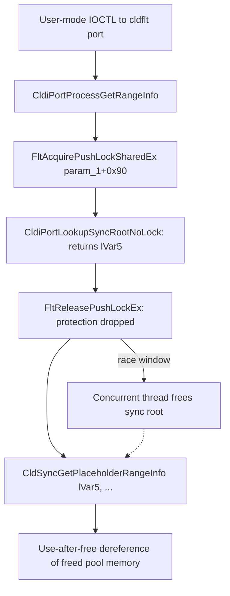

# CVE-2026-50401

**CVE:** CVE-2026-50401  
**Title:** Windows Cloud Files Mini Filter Driver Information Disclosure Vulnerability  
**Source:** [https://msrc.microsoft.com/update-guide/vulnerability/CVE-2026-50401](https://msrc.microsoft.com/update-guide/vulnerability/CVE-2026-50401)  
**Component(s):** cldflt.sys  
**Patched Date:** 2026-07-14T07:00:00  
**CWE:** Out-of-bounds read in Windows Cloud Files Mini Filter Driver allows an authorized attacker to disclose information locally.  

---

## Related CVEs (Same Component)

This report covers 4 CVEs affecting the same component(s):

- **CVE-2026-50401**  
- CVE-2026-50374  
- CVE-2026-58536  
- CVE-2026-58613  

### Detailed Information

#### CVE-2026-50374

**Title:** Windows Cloud Files Mini Filter Driver Elevation of Privilege Vulnerability  
**Source:** [https://msrc.microsoft.com/update-guide/vulnerability/CVE-2026-50374](https://msrc.microsoft.com/update-guide/vulnerability/CVE-2026-50374)  
**Patched Date:** 2026-07-14T07:00:00  
**CWE:** Use after free in Windows Cloud Files Mini Filter Driver allows an authorized attacker to elevate privileges with a physical attack.  

#### CVE-2026-58536

**Title:** Windows Cloud Files Mini Filter Driver Elevation of Privilege Vulnerability  
**Source:** [https://msrc.microsoft.com/update-guide/vulnerability/CVE-2026-58536](https://msrc.microsoft.com/update-guide/vulnerability/CVE-2026-58536)  
**Patched Date:** 2026-07-14T07:00:00  
**CWE:** Use after free in Windows Cloud Files Mini Filter Driver allows an authorized attacker to elevate privileges locally.  

#### CVE-2026-58613

**Title:** Windows Cloud Files Mini Filter Driver Elevation of Privilege Vulnerability  
**Source:** [https://msrc.microsoft.com/update-guide/vulnerability/CVE-2026-58613](https://msrc.microsoft.com/update-guide/vulnerability/CVE-2026-58613)  
**Patched Date:** 2026-07-14T07:00:00  
**CWE:** Use after free in Windows Cloud Files Mini Filter Driver allows an authorized attacker to elevate privileges locally.  

---

Download Patched & Vulnerable Components:

```bash
# cldflt.sys
wget https://msdl.microsoft.com/download/symbols/cldflt.sys/7927F89992000/cldflt.sys -O cldflt.sys.10.0.26100.8737 # vulnerable
wget https://msdl.microsoft.com/download/symbols/cldflt.sys/E30A07BB94000/cldflt.sys -O cldflt.sys.10.0.26100.8875 # patched
```

## Version Tracking Analysis

**Command:**

```
python ghidra_scripts\ghidra_vt_wrapper.py --old-binary ./reports/2026-Jul/CVE-2026-50401/cldflt.sys.10.0.26100.8737 --new-binary ./reports/2026-Jul/CVE-2026-50401/cldflt.sys.10.0.26100.8875 --project-dir ./reports/2026-Jul/CVE-2026-50401/ghidra_project --project-name cldflt.sys_CVE-2026-50401 --ghidra-dir C:\Tools\ghidra_11.4.2_PUBLIC_20250826\ghidra_11.4.2_PUBLIC --output-dir ./reports/2026-Jul/CVE-2026-50401/ghidra_project/vt_results --max-memory 16g
```

Patched Functions: 23 | New Functions: 11 | Removed Functions: 1 | Total Matches: 7853 | Accepted Matches: 6811

### Patched Functions

*Showing top 10 of 23 patched functions*

| Function Name | Source Address | Dest Address | Similarity | Confidence |
| --- | --- | --- | --- | --- |
| `CldHsmHydratePlaceholder` | `1400832c0` | `1400846c0` | 0.988 | 10.0 |
| `CldHsmPopulatePlaceholders` | `14003f090` | `1400406c0` | 0.968 | 10.0 |
| `CldHsmNotifyPreOperation` | `14003ebf0` | `140040210` | 0.965 | 10.0 |
| `CldStreamQueryProgress` | `14007b514` | `14007e224` | 0.950 | 10.0 |
| `CldiStreamCompleteRequest` | `1400841bc` | `1400855cc` | 0.947 | 10.0 |
| `CldiPortProcessServiceCommands` | `140081a48` | `140078648` | 0.940 | 10.0 |
| `CldiPortProcessRestartHydration` | `14003b128` | `14003c600` | 0.930 | 10.0 |
| `CldiPortNotifyMessage` | `14004a270` | `140077120` | 0.927 | 10.0 |
| `CldiStreamBuildProviderRequest` | `1400407b4` | `140041df4` | 0.910 | 10.0 |
| `WPP_SF_qqDqDqDZZqDd` | `14000f248` | `14000f7cc` | 0.905 | 10.0 |

### New Functions

*Showing 10 of 11 new functions*

| Function Name | Address |
| --- | --- |
| `Feature_4003697978__private_IsEnabledDeviceUsageNoInline` | `14000e718` |
| `Feature_4003697978__private_IsEnabledFallback` | `14000e750` |
| `Feature_1966059833__private_IsEnabledDeviceUsageNoInline` | `14000ecd8` |
| `Feature_1966059833__private_IsEnabledFallback` | `14000ed10` |
| `Feature_4003440952__private_IsEnabledDeviceUsageNoInline` | `14000ed2c` |
| `Feature_4003440952__private_IsEnabledFallback` | `14000ed64` |
| `Feature_510375226__private_IsEnabledDeviceUsageNoInline` | `140017e90` |
| `Feature_510375226__private_IsEnabledFallback` | `140017ec8` |
| `_guard_dispatch_icall` | `14001e480` |
| `CldiPortLookupAndReferenceSyncRoot` | `14003a52c` |

### Removed Functions

| Function Name | Address |
| --- | --- |
| `_guard_dispatch_icall` | `14001e320` |

---

# AI Technical Analysis

## Vulnerability Identification

**Core Vulnerable Function(s):**
- `CldiPortProcessGetRangeInfo()` - looks up a sync-root context
  pointer while holding a shared pushlock, releases that pushlock,
  and only afterward passes the unprotected pointer into
  `CldSyncGetPlaceholderRangeInfo()`, creating a use-after-free
  window.
- `CldStreamQueryProgress()` - exhibits the identical defect class:
  it drops the exclusive resource that protects the stream/root
  list before calling `CldSyncReferenceStream()` on a raw root
  pointer obtained while the resource was held.

**Supporting Changes:**
- None. Both patched functions independently add the fix (a
  reference/rundown-protection call bracketing the use of the
  pointer); neither is a mere caller of the other.

**Unrelated Changes:**
- `CldStreamOpen()` - the diff only re-linearizes nested
  if/else success paths into forward `goto` chains. No lock,
  reference count, or validation logic is added or removed, so
  this function carries no relevance to the CVE.

---

## Root Cause Analysis

The flaw is a classic time-of-check-to-time-of-use (TOCTOU)
defect that results in a use-after-free. The code treats a
pushlock/resource acquisition as sufficient protection for a
pointer that is dereferenced only *after* the lock is released,
violating the invariant that a kernel object obtained from a
lock-protected list must be pinned (via refcount or rundown
protection) for the entire span during which it is used, not just
while the list lock is held.

Vulnerable code (`CldiPortProcessGetRangeInfo`, before):

```c
FltAcquirePushLockSharedEx(param_1 + 0x90,0);
lVar5 = CldiPortLookupSyncRootNoLock(param_1,param_2);
FltReleasePushLockEx(param_1 + 0x90,0);
if (lVar5 != 0) {
  uVar4 = CldSyncGetPlaceholderRangeInfo(
              lVar5,param_3,uVar11,local_50,local_40,
              local_48,local_54,local_30,&local_38);
  ...
}
```

Vulnerable code (`CldStreamQueryProgress`, before, equivalent
pattern):

```c
ExReleaseResourceLite(&DAT_140029730);
KeLeaveCriticalRegion();
local_e8 = CldSyncReferenceStream((longlong)local_a0,local_98,0);
```

In `CldiPortProcessGetRangeInfo`, `lVar5` is the address of a
sync-root context returned by `CldiPortLookupSyncRootNoLock()`.
The shared pushlock at `param_1 + 0x90` only guarantees the
lookup table is stable during the walk; it does not increment
any reference on the returned object. The very next line,
`FltReleasePushLockEx`, removes that guarantee, yet `lVar5` is
still dereferenced afterward inside `CldSyncGetPlaceholderRangeInfo`,
which reads internal fields of the sync-root structure (stream
size, MCB ranges, and related metadata pointers). If a concurrent
thread tears down or frees that sync root (for example, via a
detach/delete path acting on the same reparse point identified
by attacker-controlled `param_2`) between the `FltReleasePushLockEx`
call and the `CldSyncGetPlaceholderRangeInfo` call, the second
call dereferences freed pool memory. The analogous window in
`CldStreamQueryProgress` occurs when `DAT_140029730` (the
exclusive resource protecting the stream list) is released
before `local_a0`/`ppplVar1` (the sync root reached through the
stream context) is handed to `CldSyncReferenceStream()`.

---

## Execution and Trigger Flow

A local, unprivileged (or low-integrity) caller with a handle to
the Cloud Files minifilter communication port issues an IOCTL
that reaches `CldiPortProcessGetRangeInfo()`, supplying `param_2`
as an identifier that resolves to a specific sync root. The
function acquires the pushlock, calls
`CldiPortLookupSyncRootNoLock()` to resolve the sync-root context
pointer, then immediately releases the pushlock -- at this point
no reference of any kind protects the object's lifetime. A second
thread, racing against the first, triggers teardown of that same
sync root (e.g., through volume dismount, sync-root unregistration,
or handle close processing that frees the underlying context).
If the free completes before the first thread reaches
`CldSyncGetPlaceholderRangeInfo(lVar5, ...)`, that call operates
on freed pool memory, reading (and in the original code path,
indirectly propagating) attacker-influenceable stale/reallocated
data back through `param_6`/`param_7` via the trailing `memmove`/
`memcpy`. This is a textbook kernel local elevation-of-privilege
or information-disclosure primitive: a low-privileged process
wins a race against object teardown to make the kernel
dereference freed memory under its influence.



---

## Patch Analysis

Patched code (`CldiPortProcessGetRangeInfo`, after):

```diff
-FltAcquirePushLockSharedEx(param_1 + 0x90,0);
-lVar5 = CldiPortLookupSyncRootNoLock(param_1,param_2);
-FltReleasePushLockEx(param_1 + 0x90,0);
-if (lVar5 != 0) {
-  uVar4 = CldSyncGetPlaceholderRangeInfo(
-              lVar5,param_3,...);
+uVar8 = Feature_1966059833__private_IsEnabledDeviceUsageNoInline();
+if ((int)uVar8 == 0) {
+  FltAcquirePushLockSharedEx(param_1 + 0x90,0);
+  lVar6 = CldiPortLookupSyncRootNoLock(param_1,param_2);
+  FltReleasePushLockEx(param_1 + 0x90,0);
+  if (lVar6 != 0) {
+    iVar5 = CldSyncGetPlaceholderRangeInfo(lVar6,...);
+  }
+} else {
+  uVar8 = CldiPortLookupAndReferenceSyncRoot(param_1,param_2,&local_30);
+  lVar6 = local_30;
+  if (-1 < (int)uVar8) {
+    iVar5 = CldSyncGetPlaceholderRangeInfo(local_30,...);
+    ExReleaseRundownProtection(lVar6 + 0x58);
+  }
+}
```

`CldStreamQueryProgress` receives the same treatment, replacing
the direct `CldSyncReferenceStream()` call with a
feature-gated path that first calls `CldiSyncReferenceRoot()` to
acquire rundown protection on the root, performs the reference
operation, then calls `ExReleaseRundownProtection()` afterward.
The core technical fix is `CldiPortLookupAndReferenceSyncRoot()`,
which atomically resolves the sync root and increments its
rundown-protection count in a single lock-held operation, so the
object cannot be torn down until `ExReleaseRundownProtection()`
is explicitly called by the same thread. This closes the exact
race window described above: the pushlock no longer needs to
span the entire usage period because the rundown reference
independently guarantees the object's lifetime for the duration
of `CldSyncGetPlaceholderRangeInfo()`. The fix is effective for
callers that take the new path, converting a TOCTOU UAF into a
reference-counted, race-free access pattern consistent with
standard filter-driver object lifetime management. The change is
gated behind `Feature_1966059833__private_IsEnabledDeviceUsageNoInline()`
(and `Feature_4003697978...` in the stream-progress function), a
Microsoft feature-rollout mechanism; when the flag evaluates to
false the legacy, vulnerable lookup-then-release-then-use path is
still compiled in and executed, meaning the security benefit is
contingent on the flag being enabled in the shipping build. Overall,
this patch eliminates a use-after-free reachable from an
IOCTL-driven race against sync-root or stream teardown, a
vulnerability class with direct implications for local privilege
escalation and information disclosure in the Windows Cloud Files
Mini Filter Driver.