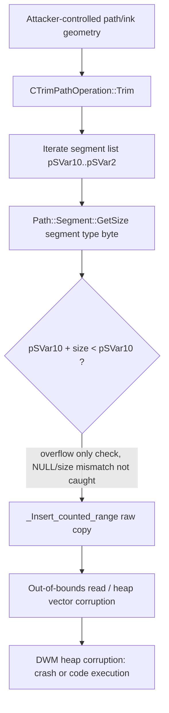

# CVE-2026-50437

**CVE:** CVE-2026-50437  
**Title:** Windows DWM Core Library Information Disclosure  Vulnerability  
**Source:** [https://msrc.microsoft.com/update-guide/vulnerability/CVE-2026-50437](https://msrc.microsoft.com/update-guide/vulnerability/CVE-2026-50437)  
**Component(s):** dwmcore.dll  
**Patched Date:** 2026-07-14T07:00:00  
**CWE:** Out-of-bounds read in Windows DWM Core Library allows an authorized attacker to disclose information locally.  

Download Patched & Vulnerable Components:

```bash
# dwmcore.dll
wget https://msdl.microsoft.com/download/symbols/dwmcore.dll/41AC23E9430000/dwmcore.dll -O dwmcore.dll.10.0.26100.8737 # vulnerable
wget https://msdl.microsoft.com/download/symbols/dwmcore.dll/3B3711F9430000/dwmcore.dll -O dwmcore.dll.10.0.26100.8875 # patched
```

## Version Tracking Analysis

**Command:**

```
python ghidra_scripts\ghidra_vt_wrapper.py --old-binary ./reports/2026-Jul/CVE-2026-50437/dwmcore.dll.10.0.26100.8737 --new-binary ./reports/2026-Jul/CVE-2026-50437/dwmcore.dll.10.0.26100.8875 --project-dir ./reports/2026-Jul/CVE-2026-50437/ghidra_project --project-name dwmcore.dll_CVE-2026-50437 --ghidra-dir C:\Tools\ghidra_11.4.2_PUBLIC_20250826\ghidra_11.4.2_PUBLIC --output-dir ./reports/2026-Jul/CVE-2026-50437/ghidra_project/vt_results --max-memory 16g
```

Patched Functions: 10 | New Functions: 66 | Removed Functions: 42 | Total Matches: 142077 | Accepted Matches: 60248

### Patched Functions

| Function Name | Source Address | Dest Address | Similarity | Confidence |
| --- | --- | --- | --- | --- |
| `CMessageConversationHost::OnItemMessage` | `1802af040` | `1802aefc0` | 0.988 | 1.0 |
| `CSynchronousSuperWetInk::EnqueueComputeScribbleOnHost` | `1802188f0` | `180217a20` | 0.976 | 1.0 |
| `const_iterator::operator++` | `1801851c0` | `180020dc0` | 0.966 | 10.0 |
| `CInteractionTracker::SelectInertiaModifierForAxis` | `1801eaab8` | `1801934b8` | 0.829 | 10.0 |
| `CTrimPathOperation::Trim` | `180184c60` | `180020860` | 0.823 | 10.0 |
| `CInterpolatePathsOperation::Interpolate` | `18018493c` | `18002050c` | 0.778 | 10.0 |
| `CPathLengthOperation::GetLength` | `180186178` | `180021980` | 0.752 | 10.0 |
| `CFilterEffect::ProcessUpdateInputs` | `180291284` | `180290db8` | 0.735 | 10.0 |
| `CPathData::PushIntoSink` | `1801af690` | `180020f48` | 0.647 | 10.0 |
| `Segment::GetSize` | `180185640` | `180021124` | 0.609 | 10.0 |

### New Functions

*Showing 10 of 66 new functions*

| Function Name | Address |
| --- | --- |
| `insert<gsl::details::span_iterator<unsigned_char_const_>,0>` | `180021250` |
| `_invalid_parameter_noinfo_noreturn` | `18002ba74` |
| `_invalid_parameter_noinfo_noreturn` | `18002be0c` |
| `_invalid_parameter_noinfo_noreturn` | `18002be19` |
| `_invalid_parameter_noinfo_noreturn` | `1800d33d6` |
| `_invalid_parameter_noinfo_noreturn` | `1800fa213` |
| `_invalid_parameter_noinfo_noreturn` | `180169ac4` |
| `_invalid_parameter_noinfo_noreturn` | `1801c8e91` |
| `_invalid_parameter_noinfo_noreturn` | `1801cab1a` |
| `FUN_1801ccaa1` | `1801ccaa1` |

### Removed Functions

*Showing 10 of 42 removed functions*

| Function Name | Address |
| --- | --- |
| `_invalid_parameter_noinfo_noreturn` | `1800587c3` |
| `_invalid_parameter_noinfo_noreturn` | `1800a62c4` |
| `_invalid_parameter_noinfo_noreturn` | `1800a665c` |
| `_invalid_parameter_noinfo_noreturn` | `1800a6669` |
| `_invalid_parameter_noinfo_noreturn` | `18010d3a6` |
| `operator++` | `180185344` |
| `_invalid_parameter_noinfo_noreturn` | `1801867e4` |
| `_invalid_parameter_noinfo_noreturn` | `1801cadf1` |
| `_invalid_parameter_noinfo_noreturn` | `1801cc8ba` |
| `FUN_1801ce261` | `1801ce261` |

---

# AI Technical Analysis

## Vulnerability Identification

**Core Vulnerable Function(s):**
- `CTrimPathOperation::Trim()` - performs an unchecked,
  attacker-influenced pointer/length copy of path segment
  bytes into a `std::vector<unsigned char>` backing store;
  the pre-patch bounds check only detects pointer wraparound
  and misses the NULL-pointer/non-zero-size case, allowing an
  out-of-bounds copy.

**Supporting Changes:**
- `Path::Segment::GetSize()` - acts as the size oracle
  consumed by `Trim()`; patched to optionally route through
  a new `TryGetSize()` path (gated by a `wil::Feature` flag)
  that returns success/failure instead of unconditionally
  trusting a fixed size table.
- `std::vector<...>::insert<gsl::details::span_iterator
  <unsigned_char_const_>,0>()` (new function) - the actual
  defensive primitive introduced by this patch; validates
  that the source `span_iterator` pair is internally
  consistent before performing the counted-range copy that
  `Trim()` used to call directly.
- `CFilterEffect::ProcessUpdateInputs()` - refactored to use
  `CMap::FindKey()` instead of a hand-rolled linear scan of
  the map's internal storage; bundled in the same binary
  update but addresses a distinct key-lookup correctness
  issue, not the overflow in `Trim()`.

**Unrelated Changes:**
- `CMessageConversationHost::OnItemMessage` /
  `OnIDFreed` - decompiler/vtable-slot artifact; both
  before and after bodies are an identical one-line stub
  returning a fixed error code.
- `CSynchronousSuperWetInk::EnqueueComputeScribbleOnHost` /
  `CD2DContext::DrawBitmap` - same class of artifact, also
  an unchanged stub.
- `_invalid_parameter_noinfo_noreturn` (x4) - standard CRT
  fail-fast helper, unmodified boilerplate.

---

## Root Cause Analysis

The vulnerability is a heap buffer overflow caused by an
incomplete bounds check before a raw pointer-range copy.
`CTrimPathOperation::Trim()` walks a linked list of path
segments and, for each one, asks `Path::Segment::GetSize()`
how many bytes that segment occupies, then copies exactly
that many bytes from the segment pointer into the geometry's
byte vector. The code assumed that a passing pointer-overflow
check was sufficient proof that the copy was safe, violating
the invariant that a copy source must be both non-NULL and
correctly sized before being dereferenced.

Vulnerable code:

```c
uVar7 = Path::Segment::GetSize
                  ((SegmentType)CONCAT71((int7)((ulonglong)this_01 >> 8),*pSVar10));
if (pSVar10 + uVar7 < pSVar10) {
  (*(code *)`void_(__cdecl*&___ptr64___cdecl_gsl::details::get_terminate_handler(void))(void)'
            ::__l2::handler)();
  pcVar4 = (code *)swi(3);
  lVar8 = (*pcVar4)();
  return lVar8;
}
std::vector<unsigned_char,std::allocator<unsigned_char>_>::
_Insert_counted_range<unsigned_char_const*___ptr64>
          ((vector<unsigned_char,std::allocator<unsigned_char>_> *)this,
           *(undefined8 *)(this + 8),pSVar10,
           (longlong)(pSVar10 + uVar7) - (longlong)pSVar10);
```

`pSVar10` is the current node while iterating the segment
list bounded by `param_1 + 0x10` and `param_1 + 0x18`.
`*pSVar10` supplies the segment-type byte passed to
`GetSize()`, and `uVar7` is the byte count `GetSize()`
returns for that type. The guard `pSVar10 + uVar7 < pSVar10`
only fires on classic pointer-arithmetic wraparound; it does
nothing when `pSVar10` is `NULL` (or otherwise invalid) while
`uVar7` is non-zero, and it does not re-validate that the
`begin`/`length` pair handed to `_Insert_counted_range` forms
a consistent range. `_Insert_counted_range` itself performs a
raw `memcpy`-style copy trusting its caller completely. Since
segment contents ultimately originate from parsed path data,
an attacker who can influence the segment list (an empty or
malformed leading segment, or a type value that causes
`GetSize()` to disagree with the actual buffer available)
can force a copy that reads out-of-bounds and inserts
attacker-influenced length data into the heap-allocated
vector, corrupting adjacent heap metadata or object data.

---

## Execution and Trigger Flow

An attacker supplies a path/geometry resource (e.g. an ink
stroke or vector shape processed through DWM's path
composition pipeline) that is later "trimmed" via
`CTrimPathOperation::Trim()`, the routine backing
`start`/`end` trim-fraction operations on path geometries.
During construction, `Trim()` iterates the source path's
segment list from `param_1 + 0x10` to `param_1 + 0x18`. For
each segment it reads the one-byte segment-type tag, calls
`Path::Segment::GetSize()` to obtain the expected structure
size, and then copies that many bytes into an internal byte
vector via `_Insert_counted_range`. If the attacker arranges
the segment stream so that the pointer/size pair passes the
naive overflow-only check (for example by presenting a
segment whose effective address is `NULL` or otherwise
invalid while `GetSize()` still reports a non-zero size for
its type tag), the copy proceeds anyway. The out-of-bounds
read pulls memory beyond the intended segment structure, and
the vector insert commits that data into heap memory sized
for the smaller, expected layout, corrupting the heap.
Because `dwmcore.dll` runs inside the Desktop Window Manager,
successful heap corruption here can lead to a crash (DoS) or,
with further heap grooming, to memory corruption exploitable
for privilege escalation from a rendering/composition context
into DWM's process.



---

## Patch Analysis

Patched flow (reconstructed from diff):

```diff
-uVar7 = Path::Segment::GetSize(...);
-if (pSVar10 + uVar7 < pSVar10) {
+uVar6 = Path::Segment::GetSize(...);
+if (((pSVar12 == (Segment *)0x0) && (uVar6 != 0)) ||
+    (pSVar12 + uVar6 < pSVar12)) {
   /* fail-fast, unchanged */
 }
 std::vector<unsigned_char,std::allocator<unsigned_char>_>::
-_Insert_counted_range<unsigned_char_const*___ptr64>
-          (this, offset, pSVar10, (longlong)(pSVar10 + uVar7) - (longlong)pSVar10);
+insert<gsl::details::span_iterator<unsigned_char_const_>,0>
+          (this, offset, span_begin, span_end);
```

And inside the new helper:

```c
if (((*param_4 == *param_5) && (param_4[1] == param_5[1])) &&
   ((ulonglong)param_4[2] <= (ulonglong)param_5[2])) {
  _Insert_counted_range<unsigned_char_const*___ptr64>
            (this,param_3,param_4[2],param_5[2] - param_4[2]);
  *param_2 = (*(longlong *)this - lVar1) + param_3;
  return param_2;
}
(*(code *)...gsl::details::get_terminate_handler...)();
```

The patch adds a second disjunct to the guard,
`(pSVar12 == NULL) && (uVar6 != 0)`, so a non-zero size paired
with a NULL/invalid segment pointer now triggers the same
fail-fast path as pointer wraparound, instead of falling
through to the copy. More fundamentally, the direct call to
`_Insert_counted_range` is replaced with the new
`insert<gsl::details::span_iterator<unsigned char const>,0>`
wrapper, which independently re-validates the source range
before touching memory: it confirms both iterators reference
the same container (`*param_4 == *param_5`), the same
element-position base (`param_4[1] == param_5[1]`), and that
the begin offset does not exceed the end offset
(`param_4[2] <= param_5[2]`). Only when all three hold does
it forward to `_Insert_counted_range`; otherwise it invokes
the GSL terminate handler, converting a potential memory
corruption into a controlled abort. `Path::Segment::GetSize()`
is hardened in parallel: behind a `wil::Feature` flag it now
calls `TryGetSize()`, which reports success/failure explicitly
via an output parameter rather than relying solely on the
legacy fixed-size switch table, and fail-fasts cleanly via
`ModuleFailFastForHR` on failure.

Together these changes close both ends of the flaw: the
size-oracle is made more defensible, and the consumer no
longer trusts a single wraparound check as sufficient proof
of a safe copy, instead re-deriving and validating the
iterator range immediately before the memory copy executes.
This is a strong fix because it removes the trust boundary
that let a malformed segment size/pointer combination reach
`_Insert_counted_range` unchecked, converting an exploitable
out-of-bounds copy into a deterministic fail-fast. The
overall effect eliminates the heap-corruption primitive in
`CTrimPathOperation::Trim()` and reduces the CVE's impact
from potential memory-corruption/privilege-escalation in the
DWM composition engine to a safe process termination on
malformed input.