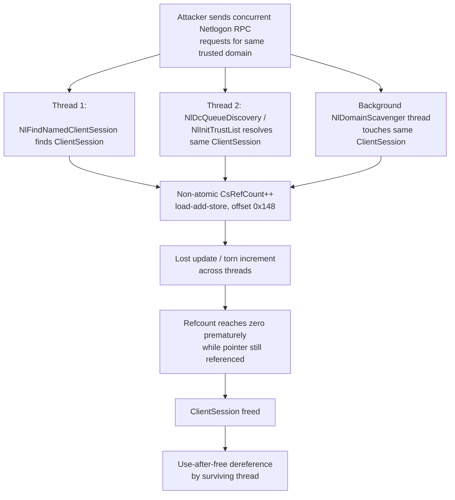

# CVE-2026-50500

**CVE:** CVE-2026-50500  
**Title:** Windows Netlogon Elevation of Privilege Vulnerability  
**Source:** [https://msrc.microsoft.com/update-guide/vulnerability/CVE-2026-50500](https://msrc.microsoft.com/update-guide/vulnerability/CVE-2026-50500)  
**Component(s):** netlogon.dll  
**Patched Date:** 2026-07-14T07:00:00  
**CWE:** Use after free in Windows Netlogon allows an authorized attacker to elevate privileges over a network.  

Download Patched & Vulnerable Components:

```bash
# netlogon.dll
wget https://msdl.microsoft.com/download/symbols/netlogon.dll/EB4BF3C6101000/netlogon.dll -O netlogon.dll.10.0.26100.8737 # vulnerable
wget https://msdl.microsoft.com/download/symbols/netlogon.dll/F71B3C8C103000/netlogon.dll -O netlogon.dll.10.0.26100.8875 # patched
```

## Version Tracking Analysis

**Command:**

```
python ghidra_scripts\ghidra_vt_wrapper.py --old-binary ./reports/2026-Jul/CVE-2026-50500/netlogon.dll.10.0.26100.8737 --new-binary ./reports/2026-Jul/CVE-2026-50500/netlogon.dll.10.0.26100.8875 --project-dir ./reports/2026-Jul/CVE-2026-50500/ghidra_project --project-name netlogon.dll_CVE-2026-50500 --ghidra-dir C:\Tools\ghidra_11.4.2_PUBLIC_20250826\ghidra_11.4.2_PUBLIC --output-dir ./reports/2026-Jul/CVE-2026-50500/ghidra_project/vt_results --max-memory 16g
```

Patched Functions: 11 | New Functions: 3 | Removed Functions: 1 | Total Matches: 58444 | Accepted Matches: 17036

### Patched Functions

*Showing top 10 of 11 patched functions*

| Function Name | Source Address | Dest Address | Similarity | Confidence |
| --- | --- | --- | --- | --- |
| `NlInitTrustList` | `180062c74` | `180062e64` | 0.985 | 10.0 |
| `NlDomainScavenger` | `18006cce0` | `18006d1a0` | 0.980 | 10.0 |
| `NlPickTrustedDcForEntireTrustList` | `1800645ac` | `18006479c` | 0.968 | 10.0 |
| `NlFlushCacheOnPnpWorker` | `180062420` | `180062610` | 0.957 | 10.0 |
| `NlTimeoutOneApiClientSession` | `180066eb0` | `1800670d4` | 0.957 | 10.0 |
| `NlAddDomainTreeToTrustList` | `1800617c0` | `1800619b0` | 0.955 | 10.0 |
| `NlDcQueueDiscovery` | `1800621fc` | `1800623ec` | 0.900 | 10.0 |
| `NlUpdateTrustList` | `180068590` | `180068a6c` | 0.880 | 10.0 |
| `NlPickDomainWithAccountViaPing` | `180063c10` | `180063e00` | 0.850 | 10.0 |
| `NlFindNamedClientSession` | `180013ff8` | `180013ff8` | 0.695 | 10.0 |

### New Functions

| Function Name | Address |
| --- | --- |
| `Feature_3457920314__private_IsEnabledDeviceUsageNoInline` | `180050958` |
| `NlRefClientSession` | `180065570` |
| `_guard_dispatch_icall` | `18008ac70` |

### Removed Functions

| Function Name | Address |
| --- | --- |
| `_guard_dispatch_icall` | `18008a7b0` |

---

# AI Technical Analysis

## Vulnerability Identification

**Core Vulnerable Function(s):**
- `NlFindNamedClientSession()` - increments the shared
  `ClientSession.CsRefCount` field with a plain, non-atomic
  read-modify-write instead of an interlocked operation.
- `NlPickDomainWithAccountViaPing()` - same non-atomic
  refcount increment while looping over domain client
  sessions before issuing long-running DC ping operations.
- `NlDcQueueDiscovery()` - same non-atomic refcount increment
  while queuing DC discovery under a domain-scoped critical
  section rather than a session-global lock.
- `NlInitTrustList()` - same non-atomic refcount increment
  when caching the parent-trust client session pointer.
- `NlDomainScavenger()` - same non-atomic refcount increment
  performed by the periodic background scavenger thread.

**Supporting Changes:**
- `NlFindNamedClientSession()` - additionally gains defensive
  corruption checks on `NlGlobalServiceAccountList` traversal
  (null-node detection, `RtlInitUnicodeStringEx` return-value
  validation), hardening against a list already corrupted by
  the race.
- `NlRefClientSession()` (new) - centralizes the refcount
  increment and conditionally performs it atomically; this is
  the remediation, not the flaw.

**Unrelated Changes:**
- `NlDomainScavenger()` - `DAT_1800f50dc`/`DAT_1800f5178`
  renamed to `DAT_1800f70dc`/`DAT_1800f7178` are data-symbol
  address shifts from module relocation/rebuild, not logic
  changes.
- Widespread `undefined8 *` -> `longlong *` retyping and
  `puVarN`/`uVarN` variable renumbering across all functions
  are decompiler/type-recovery artifacts with no behavioral
  effect.

---

## Root Cause Analysis

The vulnerability is a reference-count race condition caused
by using a plain, non-atomic increment on a `ClientSession`
object's shared refcount field instead of an interlocked (bus
-locked) operation. The invariant violated is that any field
mutated concurrently by multiple threads must be updated with
a single indivisible instruction; here the increment is
instead a load, add, and store sequence that can interleave
with a concurrent increment or decrement from another thread.

Representative vulnerable code, present identically in all
five call sites (`NlFindNamedClientSession` shown):

```c
if (((param_3 & 8) == 0) ||
    ((*(uint *)((longlong)puVar8 + 0x124) & 0x4000) != 0)) {
    if ((*(byte *)((longlong)puVar8 + 0x124) & 0x10) == 0) {
        ...
    }
    *(int *)(puVar8 + 0x29) = *(int *)(puVar8 + 0x29) + 1;
    puVar4 = puVar8;
}
```

`puVar8 + 0x29` (i.e. byte offset `0x148` into the
`ClientSession` structure) is the object's `CsRefCount`.
`*(int *)(puVar8 + 0x29) + 1` compiles to a separate load,
add, and store, none of which are atomic with respect to
other CPUs. Each of the five call sites acquires a lock before
incrementing, but the locks differ in scope: the main session
list lock (`param_1 + 400`), a domain-indirected lock
(`*(longlong *)(param_1 + 0x110) + 400`), and the distinct
`NlGlobalServiceAccountCritSect`. None of these locks is a
single, session-global lock guaranteed to also guard the
decrement path (`NlUnrefClientSession`, not shown but implied
by the naming symmetry with the new `NlRefClientSession`).
Consequently, an increment executing under one lock can race
with a decrement executing under a different lock (or a
lock-free/interlocked decrement) on the exact same
`CsRefCount` field. A classic lost-update race results: two
threads read the same old count, each computes `old + 1`, and
the second write clobbers the first, permanently losing an
increment. The mirrored failure mode (a lost decrement, or a
decrement racing an in-flight increment) can drive the count
to zero while a live pointer to the object is still in use
elsewhere, triggering premature deallocation of the
`ClientSession` structure.

---

## Execution and Trigger Flow

The `ClientSession` object represents a cached, trusted
domain-controller session and is reachable from multiple,
independently scheduled execution contexts inside
`netlogon.dll`: RPC worker threads servicing incoming Netlogon
calls (e.g. secure-channel setup, `NetrLogonControl2Ex`-driven
rediscovery), the background `NlDomainScavenger` timer thread,
and asynchronous DC-ping completion callbacks driven by
`NlPickDomainWithAccountViaPing`. An attacker who can reach
the Netlogon RPC interface (as an authenticated domain member,
or in scenarios where DC rediscovery/trust enumeration can be
externally triggered) can issue several concurrent requests
that all resolve to the same trust's `ClientSession` object,
for example by repeatedly forcing secure-channel re-validation
or DC rediscovery for one domain name. Each concurrent request
thread calls into `NlFindNamedClientSession`,
`NlDcQueueDiscovery`, or `NlInitTrustList`, all of which
resolve the same object and perform the vulnerable
non-atomic `CsRefCount` increment while the scavenger thread
independently increments/decrements the same field on its
periodic cycle. Winning the race requires only ordinary
thread-scheduler jitter under load; no precise timing primitive
is needed because the window is the full duration of the
non-atomic add sequence repeated across many legitimate calls
per second. Once the count is corrupted to zero prematurely,
the object is freed by one thread while another thread still
holds and subsequently dereferences the stale pointer, producing
a use-after-free inside the LSASS process hosting
`netlogon.dll`.



---

## Patch Analysis

The patch introduces a centralized helper and routes every
increment site through it:

```c
void NlRefClientSession(longlong param_1)
{
  uint uVar1;
  uVar1 = Feature_3457920314__private_IsEnabledDeviceUsageNoInline();
  if (uVar1 == 0) {
    *(int *)(param_1 + 0x148) = *(int *)(param_1 + 0x148) + 1;
  }
  else {
    LOCK();
    *(int *)(param_1 + 0x148) = *(int *)(param_1 + 0x148) + 1;
    UNLOCK();
  }
  return;
}
```

```diff
-      *(int *)(puVar8 + 0x29) = *(int *)(puVar8 + 0x29) + 1;
-      puVar4 = puVar8;
+      NlRefClientSession((longlong)plVar8);
+      plVar4 = plVar8;
```

The same substitution is applied verbatim in
`NlPickDomainWithAccountViaPing`, `NlDcQueueDiscovery`,
`NlInitTrustList`, and `NlDomainScavenger`. Functionally, when
the `Feature_3457920314` gate is enabled, the increment is
wrapped in `LOCK()`/`UNLOCK()`, which on x86/x64 corresponds to
prefixing the add with the `LOCK` bus-lock instruction,
guaranteeing the read-modify-write executes as a single atomic
operation visible consistently to all cores. This directly
closes the lost-update window described in the root-cause
analysis: two threads racing on `CsRefCount` can no longer
interleave their load/add/store sequences. `NlFindNamedClientSession`
additionally adds corruption detection when walking
`NlGlobalServiceAccountList` -- verifying forward/backward
list-node pointers are non-null and validating
`RtlInitUnicodeStringEx`'s return code before comparing names
-- which prevents the function from dereferencing or acting on
list state that may already be corrupted from a prior race
window, converting a potential crash/UAF into a logged,
handled error path. Effectiveness is high for the specific
race the patch targets: unifying every increment through one
routine removes the possibility of an inconsistent, unlocked
add racing a locked one at any of the five call sites. The
fix is nonetheless conditional on the `Feature_3457920314`
gate; the diff shows the non-atomic add is still executed
verbatim when that feature is disabled, meaning the atomicity
guarantee it provides is scoped to configurations where the
gate is on. Overall, this change eliminates a reference-count
corruption primitive that could otherwise be leveraged to
trigger a use-after-free of a `ClientSession` object inside
`netlogon.dll`, improving reliability and closing a potential
memory-corruption vector reachable via ordinary concurrent
Netlogon RPC activity.