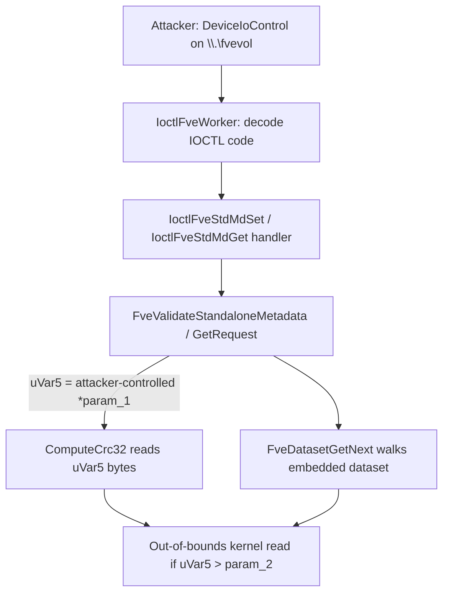

# CVE-2026-50661

**CVE:** CVE-2026-50661  
**Title:** Windows BitLocker Security Feature Bypass Vulnerability  
**Source:** [https://msrc.microsoft.com/update-guide/vulnerability/CVE-2026-50661](https://msrc.microsoft.com/update-guide/vulnerability/CVE-2026-50661)  
**Component(s):** fvevol.sys  
**Patched Date:** 2026-07-14T07:00:00  
**CWE:** Protection mechanism failure in Windows BitLocker allows an unauthorized attacker to bypass a security feature with a physical attack.  

Download Patched & Vulnerable Components:

```bash
# fvevol.sys
wget https://msdl.microsoft.com/download/symbols/fvevol.sys/9C22F3F6EB000/fvevol.sys -O fvevol.sys.10.0.26100.8521 # vulnerable
wget https://msdl.microsoft.com/download/symbols/fvevol.sys/D9829BBAED000/fvevol.sys -O fvevol.sys.10.0.26100.8737 # patched
```

## Version Tracking Analysis

**Command:**

```
python ghidra_scripts\ghidra_vt_wrapper.py --old-binary ./reports/2026-Jul/CVE-2026-50661/fvevol.sys.10.0.26100.8521 --new-binary ./reports/2026-Jul/CVE-2026-50661/fvevol.sys.10.0.26100.8737 --project-dir ./reports/2026-Jul/CVE-2026-50661/ghidra_project --project-name fvevol.sys_CVE-2026-50661 --ghidra-dir C:\Tools\ghidra_11.4.2_PUBLIC_20250826\ghidra_11.4.2_PUBLIC --output-dir ./reports/2026-Jul/CVE-2026-50661/ghidra_project/vt_results --max-memory 16g
```

Patched Functions: 14 | New Functions: 16 | Removed Functions: 3 | Total Matches: 11003 | Accepted Matches: 10812

### Patched Functions

*Showing top 10 of 14 patched functions*

| Function Name | Source Address | Dest Address | Similarity | Confidence |
| --- | --- | --- | --- | --- |
| `FveWrqCompleteRequestByFileObject` | `140027ce0` | `140027d70` | 0.972 | 10.0 |
| `FveGlobalAction` | `14008da9c` | `14008e1a0` | 0.966 | 10.0 |
| `FvepWimHashControl` | `1400596c8` | `1400596c8` | 0.965 | 10.0 |
| `FveWrqDequeueRequestByCookie` | `14001d490` | `14001d518` | 0.959 | 10.0 |
| `IoctlFveWorker` | `1400cffe0` | `1400d1710` | 0.954 | 10.0 |
| `FveWrqAddFileBasedRequest` | `14000cba4` | `14000cc08` | 0.950 | 10.0 |
| `FveIsActionAllowed` | `1400bd650` | `1400bed68` | 0.928 | 10.0 |
| `ActionWorker` | `1400bb6ac` | `1400bcc6c` | 0.923 | 10.0 |
| `FveDatumIsValidTypeSpecificChecks` | `1400099e4` | `1400099e4` | 0.917 | 10.0 |
| `FveIsROActionAllowed` | `1400cf478` | `1400d0b98` | 0.891 | 10.0 |

### New Functions

*Showing 10 of 16 new functions*

| Function Name | Address |
| --- | --- |
| `Feature_AutopilotBitlockerOobeDeferral__private_IsEnabledDeviceUsageNoInline` | `14000c8d8` |
| `Feature_AutopilotBitlockerOobeDeferral__private_IsEnabledFallback` | `14000c910` |
| `WPP_SF_IId` | `14000d498` |
| `FveLibClientFree` | `140013b2c` |
| `FveCreateStandaloneMetadataFromDataSet` | `140015070` |
| `FveCreateStandaloneMetadataGetResponseFromDataSet` | `140015140` |
| `FveValidateStandaloneMetadata` | `140015208` |
| `FveValidateStandaloneMetadataGetRequest` | `1400152f4` |
| `FveValidateStandaloneMetadataSetRequest` | `140015324` |
| `_guard_dispatch_icall` | `14001ac30` |

### Removed Functions

| Function Name | Address |
| --- | --- |
| `WPP_SF_i` | `140009f20` |
| `WPP_SF_Id` | `14000ceec` |
| `_guard_dispatch_icall` | `14001a890` |

---

# AI Technical Analysis

## Vulnerability Identification

**Core Vulnerable Function(s):**
- `FveValidateStandaloneMetadata()` - newly introduced
  validator for the "Standalone Metadata Set" IOCTL path; it
  is the first place the driver cross-checks the
  attacker-supplied embedded length field against the actual
  size of the caller's buffer before that length is used to
  drive a CRC32 read and a nested dataset walk. No equivalent
  check existed in this code path prior to the patch.
- `FveValidateStandaloneMetadataGetRequest()` - same class of
  fix for the "Standalone Metadata Get" IOCTL path; validates
  that the embedded size field does not exceed the caller's
  supplied buffer length before the buffer is consumed
  downstream.

**Supporting Changes:**
- `IoctlFveWorker()` - IOCTL dispatcher; adds the two new
  control codes (`0x455610ef` -> `IoctlFveStdMdGet`,
  `0x4556d0f3` -> `IoctlFveStdMdSet`) that route
  attacker-controlled buffers into the newly validated code
  paths, and merges `0x455610c8` into the existing
  `IoctlFveAction` handler (label renumbering only).
- `FveCreateStandaloneMetadataFromDataSet()` /
  `FveCreateStandaloneMetadataGetResponseFromDataSet()` -
  output-side builders that allocate a buffer sized from a
  trusted, kernel-computed length and copy into it; they do
  not consume untrusted attacker length fields and are not
  independently vulnerable.
- `FveIsActionAllowed()` - recompiled/restructured
  permission-check routine; behaviorally equivalent to the
  prior version except for a new unconditionally-allowed
  action code (`0x20`) that corresponds to the new metadata
  IOCTLs. Access-control bookkeeping, not the memory-safety
  bug itself.
- `FveLibClientFree()` - trivial wrapper around
  `FveLibFreeWithTag()`; not security relevant.

**Unrelated Changes:**
- `FveDatumIsValidTypeSpecificChecks()` - comment-only change
  (dead-code block offset annotation shifted by recompilation).
- `FveWrqCompleteRequestByFileObject()` and
  `FveWrqDequeueRequestByCookie()` - removal of an unused
  `param_3` tracing artifact and WPP macro/label renumbering
  from recompilation; no logic change.
- `IoctlFveWorker()` WPP trace GUID updates - cosmetic
  artifacts of recompilation, not functional changes.

---

## Root Cause Analysis

The vulnerability is a classic trusted-length-field confusion:
the driver's new "Standalone Metadata" object embeds its own
size as the first `uint` field, and prior to the patch this
embedded, attacker-controlled length was used directly to
drive a CRC32 computation and a nested dataset walk without
first confirming it did not exceed the number of bytes the
caller actually supplied in the IOCTL input buffer
(`param_2`). The invariant that was violated is "any length
taken from inside a user-supplied buffer must be bounded by
the buffer's real size before use," which is exactly the
check `FveValidateStandaloneMetadata()` was added to enforce.

```c
undefined8 FveValidateStandaloneMetadata(uint *param_1,uint param_2)
{
  ...
  if ((((0x47 < param_2) && (uVar5 = *param_1, 0x47 < uVar5)) &&
       (uVar5 <= param_2)) &&
      (((short)param_1[1] == 1 &&
        (*(short *)((longlong)param_1 + 6) != 0)))) {
    uVar1 = param_1[2];
    param_1[2] = 0;
    uVar2 = ComputeCrc32(param_1,(byte *)param_1,uVar5);
    param_1[2] = uVar1;
    if (...) {
      ...
      do {
        uVar4 = FveDatasetGetNext((longlong)(param_1 + 6),-1,-1,
                                   local_res8[0],local_res8);
        ...
      } while (iVar3 == 0);
    }
  }
  ...
}
```

Here `param_1` is the raw system-buffer pointer for the
`IoctlFveStdMdSet` IOCTL and `param_2` is the actual number of
bytes the caller placed in that buffer. `uVar5 = *param_1`
reads the embedded "claimed length" from inside the buffer
itself. The critical guard is `uVar5 <= param_2`: without it,
`ComputeCrc32(param_1,(byte *)param_1,uVar5)` will read `uVar5`
bytes starting at `param_1` even when `uVar5` exceeds the real
allocation backing the IOCTL buffer, producing an
out-of-bounds kernel read. The same `uVar5` also seeds
subsequent offset checks (`param_1[6]`, `param_1[8]`,
`param_1[9]`) and the `FveDatasetGetNext()` walk over the
embedded dataset at `param_1 + 6`, so an over-large `uVar5`
propagates the out-of-bounds window into the nested parser as
well. `FveValidateStandaloneMetadataGetRequest()` enforces the
analogous invariant (`param_2 < *param_1` check) for the
paired "Get" IOCTL, whose response builder,
`FveCreateStandaloneMetadataGetResponseFromDataSet()`, copies
`*param_3` bytes from the same untrusted structure.

---

## Execution and Trigger Flow

An unprivileged or low-privileged caller with a handle to the
`fvevol.sys` device object sends a `DeviceIoControl()` request
using either the new `IoctlFveStdMdSet` control code
(`0x4556d0f3`) or `IoctlFveStdMdGet` (`0x455610ef`), supplying
a small input buffer. The buffer's first 4 bytes are crafted
so the embedded "claimed length" field (`*param_1`) is set to
a value larger than the true size of the buffer the caller
actually allocated and passed to `DeviceIoControl()`
(`param_2`). The request travels through the standard I/O
Manager dispatch into `IoctlFveWorker()`, which decodes the
IOCTL code, matches it against the newly added case, and
forwards the raw system-buffer pointer and length to the
handler backing `IoctlFveStdMdSet`/`IoctlFveStdMdGet`. That
handler in turn calls `FveValidateStandaloneMetadata()` (or
`FveValidateStandaloneMetadataGetRequest()` for the Get path)
to sanity-check the structure before acting on it. Prior to
the patch, no such cross-check existed, so the inflated length
field was accepted and handed to `ComputeCrc32()` and
`FveDatasetGetNext()`, both of which read memory relative to
`param_1` out to the attacker-controlled `uVar5` bytes -
beyond the bounds of the actual input buffer, and potentially
beyond the pool allocation backing it, resulting in an
out-of-bounds kernel memory read (information disclosure or
crash/DoS on an inaccessible page).



---

## Patch Analysis

The patch introduces `FveValidateStandaloneMetadata()` and
`FveValidateStandaloneMetadataGetRequest()` as mandatory
gatekeepers on the two new IOCTL paths, and wires them in via
`IoctlFveWorker()`'s new dispatch cases.

```diff
+ if (uVar5 <= param_2) {              /* claimed len <= real buffer */
+   ...
+   uVar2 = ComputeCrc32(param_1,(byte *)param_1,uVar5);
+   ...
+ }
```

```c
undefined8 FveValidateStandaloneMetadataGetRequest(uint *param_1,uint param_2)
{
  undefined8 uVar1;
  uVar1 = 0;
  if ((((param_1 == (uint *)0x0) || (param_2 < 0x18)) ||
       (*param_1 < 0x18)) ||
      ((param_2 < *param_1 ||
        (*(short *)((longlong)param_1 + 6) != 1)))) {
    uVar1 = 0xc000000d;
  }
  return uVar1;
}
```

Technically, `FveValidateStandaloneMetadata()` now rejects any
request unless `param_2` (the true input buffer length)
exceeds `0x47`, the embedded length `*param_1` also exceeds
`0x47`, and, critically, `*param_1 <= param_2`, before ever
touching `ComputeCrc32()` or `FveDatasetGetNext()`. It further
validates that the internal sub-region offsets
(`param_1[6]`, `param_1[8]`, `param_1[9]`) are internally
consistent and fall within the now-bounded region, and only
then walks the embedded dataset. `FveValidateStandaloneMetadataGetRequest()`
applies the mirrored check (`param_2 < *param_1` rejects the
request) for the Get path before
`FveCreateStandaloneMetadataGetResponseFromDataSet()` is
allowed to copy `*param_3` bytes out of the structure.
`IoctlFveWorker()`'s new branches call these validators
unconditionally ahead of any parsing or CRC computation,
closing the gap where the length field could previously exceed
the true buffer size.

This is an effective, minimal fix: it enforces the exact
invariant that was missing (length field bounded by real
buffer size) at the single point every subsequent read
depends on, rather than patching each downstream consumer
individually. It does not change the wire format or reject
legitimate requests, since well-formed callers already supply
consistent length fields. The CRC32 check additionally guards
against corrupted-but-in-bounds structures, and the offset
consistency checks on `param_1[6]/[8]/[9]` prevent a
secondary, similarly-shaped confusion inside the nested
dataset region. Overall, the patch converts an
attacker-reachable out-of-bounds kernel read (crash / potential
information disclosure) into a rejected request returning
`0xc000000d` (`STATUS_INVALID_PARAMETER`).