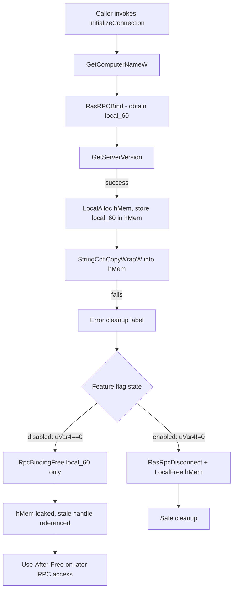

# CVE-2026-50666

**CVE:** CVE-2026-50666  
**Title:** Windows Remote Access Elevation of Privilege Vulnerability  
**Source:** [https://msrc.microsoft.com/update-guide/vulnerability/CVE-2026-50666](https://msrc.microsoft.com/update-guide/vulnerability/CVE-2026-50666)  
**Component(s):** rasman.dll  
**Patched Date:** 2026-07-14T07:00:00  
**CWE:** Use after free in Windows Remote Access Connection Manager allows an authorized attacker to elevate privileges over a network.  

Download Patched & Vulnerable Components:

```bash
# rasman.dll
wget https://msdl.microsoft.com/download/symbols/rasman.dll/173BBBE738000/rasman.dll -O rasman.dll.10.0.26100.8328 # vulnerable
wget https://msdl.microsoft.com/download/symbols/rasman.dll/5E2C7F0636000/rasman.dll -O rasman.dll.10.0.26100.8521 # patched
```

## Version Tracking Analysis

**Command:**

```
python ghidra_scripts\ghidra_vt_wrapper.py --old-binary ./reports/2026-Jul/CVE-2026-50666/rasman.dll.10.0.26100.8328 --new-binary ./reports/2026-Jul/CVE-2026-50666/rasman.dll.10.0.26100.8521 --project-dir ./reports/2026-Jul/CVE-2026-50666/ghidra_project --project-name rasman.dll_CVE-2026-50666 --ghidra-dir C:\Tools\ghidra_11.4.2_PUBLIC_20250826\ghidra_11.4.2_PUBLIC --output-dir ./reports/2026-Jul/CVE-2026-50666/ghidra_project/vt_results --max-memory 16g
```

Patched Functions: 1 | New Functions: 1 | Removed Functions: 16 | Total Matches: 4393 | Accepted Matches: 2955

### Patched Functions

| Function Name | Source Address | Dest Address | Similarity | Confidence |
| --- | --- | --- | --- | --- |
| `InitializeConnection` | `180024374` | `180024338` | 0.694 | 10.0 |

### New Functions

| Function Name | Address |
| --- | --- |
| `_guard_dispatch_icall` | `1800275f0` |

### Removed Functions

*Showing 10 of 16 removed functions*

| Function Name | Address |
| --- | --- |
| `Feature_VPN_BugFixes_25B_Use_After_Free_Fix__private_IsEnabledDeviceUsageNoInline` | `1800242f0` |
| `wil_RtlStagingConfig_QueryFeatureState` | `180024944` |
| `wil_RtlStagingConfig_RecordFeatureUsage` | `180024a3c` |
| `wil_details_AreDependenciesEnabled` | `180024a9c` |
| `wil_details_FeatureReporting_IncrementOpportunityInCache` | `180024b3c` |
| `wil_details_FeatureReporting_IncrementUsageInCache` | `180024c14` |
| `wil_details_FeatureReporting_RecordUsageInCache` | `180024cf8` |
| `wil_details_FeatureReporting_ReportUsageToService` | `180024e78` |
| `wil_details_FeatureReporting_ReportUsageToServiceDirect` | `180024ef4` |
| `wil_details_FeatureStateCache_ReevaluateCachedFeatureEnabledState` | `180024f84` |

---

# AI Technical Analysis

## Vulnerability Identification

**Core Vulnerable Function(s):**
- `InitializeConnection()` - Contains a feature-flag-gated error
  cleanup path that, when the flag resolved to "disabled", freed
  the RPC binding handle with `RpcBindingFree()` instead of the
  safe `RasRpcDisconnect()` routine, and skipped `LocalFree(hMem)`
  on the connection object that embeds a copy of that same
  handle.

**Supporting Changes:**
- `InitializeConnection()` (init block) - Local variables
  `local_68`/`local_58` were swapped in declaration/type between
  the two builds (decompiler re-numbering); the values assigned
  and the calls to `GetComputerNameW()` / `GetServerVersion()`
  remain semantically identical. Cosmetic only.
- `InitializeConnection()` (success path) - Removed a call to
  `Feature_VPN_BugFixes_25B_Use_After_Free_Fix__private_IsEnabledDeviceUsageNoInline()`
  on the success return path; this call had no effect on control
  flow (`return 0` executes regardless), so it is inert
  housekeeping removed alongside the flag.

**Unrelated Changes:**
- Label renames (`LAB_18002441d` -> `LAB_1800243e1`,
  `LAB_18002447f` -> `LAB_180024443`) and variable renames
  (`iVar7` -> `iVar5`, `uVar4`/`RVar6` type changes) - artifacts of
  recompilation/relinking after the flag logic was removed; no
  behavioral relevance.

---

## Root Cause Analysis

The vulnerability is a conditionally-reachable use-after-free in
the error-handling path of `InitializeConnection()`. The function
gated its RPC binding cleanup behind a runtime feature-state flag
(`Feature_VPN_BugFixes_25B_Use_After_Free_Fix__private_featureState`)
rather than always executing the safe teardown sequence,
violating the invariant that an RPC binding handle and the heap
object referencing it must always be torn down through the same,
synchronized cleanup routine.

Vulnerable code (error path):

```c
LAB_18002447f:
  if (local_60 != (RPC_BINDING_HANDLE)0x0) {
    if ((Feature_VPN_BugFixes_25B_Use_After_Free_Fix__private_featureState & 0x10) == 0) {
      uVar4 = Feature_VPN_BugFixes_25B_Use_After_Free_Fix__private_IsEnabledDeviceUsageNoInline();
    }
    else {
      uVar4 = Feature_VPN_BugFixes_25B_Use_After_Free_Fix__private_featureState & 1;
    }
    if (uVar4 == 0) {
      RVar6 = RpcBindingFree(&local_60);
      ...
    }
    else {
      ...
      RasRpcDisconnect(&local_60);
      if (hMem != (longlong *)0x0) {
        LocalFree(hMem);
      }
    }
  }
  return DVar3;
```

Earlier in the function, `hMem = LocalAlloc(0x40,0x30)` allocates
a connection object whose first field stores the binding handle
directly: `*hMem = (longlong)local_60`. If
`StringCchCopyWrapW()` fails after this point, control jumps to
the label above with `local_60` non-null and `hMem` non-null.
When `uVar4 == 0` (the legacy/disabled state of the flag), only
`RpcBindingFree(&local_60)` runs: the RPC binding is released
directly, bypassing `RasRpcDisconnect()`'s proper session
teardown, and `hMem` - which still holds a copy of that now-freed
handle at offset 0 - is never passed to `LocalFree()`. The binding
handle is thus released while a live heap object referencing it
persists and outstanding RPC runtime state tied to `local_60` may
still be processed asynchronously, producing a use-after-free
whose window is controlled entirely by whether the feature flag
evaluated to disabled at runtime.

---

## Execution and Trigger Flow

An attacker-influenced or environmental failure must occur after
a valid RPC binding has been established but before
`InitializeConnection()` returns successfully. The function first
resolves the local machine name via `GetComputerNameW()`, then
calls `RasRPCBind(param_1)` to obtain an RPC binding handle stored
in `local_60`. If `GetServerVersion(local_60, ...)` succeeds, the
code allocates the connection object `hMem` via `LocalAlloc()` and
embeds the binding handle inside it. The final step,
`StringCchCopyWrapW()`, copies the server name into `hMem`; this
can fail (e.g., due to a name that does not fit the fixed-size
`0x10`-WCHAR field), diverting execution into the error-cleanup
label with both `local_60` and `hMem` non-null. At that point the
feature-flag check determines whether `RpcBindingFree()` (unsafe)
or `RasRpcDisconnect()` plus `LocalFree(hMem)` (safe) executes.
When the unsafe branch is taken, the RPC binding is torn down
without properly quiescing pending RPC runtime activity associated
with it, and the connection object referencing the freed handle is
leaked rather than freed - creating a stale reference that later
code or an asynchronous RPC completion callback can dereference,
resulting in a use-after-free.



---

## Patch Analysis

Patched code (error path):

```diff
-LAB_18002447f:
+LAB_180024443:
   if (local_60 != (RPC_BINDING_HANDLE)0x0) {
-    if ((Feature_VPN_BugFixes_25B_Use_After_Free_Fix__private_featureState & 0x10) == 0) {
-      uVar4 = Feature_VPN_BugFixes_25B_Use_After_Free_Fix__private_IsEnabledDeviceUsageNoInline();
+    if (g_dwTraceId != -1) {
+      TracePrintfExA(g_dwTraceId,0xc,"InitializeConnection: failed with error %#x",DVar3);
     }
-    else {
-      uVar4 = Feature_VPN_BugFixes_25B_Use_After_Free_Fix__private_featureState & 1;
-    }
-    if (uVar4 == 0) {
-      RVar6 = RpcBindingFree(&local_60);
-      ...
-    }
-    else {
-      ...
-      RasRpcDisconnect(&local_60);
-      if (hMem != (longlong *)0x0) {
-        LocalFree(hMem);
-      }
-    }
+    RasRpcDisconnect(&local_60);
+    if (hMem != (longlong *)0x0) {
+      LocalFree(hMem);
+    }
   }
   return DVar3;
```

The patch removes the runtime feature-flag check entirely and
collapses the two divergent cleanup branches into a single,
unconditional path. `RpcBindingFree()` is no longer called from
this function; `RasRpcDisconnect(&local_60)` now always executes
when `local_60` is non-null, followed unconditionally by
`LocalFree(hMem)` when `hMem` is non-null. This guarantees that
whenever an RPC binding was successfully established and the
function subsequently fails, both the binding's associated session
state and the heap object embedding a copy of that binding are torn
down together through the routine designed for that purpose,
eliminating the divergence that previously depended on an
externally-controlled feature-state value.

The fix is effective because it removes the only code path that
could reach the vulnerable state: there is no longer a
configuration or flag value that causes `RpcBindingFree()` to run
in place of `RasRpcDisconnect()`, and `hMem` is now always released
in lockstep with the binding it references. This closes both the
resource leak and the underlying use-after-free window, since the
object holding the stale handle copy no longer outlives the
handle's teardown.

This change hardens `InitializeConnection()`'s error-handling
against a memory-corruption primitive reachable through a failure
of `StringCchCopyWrapW()` or `GetServerVersion()` during connection
setup, removing a code path whose safety previously depended on
feature-flag state rather than being unconditionally correct.