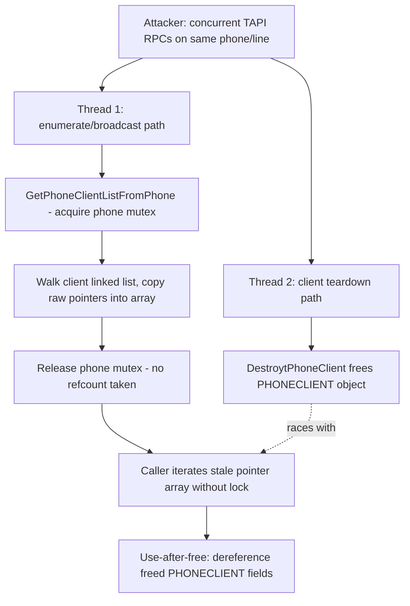

# CVE-2026-50669

**CVE:** CVE-2026-50669  
**Title:** Windows Telephony Server Elevation of Privilege Vulnerability  
**Source:** [https://msrc.microsoft.com/update-guide/vulnerability/CVE-2026-50669](https://msrc.microsoft.com/update-guide/vulnerability/CVE-2026-50669)  
**Component(s):** tapisrv.dll  
**Patched Date:** 2026-07-14T07:00:00  
**CWE:** Concurrent execution using shared resource with improper synchronization ('race condition') in Windows Telephony Service allows an authorized attacker to elevate privileges locally.  

Download Patched & Vulnerable Components:

```bash
# tapisrv.dll
wget https://msdl.microsoft.com/download/symbols/tapisrv.dll/D63509B75D000/tapisrv.dll -O tapisrv.dll.10.0.26100.8737 # vulnerable
wget https://msdl.microsoft.com/download/symbols/tapisrv.dll/3681A8AC5E000/tapisrv.dll -O tapisrv.dll.10.0.26100.8875 # patched
```

## Version Tracking Analysis

**Command:**

```
python ghidra_scripts\ghidra_vt_wrapper.py --old-binary ./reports/2026-Jul/CVE-2026-50669/tapisrv.dll.10.0.26100.8737 --new-binary ./reports/2026-Jul/CVE-2026-50669/tapisrv.dll.10.0.26100.8875 --project-dir ./reports/2026-Jul/CVE-2026-50669/ghidra_project --project-name tapisrv.dll_CVE-2026-50669 --ghidra-dir C:\Tools\ghidra_11.4.2_PUBLIC_20250826\ghidra_11.4.2_PUBLIC --output-dir ./reports/2026-Jul/CVE-2026-50669/ghidra_project/vt_results --max-memory 16g
```

Patched Functions: 3 | New Functions: 3 | Removed Functions: 1 | Total Matches: 10509 | Accepted Matches: 6929

### Patched Functions

| Function Name | Source Address | Dest Address | Similarity | Confidence |
| --- | --- | --- | --- | --- |
| `SendMsgToPhoneClients` | `180027ca0` | `180027db0` | 0.732 | 10.0 |
| `GetPhoneClientListFromPhone` | `1800234b4` | `180023588` | 0.600 | 10.0 |
| `DestroytPhone` | `180022a10` | `180022a54` | 0.596 | 10.0 |

### New Functions

| Function Name | Address |
| --- | --- |
| `DereferencePhoneClientList` | `180022a10` |
| `Feature_287027513__private_IsEnabledDeviceUsageNoInline` | `180023404` |
| `_guard_dispatch_icall` | `180043ef0` |

### Removed Functions

| Function Name | Address |
| --- | --- |
| `_guard_dispatch_icall` | `180043d90` |

---

# AI Technical Analysis

## Vulnerability Identification

**Core Vulnerable Function(s):**
- `GetPhoneClientListFromPhone()` - Builds an array of raw
  pointers to `PHONECLIENT` objects while holding the phone's
  exclusive-access mutex, then releases that mutex without
  ever placing a reference count on the objects it collected.
  Callers subsequently walk the array after the lock is gone,
  creating a use-after-free window.

**Supporting Changes:**
- `DestroytPhone()` - Caller that obtains the client list via
  `GetPhoneClientListFromPhone()`, iterates it post-unlock to
  emit events and tear down clients; patched to call the new
  `DereferencePhoneClientList()` to release the references
  the fixed allocator now takes.
- `SendMsgToPhoneClients()` - Caller that obtains the client
  list via `GetPhoneClientListFromPhone()`, iterates it
  post-unlock to broadcast messages; patched identically to
  release references after use, including on the
  previously-unhandled error return path.
- `DereferencePhoneClientList()` - New helper, the release
  counterpart of the `ReferenceObject()` calls added inside
  `GetPhoneClientListFromPhone()`. It is a cleanup routine,
  not itself a source of the flaw.

**Unrelated Changes:**
- None. All three diffs are directly part of the same
  reference-counting fix; variable renames (`piVar3`/`piVar4`
  shuffles, `local_a0`/`local_98` swaps) are compiler-artifact
  noise from the recompiled binary, not functional changes.

---

## Root Cause Analysis

The bug is a classic time-of-check/time-of-use race: the code
captured raw pointers to shared `PHONECLIENT` objects while a
lock was held, then used those pointers after the lock was
released, without any ownership mechanism keeping the objects
alive in between. The invariant violated is "a pointer handed
to a caller outside the critical section must remain valid for
the duration of its use."

```c
uVar2 = WaitForExclusivetPhoneAccess(param_1,&local_res20,local_res18);
...
for (lVar5 = *(longlong *)(param_1 + 4); lVar5 != 0;
    lVar5 = *(longlong *)(lVar5 + 0x48)) {
  piVar3 = piVar4;
  if (iVar6 == iVar8) {
    piVar3 = HeapAlloc(ghTapisrvHeap,8,(ulonglong)(iVar8 * 0x10 + 8));
    ...
    memcpy(piVar3 + 2,piVar4 + 2,uVar7 * 8);
    ...
  }
  *(longlong *)(piVar3 + uVar7 * 2 + 2) = lVar5;
  uVar7 = (ulonglong)(iVar6 + 1);
  piVar4 = piVar3;
}
MyReleaseMutex(local_res20,local_res18[0]);
*piVar4 = iVar6;
*param_2 = (longlong)piVar4;
```

`WaitForExclusivetPhoneAccess` grants temporary exclusive
access to the phone's client linked list, whose head lives at
`*(param_1+4)` and whose "next" pointer lives at offset `0x48`
of each node (`lVar5`). The loop copies each node address
(`lVar5`) straight into a growable array (`piVar3`/`piVar4`),
doubling capacity from 8 with `HeapAlloc`/`memcpy` as needed.
Nothing in this loop touches the client object's own reference
count; the only protection is `local_res20`, the phone mutex,
which is released via `MyReleaseMutex` immediately after the
array is finalized. Callers such as `DestroytPhone()` and
`SendMsgToPhoneClients()` then dereference every stored
pointer (`piVar1[8]`, `piVar1[0xc]`, `*(longlong*)(piVar1+4)`,
etc.) well after the mutex is gone. If a concurrent TAPI
operation destroys one of those client objects in that window
(`DestroytPhoneClient`), the memory backing `piVar1` is freed
while a stale pointer to it still sits in the just-built array,
producing a use-after-free on the next iteration.

---

## Execution and Trigger Flow

An attacker needs two concurrent TAPI operations against the
same phone device/line: one that enumerates or broadcasts to
its clients (`lineGetMessage`/close-related RPCs reaching
`SendMsgToPhoneClients()` or `DestroytPhone()`), and one that
disconnects or tears down a client on that same phone
(reaching `DestroytPhoneClient`). The first operation calls
`GetPhoneClientListFromPhone()`, which takes the phone's
exclusive mutex, walks the client linked list starting at
`*(param_1+4)` via the `+0x48` next-pointer, and copies each
client's address into a heap array. As soon as the array is
complete, the mutex is released and the raw pointer array is
handed back to the caller. Before the caller finishes iterating
that array, the second, racing operation runs
`DestroytPhoneClient` on one of the enumerated client objects,
freeing its backing allocation. The first operation, still
iterating the now-stale array in `DestroytPhone()` or
`SendMsgToPhoneClients()`, dereferences the freed pointer to
read fields used for event filtering (`piVar1[0xd]`,
`piVar1[0xe]`, `piVar1[0xf]`) and to build/send an event buffer
(`WriteEventBuffer`), operating on freed heap memory. Because
`tapisrv.dll` runs as the SYSTEM-level Telephony service and is
reachable via TAPI RPC from lower-privileged local clients,
winning this race gives an attacker a use-after-free primitive
inside a SYSTEM process.



---

## Patch Analysis

```diff
+      uVar2 = Feature_287027513__private_IsEnabledDeviceUsageNoInline();
+      if ((uVar2 == 0) ||
+         (piVar5 = ReferenceObject(_Dst,*(uint *)(lVar6 + 0x60),0x494c4350), uVar8 = uVar9,
+         piVar5 != (int *)0x0)) {
+        uVar8 = (ulonglong)(iVar7 + 1);
+        *(longlong *)(piVar4 + uVar9 * 2 + 2) = lVar6;
+      }
```

```diff
+        uVar4 = Feature_287027513__private_IsEnabledDeviceUsageNoInline();
+        if (uVar4 != 0) {
+          DereferencePhoneClientList((longlong *)puVar8,*puVar8);
+        }
```

The patched `GetPhoneClientListFromPhone()` now calls
`ReferenceObject(_Dst, *(uint*)(lVar6+0x60), 0x494c4350)` for
each client node before committing it to the output array,
still while the phone mutex is held. This increments the
object's own reference count, so the object cannot be freed by
`DestroytPhoneClient` until that reference is released, even
after `MyReleaseMutex` runs. If `ReferenceObject` fails (the
object is already being torn down), the entry is simply
skipped (`uVar8`/`uVar9` are not advanced), preventing a
dying object from ever entering the list. The new
`DereferencePhoneClientList()` walks the resulting array and
calls `DereferenceObject` on every entry, and is invoked by
both `DestroytPhone()` and `SendMsgToPhoneClients()` once they
finish consuming the list, symmetrically releasing the
references taken during enumeration. `SendMsgToPhoneClients()`
also gained a previously missing dereference/free on its
early-return error path, closing a related leak.

This closes the race window: an object referenced by the
enumeration array is now guaranteed to remain valid for as long
as the caller holds it, regardless of concurrent destroy
operations, because the object's own lifetime (refcount) rather
than the phone mutex now governs validity. The fix is gated
behind `Feature_287027513__private_IsEnabledDeviceUsageNoInline`,
indicating a staged/flighted rollout rather than an unconditional
behavior change, but the reference/dereference pairing is
symmetric across all three functions, so no reference leak or
premature free is introduced when the flag is enabled.

The change directly eliminates the use-after-free by converting
an implicit, lock-scoped validity guarantee into an explicit,
object-lifetime-scoped one, which is the correct fix for a
collection-then-use-outside-lock pattern.