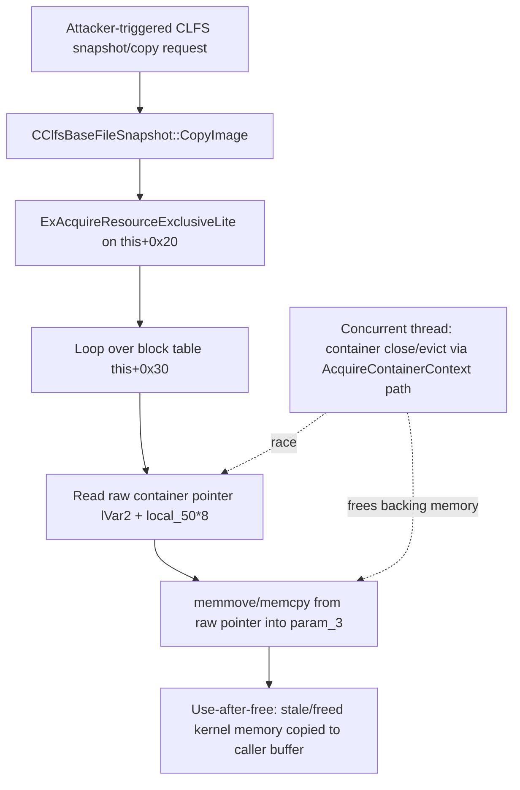

# CVE-2026-50697

**CVE:** CVE-2026-50697  
**Title:** Windows Common Log File System Driver Elevation of Privilege Vulnerability  
**Source:** [https://msrc.microsoft.com/update-guide/vulnerability/CVE-2026-50697](https://msrc.microsoft.com/update-guide/vulnerability/CVE-2026-50697)  
**Component(s):** clfs.sys  
**Patched Date:** 2026-07-14T07:00:00  
**CWE:** Exposure of sensitive information to an unauthorized actor in Windows Common Log File System Driver allows an authorized attacker to elevate privileges locally.  

Download Patched & Vulnerable Components:

```bash
# clfs.sys
wget https://msdl.microsoft.com/download/symbols/clfs.sys/B9B52AD98C000/clfs.sys -O clfs.sys.10.0.26100.8737 # vulnerable
wget https://msdl.microsoft.com/download/symbols/clfs.sys/3F1E18F28C000/clfs.sys -O clfs.sys.10.0.26100.8875 # patched
```

## Version Tracking Analysis

**Command:**

```
python ghidra_scripts\ghidra_vt_wrapper.py --old-binary ./reports/2026-Jul/CVE-2026-50697/clfs.sys.10.0.26100.8737 --new-binary ./reports/2026-Jul/CVE-2026-50697/clfs.sys.10.0.26100.8875 --project-dir ./reports/2026-Jul/CVE-2026-50697/ghidra_project --project-name clfs.sys_CVE-2026-50697 --ghidra-dir C:\Tools\ghidra_11.4.2_PUBLIC_20250826\ghidra_11.4.2_PUBLIC --output-dir ./reports/2026-Jul/CVE-2026-50697/ghidra_project/vt_results --max-memory 16g
```

Patched Functions: 1 | New Functions: 5 | Removed Functions: 1 | Total Matches: 11960 | Accepted Matches: 9241

### Patched Functions

| Function Name | Source Address | Dest Address | Similarity | Confidence |
| --- | --- | --- | --- | --- |
| `CClfsBaseFileSnapshot::CopyImage` | `140039668` | `1400396a0` | 0.531 | 10.0 |

### New Functions

| Function Name | Address |
| --- | --- |
| `Feature_326875449__private_IsEnabledDeviceUsageNoInline` | `140011880` |
| `Feature_326875449__private_IsEnabledFallback` | `1400118b8` |
| `Feature_3650604346__private_IsEnabledDeviceUsageNoInline` | `140016cf0` |
| `Feature_3650604346__private_IsEnabledFallback` | `140016d28` |
| `_guard_dispatch_icall` | `140018890` |

### Removed Functions

| Function Name | Address |
| --- | --- |
| `_guard_dispatch_icall` | `140018a80` |

---

# AI Technical Analysis

## Vulnerability Identification

**Core Vulnerable Function(s):**
- `CClfsBaseFileSnapshot::CopyImage()` - performs the block
  copy from container-backed log memory into the caller
  buffer using a raw pointer that is never pinned or
  reference-counted against concurrent container teardown,
  producing a use-after-free / TOCTOU race.

**Supporting Changes:**
- `CClfsBaseFileSnapshot::CopyImage()` (patched region) -
  the same function also contains the fix: a new
  `AcquireContainerContext()` / `ReleaseContainerContext()`
  pinning loop gated by
  `Feature_326875449__private_IsEnabledDeviceUsageNoInline()`.

**Unrelated Changes:**
- WPP trace-flag test (`>> 0x1b & 1` versus `& 0x8000000`)
  - equivalent bitmask rewritten by the compiler/decompiler,
  no behavioral or security effect.
- Local variable renaming/reordering (`local_6c`, `local_70`,
  `uVar9`, etc.) - decompilation artifacts of recompiled
  code, not functional changes.
- `memmove` to `memcpy` change in the copy call - a
  side effect of the same edited block, not itself the
  security boundary; the source/destination ranges do not
  overlap in either version.

---

## Root Cause Analysis

The vulnerability is a use-after-free caused by a missing
ownership/reference guarantee on container-backed memory
during a multi-iteration copy loop. `CopyImage()` walks a
per-block metadata table at `this + 0x30` and copies log
data through a pointer taken directly from that table,
without ever acquiring a lock or reference tied to the
container object that actually owns the underlying memory.
The routine assumes that once `ExAcquireResourceExclusiveLite`
is taken on `this + 0x20`, the container-backed pointers it
reads remain valid for the whole loop, but that resource
does not govern the independent lifetime of container
contexts (acquired/released elsewhere via
`AcquireContainerContext` / `ReleaseContainerContext`).

Vulnerable code (pre-patch):

```c
while( true ) {
    if (((uint)*(ushort *)(this + 0x28) <= (uint)uVar9) ||
        (param_2 <= *param_4)) break;
    local_50 = uVar9 * 3;
    p_Var7 = *(_CLFS_LOG_BLOCK_HEADER **)
             (*(longlong *)(this + 0x30) + uVar9 * 0x18);
    ...
    uVar5 = *(uint *)(lVar2 + 0xc + local_50 * 8);
    uVar1 = *(uint *)(lVar2 + 8 + local_50 * 8);
    if ((param_1 < uVar1 + uVar5) && (uVar5 <= param_1)) {
        local_58 = param_1 - uVar5;
        ...
        memmove(param_3 + *param_4,
                (void *)((ulonglong)local_58 +
                *(longlong *)(lVar2 + local_50 * 8)),
                (ulonglong)uVar8);
```

`lVar2` is `this + 0x30`, the container/block table base.
`*(longlong *)(lVar2 + local_50 * 8)` is a raw source
pointer into container-owned memory, dereferenced by
`memmove` with a length (`uVar8`) derived from caller-visible
`param_1`/`param_2` bookkeeping. Nothing in this loop calls
`AcquireContainerContext`, so a second thread that closes,
evicts, or remaps that container between iterations frees or
invalidates the memory this loop is still reading from,
resulting in a stale-pointer dereference and a copy of freed
kernel memory into `param_3`.

---

## Execution and Trigger Flow

An attacker capable of driving CLFS log operations (e.g.
through NTFS transactional APIs, TxF-backed components, or
any subsystem that exposes CLFS marshalling/snapshot
requests to `clfs.sys`) requests a base-log-file snapshot
copy, which reaches `CClfsBaseFileSnapshot::CopyImage()`.
The function takes the file-level resource lock, then
iterates the block table, reading a container-owned pointer
directly out of `this + 0x30` for each block and copying
data from it. Because the container lifecycle
(`AcquireContainerContext`/`ReleaseContainerContext`) is
managed independently of the file resource lock, a second
thread can concurrently trigger container closure or
eviction (e.g. via container cache pressure or an explicit
container-management request) while the copy loop is still
mid-flight across up to `0x400` blocks/containers. If that
race wins between the pointer read and the `memcpy`/`memmove`,
the loop copies from memory that has already been freed and
potentially reallocated, producing an information disclosure
of arbitrary kernel pool contents into the caller-supplied
`param_3` buffer, or a crash if the freed page is unmapped.



---

## Patch Analysis

The fix adds a container-pinning phase around the copy loop,
gated by `Feature_326875449__private_IsEnabledDeviceUsageNoInline()`:

```diff
+    uVar6 = Feature_326875449__private_IsEnabledDeviceUsageNoInline();
+    if ((int)uVar6 != 0) {
+      local_74 = 0;
+      while (uVar13 = (uint)uVar7, uVar13 < 0x400) {
+        lVar4 = CClfsBaseFile::AcquireContainerContext(
+                    (CClfsBaseFile *)this,uVar13,&local_80);
+        if (lVar4 < 0) {
+          *(undefined8 *)(this + uVar7 * 8 + 0xa0) = 0;
+        }
+        else {
+          *(undefined8 *)(this + uVar7 * 8 + 0xa0) =
+              *(undefined8 *)(local_80 + 0x18);
+          *(undefined8 *)(local_80 + 0x18) = 0;
+          CClfsBaseFile::ReleaseContainerContext(
+              (CClfsBaseFile *)this,&local_80);
+        }
+        ...
+      }
+    }
     ... copy loop unchanged in structure ...
+    uVar7 = Feature_326875449__private_IsEnabledDeviceUsageNoInline();
+    if ((int)uVar7 != 0) {
+      pCVar12 = this + 0xa0;
+      do {
+        if (*(longlong *)pCVar12 != 0) {
+          lVar5 = CClfsBaseFile::AcquireContainerContext(
+                      (CClfsBaseFile *)this,(ulong)uVar8,&local_80);
+          if (lVar5 < 0) {
+            *(longlong *)pCVar12 = 0;
+          }
+          else {
+            *(longlong *)(local_80 + 0x18) = *(longlong *)pCVar12;
+            *(longlong *)pCVar12 = 0;
+            CClfsBaseFile::ReleaseContainerContext(
+                (CClfsBaseFile *)this,&local_80);
+          }
+        }
+        ...
+      } while (uVar13 < 0x400);
+    }
```

Before the block-copy loop begins, the patch acquires each
container context in turn and transfers ownership of its
backing pointer (`local_80 + 0x18`) into a private per-object
array at `this + 0xa0`, zeroing the field inside the
container context itself. This effectively "checks out" the
memory the copy loop is about to read, so any concurrent
container-teardown path that inspects or frees based on
`local_80 + 0x18` sees a null field and cannot reclaim memory
that `CopyImage()` still intends to read. After the copy loop
completes (or exits via `LAB_1400399a5` on error), the second
gated loop reacquires every container context and restores
the pointer, returning ownership to the container so normal
lifecycle management resumes. This establishes a
short-lived, explicit ownership transfer instead of relying
on the file-level exclusive resource, which never actually
protected per-container memory lifetime.

The approach closes the TOCTOU window because the pointer
cannot be freed by a racing container-close operation while
it is parked in `this + 0xa0` under the snapshot object's
control; the container subsystem cooperates by checking that
field before releasing backing memory. Gating the mitigation
behind `Feature_326875449__private_IsEnabledDeviceUsageNoInline()`
suggests a staged rollout rather than a universal behavior
change, but when active it fully removes the unsynchronized
pointer dereference that caused the original use-after-free.
The result is a kernel-mode fix that prevents disclosure of
freed pool memory into caller buffers and eliminates the
associated crash/exploitation primitive in `clfs.sys`.