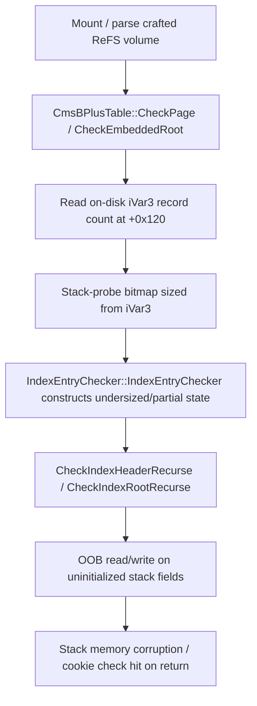

# CVE-2026-54109

**CVE:** CVE-2026-54109  
**Title:** Windows Resilient File System (ReFS) Remote Code Execution Vulnerability  
**Source:** [https://msrc.microsoft.com/update-guide/vulnerability/CVE-2026-54109](https://msrc.microsoft.com/update-guide/vulnerability/CVE-2026-54109)  
**Component(s):** refs.sys  
**Patched Date:** 2026-07-14T07:00:00  
**CWE:** Integer overflow or wraparound in Windows Resilient File System (ReFS) allows an authorized attacker to execute code locally.  

---

## Related CVEs (Same Component)

This report covers 11 CVEs affecting the same component(s):

- **CVE-2026-54109**  
- CVE-2026-49792  
- CVE-2026-49793  
- CVE-2026-50318  
- CVE-2026-50407  
- CVE-2026-50357  
- CVE-2026-50441  
- CVE-2026-50362  
- CVE-2026-50492  
- CVE-2026-50501  
- CVE-2026-58530  

### Detailed Information

#### CVE-2026-49792

**Title:** Windows Resilient File System (ReFS) Remote Code Execution Vulnerability  
**Source:** [https://msrc.microsoft.com/update-guide/vulnerability/CVE-2026-49792](https://msrc.microsoft.com/update-guide/vulnerability/CVE-2026-49792)  
**Patched Date:** 2026-07-14T07:00:00  
**CWE:** Numeric truncation error in Windows Resilient File System (ReFS) allows an authorized attacker to execute code locally.  

#### CVE-2026-49793

**Title:** Windows Resilient File System (ReFS) Remote Code Execution Vulnerability  
**Source:** [https://msrc.microsoft.com/update-guide/vulnerability/CVE-2026-49793](https://msrc.microsoft.com/update-guide/vulnerability/CVE-2026-49793)  
**Patched Date:** 2026-07-14T07:00:00  
**CWE:** Heap-based buffer overflow in Windows Resilient File System (ReFS) allows an authorized attacker to execute code locally.  

#### CVE-2026-50318

**Title:** Windows Resilient File System (ReFS) Elevation of Privilege Vulnerability  
**Source:** [https://msrc.microsoft.com/update-guide/vulnerability/CVE-2026-50318](https://msrc.microsoft.com/update-guide/vulnerability/CVE-2026-50318)  
**Patched Date:** 2026-07-14T07:00:00  
**CWE:** Stack-based buffer overflow in Windows Resilient File System (ReFS) allows an authorized attacker to elevate privileges locally.  

#### CVE-2026-50407

**Title:** Windows Resilient File System (ReFS) Elevation of Privilege Vulnerability  
**Source:** [https://msrc.microsoft.com/update-guide/vulnerability/CVE-2026-50407](https://msrc.microsoft.com/update-guide/vulnerability/CVE-2026-50407)  
**Patched Date:** 2026-07-14T07:00:00  
**CWE:** Heap-based buffer overflow in Windows Resilient File System (ReFS) allows an authorized attacker to elevate privileges locally.  

#### CVE-2026-50357

**Title:** Windows Resilient File System (ReFS) Elevation of Privilege Vulnerability  
**Source:** [https://msrc.microsoft.com/update-guide/vulnerability/CVE-2026-50357](https://msrc.microsoft.com/update-guide/vulnerability/CVE-2026-50357)  
**Patched Date:** 2026-07-14T07:00:00  
**CWE:** Numeric truncation error in Windows Resilient File System (ReFS) allows an authorized attacker to execute code locally.  

#### CVE-2026-50441

**Title:** Windows Resilient File System (ReFS) Elevation of Privilege Vulnerability  
**Source:** [https://msrc.microsoft.com/update-guide/vulnerability/CVE-2026-50441](https://msrc.microsoft.com/update-guide/vulnerability/CVE-2026-50441)  
**Patched Date:** 2026-07-14T07:00:00  
**CWE:** Untrusted pointer dereference in Windows Resilient File System (ReFS) allows an authorized attacker to elevate privileges locally.  

#### CVE-2026-50362

**Title:** Windows Resilient File System (ReFS) Remote Code Execution Vulnerability  
**Source:** [https://msrc.microsoft.com/update-guide/vulnerability/CVE-2026-50362](https://msrc.microsoft.com/update-guide/vulnerability/CVE-2026-50362)  
**Patched Date:** 2026-07-14T07:00:00  
**CWE:** Heap-based buffer overflow in Windows Resilient File System (ReFS) allows an unauthorized attacker to execute code locally.  

#### CVE-2026-50492

**Title:** Windows Resilient File System (ReFS) Remote Code Execution Vulnerability  
**Source:** [https://msrc.microsoft.com/update-guide/vulnerability/CVE-2026-50492](https://msrc.microsoft.com/update-guide/vulnerability/CVE-2026-50492)  
**Patched Date:** 2026-07-14T07:00:00  
**CWE:** Heap-based buffer overflow in Windows Resilient File System (ReFS) allows an unauthorized attacker to execute code with a physical attack.  

#### CVE-2026-50501

**Title:** Windows Resilient File System (ReFS) Remote Code Execution Vulnerability  
**Source:** [https://msrc.microsoft.com/update-guide/vulnerability/CVE-2026-50501](https://msrc.microsoft.com/update-guide/vulnerability/CVE-2026-50501)  
**Patched Date:** 2026-07-14T07:00:00  
**CWE:** Stack-based buffer overflow in Windows Resilient File System (ReFS) allows an unauthorized attacker to execute code locally.  

#### CVE-2026-58530

**Title:** Windows Resilient File System (ReFS) Remote Code Execution Vulnerability  
**Source:** [https://msrc.microsoft.com/update-guide/vulnerability/CVE-2026-58530](https://msrc.microsoft.com/update-guide/vulnerability/CVE-2026-58530)  
**Patched Date:** 2026-07-14T07:00:00  
**CWE:** Heap-based buffer overflow in Windows Resilient File System (ReFS) allows an unauthorized attacker to execute code locally.  

---

Download Patched & Vulnerable Components:

```bash
# refs.sys
wget https://msdl.microsoft.com/download/symbols/refs.sys/2F254105380000/refs.sys -O refs.sys.10.0.26100.8737 # vulnerable
wget https://msdl.microsoft.com/download/symbols/refs.sys/9E0F32A4381000/refs.sys -O refs.sys.10.0.26100.8875 # patched
```

## Version Tracking Analysis

**Command:**

```
python ghidra_scripts\ghidra_vt_wrapper.py --old-binary ./reports/2026-Jul/CVE-2026-54109/refs.sys.10.0.26100.8737 --new-binary ./reports/2026-Jul/CVE-2026-54109/refs.sys.10.0.26100.8875 --project-dir ./reports/2026-Jul/CVE-2026-54109/ghidra_project --project-name refs.sys_CVE-2026-54109 --ghidra-dir C:\Tools\ghidra_11.4.2_PUBLIC_20250826\ghidra_11.4.2_PUBLIC --output-dir ./reports/2026-Jul/CVE-2026-54109/ghidra_project/vt_results --max-memory 16g
```

Patched Functions: 13 | New Functions: 51 | Removed Functions: 28 | Total Matches: 42089 | Accepted Matches: 32111

### Patched Functions

*Showing top 10 of 13 patched functions*

| Function Name | Source Address | Dest Address | Similarity | Confidence |
| --- | --- | --- | --- | --- |
| `CmsBPlusTable::CheckEmbeddedRoot` | `1400b283c` | `1400b255c` | 0.989 | 10.0 |
| `RefsLinkFileToSelf` | `1400e90b8` | `1400e8ee8` | 0.971 | 10.0 |
| `CmsBPlusTable::CheckPage` | `14007eebc` | `14007d6c4` | 0.957 | 10.0 |
| `ContinueEnumeration` | `14000d9f0` | `14004daa0` | 0.857 | 10.0 |
| `LogValidateEntryHeader` | `140099b08` | `1400abec4` | 0.830 | 10.0 |
| `<lambda_1>::operator()` | `14010526c` | `140105260` | 0.787 | 10.0 |
| `IndexEntryChecker::IndexEntryChecker` | `140093ad4` | `1400926c8` | 0.762 | 10.0 |
| `LogReadControlRecord` | `140099410` | `1400abb64` | 0.735 | 10.0 |
| `LogCoreScanDataRecord` | `140168ae8` | `1401693e4` | 0.696 | 10.0 |
| `InitializeDevice` | `1402db050` | `1402dc050` | 0.668 | 10.0 |

### New Functions

*Showing 10 of 51 new functions*

| Function Name | Address |
| --- | --- |
| `FUN_14000f31a` | `14000f31a` |
| `FUN_14003c8da` | `14003c8da` |
| `FUN_140077fcd` | `140077fcd` |
| `FUN_14007d19f` | `14007d19f` |
| `FUN_140086bf5` | `140086bf5` |
| `MspInitializeReadCopyContext` | `1400b2b44` |
| `Feature_Servicing_ReFSMountHotplugTelemetry__private_IsEnabledDeviceUsageNoInline` | `1400c82d0` |
| `Feature_Servicing_ReFSMountHotplugTelemetry__private_IsEnabledFallback` | `1400c8308` |
| `ValidateCmsRowForDirIndex` | `1400e9c74` |
| `Feature_2008279355__private_IsEnabledDeviceUsageNoInline` | `1400e9db8` |

### Removed Functions

*Showing 10 of 28 removed functions*

| Function Name | Address |
| --- | --- |
| `FUN_14003969a` | `14003969a` |
| `FUN_14003f4ea` | `14003f4ea` |
| `FUN_140077abd` | `140077abd` |
| `FUN_14007e3af` | `14007e3af` |
| `FUN_1400870a5` | `1400870a5` |
| `make_unique<_MS_TELEMETRY_DATA,0>` | `140105220` |
| `_guard_dispatch_icall` | `1401bdf80` |
| `FUN_1401c21f6` | `1401c21f6` |
| `FUN_1401c2222` | `1401c2222` |
| `FUN_1401c2666` | `1401c2666` |

---

# AI Technical Analysis

## Vulnerability Identification

**Core Vulnerable Function(s):**
- `IndexEntryChecker::IndexEntryChecker()` - constructs the
  fixed-header portion of the `IndexEntryChecker` state object used
  during recursive ReFS B+Tree index validation. The pre-patch
  constructor initializes fields only through offset `0x28`
  (`param_1[5] = param_5`) and leaves the region between that field
  and the true end of the fixed header uninitialized, even though
  callers pass a "this" pointer into a stack region that the
  recursive validators read and write well past that offset.
- `CmsBPlusTable::CheckPage()` - allocates the variable-length
  stack buffer (fixed header + attacker-sized bitmap) that backs
  the `IndexEntryChecker` object and passes it into the recursive
  validator `CheckIndexHeaderRecurse`.
- `CmsBPlusTable::CheckEmbeddedRoot()` - the embedded-root sibling
  of `CheckPage`, exhibiting the identical undersized stack layout
  and feeding `CheckIndexRootRecurse`.

**Supporting Changes:**
- Renumbered stack labels/return-address constants
  (`uStack_80`->`uStack_a0`, jump targets) in both `CheckPage` and
  `CheckEmbeddedRoot` - purely mechanical consequences of the frame
  growing, not independent fixes.

**Unrelated Changes:**
- `ContinueEnumeration()` - refactors directory-enumeration cursor
  handling (`EnumerateDirectoryCursor`, new `ValidateCmsRowForDirIndex`
  helper) and swaps one `memmove()` for `memcpy()`; this addresses a
  separate directory-index enumeration code path, not the B+Tree
  page-checking struct-sizing bug.
- `LogCoreScanDataRecord()` - adds `LogValidateEntryMetadata()` and
  extracts `LogGetNextRecordLsn()`; this hardens log record replay,
  unrelated to index-page validation.
- `MspInitializeReadCopyContext`, `InitializeRemovableDevice` (new
  functions) - unrelated subsystems (read-copy context allocation,
  removable-device mount handling).

---

## Root Cause Analysis

The flaw is an undersized and partially-uninitialized stack object
(CWE-787/CWE-457 hybrid): `IndexEntryChecker`'s constructor wrote
only the first six quad-words of its state object, while the
caller-allocated stack region and the recursive validators that
consume that object assumed a larger, fully-zeroed structure. The
invariant violated is "the constructed object's initialized extent
matches the extent the recursive parser is permitted to touch."

Vulnerable constructor:

```c
*param_1 = param_2;
param_1[1] = (ulonglong)(param_3 >> 3);
param_1[2] = param_4;
param_1[5] = param_5;
puVar1 = param_2 + (param_3 >> 3);
*(uint *)((longlong)param_1 + 0x1c) = param_3 << 6;
*(undefined4 *)(param_1 + 3) = 0;
*(undefined4 *)(param_1 + 4) = 0;
*(undefined2 *)((longlong)param_1 + 0x24) = 0;
for (; param_2 != puVar1; param_2 = param_2 + 1) {
  *param_2 = 0;
}
```

Vulnerable caller-side buffer sizing in `CheckPage`:

```c
uVar15 = (iVar3 + 7U >> 6) + 7;
uVar16 = uVar15 & 0xfffffff8;
...
local_50 = (ulonglong)(uVar15 >> 3);
lVar8 = -(uVar12 & 0xfffffffffffffff0);
puVar13 = (undefined8 *)((longlong)&local_58 + lVar8);
puVar1 = puVar13 + local_50;
local_40 = 0;
local_38 = 0;
local_34 = 0;
local_58 = puVar13;
local_48 = piVar5;
for (; puVar13 != puVar1; puVar13 = puVar13 + 1) {
  *puVar13 = 0;
}
```

`iVar3` is read directly from the on-disk index header
(`*(int *)(param_1 + 0x120)`) and drives `uVar15`/`uVar16`, which
size the trailing bitmap region reserved via manual stack-pointer
probing (`uVar12`/`lVar8`). Only three scalars (`local_40`,
`local_38`, `local_34`) between the fixed header and the bitmap were
zeroed; the fixed header handed to `IndexEntryChecker::IndexEntryChecker`
(`local_58`..`local_34` in the old layout) was both smaller than the
object the recursive validator actually dereferences and left several
intermediate bytes uninitialized. `CheckIndexHeaderRecurse` is then
invoked with `&local_58` as state, walking further into this
structure for every recursive B+Tree level.

---

## Execution and Trigger Flow

An attacker supplies a crafted ReFS volume image or mounts a crafted
removable/virtual disk containing a directory or metadata B+Tree
whose index page carries a signature match (`MSMB2+` cookie test,
`piVar5[1] == 2`, `*piVar5 == 0x2b42534d`) so that `CheckPage` (or
`CheckEmbeddedRoot` for an inline/embedded root) enters its
validation branch. The page's record-count field at offset `0x120`
supplies `iVar3`, which the function uses, unsanitized against the
fixed-header size, to size a stack bitmap via manual stack-pointer
arithmetic. `IndexEntryChecker::IndexEntryChecker` is called on the
base of that stack region, but only initializes a subset of the
fields the subsequent recursive validator expects to be valid,
leaving adjacent stack bytes as leftover frame contents. Execution
then descends into `CheckIndexHeaderRecurse` /
`CheckIndexRootRecurse`, passing a pointer to this same
under-initialized object; each recursion level reads and writes
through offsets beyond what the constructor guaranteed, so an
attacker who controls the index page's embedded property/schema
definitions can steer these accesses into stack memory that was
never validated, corrupting adjacent locals (including
`__security_cookie`-protected data) before the function returns
through its cookie check.



---

## Patch Analysis

Patched constructor:

```diff
-  param_1[5] = param_5;
+  *(undefined4 *)(param_1 + 8) = 0xffffffff;
+  param_1[9] = param_5;
   puVar1 = param_2 + (param_3 >> 3);
-  *(uint *)((longlong)param_1 + 0x1c) = param_3 << 6;
   *(undefined4 *)(param_1 + 3) = 0;
   *(undefined4 *)(param_1 + 4) = 0;
   *(undefined2 *)((longlong)param_1 + 0x24) = 0;
+  param_1[5] = 0;
+  param_1[6] = 0;
+  param_1[7] = 0;
+  *(undefined1 *)((longlong)param_1 + 0x44) = 0;
+  *(uint *)((longlong)param_1 + 0x1c) = param_3 << 6;
```

Patched `CheckPage` grows its matching stack frame
(`auStack_78`->`auStack_98`, `uStack_80`->`uStack_a0`) and adds five
new zeroed locals (`local_58`, `local_54`, `local_50`, `local_48`,
`local_40`) between the header and bitmap regions.

The patch enlarges the `IndexEntryChecker` object from 0x30 to 0x50
bytes, relocates the caller-supplied `param_5` field from offset
`0x28` to `0x48`, and explicitly zero-fills every intermediate
quad-word (`param_1[5]`, `param_1[6]`, `param_1[7]`) plus a new byte
flag at `0x44`. It also writes an explicit `0xffffffff` sentinel at
offset `0x40`, marking a bound/limit field that recursive validators
can now check rather than reading stale stack contents. `CheckPage`
and `CheckEmbeddedRoot` are updated in lockstep to reserve the larger
frame so the fixed header and the `iVar3`-derived bitmap no longer
overlap or leave a partially-initialized gap between them.

This closes the gap between what the constructor promises and what
the recursive index-checking routines consume, eliminating both the
uninitialized-read and the out-of-bounds-write exposure across a
value (`iVar3`) that is fully attacker-controlled from the on-disk
page. Because the fix is applied symmetrically in both callers that
build this object (`CheckPage` and `CheckEmbeddedRoot`), the
correction is structurally complete for the B+Tree index/embedded
root validation path. The new `0xffffffff` sentinel further suggests
an added invariant check consumed downstream in the recursive
validators, providing defense in depth beyond simple zero-init.

This is a kernel-mode (refs.sys) memory-corruption vulnerability
triggerable by mounting or parsing a maliciously crafted ReFS
filesystem image, with impact ranging from denial of service (bug
check) to potential local elevation of privilege depending on stack
layout and adjacent data corrupted at the time of trigger.