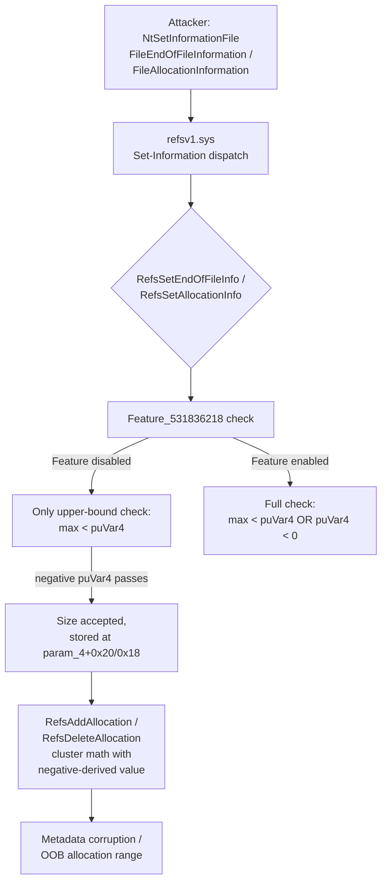

# CVE-2026-54109

**CVE:** CVE-2026-54109  
**Title:** Windows Resilient File System (ReFS) Remote Code Execution Vulnerability  
**Source:** [https://msrc.microsoft.com/update-guide/vulnerability/CVE-2026-54109](https://msrc.microsoft.com/update-guide/vulnerability/CVE-2026-54109)  
**Component(s):** refsv1.sys  
**Patched Date:** 2026-07-14T07:00:00  
**CWE:** Integer overflow or wraparound in Windows Resilient File System (ReFS) allows an authorized attacker to execute code locally.  

---

## Related CVEs (Same Component)

This report covers 11 CVEs affecting the same component(s):

- **CVE-2026-54109**  
- CVE-2026-49792  
- CVE-2026-49793  
- CVE-2026-50318  
- CVE-2026-50407  
- CVE-2026-50357  
- CVE-2026-50441  
- CVE-2026-50362  
- CVE-2026-50492  
- CVE-2026-50501  
- CVE-2026-58530  

### Detailed Information

#### CVE-2026-49792

**Title:** Windows Resilient File System (ReFS) Remote Code Execution Vulnerability  
**Source:** [https://msrc.microsoft.com/update-guide/vulnerability/CVE-2026-49792](https://msrc.microsoft.com/update-guide/vulnerability/CVE-2026-49792)  
**Patched Date:** 2026-07-14T07:00:00  
**CWE:** Numeric truncation error in Windows Resilient File System (ReFS) allows an authorized attacker to execute code locally.  

#### CVE-2026-49793

**Title:** Windows Resilient File System (ReFS) Remote Code Execution Vulnerability  
**Source:** [https://msrc.microsoft.com/update-guide/vulnerability/CVE-2026-49793](https://msrc.microsoft.com/update-guide/vulnerability/CVE-2026-49793)  
**Patched Date:** 2026-07-14T07:00:00  
**CWE:** Heap-based buffer overflow in Windows Resilient File System (ReFS) allows an authorized attacker to execute code locally.  

#### CVE-2026-50318

**Title:** Windows Resilient File System (ReFS) Elevation of Privilege Vulnerability  
**Source:** [https://msrc.microsoft.com/update-guide/vulnerability/CVE-2026-50318](https://msrc.microsoft.com/update-guide/vulnerability/CVE-2026-50318)  
**Patched Date:** 2026-07-14T07:00:00  
**CWE:** Stack-based buffer overflow in Windows Resilient File System (ReFS) allows an authorized attacker to elevate privileges locally.  

#### CVE-2026-50407

**Title:** Windows Resilient File System (ReFS) Elevation of Privilege Vulnerability  
**Source:** [https://msrc.microsoft.com/update-guide/vulnerability/CVE-2026-50407](https://msrc.microsoft.com/update-guide/vulnerability/CVE-2026-50407)  
**Patched Date:** 2026-07-14T07:00:00  
**CWE:** Heap-based buffer overflow in Windows Resilient File System (ReFS) allows an authorized attacker to elevate privileges locally.  

#### CVE-2026-50357

**Title:** Windows Resilient File System (ReFS) Elevation of Privilege Vulnerability  
**Source:** [https://msrc.microsoft.com/update-guide/vulnerability/CVE-2026-50357](https://msrc.microsoft.com/update-guide/vulnerability/CVE-2026-50357)  
**Patched Date:** 2026-07-14T07:00:00  
**CWE:** Numeric truncation error in Windows Resilient File System (ReFS) allows an authorized attacker to execute code locally.  

#### CVE-2026-50441

**Title:** Windows Resilient File System (ReFS) Elevation of Privilege Vulnerability  
**Source:** [https://msrc.microsoft.com/update-guide/vulnerability/CVE-2026-50441](https://msrc.microsoft.com/update-guide/vulnerability/CVE-2026-50441)  
**Patched Date:** 2026-07-14T07:00:00  
**CWE:** Untrusted pointer dereference in Windows Resilient File System (ReFS) allows an authorized attacker to elevate privileges locally.  

#### CVE-2026-50362

**Title:** Windows Resilient File System (ReFS) Remote Code Execution Vulnerability  
**Source:** [https://msrc.microsoft.com/update-guide/vulnerability/CVE-2026-50362](https://msrc.microsoft.com/update-guide/vulnerability/CVE-2026-50362)  
**Patched Date:** 2026-07-14T07:00:00  
**CWE:** Heap-based buffer overflow in Windows Resilient File System (ReFS) allows an unauthorized attacker to execute code locally.  

#### CVE-2026-50492

**Title:** Windows Resilient File System (ReFS) Remote Code Execution Vulnerability  
**Source:** [https://msrc.microsoft.com/update-guide/vulnerability/CVE-2026-50492](https://msrc.microsoft.com/update-guide/vulnerability/CVE-2026-50492)  
**Patched Date:** 2026-07-14T07:00:00  
**CWE:** Heap-based buffer overflow in Windows Resilient File System (ReFS) allows an unauthorized attacker to execute code with a physical attack.  

#### CVE-2026-50501

**Title:** Windows Resilient File System (ReFS) Remote Code Execution Vulnerability  
**Source:** [https://msrc.microsoft.com/update-guide/vulnerability/CVE-2026-50501](https://msrc.microsoft.com/update-guide/vulnerability/CVE-2026-50501)  
**Patched Date:** 2026-07-14T07:00:00  
**CWE:** Stack-based buffer overflow in Windows Resilient File System (ReFS) allows an unauthorized attacker to execute code locally.  

#### CVE-2026-58530

**Title:** Windows Resilient File System (ReFS) Remote Code Execution Vulnerability  
**Source:** [https://msrc.microsoft.com/update-guide/vulnerability/CVE-2026-58530](https://msrc.microsoft.com/update-guide/vulnerability/CVE-2026-58530)  
**Patched Date:** 2026-07-14T07:00:00  
**CWE:** Heap-based buffer overflow in Windows Resilient File System (ReFS) allows an unauthorized attacker to execute code locally.  

---

Download Patched & Vulnerable Components:

```bash
# refsv1.sys
wget https://msdl.microsoft.com/download/symbols/refsv1.sys/5E5A2D4BFE000/refsv1.sys -O refsv1.sys.10.0.26100.8521 # vulnerable
wget https://msdl.microsoft.com/download/symbols/refsv1.sys/B50FB535FD000/refsv1.sys -O refsv1.sys.10.0.26100.8737 # patched
```

## Version Tracking Analysis

**Command:**

```
python ghidra_scripts\ghidra_vt_wrapper.py --old-binary ./reports/2026-Jul/CVE-2026-54109/refsv1.sys.10.0.26100.8521 --new-binary ./reports/2026-Jul/CVE-2026-54109/refsv1.sys.10.0.26100.8737 --project-dir ./reports/2026-Jul/CVE-2026-54109/ghidra_project --project-name refsv1.sys_CVE-2026-54109 --ghidra-dir C:\Tools\ghidra_11.4.2_PUBLIC_20250826\ghidra_11.4.2_PUBLIC --output-dir ./reports/2026-Jul/CVE-2026-54109/ghidra_project/vt_results --max-memory 16g
```

Patched Functions: 3 | New Functions: 1 | Removed Functions: 15 | Total Matches: 13853 | Accepted Matches: 12292

### Patched Functions

| Function Name | Source Address | Dest Address | Similarity | Confidence |
| --- | --- | --- | --- | --- |
| `CmsAvlTable::PinDataWithRoot` | `140037fd0` | `140037690` | 0.985 | 1.0 |
| `RefsSetEndOfFileInfo` | `1400ba004` | `1400b8fe8` | 0.912 | 10.0 |
| `RefsSetAllocationInfo` | `1400b9284` | `1400b8284` | 0.878 | 10.0 |

### New Functions

| Function Name | Address |
| --- | --- |
| `_guard_dispatch_icall` | `1400600d0` |

### Removed Functions

*Showing 10 of 15 removed functions*

| Function Name | Address |
| --- | --- |
| `Feature_531836218__private_IsEnabledDeviceUsageNoInline` | `14000b460` |
| `Feature_531836218__private_IsEnabledFallback` | `14000b498` |
| `wil_details_AreDependenciesEnabled` | `14000ba90` |
| `wil_details_FeatureReporting_IncrementOpportunityInCache` | `14000bb30` |
| `wil_details_FeatureReporting_IncrementUsageInCache` | `14000bc08` |
| `wil_details_FeatureReporting_RecordUsageInCache` | `14000bcec` |
| `wil_details_FeatureReporting_ReportUsageToService` | `14000be6c` |
| `wil_details_FeatureReporting_ReportUsageToServiceDirect` | `14000bee8` |
| `wil_details_FeatureStateCache_ReevaluateCachedFeatureEnabledState` | `14000bfd4` |
| `wil_details_FeatureStateCache_TryEnableDeviceUsageFastPath` | `14000c0e4` |

---

# AI Technical Analysis

## Vulnerability Identification

**Core Vulnerable Function(s):**
- `RefsSetEndOfFileInfo()` - performs an end-of-file (truncate/
  extend) size validation that is gated by a runtime feature
  flag, silently dropping the negative-size check when the flag
  is disabled.
- `RefsSetAllocationInfo()` - contains the identical feature-
  flag-gated validation flaw for the allocation-size parameter.

**Supporting Changes:**
- None. Both functions contain independent instances of the
  same core defect; neither is a mere caller of the other.

**Unrelated Changes:**
- `CmsAvlTable::PinDataWithRoot()` /
  `CmsContainerBase::ReserveForParentChildTableUpdate()` - the
  diff only corrects the recovered symbol name and prototype for
  a function that unconditionally returns `-0x3fffff45` in both
  the "before" and "after" versions. No executable logic
  changed, so this is a decompiler/symbol relabeling artifact,
  not a security fix.

---

## Root Cause Analysis

The flaw is an inconsistent bounds check on an attacker-supplied
64-bit size value (`puVar4`), which represents the new
end-of-file or allocation size requested via a file-information
IOCTL. Validation of this value is wrapped in a branch on
`Feature_531836218__private_IsEnabledDeviceUsageNoInline()`, and
only the branch taken when the feature is *enabled* checks that
`puVar4` is non-negative. The invariant violated is that a file
size used later in pointer/offset arithmetic and cluster
allocation math must be a non-negative value bounded by the
volume's maximum file size.

Vulnerable code (`RefsSetEndOfFileInfo`, before patch):

```c
uVar8 = Feature_531836218__private_IsEnabledDeviceUsageNoInline();
if ((int)uVar8 == 0) {
  if (*(longlong *)(*(longlong *)(param_4 + 0x90) + 0x138) <
      (longlong)puVar4) {
    if (RefsStatusDebugEnabled == '\0') {
      return -0x3ffffff3;
    }
    uVar12 = 0x2108;
    goto LAB_1400ba11f;
  }
}
else if ((*(longlong *)(*(longlong *)(param_4 + 0x90) + 0x138) <
          (longlong)puVar4) || ((longlong)puVar4 < 0)) {
  ...
  return -0x3ffffff3;
}
```

`RefsSetAllocationInfo` mirrors this exactly: when the feature
flag is `0`, only `puVar4 <= max` is checked before jumping to
the main allocation-update path; the `-1 < (longlong)puVar4`
(non-negative) test is only reached in the `else` (feature
enabled) branch. In both functions, `param_4 + 0x138` holds the
volume-derived maximum valid size and `param_4 + 0x20` /
`param_4 + 0x18` hold the current file-size fields that get
overwritten with `puVar4`. Because signed comparison treats a
negative `puVar4` as "less than" the positive maximum, the
upper-bound check alone (`max < puVar4`) is satisfied and the
function proceeds. The unchecked negative value then flows into
`RefsAddAllocation`/`RefsDeleteAllocation` cluster-range
calculations (shifted by `bVar1`, a cluster-size log2 factor) and
is persisted via `RefsWriteFileSizes`, corrupting on-disk/in-
memory size metadata and allocation-range arithmetic with an
attacker-controlled negative-turned-huge unsigned quantity.

---

## Execution and Trigger Flow

An attacker with local or SMB-mounted access to a ReFS volume
issues a file-information set request (`NtSetInformationFile`
with `FileEndOfFileInformation` or `FileAllocationInformation`,
or the equivalent FSCTL path) against a file they control. The
I/O manager routes this through `refsv1.sys`'s set-information
dispatch, which eventually calls `RefsSetEndOfFileInfo` or
`RefsSetAllocationInfo` with the requested size extracted from
the caller-supplied structure into `puVar4`. Before committing
the new size, the driver queries
`Feature_531836218__private_IsEnabledDeviceUsageNoInline()`; on
systems/configurations where this feature is disabled, the
negative-value check is skipped. An attacker supplies a crafted
64-bit size whose sign bit is set (interpreted as negative when
compared) but which is numerically less than the volume's
maximum file size threshold, so the truncated bounds check
passes. Execution proceeds to update the file's size fields and
call the allocation helpers with the negative size, producing
out-of-bounds cluster range computations and corrupting
allocation/size metadata, which can be leveraged for memory
corruption or denial of service in kernel mode.



---

## Patch Analysis

The patch removes the feature-flag branch entirely and replaces
it with a single, unconditional check performed regardless of
`Feature_531836218` state:

```diff
-  uVar8 = Feature_531836218__private_IsEnabledDeviceUsageNoInline();
-  if ((int)uVar8 == 0) {
-    if (*(longlong *)(*(longlong *)(param_4 + 0x90) + 0x138) <
-        (longlong)puVar4) {
-      ...
-    }
-  }
-  else if ((*(longlong *)(*(longlong *)(param_4 + 0x90) + 0x138) <
-            (longlong)puVar4) || ((longlong)puVar4 < 0)) {
-    ...
-  }
+  if ((*(longlong *)(*(longlong *)(param_4 + 0x90) + 0x138) <
+       (longlong)puVar4) ||
+     ((longlong)puVar4 < 0)) {
+    iVar8 = -0x3ffffff3;
+    if (RefsStatusDebugEnabled == '\0') {
+      return -0x3ffffff3;
+    }
+    uVar12 = 0x20f5;
+    goto LAB_1400b9476;
+  }
```

The same restructuring is applied verbatim in
`RefsSetAllocationInfo`, collapsing the feature-gated `if/else`
into one unconditional `if` that always evaluates both the
upper-bound (`max < puVar4`) and lower-bound (`puVar4 < 0`)
conditions before any size field is modified or any allocation
helper is invoked. This closes the bypass window entirely: it is
no longer possible to reach the size-update/allocation logic with
a negative `puVar4` in any device-usage feature configuration.
The fix is a minimal, targeted validation fix rather than a
broader redesign, and it addresses the root cause directly
without altering the surrounding success-path logic (usn change
posting, cache size updates, transaction checkpointing).
Effectiveness is high: the check is now unconditional and placed
before any state mutation, eliminating the code path that
previously allowed sign-extended negative sizes to reach
allocation arithmetic. The security impact is the elimination of
an attacker-triggerable kernel-mode memory/metadata corruption
primitive reachable via standard file-size IOCTLs on a ReFS
volume, addressing CVE-2026-54109 in `refsv1.sys`.