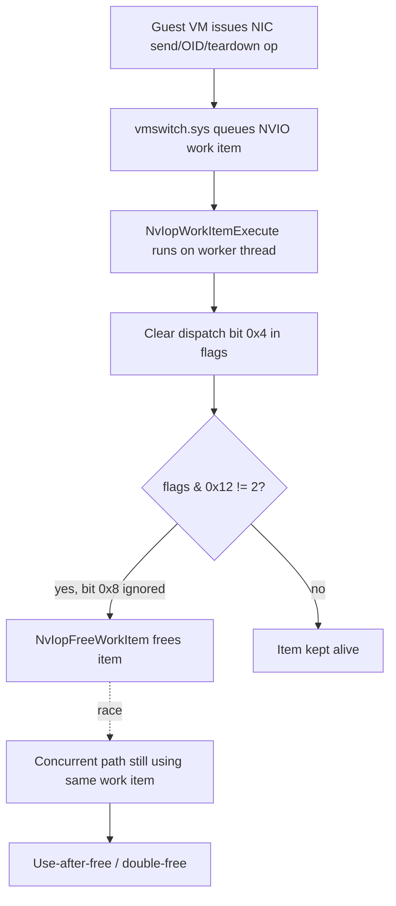

# CVE-2026-54129

**CVE:** CVE-2026-54129  
**Title:** Windows Hyper-V Elevation of Privilege Vulnerability  
**Source:** [https://msrc.microsoft.com/update-guide/vulnerability/CVE-2026-54129](https://msrc.microsoft.com/update-guide/vulnerability/CVE-2026-54129)  
**Component(s):** vmswitch.sys  
**Patched Date:** 2026-07-14T07:00:00  
**CWE:** Use after free in Windows Hyper-V allows an authorized attacker to elevate privileges locally.  

---

## Related CVEs (Same Component)

This report covers 4 CVEs affecting the same component(s):

- **CVE-2026-54129**  
- CVE-2026-54127  
- CVE-2026-50485  
- CVE-2026-50680  

### Detailed Information

#### CVE-2026-54127

**Title:** Windows Hyper-V Elevation of Privilege Vulnerability  
**Source:** [https://msrc.microsoft.com/update-guide/vulnerability/CVE-2026-54127](https://msrc.microsoft.com/update-guide/vulnerability/CVE-2026-54127)  
**Patched Date:** 2026-07-14T07:00:00  
**CWE:** Use after free in Windows Hyper-V allows an unauthorized attacker to elevate privileges locally.  

#### CVE-2026-50485

**Title:** Windows Hyper-V Denial of Service Vulnerability  
**Source:** [https://msrc.microsoft.com/update-guide/vulnerability/CVE-2026-50485](https://msrc.microsoft.com/update-guide/vulnerability/CVE-2026-50485)  
**Patched Date:** 2026-07-14T07:00:00  
**CWE:** Buffer over-read in Windows Hyper-V allows an authorized attacker to deny service over an adjacent network.  

#### CVE-2026-50680

**Title:** Windows Hyper-V Elevation of Privilege Vulnerability  
**Source:** [https://msrc.microsoft.com/update-guide/vulnerability/CVE-2026-50680](https://msrc.microsoft.com/update-guide/vulnerability/CVE-2026-50680)  
**Patched Date:** 2026-07-14T07:00:00  
**CWE:** Heap-based buffer overflow in Windows Hyper-V allows an authorized attacker to elevate privileges locally.  

---

Download Patched & Vulnerable Components:

```bash
# vmswitch.sys
wget https://msdl.microsoft.com/download/symbols/vmswitch.sys/EB489B5E284000/vmswitch.sys -O vmswitch.sys.10.0.26100.8737 # vulnerable
wget https://msdl.microsoft.com/download/symbols/vmswitch.sys/9F16FCC9284000/vmswitch.sys -O vmswitch.sys.10.0.26100.8875 # patched
```

## Version Tracking Analysis

**Command:**

```
python ghidra_scripts\ghidra_vt_wrapper.py --old-binary ./reports/2026-Jul/CVE-2026-54129/vmswitch.sys.10.0.26100.8737 --new-binary ./reports/2026-Jul/CVE-2026-54129/vmswitch.sys.10.0.26100.8875 --project-dir ./reports/2026-Jul/CVE-2026-54129/ghidra_project --project-name vmswitch.sys_CVE-2026-54129 --ghidra-dir C:\Tools\ghidra_11.4.2_PUBLIC_20250826\ghidra_11.4.2_PUBLIC --output-dir ./reports/2026-Jul/CVE-2026-54129/ghidra_project/vt_results --max-memory 16g
```

Patched Functions: 12 | New Functions: 13 | Removed Functions: 2 | Total Matches: 27982 | Accepted Matches: 26940

### Patched Functions

*Showing top 10 of 12 patched functions*

| Function Name | Source Address | Dest Address | Similarity | Confidence |
| --- | --- | --- | --- | --- |
| `VmsOmSwitchCreate` | `1400e931c` | `1400e90bc` | 0.976 | 10.0 |
| `WPP_RECORDER_SF_qqZd` | `1400fb2dc` | `1400fb54c` | 0.927 | 10.0 |
| `VmsOmpSwitchRestoreConfig` | `1400f8d34` | `1400f8fac` | 0.901 | 10.0 |
| `VmsMpCommonPvtQueryRequestNdis6` | `140051da4` | `140037434` | 0.878 | 10.0 |
| `VmsMpCommonPvtHandleMulticastOids` | `1400df6b4` | `1400df3d8` | 0.820 | 10.0 |
| `VmsNvioWorkItemPreProcessCallBack` | `14003a210` | `14003d090` | 0.810 | 10.0 |
| `WPP_RECORDER_SF__guid__guid_d` | `1400fab6c` | `1400fadd8` | 0.762 | 10.0 |
| `VmsOmpObjectDereference` | `140009c0c` | `1400506e0` | 0.762 | 10.0 |
| `VmsPtNicReceiveNetBufferLists` | `140007bd0` | `14007d950` | 0.750 | 10.0 |
| `NvIopWorkItemExecute` | `140062a6c` | `14005ff1c` | 0.741 | 10.0 |

### New Functions

*Showing 10 of 13 new functions*

| Function Name | Address |
| --- | --- |
| `NvIopCompleteWorkItem` | `140060038` |
| `Feature_896501050__private_IsEnabledDeviceUsageNoInline` | `1400e0780` |
| `Feature_896501050__private_IsEnabledFallback` | `1400e07b8` |
| `VmsOmSwitchDereferenceNoTracker` | `1400ea644` |
| `VmsOmSwitchReferenceNoTracker` | `1400ea8e8` |
| `VmsOmNicDereferencePortAndSwitch` | `1400f62d0` |
| `VmsOmNicReferencePortAndSwitch` | `1400f6618` |
| `VmsOmpObjectDereferenceEx` | `1400f7b14` |
| `VmsOmpObjectReferenceEx` | `1400f7cb4` |
| `FUN_1401abcf4` | `1401abcf4` |

### Removed Functions

| Function Name | Address |
| --- | --- |
| `FUN_1401aba84` | `1401aba84` |
| `_guard_dispatch_icall` | `1401c1820` |

---

# AI Technical Analysis

## Vulnerability Identification

**Core Vulnerable Function(s):**
- `NvIopWorkItemExecute()` - the pre-patch logic frees the
  `_NVIO_WORK_ITEM` object based on an incomplete flag check,
  omitting a test for a "still in use" state bit. This allows the
  work item to be freed while another execution path still expects
  it to be valid, producing a use-after-free / double-free
  condition.

**Supporting Changes:**
- `NvIopCompleteWorkItem()` - new function that centralizes the
  free-vs-keep decision and adds the missing state-bit check that
  closes the race.
- `VmsMpNicSendNetBufferLists()` - refactored to add a
  feature-gated reference/dereference pair
  (`VmsOmSwitchReferenceNoTracker` /
  `VmsOmSwitchDereferenceNoTracker`); the ref/deref symmetry is
  preserved and is not itself the flaw.
- `VmsOmSwitchReferenceNoTracker()`, `VmsOmSwitchDereferenceNoTracker()`,
  `VmsOmNicReferencePortAndSwitch()`,
  `VmsOmNicDereferencePortAndSwitch()` - new object-lifetime helper
  wrappers introduced to support the same feature-flagged code path;
  they call through to the existing, already-safe
  `VmsOmpObjectReferenceEx` / `VmsOmpObjectDereferenceEx` primitives.

**Unrelated Changes:**
- `WPP_RECORDER_SF_qqZd()` - only WPP trace GUID and trace-message
  length constants changed (0x86 to 0x8d); pure telemetry rebuild
  artifact.
- `VmsOmSwitchCreate()` - label renumbering, WPP GUID updates, an
  allocation-size flag change (`0x10` to `0x11`) and a global symbol
  rename (`DAT_1402130b8` to `DAT_1402130d8`); consistent with a
  struct-layout shift elsewhere in the binary, not a logic change.
- `VmsMpCommonPvtQueryRequestNdis6()` - local variable renaming and
  reordering from recompilation; the bounds check before the
  `memmove` (`local_2c4[0] <= param_5`) is functionally identical to
  the pre-patch check, so this is decompiler noise, not a fix.

---

## Root Cause Analysis

The flaw is a missing synchronization/state check before releasing
a kernel object. `NvIopWorkItemExecute` clears a "dispatched" bit in
the work item's flags field and then frees the work item whenever a
narrower set of completion flags does not equal a terminal value.
It never consults a separate bit that indicates the work item is
still owned or referenced by another in-flight code path, so the
free can race with that other consumer, violating the invariant
that a `_NVIO_WORK_ITEM` must only be freed once nothing else can
touch it.

Vulnerable code (before):

```c
*(uint *)(param_1 + 0x48) = *(uint *)(param_1 + 0x48) & 0xfffffffb;
if (((byte)*(undefined4 *)(param_1 + 0x48) & 0x12) != 2) {
  LOCK();
  plVar1 = (longlong *)(*(longlong *)(*(longlong *)(param_1 + 0x20) +
                         0xc0) + 0x40);
  *plVar1 = *plVar1 + 1;
  UNLOCK();
  NvIopFreeWorkItem(param_1);
}
```

`param_1 + 0x48` is the work item's flags dword. The `& 0xfffffffb`
clears bit 2 (0x4), representing "no longer dispatched." The guard
`((byte)flags & 0x12) != 2` only inspects bits 1 (0x2) and 4 (0x10)
and treats any combination other than exactly `0x2` as "safe to
free." Nothing in this condition accounts for bit 3 (0x8), which,
under a feature-controlled code path, marks the item as still
referenced by a concurrent consumer (e.g. a pending completion or
cancellation routine on another CPU). Because the check does not
gate on that bit, `NvIopFreeWorkItem(param_1)` can run while that
other path still holds a live pointer to `param_1`, leading to a
use-after-free once the other path subsequently dereferences or
re-completes the same work item, or a double-free if both paths
independently satisfy the free condition.

---

## Execution and Trigger Flow

A malicious or misbehaving guest partition interacts with the
Hyper-V virtual switch by issuing NVSP/OID-driven I/O operations
that vmswitch.sys services through NDIS work items (e.g. queued
send/receive completions, OID request handling, or port
teardown/reinitialization events routed through
`NvIoAllocateWorkItem`). Each such operation is represented by an
`_NVIO_WORK_ITEM` and is eventually executed by
`NvIopWorkItemExecute`, which clears the dispatch flag and decides
whether to free the item. If the guest can drive two logically
concurrent completions of the same work item close together in time
(for instance by rapidly issuing an operation and a cancellation, or
by triggering a datapath event while a device-usage/telemetry
feature path also holds a reference), one thread can reach the flag
check and free the object while the second thread is still mid-flight
using it. Repeating this race from the guest gives an attacker
influence over freed-and-reused kernel memory backing the work item,
which can be leveraged for information disclosure or code execution
in the host's virtualization stack (VM-to-host escalation), matching
the severity profile expected for a vmswitch.sys CVE.



---

## Patch Analysis

Patched code introduces a dedicated completion helper and adds a
state-bit check before freeing:

```diff
-  *(uint *)(param_1 + 0x48) = *(uint *)(param_1 + 0x48) & 0xfffffffb;
-  if (((byte)*(undefined4 *)(param_1 + 0x48) & 0x12) != 2) {
-    LOCK();
-    plVar1 = (longlong *)(*(longlong *)(*(longlong *)(param_1 + 0x20) + 0xc0) + 0x40);
-    *plVar1 = *plVar1 + 1;
-    UNLOCK();
-    NvIopFreeWorkItem(param_1);
-  }
+  NvIopCompleteWorkItem(param_1);
```

```c
void NvIopCompleteWorkItem(_NVIO_WORK_ITEM *param_1)
{
  *(uint *)(param_1 + 0x48) = *(uint *)(param_1 + 0x48) & 0xfffffffb;
  if ((Feature_558341434__private_featureState & 0x10) == 0) {
    uVar2 = Feature_558341434__private_IsEnabledDeviceUsageNoInline();
  } else {
    uVar2 = Feature_558341434__private_featureState & 1;
  }
  if (((uVar2 == 0) || ((*(uint *)(param_1 + 0x48) & 8) == 0)) &&
     (((byte)*(uint *)(param_1 + 0x48) & 0x12) != 2)) {
    LOCK();
    plVar1 = (longlong *)(*(longlong *)(*(longlong *)(param_1 + 0x20)
                           + 0xc0) + 0x40);
    *plVar1 = *plVar1 + 1;
    UNLOCK();
    NvIopFreeWorkItem(param_1);
  }
}
```

The patch adds a compound guard: `(uVar2 == 0) ||
((flags & 8) == 0)`. When the feature is active (`uVar2 != 0`) and
bit 3 (0x8) of the flags dword is set, this term evaluates false,
short-circuiting the whole condition so `NvIopFreeWorkItem` is never
called regardless of the original `0x12` check. This directly closes
the race identified above by making the free path respect the
"still referenced" state bit that the original code silently
ignored. The fix is effective for the code paths that go through
this shared helper, since both the flag-clearing and the free
decision are now atomic within a single routine rather than split
across differently-evolving call sites. Its effectiveness is
conditioned on `Feature_558341434`/`Feature_896501050` gating being
enabled in the running build; if the associated feature is disabled
the new check degrades to the original (vulnerable) behavior via the
`uVar2 == 0` branch, so the mitigation's real-world coverage depends
on feature-flag rollout state. Overall, this remediates a
use-after-free/double-free class vulnerability reachable from guest
VM-driven NIC/OID/teardown operations in the Hyper-V virtual switch
driver.