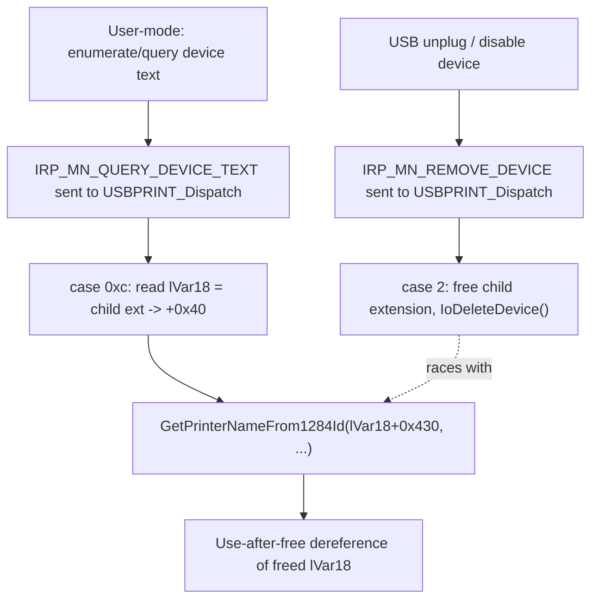

# CVE-2026-55000

**CVE:** CVE-2026-55000  
**Title:** Windows USB Print Driver Elevation of Privilege Vulnerability  
**Source:** [https://msrc.microsoft.com/update-guide/vulnerability/CVE-2026-55000](https://msrc.microsoft.com/update-guide/vulnerability/CVE-2026-55000)  
**Component(s):** usbprint.sys  
**Patched Date:** 2026-07-14T07:00:00  
**CWE:** Use after free in Windows USB Print Driver allows an unauthorized attacker to elevate privileges with a physical attack.  

---

## Related CVEs (Same Component)

This report covers 8 CVEs affecting the same component(s):

- **CVE-2026-55000**  
- CVE-2026-54111  
- CVE-2026-54991  
- CVE-2026-54996  
- CVE-2026-49802  
- CVE-2026-49806  
- CVE-2026-50674  
- CVE-2026-58543  

### Detailed Information

#### CVE-2026-54111

**Title:** Universal Print Management Service Elevation of Privilege Vulnerability  
**Source:** [https://msrc.microsoft.com/update-guide/vulnerability/CVE-2026-54111](https://msrc.microsoft.com/update-guide/vulnerability/CVE-2026-54111)  
**Patched Date:** 2026-07-14T07:00:00  
**CWE:** Concurrent execution using shared resource with improper synchronization ('race condition') in Windows USB Print Driver allows an authorized attacker to elevate privileges locally.  

#### CVE-2026-54991

**Title:** Windows USB Print Driver Elevation of Privilege Vulnerability  
**Source:** [https://msrc.microsoft.com/update-guide/vulnerability/CVE-2026-54991](https://msrc.microsoft.com/update-guide/vulnerability/CVE-2026-54991)  
**Patched Date:** 2026-07-14T07:00:00  
**CWE:** Concurrent execution using shared resource with improper synchronization ('race condition') in Windows USB Print Driver allows an authorized attacker to elevate privileges locally.  

#### CVE-2026-54996

**Title:** Windows USB Print Driver Elevation of Privilege Vulnerability  
**Source:** [https://msrc.microsoft.com/update-guide/vulnerability/CVE-2026-54996](https://msrc.microsoft.com/update-guide/vulnerability/CVE-2026-54996)  
**Patched Date:** 2026-07-14T07:00:00  
**CWE:** Concurrent execution using shared resource with improper synchronization ('race condition') in Windows USB Print Driver allows an authorized attacker to elevate privileges locally.  

#### CVE-2026-49802

**Title:** Windows USB Print Driver Elevation of Privilege Vulnerability  
**Source:** [https://msrc.microsoft.com/update-guide/vulnerability/CVE-2026-49802](https://msrc.microsoft.com/update-guide/vulnerability/CVE-2026-49802)  
**Patched Date:** 2026-07-14T07:00:00  
**CWE:** Concurrent execution using shared resource with improper synchronization ('race condition') in Windows USB Print Driver allows an authorized attacker to elevate privileges locally.  

#### CVE-2026-49806

**Title:** Windows USB Print Driver Elevation of Privilege Vulnerability  
**Source:** [https://msrc.microsoft.com/update-guide/vulnerability/CVE-2026-49806](https://msrc.microsoft.com/update-guide/vulnerability/CVE-2026-49806)  
**Patched Date:** 2026-07-14T07:00:00  
**CWE:** Concurrent execution using shared resource with improper synchronization ('race condition') in Windows USB Print Driver allows an authorized attacker to elevate privileges locally.  

#### CVE-2026-50674

**Title:** Windows USB Print Driver Elevation of Privilege Vulnerability  
**Source:** [https://msrc.microsoft.com/update-guide/vulnerability/CVE-2026-50674](https://msrc.microsoft.com/update-guide/vulnerability/CVE-2026-50674)  
**Patched Date:** 2026-07-14T07:00:00  
**CWE:** Use after free in Windows USB Print Driver allows an authorized attacker to elevate privileges locally.  

#### CVE-2026-58543

**Title:** Universal Print Management Service Elevation of Privilege Vulnerability  
**Source:** [https://msrc.microsoft.com/update-guide/vulnerability/CVE-2026-58543](https://msrc.microsoft.com/update-guide/vulnerability/CVE-2026-58543)  
**Patched Date:** 2026-07-14T07:00:00  
**CWE:** Concurrent execution using shared resource with improper synchronization ('race condition') in Windows USB Print Driver allows an authorized attacker to elevate privileges with a physical attack.  

---

Download Patched & Vulnerable Components:

```bash
# usbprint.sys
wget https://msdl.microsoft.com/download/symbols/usbprint.sys/770F6E971C000/usbprint.sys -O usbprint.sys.10.0.26100.8737 # vulnerable
wget https://msdl.microsoft.com/download/symbols/usbprint.sys/511156881C000/usbprint.sys -O usbprint.sys.10.0.26100.8875 # patched
```

## Version Tracking Analysis

**Command:**

```
python ghidra_scripts\ghidra_vt_wrapper.py --old-binary ./reports/2026-Jul/CVE-2026-55000/usbprint.sys.10.0.26100.8737 --new-binary ./reports/2026-Jul/CVE-2026-55000/usbprint.sys.10.0.26100.8875 --project-dir ./reports/2026-Jul/CVE-2026-55000/ghidra_project --project-name usbprint.sys_CVE-2026-55000 --ghidra-dir C:\Tools\ghidra_11.4.2_PUBLIC_20250826\ghidra_11.4.2_PUBLIC --output-dir ./reports/2026-Jul/CVE-2026-55000/ghidra_project/vt_results --max-memory 16g
```

Patched Functions: 5 | New Functions: 10 | Removed Functions: 2 | Total Matches: 1753 | Accepted Matches: 1714

### Patched Functions

| Function Name | Source Address | Dest Address | Similarity | Confidence |
| --- | --- | --- | --- | --- |
| `USBPRINT_InitDeviceObject` | `140003fa0` | `140003c60` | 0.957 | 10.0 |
| `USBPRINT_Dispatch` | `1400035b0` | `140003250` | 0.916 | 10.0 |
| `USBPRINT_ProcessIOCTL` | `140004bb0` | `1400048f0` | 0.834 | 10.0 |
| `USBPRINT_RemoveDevice` | `140008434` | `140008534` | 0.750 | 10.0 |
| `USBPRINT_StartDevice` | `140004490` | `140004340` | 0.707 | 10.0 |

### New Functions

| Function Name | Address |
| --- | --- |
| `USBPRINT_SetDeviceID` | `140004140` |
| `Feature_999799099__private_IsEnabledDeviceUsageNoInline` | `140005f64` |
| `Feature_999799099__private_IsEnabledFallback` | `140005f9c` |
| `USBPRINT_GetDeviceID` | `140007f88` |
| `Feature_1936960827__private_IsEnabledDeviceUsageNoInline` | `140009394` |
| `Feature_1936960827__private_IsEnabledFallback` | `1400093cc` |
| `Feature_2853157178__private_IsEnabledDeviceUsageNoInline` | `1400093e8` |
| `Feature_2853157178__private_IsEnabledFallback` | `140009420` |
| `USBPRINT_AddChildDevice` | `140009490` |
| `_guard_dispatch_icall` | `140009cb0` |

### Removed Functions

| Function Name | Address |
| --- | --- |
| `USBPRINT_FdoRequestWake` | `140002b20` |
| `_guard_dispatch_icall` | `1400098d0` |

---

# AI Technical Analysis

## Vulnerability Identification

**Core Vulnerable Function(s):**
- `USBPRINT_Dispatch()` - the `IRP_MN_QUERY_DEVICE_TEXT` handler
  (case `0xc`) reads the child PDO's USB device-descriptor block
  and a status flag byte from it with no synchronization, while
  the `IRP_MN_REMOVE_DEVICE` handler (case `2`) in the same
  function can concurrently tear down and `IoDeleteDevice()` that
  same child object. This is a classic TOCTOU / use-after-free
  race condition (CWE-362 / CWE-416).

**Supporting Changes:**
- `USBPRINT_InitDeviceObject()` - the device extension grew by
  `0x38` bytes (the size of a `FAST_MUTEX`) to host the new lock
  consumed by the patched dispatch path; every field after the
  insertion point is renumbered accordingly. No logic other than
  the offset shift changed here.
- `USBPRINT_RemoveDevice()` - purely mechanical offset updates
  (`0x530`->`0x568`, `0x4b8`->`0x4f0`, etc.) from the same struct
  growth; no synchronization primitives were added in this
  function.
- `USBPRINT_StartDevice()` - offsets updated for the same reason,
  plus a refactor that moves the 1284-ID / string-descriptor
  parsing block into a new helper, `USBPRINT_GetDeviceID()`. The
  serial-number length clamp (`bLength - 2` capped at `0x3e`)
  is byte-for-byte identical before and after.

**Unrelated Changes:**
- `USBPRINT_StartDevice()` `memmove()` -> `memcpy()` swap -
  cosmetic; the source and destination ranges never overlap in
  either version, so this has no security effect.

---

## Root Cause Analysis

The flaw is a missing lock around a pointer chain that is shared
between two PnP minor-function paths that can run concurrently on
the same child device object: `IRP_MN_QUERY_DEVICE_TEXT` (read
path) and `IRP_MN_REMOVE_DEVICE` (teardown path). The driver
assumed that once a pointer to the child's device-extension data
was fetched, it would remain valid for the remainder of the
handler, but nothing prevented the removal path from freeing that
data in between.

Vulnerable code (`USBPRINT_Dispatch`, case `0xc`, before patch):

```c
case 0xc:
    if (*pcVar5 != '\x01') goto LAB_140003ec7;
    lVar6 = *(longlong *)(pcVar5 + 8);
    lVar18 = *(longlong *)(lVar6 + 0x40);
    if (*(int *)(lVar20 + 8) == 0) {
      plVar17 = &local_res18;
      local_res18 = 0;
      uVar10 = GetPrinterNameFrom1284Id
                 (*(void **)(lVar18 + 0x430),
                  *(byte *)(lVar18 + 0x438) & 2,plVar17,param_4);
      ...
```

`pcVar5` is the FDO device extension; `pcVar5 + 8` holds a pointer
to the currently attached child PDO's extension, and
`lVar18 = *(longlong *)(lVar6 + 0x40)` follows a further pointer
inside that structure to reach the cached USB device-descriptor
block. `lVar18` is captured once, then dereferenced twice more
(`lVar18 + 0x430`, `lVar18 + 0x438`) with no lock held between the
initial read and the two subsequent uses. If `IRP_MN_REMOVE_DEVICE`
runs on the child concurrently, it clears `pcVar5[8]`/frees the
child's extension and calls `IoDeleteDevice()`, so `lVar18` becomes
a dangling pointer by the time `GetPrinterNameFrom1284Id()`
dereferences `lVar18 + 0x430` and `lVar18 + 0x438`, producing a
use-after-free read that can crash the kernel or, if the freed
pool is reallocated by an attacker-influenced allocation, leak or
corrupt kernel memory.

---

## Execution and Trigger Flow

A malicious or malformed USB printer device (or a program that can
issue PnP requests to the stack) can trigger this from user mode
by racing two PnP operations against the same child device: a
`IRP_MN_QUERY_DEVICE_TEXT` request and a device-removal sequence
(unplug, surprise removal, or a driver-initiated `IRP_MN_REMOVE_
DEVICE`). Because USB devices generate removal IRPs asynchronously
(surprise removal on physical unplug, or via `SetupDiRemoveDevice`/
disable-device from user mode) while PnP managers or printer
enumeration code independently issue `QUERY_DEVICE_TEXT` to read
the friendly/device name, the two code paths inside
`USBPRINT_Dispatch()` execute on separate threads with no exclusion
between them. An attacker can amplify the race by repeatedly
enumerating the printer's device text (e.g., via `SetupDi*` device
property queries) while rapidly attaching/detaching (or spoofing)
the USB print interface, widening the window between the pointer
capture and its use. Once the removal thread wins the race and
frees the child extension and its descriptor buffer, the query
thread dereferences the stale `lVar18` pointer, corrupting or
crashing the kernel (potential local privilege escalation or
denial of service).



---

## Patch Analysis

```diff
-    lVar6 = *(longlong *)(pcVar5 + 8);
-    lVar18 = *(longlong *)(lVar6 + 0x40);
     if (*(int *)(lVar19 + 8) == 0) {
+      uVar12 = Feature_999799099__private_IsEnabledDeviceUsageNoInline();
+      if ((char)uVar12 != '\0') {
+        ExAcquireFastMutex(lVar18 + 0x438);
+      }
+      lVar19 = *(longlong *)(pcVar5 + 8);
       plVar16 = &local_res18;
       local_res18 = 0;
       uVar9 = GetPrinterNameFrom1284Id
                 (*(void **)(lVar18 + 0x430),
-                 *(byte *)(lVar18 + 0x438) & 2,plVar16,param_4);
+                 *(byte *)(*(longlong *)(lVar19 + 0x40) + 0x470) & 2,
+                 plVar16,param_4);
       ...
+      uVar12 = Feature_999799099__private_IsEnabledDeviceUsageNoInline();
+      if ((char)uVar12 != '\0') {
+        ExReleaseFastMutex(lVar18 + 0x438);
+      }
```

The patch introduces a `FAST_MUTEX` (added to the device extension
in `USBPRINT_InitDeviceObject()`, accounting for the `0x38`-byte
offset shift seen across all four functions) and wraps the
descriptor-read critical section in `ExAcquireFastMutex()` /
`ExReleaseFastMutex()`, gated by a feature flag
(`Feature_999799099__private_IsEnabledDeviceUsageNoInline()`) for
staged rollout. Critically, it also re-reads `lVar19 = *(longlong
*)(pcVar5 + 8)` and re-derives the descriptor flag through
`*(longlong *)(lVar19 + 0x40) + 0x470` from inside the locked
region, instead of reusing the pointer captured before the lock
was taken. This ensures the value used is fresh and consistent
with whatever state the removal path leaves behind, rather than a
snapshot that may already be stale.

Effectiveness: acquiring the mutex before touching the child
device's descriptor data and releasing it only after all reads
complete closes the race window against `IRP_MN_REMOVE_DEVICE`'s
teardown of the same child object, since removal must now contend
for the same lock (or, at minimum, the query path no longer
operates on a pre-lock pointer snapshot). The feature-flag gate
suggests a controlled/telemetry-monitored rollout rather than a
weaker mitigation; provided the removal path is likewise
serialized on this mutex, the use-after-free window is eliminated.

Security impact: this change converts an unsynchronized
cross-thread pointer race into a properly serialized access
pattern, removing a kernel-mode use-after-free that could be
triggered by ordinary USB hot-plug/removal timing combined with
device-text queries, and that could lead to a kernel crash or
local privilege escalation.