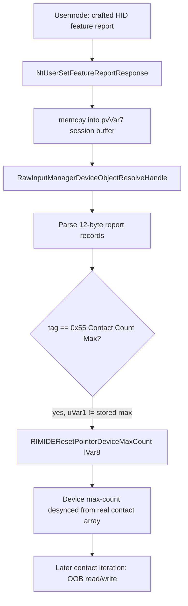

# CVE-2026-56176

**CVE:** CVE-2026-56176  
**Title:** Windows Win32k Elevation of Privilege Vulnerability  
**Source:** [https://msrc.microsoft.com/update-guide/vulnerability/CVE-2026-56176](https://msrc.microsoft.com/update-guide/vulnerability/CVE-2026-56176)  
**Component(s):** win32kbase.sys  
**Patched Date:** 2026-07-14T07:00:00  
**CWE:** Out-of-bounds read in Windows Win32K - GRFX allows an authorized attacker to elevate privileges locally.  

Download Patched & Vulnerable Components:

```bash
# win32kbase.sys
wget https://msdl.microsoft.com/download/symbols/win32kbase.sys/FD6DBEEF333000/win32kbase.sys -O win32kbase.sys.10.0.26100.8737 # vulnerable
wget https://msdl.microsoft.com/download/symbols/win32kbase.sys/90AC8BC8335000/win32kbase.sys -O win32kbase.sys.10.0.26100.8875 # patched
```

## Version Tracking Analysis

**Command:**

```
python ghidra_scripts\ghidra_vt_wrapper.py --old-binary ./reports/2026-Jul/CVE-2026-56176/win32kbase.sys.10.0.26100.8737 --new-binary ./reports/2026-Jul/CVE-2026-56176/win32kbase.sys.10.0.26100.8875 --project-dir ./reports/2026-Jul/CVE-2026-56176/ghidra_project --project-name win32kbase.sys_CVE-2026-56176 --ghidra-dir C:\Tools\ghidra_11.4.2_PUBLIC_20250826\ghidra_11.4.2_PUBLIC --output-dir ./reports/2026-Jul/CVE-2026-56176/ghidra_project/vt_results --max-memory 16g
```

Patched Functions: 10 | New Functions: 12 | Removed Functions: 3 | Total Matches: 92619 | Accepted Matches: 57600

### Patched Functions

| Function Name | Source Address | Dest Address | Similarity | Confidence |
| --- | --- | --- | --- | --- |
| `NtUserInjectGenericHidInput` | `14016ab80` | `14016a890` | 0.991 | 10.0 |
| `RIMIDECreateHIDDesc` | `1400518b4` | `140051904` | 0.986 | 10.0 |
| `NtUserSetFeatureReportResponse` | `1401bbca0` | `1401bbdd0` | 0.983 | 10.0 |
| `InitProcessUipiInfo` | `1401a12d4` | `1401a13a4` | 0.979 | 10.0 |
| `BuildValueDeviceUsages` | `1401e7114` | `1401e7508` | 0.935 | 10.0 |
| `tagPROCESSINFO::CanPerformUIOperation` | `1401a09f0` | `1401a0ab0` | 0.924 | 10.0 |
| `tagTHREADINFO::ClearForegroundActivate` | `1401a0c90` | `1401a0d60` | 0.914 | 10.0 |
| `RIMIDECreatePointerDeviceInfo` | `1401e4124` | `1401e436c` | 0.690 | 10.0 |
| `WPP_RECORDER_AND_TRACE_SF_DDD` | `1401a26e4` | `1401a27b4` | 0.620 | 10.0 |
| `DrvQueryDisplayConfigInternal` | `1400535a8` | `140023a68` | 0.525 | 10.0 |

### New Functions

*Showing 10 of 12 new functions*

| Function Name | Address |
| --- | --- |
| `DrvIsQdcHandledByDispBroker` | `1400535d8` |
| `Feature_2428216633__private_IsEnabledDeviceUsageNoInline` | `1401b668c` |
| `Feature_2428216633__private_IsEnabledFallback` | `1401b66c4` |
| `Feature_2885670203__private_IsEnabledDeviceUsageNoInline` | `1401cc04c` |
| `Feature_2885670203__private_IsEnabledFallback` | `1401cc084` |
| `Feature_1710207290__private_IsEnabledDeviceUsageNoInline` | `1401e41a0` |
| `Feature_1710207290__private_IsEnabledFallback` | `1401e41d8` |
| `Feature_2503976249__private_IsEnabledDeviceUsageNoInline` | `1401e41f4` |
| `Feature_2503976249__private_IsEnabledFallback` | `1401e422c` |
| `_guard_dispatch_icall` | `140240c30` |

### Removed Functions

| Function Name | Address |
| --- | --- |
| `_guard_dispatch_icall` | `140240830` |
| `DxDdGetDxgkWin32kInterface` | `140333000` |
| `DxDdIsTearDownLddmSpriteDisabled` | `140333008` |

---

# AI Technical Analysis

## Vulnerability Identification

**Core Vulnerable Function(s):**
- `NtUserSetFeatureReportResponse()` - This syscall parses an
  attacker-controlled HID feature-report buffer and updates a
  pointer device's maximum-contact-count value without validating
  it against the real per-session device array before the fix.

**Supporting Changes:**
- `InitProcessUipiInfo()` - Adds a previously missing
  initialization of the WPP trace-GUID pointer (`local_a0`) used
  by a diagnostic trace call; a correctness fix, not the exploit
  primitive itself.
- `tagPROCESSINFO::CanPerformUIOperation()` - Extends WPP trace
  calls with additional logged parameters; logic paths and
  security checks are unchanged.
- `tagTHREADINFO::ClearForegroundActivate()` - Same category as
  above: only trace instrumentation was expanded.

**Unrelated Changes:**
- `RIMIDECreateHIDDesc()` - Contains only label renumbering, a
  `memmove` to `memcpy` substitution (behaviorally identical for
  the non-overlapping buffers used here), and WPP trace-ID bumps
  caused by the new trace parameter added elsewhere in the module.
- `DrvIsQdcHandledByDispBroker()`, `DxDdGetDxgkWin32kInterface()`,
  `DxDdIsTearDownLddmSpriteDisabled()` - New/forwarder functions
  belonging to the DXGK/display-broker subsystem, unrelated to the
  Raw Input Manager (RIM) HID code path affected by this CVE.

---

## Root Cause Analysis

The vulnerability is a missing cross-validation between a
user-supplied HID "Contact Count Maximum" value and the real
capacity of the per-session pointer-device data structure. The
kernel accepted an attacker-controlled count and forwarded it to
`RIMIDEResetPointerDeviceMaxCount()` using only the device object
as context, so the callee could not verify the new count against
the actual allocated array backing pointer/touch contacts,
violating the invariant that a device's advertised maximum contact
count must never exceed the array capacity used to store per-
contact state.

```c
uVar1 = *puVar12;
if (((0x100 < (int)uVar1) || (iVar2 = *(int *)(lVar8 + 0x18), 3 < iVar2 - 1U)) &&
   ((*(int *)(lVar8 + 0x18) != 7 || (iVar2 = 7, 5 < (int)uVar1)))) goto LAB_bad;
uVar3 = *(uint *)(lVar8 + 0x310);
if (iVar2 == 7) {
  uVar3 = uVar3 - 1;
}
if ((uVar1 != uVar3) && (iVar2 = RIMIDEResetPointerDeviceMaxCount(lVar8), iVar2 == 0))
goto LAB_bad;
```

The buffer at `pvVar7` is populated via a bounded `memcpy` from
`param_2` (an attacker-supplied usermode pointer), sized as
`param_3 * 0xc` where `param_3` is constrained to `1..7`, so the
copy itself is not overflowing. The subsequent parsing loop walks
this buffer 12 bytes at a time via `puVar12`, checking a status
field (`puVar12[-1]` must equal `0xd`) and a tag field at offset
`-2`. When the tag equals `0x55` (HID "Contact Count Maximum"
usage), the raw value `uVar1` is range-checked only against
generic device-type bounds (`lVar8 + 0x18`), not against the
actual number of allocated contact slots referenced through the
session state. If `uVar1` differs from the currently stored
maximum `uVar3` (`*(uint *)(lVar8 + 0x310)`), the code commits to
the new value by calling `RIMIDEResetPointerDeviceMaxCount(lVar8)`
with no visibility into the true array bounds, allowing the device
object's max-count field to become desynchronized from the memory
actually reserved to hold per-contact records.

---

## Execution and Trigger Flow

An attacker-controlled process (or a malicious/spoofed HID
digitizer device feeding data through the Raw Input Manager)
invokes the undocumented syscall `NtUserSetFeatureReportResponse`
with a crafted report buffer (`param_2`) and a count (`param_3`)
in the range `1..7`. The kernel copies the buffer into a
session-associated allocation `pvVar7` and resolves the target
raw-input device object via
`RawInputManagerDeviceObjectResolveHandle`. The parsing loop then
walks each 12-byte report record; for a record tagged `0x55`
("Contact Count Maximum"), the attacker-supplied value `uVar1` is
checked only against coarse device-class limits, not the real
contact-array capacity. Because the value differs from the
currently stored count, the kernel calls
`RIMIDEResetPointerDeviceMaxCount`, which prior to the patch had
no way to validate the new count against the session's actual
per-contact storage, letting the device's max-count field be set
to a value inconsistent with allocated memory. Later code paths
that iterate touch/pen contacts up to this max-count field can
then read or write past the true bounds of the contact array,
enabling an out-of-bounds memory corruption primitive usable for
local elevation of privilege from a low-privileged caller.



---

## Patch Analysis

```diff
-      if ((uVar1 != uVar3) && (iVar2 = RIMIDEResetPointerDeviceMaxCount(lVar8), iVar2 == 0))
-      goto LAB_1401bbf73;
+      if ((uVar1 != uVar3) &&
+         (iVar2 = RIMIDEResetPointerDeviceMaxCount
+                            (lVar8,uVar1,*(undefined8 *)(lVar5 + 0x1b8)), iVar2 == 0))
+      goto LAB_1401bc0ae;
```

The patch extends the call to `RIMIDEResetPointerDeviceMaxCount`
with two additional arguments: `uVar1`, the attacker-supplied
proposed maximum contact count, and
`*(undefined8 *)(lVar5 + 0x1b8)`, a pointer derived from the
session state (`lVar5` is the result of `W32GetUserSessionState`).
This gives the callee the information required to validate the
requested count against the real, currently allocated contact
storage for that session/device before committing the change,
instead of blindly resetting internal state using only the device
object. The change is a data-flow fix: it closes the gap between
"value accepted by the coarse range check in
`NtUserSetFeatureReportResponse`" and "value actually safe to use
as an array bound elsewhere," by pushing the authoritative
validation into the function that owns the array bounds. Because
the callee itself is not shown in this diff, the exact new
validation logic cannot be confirmed line-by-line, but the shape
of the change - passing both the untrusted value and the
session-scoped array pointer - is consistent with a bounds/
consistency check being added at the point where the device's
max-count field is committed. This is an effective fix in that it
moves the check to the same context that possesses the true
capacity information, eliminating the trust-boundary gap that
allowed a crafted feature-report record to desynchronize the
stored maximum from the real allocation. The accompanying
`memmove`-to-`memcpy` and WPP trace-ID changes in this and
neighboring functions are incidental compiler/instrumentation
differences and do not themselves alter security-relevant control
flow. Overall, the patch mitigates a kernel out-of-bounds
memory-corruption primitive reachable from user mode via a
documented-adjacent Win32k syscall, consistent with a local
elevation-of-privilege vulnerability class.