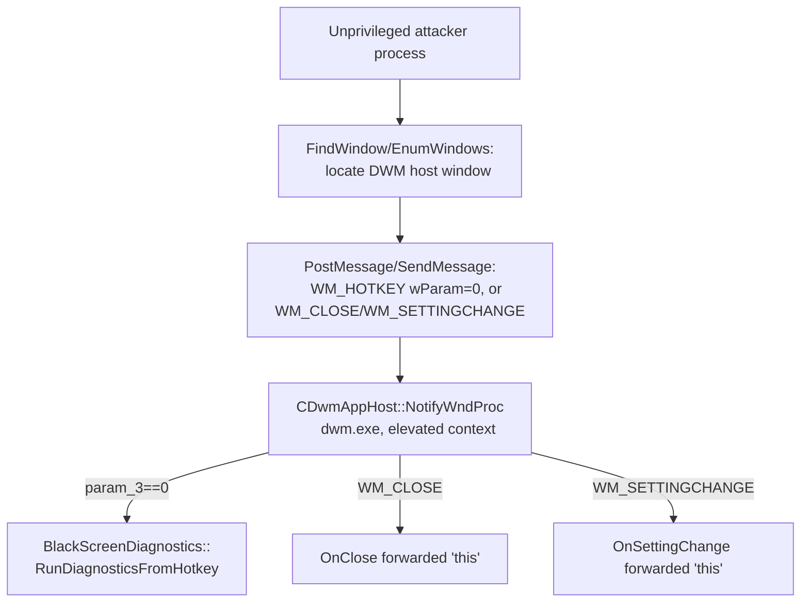

# CVE-2026-58609

**CVE:** CVE-2026-58609  
**Title:** Windows Graphics Component Remote Code Execution Vulnerability  
**Source:** [https://msrc.microsoft.com/update-guide/vulnerability/CVE-2026-58609](https://msrc.microsoft.com/update-guide/vulnerability/CVE-2026-58609)  
**Component(s):** dwm.exe  
**Patched Date:** 2026-07-14T07:00:00  
**CWE:** Out-of-bounds read in Microsoft Graphics Component allows an unauthorized attacker to execute code locally.  

---

## Related CVEs (Same Component)

This report covers 2 CVEs affecting the same component(s):

- **CVE-2026-58609**  
- CVE-2026-50483  

### Detailed Information

#### CVE-2026-50483

**Title:** Windows Graphics Component Information Disclosure Vulnerability  
**Source:** [https://msrc.microsoft.com/update-guide/vulnerability/CVE-2026-50483](https://msrc.microsoft.com/update-guide/vulnerability/CVE-2026-50483)  
**Patched Date:** 2026-07-14T07:00:00  
**CWE:** Exposure of sensitive information to an unauthorized actor in Microsoft Graphics Component allows an authorized attacker to disclose information locally.  

---

Download Patched & Vulnerable Components:

```bash
# dwm.exe
wget https://msdl.microsoft.com/download/symbols/dwm.exe/3AF3FBB223000/dwm.exe -O dwm.exe.10.0.26100.8521 # vulnerable
wget https://msdl.microsoft.com/download/symbols/dwm.exe/1A511BB025000/dwm.exe -O dwm.exe.10.0.26100.8737 # patched
```

## Version Tracking Analysis

**Command:**

```
python ghidra_scripts\ghidra_vt_wrapper.py --old-binary ./reports/2026-Jul/CVE-2026-58609/dwm.exe.10.0.26100.8521 --new-binary ./reports/2026-Jul/CVE-2026-58609/dwm.exe.10.0.26100.8737 --project-dir ./reports/2026-Jul/CVE-2026-58609/ghidra_project --project-name dwm.exe_CVE-2026-58609 --ghidra-dir C:\Tools\ghidra_11.4.2_PUBLIC_20250826\ghidra_11.4.2_PUBLIC --output-dir ./reports/2026-Jul/CVE-2026-58609/ghidra_project/vt_results --max-memory 16g
```

Patched Functions: 3 | New Functions: 52 | Removed Functions: 1 | Total Matches: 4218 | Accepted Matches: 3623

### Patched Functions

| Function Name | Source Address | Dest Address | Similarity | Confidence |
| --- | --- | --- | --- | --- |
| `CDwmAppHost::Initialize` | `140002ee0` | `140002f50` | 0.932 | 10.0 |
| `CDwmAppHost::NotifyWndProc` | `140003804` | `1400038a4` | 0.819 | 10.0 |
| `CDwmAppHost::OnClose` | `1400042a4` | `140004344` | 0.525 | 10.0 |

### New Functions

*Showing 10 of 52 new functions*

| Function Name | Address |
| --- | --- |
| ``dynamic_initializer_for_'g_enabledStateManager''` | `140001f70` |
| ``dynamic_initializer_for_'g_header_init_InitializeStagingSRUMFeatureReporting''` | `140001fe0` |
| `~EnabledStateManager` | `1400046b8` |
| `ReportUsageToService` | `140004730` |
| `EnabledStateManager` | `1400047d4` |
| `~unique_storage<wil::details::resource_policy<FEATURE_STATE_CHANGE_SUBSCRIPTION__*___ptr64,void_(__cdecl*)(FEATURE_STATE_CHANGE_SUBSCRIPTION__*___ptr64),&void___cdecl_wil::details::WilApi_UnsubscribeFeatureStateChangeNotification(struct_FEATURE_STATE_CHANGE_SUBSCRIPTION__*___ptr64),wistd::integral_constant<unsigned___int64,0>,FEATURE_STATE_CHANGE_SUBSCRIPTION__*___ptr64,FEATURE_STATE_CHANGE_SUBSCRIPTION__*___ptr64,0,std::nullptr_t>_>` | `1400048b0` |
| `<lambda_invoker_cdecl>` | `140006380` |
| `EnsureSubscribedToFeatureConfigurationChanges` | `140007808` |
| `EnsureSubscribedToFeatureConfigurationChangesImpl` | `140007830` |
| `IsFeatureConfigured` | `140008bac` |

### Removed Functions

| Function Name | Address |
| --- | --- |
| `_guard_dispatch_icall` | `14000f250` |

---

# AI Technical Analysis

## Vulnerability Identification

**Core Vulnerable Function(s):**
- `CDwmAppHost::NotifyWndProc()` - The window procedure dispatches
  privileged operations (`OnClose`, `OnSettingChange`,
  `LpcNotifySettingsChange`, and
  `BlackScreenDiagnostics::RunDiagnosticsFromHotkey`) directly off
  attacker-reachable window messages (`WM_CLOSE`, `WM_SETTINGCHANGE`,
  `WM_ENDSESSION`, `WM_HOTKEY`) while blindly forwarding the host
  object context (`this`) into those handlers, and while trusting
  the `wParam` hotkey ID (`param_3`) as proof that a real,
  physically-pressed global hotkey occurred.

**Supporting Changes:**
- `CDwmAppHost::OnClose()` - Callee reached from the vulnerable
  dispatch; patched to tear down the new diagnostic hotkey (ID 3)
  symmetrically with its registration.
- `CDwmAppHost::Initialize()` - Registers the new diagnostic hotkey
  (ID 3, Ctrl+Shift+Win+M) behind a feature gate; establishes the
  state that `OnClose` and `NotifyWndProc` must now handle safely.

**Unrelated Changes:**
- Renumbered `DAT_14001c4xx` / `DAT_14001e6xx` global addresses and
  renamed temporaries (`uVar1`->`uVar2`, etc.) - artifacts of image
  relinking/recompilation, not security-relevant.

---

## Root Cause Analysis

The flaw is a confused-deputy / untrusted-input dispatch problem
(CWE-668 / CWE-862): `NotifyWndProc` treats the arrival of specific
window messages as sufficient authorization to invoke privileged
DWM-host operations, without validating that the message actually
originated from the expected trusted source (a genuine physical
hotkey press routed by the input subsystem, versus a message
synthetically posted by any process that can locate the DWM host
window). The invariant violated is: "`WM_HOTKEY` with `wParam == 0`
only ever arrives after the user physically pressed the registered
combination," and "the object context reaching `OnClose` /
`OnSettingChange` / `LpcNotifySettingsChange` is always the live,
validated singleton instance."

Vulnerable code (`NotifyWndProc`, before):

```c
else if (param_2 == 0x10) {
    OnClose(this);
}
else {
    if (param_2 == 0x1a) {
        OnSettingChange(this,param_3,param_4);
        return 0;
    }
    if (param_2 == 0x312) {
        if (param_3 == 0) {
            BlackScreenDiagnostics::RunDiagnosticsFromHotkey();
            return 0;
        }
        if (param_3 != 3) {
            LVar2 = DefWindowProcW(param_1,param_2,param_3,param_4);
            return LVar2;
        }
    }
    uVar4 = 4;
}
LpcNotifySettingsChange(this,uVar4);
```

Here, `param_2` is the raw message ID and `param_3` its `wParam`.
For `WM_HOTKEY` (`0x312`), only `param_3 == 0` is special-cased to
invoke `RunDiagnosticsFromHotkey()`, a SYSTEM-context diagnostic
routine; any other non-zero, non-three value falls through to
`DefWindowProcW`, but ID `0` is accepted unconditionally with no
check on the message's actual delivery path. Simultaneously, `this`
is forwarded verbatim into `OnClose`, `OnSettingChange`, and
`LpcNotifySettingsChange` for `WM_CLOSE`, `WM_SETTINGCHANGE`, and the
default/`WM_ENDSESSION` branches, meaning any process able to deliver
these messages to the host window controls which object context
those privileged handlers operate against.

---

## Execution and Trigger Flow

An attacker first locates the DWM application host window - a
message/top-level window owned by `dwm.exe` - typically via
`EnumWindows`/`FindWindow` enumeration, since window handles are
process-visible desktop objects and are not, by default, isolated
from lower-integrity callers unless the target has applied UIPI
message filtering with `ChangeWindowMessageFilterEx`. Once the
handle is obtained, the attacker calls `PostMessage`/`SendMessage`
directly against it, synthesizing `WM_HOTKEY` with `wParam == 0`
(or `WM_CLOSE`, `WM_SETTINGCHANGE`, `WM_ENDSESSION`) without ever
pressing the registered physical key combination. `NotifyWndProc`
receives the message on the DWM message-pump thread (running with
DWM's elevated/SYSTEM-adjacent privileges) and, because it validates
only the numeric message ID and `wParam`, treats the forged message
identically to a legitimate one. For `WM_HOTKEY`/ID 0 this directly
invokes `BlackScreenDiagnostics::RunDiagnosticsFromHotkey()` in the
DWM process context; for `WM_CLOSE`/`WM_SETTINGCHANGE` it invokes
`OnClose`/`OnSettingChange` with the forwarded `this`, tearing down
or reconfiguring desktop composition state on demand from an
unprivileged caller. The result ranges from denial-of-service
(desktop composition teardown, forced session disruption) to
triggering privileged diagnostic code paths outside their intended
user-gesture trigger.



---

## Patch Analysis

Patched code (`NotifyWndProc` and companions, after):

```diff
-      OnClose(this);
+      OnClose((CDwmAppHost *)0x0);
...
-        OnSettingChange(this,param_3,param_4);
+        OnSettingChange((CDwmAppHost *)0x0,param_3,param_4);
...
         if (param_3 == 0) {
             BlackScreenDiagnostics::RunDiagnosticsFromHotkey();
             return 0;
         }
+        if (param_3 == 1) { return 0; }
+        if (param_3 == 2) { return 0; }
...
-  LpcNotifySettingsChange(this,uVar4);
+  LpcNotifySettingsChange((CDwmAppHost *)(ulonglong)uVar4,uVar5);
```

```diff
--- CDwmAppHost::OnClose
   UnregisterHotKey(DAT_14001e610,0);
+  bVar1 = FeatureImpl<..._DiagnosticHotkey>::__private_IsEnabled(...);
+  if (bVar1) {
+      UnregisterHotKey(DAT_14001e610,3);
+  }
```

The patch removes reliance on the caller-influenced `this` context
for `OnClose`, `OnSettingChange`, and `LpcNotifySettingsChange`,
replacing it with a fixed constant so these handlers can no longer
be driven against an externally supplied object pointer; state is
instead read exclusively from the validated internal singleton
globals (`DAT_14001e610`, etc.). `NotifyWndProc` also now explicitly
enumerates and no-ops hotkey IDs `1` and `2`, closing the gap that a
newly introduced diagnostic hotkey (ID `3`, added in `Initialize`,
gated by `Feature_DesktopDWMCursor_DiagnosticHotkey`) does not
silently widen the reachable ID space. `OnClose` is updated to
unregister hotkey ID `3` symmetrically with its registration in
`Initialize`, preventing a dangling/leaked hotkey registration across
window teardown.

Effectiveness: nulling the forwarded context stops the object-context
confusion vector for the three callees and the matched
register/unregister pair closes the resource-lifetime gap introduced
by the new hotkey. It does not, however, add any message-origin or
sender-identity validation in `NotifyWndProc` itself - `WM_HOTKEY`
ID `0` still triggers `RunDiagnosticsFromHotkey()` for any process
able to post the message, so the confused-deputy trigger path is
narrowed but not fully eliminated.

Security impact: prior to the patch, an unprivileged process could
invoke SYSTEM-context DWM handlers via forged window messages,
enabling denial-of-service against desktop composition and
unauthorized triggering of diagnostic routines; the patch reduces
the object-confusion attack surface and fixes the hotkey
registration leak, but callers should still add message-source
validation to fully close the underlying confused-deputy issue.