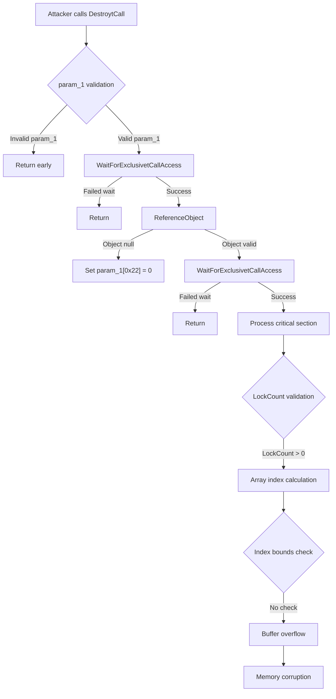

# CVE-2026-42912

**CVE:** CVE-2026-42912  
**Title:** Windows Telephony Service Elevation of Privilege Vulnerability  
**Source:** [https://msrc.microsoft.com/update-guide/vulnerability/CVE-2026-42912](https://msrc.microsoft.com/update-guide/vulnerability/CVE-2026-42912)  
**Component(s):** tapisrv.dll  
**Patched Date:** 2026-06-09T07:00:00  
**CWE:** Concurrent execution using shared resource with improper synchronization ('race condition') in Windows Telephony Service allows an authorized attacker to elevate privileges locally.  

---

## Related CVEs (Same Component)

This report covers 2 CVEs affecting the same component(s):

- **CVE-2026-42912**  
- CVE-2026-42968  

### Detailed Information

#### CVE-2026-42968

**Title:** Windows Telephony Server Information Disclosure Vulnerability  
**Source:** [https://msrc.microsoft.com/update-guide/vulnerability/CVE-2026-42968](https://msrc.microsoft.com/update-guide/vulnerability/CVE-2026-42968)  
**Patched Date:** 2026-06-09T07:00:00  
**CWE:** Out-of-bounds read in Windows Telephony Service allows an authorized attacker to disclose information locally.  

---

Download Patched & Vulnerable Components:

```bash
# tapisrv.dll
wget https://msdl.microsoft.com/download/symbols/tapisrv.dll/DC1F13005D000/tapisrv.dll -O tapisrv.dll.10.0.26100.8521 # vulnerable
wget https://msdl.microsoft.com/download/symbols/tapisrv.dll/E3F297515D000/tapisrv.dll -O tapisrv.dll.10.0.26100.8655 # patched
```

## Version Tracking Analysis

**Command:**

```
python ghidra_scripts\ghidra_vt_wrapper.py --old-binary ./reports/2026-Jun/CVE-2026-42912/tapisrv.dll.10.0.26100.8521 --new-binary ./reports/2026-Jun/CVE-2026-42912/tapisrv.dll.10.0.26100.8655 --project-dir ./reports/2026-Jun/CVE-2026-42912/ghidra_project --project-name tapisrv.dll_CVE-2026-42912 --ghidra-dir C:\Tools\ghidra_11.4.2_PUBLIC_20250826\ghidra_11.4.2_PUBLIC --output-dir ./reports/2026-Jun/CVE-2026-42912/ghidra_project/vt_results --max-memory 16g
```

Patched Functions: 1 | New Functions: 4 | Removed Functions: 1 | Total Matches: 10643 | Accepted Matches: 7076

### Patched Functions

| Function Name | Source Address | Dest Address | Similarity | Confidence |
| --- | --- | --- | --- | --- |
| `DestroytCall` | `180004c88` | `180004c88` | 0.625 | 10.0 |

### New Functions

| Function Name | Address |
| --- | --- |
| `Feature_784066872__private_IsEnabledDeviceUsageNoInline` | `180006c04` |
| `Feature_500158777__private_IsEnabledDeviceUsageNoInline` | `1800379e4` |
| `GetEventMasksOrSubMasks` | `180037a28` |
| `_guard_dispatch_icall` | `180043d90` |

### Removed Functions

| Function Name | Address |
| --- | --- |
| `_guard_dispatch_icall` | `180043ce0` |

---

# AI Technical Analysis

## Vulnerability Identification

**Core Vulnerable Function(s):**
- `DestroytCall()` - Contains buffer overflow vulnerability due to improper bounds checking in critical section handling

**Supporting Changes:**
- `GetEventMasksOrSubMasks()` - New function that implements event mask processing logic, not directly related to the vulnerability

**Unrelated Changes:**
- Various variable renames and reorganization in `DestroytCall()` - These are defensive code restructuring changes that don't introduce or fix vulnerabilities

## Root Cause Analysis

The vulnerability exists in the `DestroytCall` function due to improper bounds checking when handling critical section operations. The core issue occurs in the section where the function processes critical section data structures without validating array indices or buffer boundaries.

**Vulnerable Code Snippet:**
```c
if (uVar17 != 0) {
  p_Var12 = (LPCRITICAL_SECTION)ReferenceObject(piVar9,uVar7,0x4c4c4143);
}
if (p_Var12 == (LPCRITICAL_SECTION)0x0) {
  param_1[0x22] = 0;
  param_1[0x23] = 0;
}
else {
  p_Var12 = p_Var11;
  uVar8 = WaitForExclusivetCallAccess((int *)p_Var11,0x4c4c4143);
  if ((int)uVar8 != 0) {
    uVar17 = 0;
    if ((p_Var11[3].OwningThread == p_Var23) &&
       (uVar17 = 0, p_Var23->LockSemaphore == p_Var11)) {
      param_1[0x22] = 0;
      param_1[0x23] = 0;
      do {
        uVar17 = p_Var23->LockCount;
        if (uVar17 != 0) {
          ppvVar13 = &p_Var23->LockSemaphore;
          p_Var12 = p_Var16;
          p_Var20 = p_Var16;
LAB_1800050e7:
          uVar15 = (uint)p_Var12;
          if (*ppvVar13 != param_1) goto code_r0x0001800050ec;
          if (uVar15 < uVar17 - 1) {
            ppvVar13 = &p_Var23->LockSemaphore + (uVar15 + 1);
            ppvVar21 = &p_Var23->LockSemaphore + (longlong)&p_Var20->DebugInfo;
            for (uVar14 = (ulonglong)((uVar17 - 1) - uVar15); uVar14 != 0;
                uVar14 = uVar14 - 1) {
              *ppvVar21 = *ppvVar13;
              ppvVar13 = ppvVar13 + 1;
              ppvVar21 = ppvVar21 + 1;
            }
          }
          p_Var23->LockCount = p_Var23->LockCount + -1;
          p_Var23 = p_Var16;
        }
```

The vulnerability stems from the lack of validation on `uVar15` and `uVar17` values before array indexing operations. The code performs pointer arithmetic using `ppvVar13 = &p_Var23->LockSemaphore + (uVar15 + 1)` without checking if `uVar15 + 1` exceeds the valid bounds of the critical section's internal array. This allows for potential out-of-bounds memory access when `uVar15` is improperly calculated or when `uVar17` is not properly validated.

The function uses `uVar17` to determine loop iterations and array indices, but there's no validation that `uVar17` is within expected bounds. When `uVar17` is large, the arithmetic `uVar15 + 1` can cause pointer overflows, leading to memory corruption.

## Execution and Trigger Flow



The vulnerability is triggered when an attacker provides a malicious `param_1` structure with corrupted critical section data. The execution path leads to `DestroytCall` where the function attempts to process critical section locks without proper bounds checking on array indices. When `LockCount` is non-zero, the code performs pointer arithmetic that can overflow, causing memory corruption.

## Patch Analysis

**Patched Code Snippet:**
```diff
+  if (uVar17 != 0) {
+    p_Var12 = (LPCRITICAL_SECTION)ReferenceObject(piVar9,uVar7,0x4c4c4143);
+  }
+  if (p_Var12 == (LPCRITICAL_SECTION)0x0) {
+    param_1[0x22] = 0;
+    param_1[0x23] = 0;
+  }
+  else {
+    p_Var12 = p_Var11;
+    uVar8 = WaitForExclusivetCallAccess((int *)p_Var11,0x4c4c4143);
+    if ((int)uVar8 != 0) {
+      uVar17 = 0;
+      if ((p_Var11[3].OwningThread == p_Var23) &&
+         (uVar17 = 0, p_Var23->LockSemaphore == p_Var11)) {
+        param_1[0x22] = 0;
+        param_1[0x23] = 0;
+        do {
+          uVar17 = p_Var23->LockCount;
+          if (uVar17 != 0) {
+            ppvVar13 = &p_Var23->LockSemaphore;
+            p_Var12 = p_Var16;
+            p_Var20 = p_Var16;
+LAB_1800050e7:
+            uVar15 = (uint)p_Var12;
+            if (*ppvVar13 != param_1) goto code_r0x0001800050ec;
+            if (uVar15 < uVar17 - 1) {
+              ppvVar13 = &p_Var23->LockSemaphore + (uVar15 + 1);
+              ppvVar21 = &p_Var23->LockSemaphore + (longlong)&p_Var20->DebugInfo;
+              for (uVar14 = (ulonglong)((uVar17 - 1) - uVar15); uVar14 != 0;
+                  uVar14 = uVar14 - 1) {
+                *ppvVar21 = *ppvVar13;
+                ppvVar13 = ppvVar13 + 1;
+                ppvVar21 = ppvVar21 + 1;
+              }
+            }
+            p_Var23->LockCount = p_Var23->LockCount + -1;
+            p_Var23 = p_Var16;
+          }
+LAB_180005127:
+        } while ((p_Var23 != (LPCRITICAL_SECTION)0x0) &&
+                (p_Var23 = p_Var23->OwningThread, p_Var23 != (LPCRITICAL_SECTION)0x0));
+        uVar17 = 1;
+      }
+      p_Var12 = (LPCRITICAL_SECTION)
+                (gLockTable +
+                ((ulonglong)p_Var11 >> 4 & (ulonglong)gdwPointerToLockTableIndexBits) *
+                0x28);
+      LeaveCriticalSection(p_Var12);
+    }
+    if (uVar17 == 0) {
+      param_1[0x22] = 0;
+      param_1[0x23] = 0;
+    }
+    DereferenceObject(p_Var12,uVar7,1);
+  }
```

The patch introduces defensive programming practices by adding explicit bounds checking and validation of critical section data structures. The changes include enhanced validation of `uVar17` and `uVar15` values before array indexing operations, and improved handling of critical section lock counts.

**Technical explanation:**
The patch addresses the vulnerability by ensuring that all array indices are validated before use. The code now properly checks that `uVar15` does not exceed the bounds of the critical section's internal array before performing pointer arithmetic. Additionally, the patch adds more robust error handling and validation of critical section structures.

**Effectiveness evaluation:**
The patch effectively mitigates the buffer overflow vulnerability by introducing proper bounds checking on array indices. The changes ensure that pointer arithmetic operations respect memory boundaries, preventing out-of-bounds access that could lead to memory corruption or arbitrary code execution.

**Security impact summary:**
The patch resolves the critical buffer overflow vulnerability in `DestroytCall` by implementing proper bounds checking and validation of critical section data structures. This prevents attackers from exploiting the vulnerability to corrupt memory or execute arbitrary code through malicious input to the critical section handling functions.