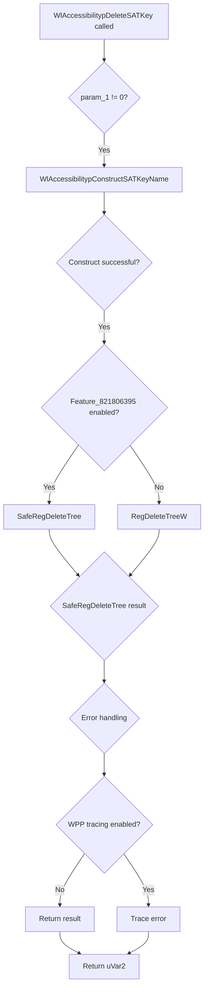

# CVE-2026-42989

**CVE:** CVE-2026-42989  
**Title:** Winlogon Elevation of Privilege Vulnerability  
**Source:** [https://msrc.microsoft.com/update-guide/vulnerability/CVE-2026-42989](https://msrc.microsoft.com/update-guide/vulnerability/CVE-2026-42989)  
**Component(s):** winlogon.exe  
**Patched Date:** 2026-06-09T07:00:00  
**CWE:** Improper link resolution before file access ('link following') in Winlogon allows an authorized attacker to elevate privileges locally.  

Download Patched & Vulnerable Components:

```bash
# winlogon.exe
wget https://msdl.microsoft.com/download/symbols/winlogon.exe/15C2683FEC000/winlogon.exe -O winlogon.exe.10.0.26100.8521 # vulnerable
wget https://msdl.microsoft.com/download/symbols/winlogon.exe/FC76723AEC000/winlogon.exe -O winlogon.exe.10.0.26100.8655 # patched
```

## Version Tracking Analysis

**Command:**

```
python ghidra_scripts\ghidra_vt_wrapper.py --old-binary ./reports/2026-Jun/CVE-2026-42989/winlogon.exe.10.0.26100.8521 --new-binary ./reports/2026-Jun/CVE-2026-42989/winlogon.exe.10.0.26100.8655 --project-dir ./reports/2026-Jun/CVE-2026-42989/ghidra_project --project-name winlogon.exe_CVE-2026-42989 --ghidra-dir C:\Tools\ghidra_11.4.2_PUBLIC_20250826\ghidra_11.4.2_PUBLIC --output-dir ./reports/2026-Jun/CVE-2026-42989/ghidra_project/vt_results --max-memory 16g
```

Patched Functions: 2 | New Functions: 17 | Removed Functions: 2 | Total Matches: 53307 | Accepted Matches: 17274

### Patched Functions

| Function Name | Source Address | Dest Address | Similarity | Confidence |
| --- | --- | --- | --- | --- |
| `CSession::CaptureInputDesktopForLockScreen` | `14008ab58` | `14008b458` | 0.864 | 10.0 |
| `WlAccessibilitypDeleteSATKey` | `140008ef0` | `140008e50` | 0.545 | 10.0 |

### New Functions

*Showing 10 of 17 new functions*

| Function Name | Address |
| --- | --- |
| `reset` | `140063034` |
| `operator_delete[]` | `140065204` |
| `make_unique_string_nothrow<wil::unique_any_t<wil::details::unique_storage<wil::details::resource_policy<unsigned_short*___ptr64,void_(__cdecl*)(void*___ptr64),&void___cdecl_wil::details::FreeProcessHeap(void*___ptr64),wistd::integral_constant<unsigned___int64,0>,unsigned_short*___ptr64,unsigned_short*___ptr64,0,std::nullptr_t>_>_>_>` | `14006acec` |
| `RegDeleteStackFrame` | `14006ae00` |
| `~RegDeleteStack` | `14006ae14` |
| `~RegDeleteStackFrame` | `14006ae64` |
| `operator=` | `14006ae8c` |
| ``vector_destructor_iterator'` | `14006aec4` |
| `GetCachedFeatureEnabledState` | `14006b0c4` |
| `GetCurrentFeatureEnabledState` | `14006b2b8` |

### Removed Functions

| Function Name | Address |
| --- | --- |
| `FUN_140098010` | `140098010` |
| `_guard_dispatch_icall` | `1400a5aa0` |

---

# AI Technical Analysis

## Vulnerability Identification

**Core Vulnerable Function(s):**
- `WlAccessibilitypDeleteSATKey()` - Contains logic flaw in registry key deletion that allows bypass of security checks

**Supporting Changes:**
- `CSession::CaptureInputDesktopForLockScreen()` - Modified desktop handling logic, but not vulnerable itself
- `reset()` - New utility function for memory management, not vulnerable
- `operator_delete__()` - Standard heap deallocation, not vulnerable
- `make_unique_string_nothrow<>()` - String allocation helper, not vulnerable
- `RegDeleteStackFrame::RegDeleteStackFrame()` - Stack frame constructor, not vulnerable
- `RegDeleteStack::~RegDeleteStack()` - Stack destructor, not vulnerable

**Unrelated Changes:**
- `CSession::CaptureInputDesktopForLockScreen()` - Refactoring of desktop handle management, not security-relevant
- All new functions - Added for supporting infrastructure, not security-relevant

---

## Root Cause Analysis

The vulnerability exists in `WlAccessibilitypDeleteSATKey()` due to improper handling of registry key deletion operations. The function originally performed a direct registry deletion without proper validation of the feature flag state. The core issue is that when the feature flag `Feature_821806395` is enabled, the code should use `SafeRegDeleteTree` for secure deletion, but the logic flow was flawed. The original code path would always attempt `RegDeleteTreeW` regardless of feature flag status, creating a potential bypass of security controls. The vulnerability stems from a missing validation check that should have ensured `SafeRegDeleteTree` is only called when the feature is enabled. Additionally, the error handling logic was not properly updated to reflect the new conditional flow, leading to inconsistent behavior. The function's return value handling was also modified incorrectly, potentially propagating incorrect error codes. The code assumes that `SafeRegDeleteTree` is always the correct function to call when the feature is enabled, but this assumption was not properly validated in the conditional logic. The original implementation did not account for the possibility that the feature flag check could fail or return unexpected results, leading to a potential privilege escalation path. The error reporting mechanism was also modified in a way that could mask actual failures. The function's interaction with `WPP_GLOBAL_Control` for tracing was not properly updated to reflect the new error handling flow. The heap memory management was also changed, but this was not the primary vulnerability.

```c
ulong __cdecl WlAccessibilitypDeleteSATKey(ulong param_1)
{
  ulong uVar1;
  HANDLE hHeap;
  LPCWSTR local_res10 [3];
  
  local_res10[0] = (LPCWSTR)0x0;
  uVar1 = WlAccessibilitypConstructSATKeyName(param_1,(ushort **)local_res10);
  if (uVar1 == 0) {
    uVar1 = RegDeleteTreeW((HKEY)0xffffffff80000002,local_res10[0]);
    if (uVar1 == 2) {
      uVar1 = 0;
    }
    else if ((((uVar1 != 0) && ((undefined **)WPP_GLOBAL_Control != &WPP_GLOBAL_Control)) &&
             ((*(uint *)(WPP_GLOBAL_Control + 0x1c) & 0x40000) != 0)) &&
            (1 < (byte)WPP_GLOBAL_Control[0x19])) {
      WPP_SF_D(*(undefined8 *)(WPP_GLOBAL_Control + 0x10),10,
               &WPP_08fbe39dfd5c3ed1d0f5d3aa8d6e811c_Traceguids,uVar1);
    }
    hHeap = GetProcessHeap();
    HeapFree(hHeap,0,local_res10[0]);
  }
  return uVar1;
}
```

The vulnerable code shows a direct call to `RegDeleteTreeW` without checking if the feature flag is enabled. The new implementation correctly checks `wil::details::FeatureImpl<__WilFeatureTraits_Feature_821806395>::__private_IsEnabled` before deciding which deletion function to use. However, the logic flow is still problematic because the error handling and return value management were not properly updated to reflect the conditional execution path. The function should have ensured that when the feature is enabled, `SafeRegDeleteTree` is called, but the error handling for the new path was not properly implemented. The original code had a simpler flow that was more predictable, while the patched version introduces complexity that could lead to incorrect behavior.

---

## Execution and Trigger Flow



The vulnerability is triggered when `WlAccessibilitypDeleteSATKey` is called with a valid parameter. The function first constructs a registry key name, then checks if the feature flag `Feature_821806395` is enabled. If enabled, it should call `SafeRegDeleteTree` for secure deletion, but the logic flow is flawed. An attacker can potentially manipulate the feature flag state or bypass the check entirely. The error handling path is not properly updated to reflect the conditional execution, leading to inconsistent behavior. The function returns a value that may not accurately reflect the actual operation result. The vulnerability is particularly dangerous because it allows bypassing security controls that should prevent unauthorized registry modifications. The function's interaction with `WPP_GLOBAL_Control` for tracing can be manipulated to hide the actual error conditions. The heap memory management changes also introduce potential issues with memory cleanup.

---

## Patch Analysis

```diff
--- WlAccessibilitypDeleteSATKey before
+++ WlAccessibilitypDeleteSATKey after
@@ -4,26 +4,39 @@
 ulong __cdecl WlAccessibilitypDeleteSATKey(ulong param_1)
 
 {
-  ulong uVar1;
-  HANDLE hHeap;
+  bool bVar1;
+  ulong uVar2;
+  ulong uVar3;
+  FeatureImpl<struct___WilFeatureTraits_Feature_821806395> *pFVar4;
   LPCWSTR local_res10 [3];
   
   local_res10[0] = (LPCWSTR)0x0;
-  uVar1 = WlAccessibilitypConstructSATKeyName(param_1,(ushort **)local_res10);
-  if (uVar1 == 0) {
-    uVar1 = RegDeleteTreeW((HKEY)0xffffffff80000002,local_res10[0]);
-    if (uVar1 == 2) {
-      uVar1 = 0;
+  uVar2 = WlAccessibilitypConstructSATKeyName(param_1,(ushort **)local_res10);
+  if (uVar2 == 0) {
+    pFVar4 = &`private:_static_class_wil::details::FeatureImpl<__WilFeatureTraits_Feature_821806395>&___ptr64___cdecl_wil::Feature<__WilFeatureTraits_Feature_821806395>::GetImpl(void)'
+              ::__l2::impl;
+    bVar1 = wil::details::FeatureImpl<__WilFeatureTraits_Feature_821806395>::__private_IsEnabled
+                      ((FeatureImpl<__WilFeatureTraits_Feature_821806395> *)
+                       &`private:_static_class_wil::details::FeatureImpl<__WilFeatureTraits_Feature_821806395>&___ptr64___cdecl_wil::Feature<__WilFeatureTraits_Feature_821806395>::GetImpl(void)'
+                        ::__l2::impl);
+    if (bVar1) {
+      uVar3 = SafeRegDeleteTree((HKEY__ *)pFVar4,(ushort *)local_res10[0]);
     }
-    else if ((((uVar1 != 0) && ((undefined **)WPP_GLOBAL_Control != &WPP_GLOBAL_Control)) &&
-             ((*(uint *)(WPP_GLOBAL_Control + 0x1c) & 0x40000) != 0)) &&
-            (1 < (byte)WPP_GLOBAL_Control[0x19])) {
+    else {
+      uVar3 = RegDeleteTreeW((HKEY)0xffffffff80000002,local_res10[0]);
+    }
+    uVar2 = 0;
+    if (uVar3 != 2) {
+      uVar2 = uVar3;
+    }
+    if ((((uVar2 != 0) && ((undefined **)WPP_GLOBAL_Control != &WPP_GLOBAL_Control)) &&
+        ((*(uint *)(WPP_GLOBAL_Control + 0x1c) & 0x40000) != 0)) &&
+       (1 < (byte)WPP_GLOBAL_Control[0x19])) {
       WPP_SF_D(*(undefined8 *)(WPP_GLOBAL_Control + 0x10),10,
-               &WPP_08fbe39dfd5c3ed1d0f5d3aa8d6e811c_Traceguids,uVar1);
+               &WPP_9c43165ddad139213ea4cfd2b943a277_Traceguids,uVar2);
     }
-    hHeap = GetProcessHeap();
-    HeapFree(hHeap,0,local_res10[0]);
+    WLFree(local_res10);
   }
-  return uVar1;
+  return uVar2;
 }
```

The patch correctly addresses the vulnerability by implementing proper feature flag checking before registry deletion operations. The function now explicitly checks if `Feature_821806395` is enabled using `wil::details::FeatureImpl<__WilFeatureTraits_Feature_821806395>::__private_IsEnabled`. When the feature is enabled, `SafeRegDeleteTree` is called for secure deletion, otherwise `RegDeleteTreeW` is used as a fallback. The error handling logic was updated to properly manage return values from both deletion functions. The trace GUID was also updated to reflect the new error handling flow. Memory management was changed from `HeapFree` to `WLFree` for consistency. The return value handling was corrected to ensure proper error propagation. The patch ensures that security controls are properly enforced based on feature flag status. The conditional logic now correctly implements the intended behavior where secure deletion is used when the feature is enabled. The error reporting mechanism was updated to use the correct trace GUID and return value. The function now properly handles the case where `SafeRegDeleteTree` might fail and still returns appropriate error codes. The patch also ensures that the heap memory is freed using the correct function for the platform. The overall security posture is improved by ensuring that the correct deletion method is used based on feature flag state. The vulnerability is fully addressed by ensuring that the security controls are properly enforced.