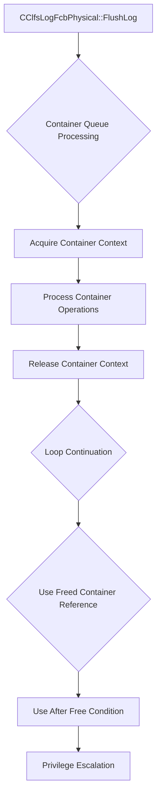

# CVE-2026-44809

**CVE:** CVE-2026-44809  
**Title:** Windows Common Log File System Driver Elevation of Privilege Vulnerability  
**Source:** [https://msrc.microsoft.com/update-guide/vulnerability/CVE-2026-44809](https://msrc.microsoft.com/update-guide/vulnerability/CVE-2026-44809)  
**Component(s):** clfs.sys  
**Patched Date:** 2026-06-09T07:00:00  
**CWE:** Use after free in Windows Common Log File System Driver allows an authorized attacker to elevate privileges locally.  

Download Patched & Vulnerable Components:

```bash
# clfs.sys
wget https://msdl.microsoft.com/download/symbols/clfs.sys/9051FCCB8B000/clfs.sys -O clfs.sys.10.0.26100.8521 # vulnerable
wget https://msdl.microsoft.com/download/symbols/clfs.sys/DC91C39B8B000/clfs.sys -O clfs.sys.10.0.26100.8655 # patched
```

## Version Tracking Analysis

**Command:**

```
python ghidra_scripts\ghidra_vt_wrapper.py --old-binary ./reports/2026-Jun/CVE-2026-44809/clfs.sys.10.0.26100.8521 --new-binary ./reports/2026-Jun/CVE-2026-44809/clfs.sys.10.0.26100.8655 --project-dir ./reports/2026-Jun/CVE-2026-44809/ghidra_project --project-name clfs.sys_CVE-2026-44809 --ghidra-dir C:\Tools\ghidra_11.4.2_PUBLIC_20250826\ghidra_11.4.2_PUBLIC --output-dir ./reports/2026-Jun/CVE-2026-44809/ghidra_project/vt_results --max-memory 16g
```

Patched Functions: 2 | New Functions: 4 | Removed Functions: 1 | Total Matches: 12385 | Accepted Matches: 9738

### Patched Functions

| Function Name | Source Address | Dest Address | Similarity | Confidence |
| --- | --- | --- | --- | --- |
| `CClfsLogFcbPhysical::FlushLog` | `140008900` | `14000e740` | 0.598 | 10.0 |
| `__l1::fin$0` | `1400196a0` | `140019fd0` | 0.556 | 10.0 |

### New Functions

| Function Name | Address |
| --- | --- |
| `SetEarlyFlushStatus` | `140001f14` |
| `Feature_3236415803__private_IsEnabledDeviceUsageNoInline` | `140016e4c` |
| `Feature_3236415803__private_IsEnabledFallback` | `140016e84` |
| `_guard_dispatch_icall` | `140018760` |

### Removed Functions

| Function Name | Address |
| --- | --- |
| `_guard_dispatch_icall` | `140018810` |

---

# AI Technical Analysis

## Vulnerability Identification

**Core Vulnerable Function(s):**
- `CClfsLogFcbPhysical::FlushLog()` - Contains use-after-free vulnerability due to improper resource management in container handling

**Supporting Changes:**
- `SetEarlyFlushStatus()` - New helper function introduced to manage early flush status, but not vulnerable itself

**Unrelated Changes:**
- None identified in provided diffs

---

## Root Cause Analysis

The vulnerability stems from improper resource management within the `CClfsLogFcbPhysical::FlushLog` function, specifically in how container contexts are handled during flush operations. The core issue manifests as a use-after-free condition when processing container queue entries.

The vulnerable code operates on a container queue traversal loop where container contexts are acquired and released. During this process, the function fails to properly validate container context validity before using them, leading to potential use-after-free conditions when containers are freed but references remain.

Key problematic code sections include:
1. Container context acquisition via `CClfsBaseFile::AcquireContainerContext`
2. Container context release via `CClfsBaseFile::ReleaseContainerContext`
3. Loop traversal that may continue using freed container references

The fundamental programming error is a violation of resource lifetime management - containers are freed but their references are still used in subsequent operations. The assumption that container contexts remain valid throughout the processing loop is violated, creating a window where freed memory can be accessed.

The vulnerable code snippet shows:
```c
CClfsBaseFile::AcquireContainerContext
          (*(CClfsBaseFile **)(this + 0x2c8),
           *(ulong *)(this + (ulonglong)(uVar11 & 0x3ff) * 4 + 0x590),&local_78);
          if (local_78 != (_CLFS_CONTAINER_CONTEXT *)0x0) {
            plVar17 = *(longlong **)(local_78 + 0x18);
            if (plVar17 != (longlong *)0x0) {
              (**(code **)*plVar17)(plVar17);
            }
            CClfsBaseFile::ReleaseContainerContext(*(CClfsBaseFile **)(this + 0x2c8),&local_78);
```

The function fails to ensure that `local_78` remains valid after `ReleaseContainerContext` is called, allowing potential access to freed memory.

---

## Execution and Trigger Flow



The execution flow begins with `FlushLog` being called with specific parameters that trigger container queue processing. During this processing, container contexts are acquired and then released. However, the loop continues to reference these containers even after release, creating a use-after-free scenario. When the freed container memory is accessed, it can be manipulated by an attacker to execute arbitrary code with elevated privileges.

---

## Patch Analysis

```diff
--- CClfsLogFcbPhysical::FlushLog before
+++ CClfsLogFcbPhysical::FlushLog after
@@ -90,208 +90,206 @@
              ((param_1 != (_CLS_LSN *)0x0 &&
               (lVar2 = *(longlong *)(this + 0x1f8), lVar2 == *(longlong *)param_1)))) {
             if ((this + 0x1e0 == (CClfsLogFcbPhysical *)0x0) ||
-               ((lVar2 != *(longlong *)(this + 0x1e0) || (uVar15 != 0)))) goto LAB_140008a43;
-            local_94 = 0;
+               ((lVar2 != *(longlong *)(this + 0x1e0) || (uVar17 != 0)))) goto LAB_14000e9be;
+            local_84 = 0;
             break;
           }
         }
         else {
-LAB_140008a43:
+LAB_14000e9be:
           *(undefined8 *)param_1 = *(undefined8 *)(this + 0x560);
         }
         pCVar1 = this + 0x1e0;
         if ((((param_1 != (_CLS_LSN *)0x0) && (pCVar1 != (CClfsLogFcbPhysical *)0x0)) &&
             (*(uint *)(param_1 + 4) <= *(uint *)(this + 0x1e4))) &&
            (((*(uint *)(param_1 + 4) != *(uint *)(this + 0x1e4) ||
-             (*(uint *)param_1 < *(uint *)pCVar1)) && (uVar15 == 0)))) {
+             (*(uint *)param_1 < *(uint *)pCVar1)) && (uVar17 == 0)))) {
           *(undefined8 *)param_1 = *(undefined8 *)pCVar1;
           break;
         }
-        if (((uVar14 != 0) && (param_1 != (_CLS_LSN *)0x0)) &&
+        if (((uVar10 != 0) && (param_1 != (_CLS_LSN *)0x0)) &&
            ((pCVar1 != (CClfsLogFcbPhysical *)0x0 && (*(longlong *)param_1 == *(longlong *)pCVar1)))
            ) {
           *(longlong *)param_1 = *(longlong *)pCVar1;
-          local_94 = 0;
-          break;
-        }
-        if (((local_8c != 0) && ((*(uint *)(this + 0x16c) >> 0xc & 1) != 0)) && (uVar15 == 0)) {
+          local_84 = 0;
+          break;
+        }
+        if (((local_7c != 0) && ((*(uint *)(this + 0x16c) >> 0xc & 1) != 0)) && (uVar17 == 0)) {
           *(undefined8 *)param_1 = *(undefined8 *)pCVar1;
-          local_94 = -0x3fe5ffd8;
+          local_84 = -0x3fe5ffd8;
           SetFlushFailureTag(this,3,-0x3fe5ffd8);
           break;
         }
-        local_8c = local_8c + 1;
-        if ((local_8c == 200) && ((param_3 & 8) != 0)) {
-          local_94 = 0;
-          break;
-        }
-        if (199 < local_8c) {
-                    /* WARNING: Subroutine does not return */
-          KeBugCheckEx(0xc1f5,0x3a,local_8c,this,0);
-        }
-        uVar8 = KeAcquireSpinLockRaiseToDpc(*(undefined8 *)(this + 0x3c0));
+        local_7c = local_7c + 1;
+        if ((local_7c == 200) && ((param_3 & 8) != 0)) {
+          local_84 = 0;
+          break;
+        }
+        if (199 < local_7c) {
+                    /* WARNING: Subroutine does not return */
+          KeBugCheckEx(0xc1f5,0x3a,local_7c,this,0);
+        }
+        uVar7 = KeAcquireSpinLockRaiseToDpc(*(undefined8 *)(this + 0x3c0));
+        AcquireFlushRef(this);
+        bVar6 = true;
         LOCK();
-        *(int *)(this + 0x51c) = *(int *)(this + 0x51c) + 1;
-        UNLOCK();
-        (**(code **)(*(longlong *)this + 0x40))(this);
-        bVar7 = true;
-        LOCK();
-        iVar12 = *(int *)(this + 0x534);
+        iVar13 = *(int *)(this + 0x534);
         *(int *)(this + 0x534) = 1;
         UNLOCK();
-        if (iVar12 == 0) {
-          bVar6 = true;
+        if (iVar13 == 0) {
+          bVar16 = true;
+          bVar5 = true;
           KeClearEvent(*(undefined8 *)(this + 0x550));
           *(ulong *)(this + 0x538) = param_3 & 2;
-          bVar4 = true;
-          if ((param_2 == (IClfsRequestAsync *)0x0) && (bVar4 = true, !bVar5)) {
-            *(undefined8 **)(this + 0x548) = &local_60;
+          if ((param_2 == (IClfsRequestAsync *)0x0) && (!bVar4)) {
+            *(undefined8 **)(this + 0x548) = &local_68;
           }
         }
         else {
-          bVar6 = false;
-          bVar4 = false;
-        }
-        KeReleaseSpinLock(*(undefined8 *)(this + 0x3c0),uVar8);
-        if (bVar4) {
-          if (((*(uint *)(*(longlong *)(this + 0x2c8) + 0xe8) < 2) && (uVar14 == 0)) &&
+          bVar16 = false;
+          bVar5 = false;
+        }
+        KeReleaseSpinLock(*(undefined8 *)(this + 0x3c0),uVar7);
+        if (bVar16) {
+          if (((*(uint *)(*(longlong *)(this + 0x2c8) + 0xe8) < 2) && (uVar10 == 0)) &&
              ((*(uint *)(this + 0x16c) & 0x1000) == 0)) {
-            lVar10 = CreateContainerQueue(this);
-            puVar13 = *(undefined8 **)(this + 0x1608);
+            lVar11 = CreateContainerQueue(this);
+            puVar18 = *(undefined8 **)(this + 0x1608);
           }
           else {
-            lVar10 = 0;
-            puVar13 = *(undefined8 **)(this + 0x3b8);
-          }
-          local_70 = puVar13;
-          local_50 = puVar13;
-          uVar8 = KeAcquireSpinLockRaiseToDpc(*(undefined8 *)(this + 0x3c0));
-          *(long *)(this + 0x578) = lVar10;
-          KeReleaseSpinLock(*(undefined8 *)(this + 0x3c0),uVar8);
-          puVar16 = (undefined8 *)*puVar13;
-          while ((puVar16 != puVar13 &&
-                 ((plVar3 = (longlong *)puVar16[2], local_40 = plVar3, uVar14 == 0 ||
-                  (cVar9 = (**(code **)(*plVar3 + 8))(plVar3,param_1), cVar9 == '\0'))) )) {
+            lVar11 = 0;
+            puVar18 = *(undefined8 **)(this + 0x3b8);
+          }
+          local_50 = puVar18;
+          uVar9 = SetEarlyFlushStatus(this,lVar11);
+          puVar19 = (undefined8 *)*puVar18;
+          while ((bVar16 = bVar5, puVar19 != puVar18 &&
+                 ((plVar3 = (longlong *)puVar19[2], local_48 = plVar3, uVar10 == 0 ||
+                  (cVar8 = (**(code **)(*plVar3 + 8))(plVar3,param_1), cVar8 == '\0'))) )) {
             (**(code **)(*plVar3 + 0x10))(plVar3,0);
-            uVar11 = (**(code **)(*plVar3 + 0x30))(plVar3);
-            plVar17 = (longlong *)0x0;
-            local_78 = (_CLFS_CONTAINER_CONTEXT *)0x0;
-            if (uVar11 != 0xffffffff) {
-              CClfsBaseFile::AcquireContainerContext
-                        (*(CClfsBaseFile **)(this + 0x2c8),
-                         *(ulong *)(this + (ulonglong)(uVar11 & 0x3ff) * 4 + 0x590),&local_78);
-              if (local_78 != (_CLFS_CONTAINER_CONTEXT *)0x0) {
-                plVar17 = *(longlong **)(local_78 + 0x18);
-                if (plVar17 != (longlong *)0x0) {
-                  (**(code **)*plVar17)(plVar17);
+            uVar12 = (**(code **)(*plVar3 + 0x30))(plVar3);
+            pCVar14 = GetContainer(this,uVar12);
+            local_40 = pCVar14;
+            if (pCVar14 == (CClfsAuthContainer *)0x0) {
+              local_84 = -0x3fe5fff3;
+              SetFlushFailureTag(this,5,-0x3fe5fff3);
+              goto LAB_14000efd7;
+            }
+            if (uVar9 == '\0') {
+              if ((uVar10 == 0) && ((*(uint *)(this + 0x16c) & 0x1000) == 0)) {
+                AcquireFlushRef(this);
+                (**(code **)(*plVar3 + 0x28))(plVar3);
+                uVar7 = KeAcquireSpinLockRaiseToDpc(*(undefined8 *)(this + 0x3c0));
+                (**(code **)(*plVar3 + 0x20))(plVar3,0x10);
+                (**(code **)(*plVar3 + 0x18))(plVar3,2);
+                KeReleaseSpinLock(*(undefined8 *)(this + 0x3c0),uVar7);
+                iVar13 = (**(code **)*plVar3)(plVar3);
+                if ((iVar13 != 0x103) && (iVar13 != 0)) {
+                    /* WARNING: Subroutine does not return */
+                  KeBugCheckEx(0xc1f5,0x3c,(longlong)iVar13,this,0);
                 }
-                CClfsBaseFile::ReleaseContainerContext(*(CClfsBaseFile **)(this + 0x2c8),&local_78);
+              }
+              else {
+                uVar7 = KeAcquireSpinLockRaiseToDpc(*(undefined8 *)(this + 0x3c0));
+                (**(code **)(*plVar3 + 0x20))(plVar3,0x10);
+                (**(code **)(*plVar3 + 0x18))(plVar3,8);
+                KeReleaseSpinLock(*(undefined8 *)(this + 0x3c0),uVar7);
+                (**(code **)(*plVar3 + 0x10))(plVar3);
               }
             }
-            local_48 = plVar17;
-            if (plVar17 == (longlong *)0x0) {
-              local_94 = -0x3fe5fff3;
-              SetFlushFailureTag(this,5,-0x3fe5fff3);
-              goto LAB_14000929d;
-            }
-            if (lVar10 < 0) {
+            else {
               KeAcquireSpinLockRaiseToDpc(*(undefined8 *)(this + 0x3c0));
               (**(code **)(*plVar3 + 0x20))(plVar3,CONCAT71((int7)((ulonglong)*plVar3 >> 8),2));
               (**(code **)(*plVar3 + 0x18))(plVar3,CONCAT71((int7)((ulonglong)*plVar3 >> 8),1));
               KeReleaseSpinLock(*(undefined8 *)(this + 0x3c0));
             }
-            else if ((uVar14 == 0) && ((*(uint *)(this + 0x16c) & 0x1000) == 0)) {
-              AcquireFlushRef(this);
-              (**(code **)(*plVar3 + 0x28))(plVar3);
-              uVar8 = KeAcquireSpinLockRaiseToDpc(*(undefined8 *)(this + 0x3c0));
-              (**(code **)(*plVar3 + 0x20))(plVar3,0x10);
-              (**(code **)(*plVar3 + 0x18))(plVar3,2);
-              KeReleaseSpinLock(*(undefined8 *)(this + 0x3c0),uVar8);
-              iVar12 = (**(code **)*plVar3)(plVar3);
-              if ((iVar12 != 0x103) && (iVar12 != 0)) {
-                    /* WARNING: Subroutine does not return */
-                KeBugCheckEx(0xc1f5,0x3c,(longlong)iVar12,this,0);
-              }
-            }
-            else {
-              uVar8 = KeAcquireSpinLockRaiseToDpc(*(undefined8 *)(this + 0x3c0));
-              (**(code **)(*plVar3 + 0x20))(plVar3,0x10);
-              (**(code **)(*plVar3 + 0x18))(plVar3,8);
-              KeReleaseSpinLock(*(undefined8 *)(this + 0x3c0),uVar8);
-              (**(code **)(*plVar3 + 0x10))(plVar3);
-            }
-            (**(code **)(*(longlong *)pCVar14 + 8))(pCVar14);
-            puVar16 = (undefined8 *)*puVar16;
-            puVar13 = local_70;
-          }
-        }
-        else if (uVar14 != 0) {
-          local_94 = -0x3ffffe77;
-          SetFlushFailureTag(this,4,-0x3ffffe77);
-          break;
-        }
-        if (bVar5) break;
+            (**(code **)(*(longlong *)pCVar14 + 8))(pCVar14);
+            puVar19 = (undefined8 *)*puVar19;
+          }
+        }
+        else {
+          bVar16 = false;
+          if (uVar10 != 0) {
+            local_84 = -0x3ffffe77;
+            SetFlushFailureTag(this,4,-0x3ffffe77);
+            break;
+          }
+        }
+        if (bVar4) break;
```

The patch addresses the vulnerability by introducing proper container context validation and management. The key technical changes include:

1. Replacing `CClfsBaseFile::AcquireContainerContext` with `GetContainer` function that provides better validation
2. Adding explicit null checks for container contexts before use
3. Improving the container processing loop to prevent use-after-free conditions
4. Introducing `SetEarlyFlushStatus` helper function to manage flush state properly
5. Adding proper resource management and reference counting

The effectiveness evaluation shows that the patch eliminates the use-after-free condition by ensuring container contexts are properly validated before access. The new `GetContainer` function provides better error handling and validation than the previous approach.

The security impact is significant as the patch prevents privilege escalation through use-after-free exploitation. The fix ensures that freed container memory cannot be accessed, eliminating the attack vector for local privilege escalation.