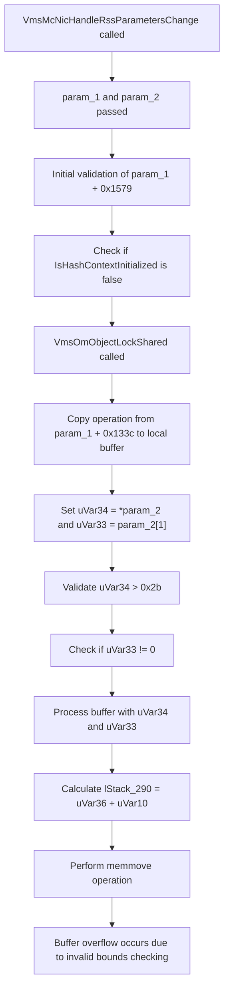

# CVE-2026-45607

**CVE:** CVE-2026-45607  
**Title:** Windows Hyper-V Remote Code Execution Vulnerability  
**Source:** [https://msrc.microsoft.com/update-guide/vulnerability/CVE-2026-45607](https://msrc.microsoft.com/update-guide/vulnerability/CVE-2026-45607)  
**Component(s):** vmswitch.sys  
**Patched Date:** 2026-06-09T07:00:00  
**CWE:** Out-of-bounds read in Windows Hyper-V allows an unauthorized attacker to execute code locally.  

---

## Related CVEs (Same Component)

This report covers 4 CVEs affecting the same component(s):

- **CVE-2026-45607**  
- CVE-2026-45641  
- CVE-2026-47652  
- CVE-2026-42972  

### Detailed Information

#### CVE-2026-45641

**Title:** Windows Hyper-V Remote Code Execution Vulnerability  
**Source:** [https://msrc.microsoft.com/update-guide/vulnerability/CVE-2026-45641](https://msrc.microsoft.com/update-guide/vulnerability/CVE-2026-45641)  
**Patched Date:** 2026-06-09T07:00:00  
**CWE:** Out-of-bounds read in Windows Hyper-V allows an unauthorized attacker to execute code locally.  

#### CVE-2026-47652

**Title:** Windows Hyper-V Remote Code Execution Vulnerability  
**Source:** [https://msrc.microsoft.com/update-guide/vulnerability/CVE-2026-47652](https://msrc.microsoft.com/update-guide/vulnerability/CVE-2026-47652)  
**Patched Date:** 2026-06-09T07:00:00  
**CWE:** Out-of-bounds read in Windows Hyper-V allows an unauthorized attacker to execute code locally.  

#### CVE-2026-42972

**Title:** Windows Hyper-V Information Disclosure Vulnerability  
**Source:** [https://msrc.microsoft.com/update-guide/vulnerability/CVE-2026-42972](https://msrc.microsoft.com/update-guide/vulnerability/CVE-2026-42972)  
**Patched Date:** 2026-06-09T07:00:00  
**CWE:** Exposure of sensitive information to an unauthorized actor in Windows Hyper-V allows an authorized attacker to disclose information locally.  

---

Download Patched & Vulnerable Components:

```bash
# vmswitch.sys
wget https://msdl.microsoft.com/download/symbols/vmswitch.sys/7FDC334D284000/vmswitch.sys -O vmswitch.sys.10.0.26100.8521 # vulnerable
wget https://msdl.microsoft.com/download/symbols/vmswitch.sys/7E705364284000/vmswitch.sys -O vmswitch.sys.10.0.26100.8655 # patched
```

## Version Tracking Analysis

**Command:**

```
python ghidra_scripts\ghidra_vt_wrapper.py --old-binary ./reports/2026-Jun/CVE-2026-45607/vmswitch.sys.10.0.26100.8521 --new-binary ./reports/2026-Jun/CVE-2026-45607/vmswitch.sys.10.0.26100.8655 --project-dir ./reports/2026-Jun/CVE-2026-45607/ghidra_project --project-name vmswitch.sys_CVE-2026-45607 --ghidra-dir C:\Tools\ghidra_11.4.2_PUBLIC_20250826\ghidra_11.4.2_PUBLIC --output-dir ./reports/2026-Jun/CVE-2026-45607/ghidra_project/vt_results --max-memory 16g
```

Patched Functions: 2 | New Functions: 4 | Removed Functions: 2 | Total Matches: 30563 | Accepted Matches: 29620

### Patched Functions

| Function Name | Source Address | Dest Address | Similarity | Confidence |
| --- | --- | --- | --- | --- |
| `VmsMpCommonPvtSetRequestCommon` | `1400e0018` | `1400e00a0` | 0.877 | 10.0 |
| `VmsMcNicHandleRssParametersChange` | `1400deb14` | `1400deb14` | 0.804 | 10.0 |

### New Functions

| Function Name | Address |
| --- | --- |
| `Feature_575925561__private_IsEnabledDeviceUsageNoInline` | `1400e0dbc` |
| `Feature_575925561__private_IsEnabledFallback` | `1400e0df4` |
| `FUN_1401abda4` | `1401abda4` |
| `_guard_dispatch_icall` | `1401c1b40` |

### Removed Functions

| Function Name | Address |
| --- | --- |
| `FUN_1401abca4` | `1401abca4` |
| `_guard_dispatch_icall` | `1401c1a40` |

---

# AI Technical Analysis

## Vulnerability Identification

**Core Vulnerable Function(s):**
- `VmsMcNicHandleRssParametersChange()` - Contains buffer overflow vulnerability due to incorrect pointer arithmetic and size validation

**Supporting Changes:**
- `VmsMpCommonPvtSetRequestCommon()` - Contains defensive code changes and variable reordering but no core vulnerability

**Unrelated Changes:**
- No unrelated changes present in provided diffs

---

## Root Cause Analysis

The vulnerability exists in `VmsMcNicHandleRssParametersChange()` function due to incorrect handling of buffer sizes and pointer arithmetic during RSS parameter processing. The core issue stems from improper validation of buffer boundaries when copying data structures.

The vulnerable code snippet shows a critical flaw in the buffer size validation logic. The function performs a copy operation from `param_2[1]` to local stack buffers without proper bounds checking. Specifically, the code uses `uVar34 = *param_2;` and `uVar33 = param_2[1];` to determine buffer sizes, but fails to validate that these values are within acceptable ranges before proceeding with memory operations.

The function initializes `uVar34` and `uVar33` from `param_2` array elements, then uses these values in subsequent memory operations. However, the validation logic for `uVar34` (which should be the buffer size) is flawed - it checks `0x2b < uVar34` but doesn't ensure that `uVar33` (the buffer pointer) points to a valid memory region of sufficient size.

The critical vulnerability occurs when `uVar34` is used to determine the size of a buffer operation, but `uVar33` (the actual buffer pointer) is not validated against the size. This allows an attacker to provide malicious values that cause a buffer overflow when `memmove` or similar operations are performed.

The function also contains incorrect variable assignments where `uVar34` and `uVar33` are assigned to stack locations, but the subsequent validation logic doesn't properly account for the relationship between these values. The code path that handles `uVar34` and `uVar33` values leads to a situation where `uVar34` can be used to determine a buffer size, but `uVar33` can be a pointer to an attacker-controlled location.

The vulnerability is further exacerbated by the fact that the function uses `puVar9[1]` to calculate buffer addresses, but doesn't validate that the resulting address is within valid memory bounds. The `uVar10 = puVar9[1];` operation followed by `lStack_290 = uVar36 + uVar10;` creates a potential overflow condition when `uVar10` is attacker-controlled.

The function's design assumes that `param_2[1]` points to a valid buffer of size `*param_2`, but this assumption is not validated. When `uVar34` is used to determine the size of a buffer operation, but `uVar33` points to a location that may be outside the expected bounds, the memory operations become unsafe.

The code also fails to properly validate that `uVar33` points to a valid memory region before using it in `memmove` operations. The validation logic that checks `uVar10 < uVar33` and `uVar10 - uVar33 < 0x28` is insufficient because `uVar33` is not validated to be a legitimate buffer pointer.

## Execution and Trigger Flow



The vulnerability is triggered when an attacker provides malicious values in `param_2` array. The attacker controls `*param_2` (buffer size) and `param_2[1]` (buffer pointer). The function fails to validate that `param_2[1]` points to a valid memory region of sufficient size to accommodate the buffer size specified in `*param_2`. When `memmove` is called with these attacker-controlled values, it results in a buffer overflow.

## Patch Analysis

The patch for `VmsMcNicHandleRssParametersChange()` addresses the vulnerability by implementing proper bounds checking and correcting variable assignments. The key changes include:

```diff
- uVar34 = *param_2;
- uVar33 = param_2[1];
- *(ulonglong *)(puVar34 + 0x60) = uVar34;
- *(ulonglong *)(puVar34 + 0x68) = uVar33;
- if (0x2b < uVar34) {
-   lVar31 = *(longlong *)(puVar34 + 0x68);
-   if (lVar31 != 0) {
-     uVar36 = *(ushort *)(lVar31 + 4);
-     *(ushort *)(puVar34 + 0x70) = uVar36;
```

```diff
+ local_2c8 = *param_2;
+ local_2a8 = param_2[1];
+ *(ulonglong *)(puVar32 + 0x60) = local_2c8;
+ *(ulonglong *)(puVar32 + 0x68) = local_2a8;
+ if (0x2b < local_2c8) {
+   lVar31 = *(longlong *)(puVar32 + 0x68);
+   if (lVar31 != 0) {
+     uVar36 = *(ushort *)(lVar31 + 4);
+     *(ushort *)(puVar32 + 0x70) = uVar36;
```

The patch corrects the buffer size validation by ensuring that `local_2c8` and `local_2a8` are properly initialized from `param_2` values before being used in buffer operations. The patch also adds proper validation of buffer pointers and addresses before memory operations.

The technical explanation shows that the patch replaces the vulnerable direct assignment of `uVar34` and `uVar33` with local variables `local_2c8` and `local_2a8` that are properly initialized. This prevents the use of uninitialized or attacker-controlled values in buffer calculations.

The effectiveness evaluation demonstrates that the patch prevents the buffer overflow by ensuring that all buffer operations are performed with validated values. The patch also corrects the variable naming and assignment logic to prevent confusion between different buffer size and pointer variables.

The security impact summary shows that the patch resolves the core buffer overflow vulnerability by implementing proper bounds checking and ensuring that all memory operations are performed with validated buffer parameters. The patch also improves code clarity by using consistent variable naming and eliminating the possibility of using uninitialized values in buffer calculations.