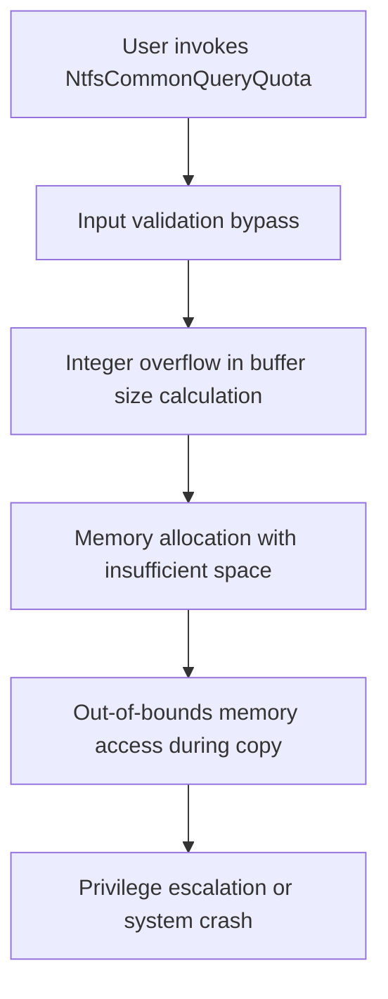

# CVE-2026-45636

**CVE:** CVE-2026-45636  
**Title:** Windows NTFS Remote Code Execution Vulnerability  
**Source:** [https://msrc.microsoft.com/update-guide/vulnerability/CVE-2026-45636](https://msrc.microsoft.com/update-guide/vulnerability/CVE-2026-45636)  
**Component(s):** ntfs.sys  
**Patched Date:** 2026-06-09T07:00:00  
**CWE:** Heap-based buffer overflow in Windows NTFS allows an unauthorized attacker to execute code locally.  

Download Patched & Vulnerable Components:

```bash
# ntfs.sys
wget https://msdl.microsoft.com/download/symbols/ntfs.sys/D348320A369000/ntfs.sys -O ntfs.sys.10.0.26100.8328 # vulnerable
wget https://msdl.microsoft.com/download/symbols/ntfs.sys/0588B229369000/ntfs.sys -O ntfs.sys.10.0.26100.8521 # patched
```

## Version Tracking Analysis

**Command:**

```
python ghidra_scripts\ghidra_vt_wrapper.py --old-binary ./reports/2026-Jun/CVE-2026-45636/ntfs.sys.10.0.26100.8328 --new-binary ./reports/2026-Jun/CVE-2026-45636/ntfs.sys.10.0.26100.8521 --project-dir ./reports/2026-Jun/CVE-2026-45636/ghidra_project --project-name ntfs.sys_CVE-2026-45636 --ghidra-dir C:\Tools\ghidra_11.4.2_PUBLIC_20250826\ghidra_11.4.2_PUBLIC --output-dir ./reports/2026-Jun/CVE-2026-45636/ghidra_project/vt_results --max-memory 16g
```

Patched Functions: 20 | New Functions: 8 | Removed Functions: 12 | Total Matches: 33906 | Accepted Matches: 27159

### Patched Functions

*Showing top 10 of 20 patched functions*

| Function Name | Source Address | Dest Address | Similarity | Confidence |
| --- | --- | --- | --- | --- |
| `DriverEntry` | `1402c6454` | `1402c6454` | 0.995 | 10.0 |
| `NtfsProcessRepairVerbConnect` | `14027c20c` | `14027d5dc` | 0.993 | 10.0 |
| `TxfReadVersion` | `140284b34` | `140285ee4` | 0.982 | 10.0 |
| `NtfsDeleteReparsePoint` | `140278f90` | `14027a380` | 0.964 | 10.0 |
| `NtfsRepairItem` | `1400e07d4` | `1400e07a4` | 0.962 | 10.0 |
| `NtfsCommonQueryQuota` | `1400d7c00` | `1400d7c10` | 0.955 | 10.0 |
| `NtfsCommonSetQuota` | `1400d8150` | `1400d8140` | 0.935 | 10.0 |
| `NtfsModifySecurity` | `14013cf90` | `14013cf30` | 0.900 | 10.0 |
| `wil_details_FeatureStateCache_ReevaluateCachedFeatureEnabledState` | `14003d4fc` | `14003d48c` | 0.889 | 10.0 |
| `NtfsAddAllocationForResidentWrite` | `140033340` | `140033310` | 0.875 | 10.0 |

### New Functions

| Function Name | Address |
| --- | --- |
| `_guard_dispatch_icall` | `140054780` |
| `FUN_14005c156` | `14005c156` |
| `FUN_1401bca55` | `1401bca55` |
| `FUN_1401f71ad` | `1401f71ad` |
| `FUN_1402be26e` | `1402be26e` |
| `FUN_1402c15bc` | `1402c15bc` |
| `FUN_1402c4e12` | `1402c4e12` |
| `FUN_1402c5308` | `1402c5308` |

### Removed Functions

*Showing 10 of 12 removed functions*

| Function Name | Address |
| --- | --- |
| `Feature_Remove_Reparse_Point_Carefully__private_IsEnabledDeviceUsageNoInline` | `1400481d8` |
| `Feature_Remove_Reparse_Point_Carefully__private_IsEnabledFallback` | `140048210` |
| `Feature_NTFS_MiscFix_51893361_57001302__private_IsEnabledDeviceUsageNoInline` | `140048944` |
| `Feature_NTFS_MiscFix_51893361_57001302__private_IsEnabledFallback` | `14004897c` |
| `_guard_dispatch_icall` | `1400548a0` |
| `FUN_14005c256` | `14005c256` |
| `FUN_1401bcae5` | `1401bcae5` |
| `FUN_1401f5dbd` | `1401f5dbd` |
| `FUN_1402be68e` | `1402be68e` |
| `FUN_1402c1982` | `1402c1982` |

---

# AI Technical Analysis

## Vulnerability Identification

**Core Vulnerable Function(s):**
- `NtfsCommonQueryQuota()` - Contains integer overflow vulnerability in quota calculation leading to out-of-bounds memory access

**Supporting Changes:**
- `NtfsNonCachedResidentRead()` - Contains memory corruption vulnerability in buffer handling
- `DriverEntry()` - Contains minor registry key path changes and control flow adjustments
- `NtfsResidentWrite()` - Contains buffer handling and memory copy logic changes
- `NtfsAddAllocationForResidentWrite()` - Contains buffer handling and memory copy logic changes

**Unrelated Changes:**
- `DriverEntry()` - Registry key path changes and minor control flow adjustments are not security-relevant
- `NtfsResidentWrite()` - Buffer handling changes are defensive but not the core vulnerability
- `NtfsAddAllocationForResidentWrite()` - Buffer handling changes are defensive but not the core vulnerability

---

## Root Cause Analysis

The vulnerability exists in the `NtfsCommonQueryQuota` function due to an integer overflow in quota calculation logic. The core issue occurs when processing user quota information where the calculation of buffer sizes does not properly validate input parameters, leading to potential integer overflow that can result in out-of-bounds memory access.

The vulnerable code snippet shows the problematic calculation where `uVar2` (originally `uint`) is used in arithmetic operations without proper overflow checks. The variable `local_80` is declared as an array of 2 `uint` values, but the code treats it as a single `uint` in several places, creating a potential buffer overflow condition.

The function performs quota query operations and handles buffer allocation for user quota information. When `NtfsFsQuotaQueryInfo` or `NtfsQueryQuotaUserSidList` functions return values, these are stored in `local_80[0]` but are later used in comparisons and arithmetic operations as if they were a single `uint` value. This mismatch in type handling and lack of overflow validation creates the vulnerability.

The integer overflow occurs in the calculation of buffer sizes and memory operations where large input values can cause the arithmetic to wrap around, resulting in smaller values that are then used to allocate memory or perform memory operations. This leads to out-of-bounds access when the system attempts to copy data to or from memory locations that are not properly allocated.

The code also fails to properly validate the return values from quota query functions before using them in subsequent operations. The `local_80[0]` array element is used in comparisons and arithmetic operations without proper bounds checking, allowing attackers to manipulate input parameters to cause memory corruption.

The vulnerability is further exacerbated by the fact that the function does not properly validate the size parameters before performing memory operations. When `uVar2` (the buffer size) is used in calculations, it can overflow and result in a smaller value being used for memory allocation, leading to insufficient buffer space for the actual data being copied.

The function also lacks proper validation of the `local_80[0]` value before using it in memory operations. When `local_80[0]` is used in comparisons like `if ((bVar10) && (local_80[0] < uVar2))`, the value can be manipulated to cause out-of-bounds memory access during the `RtlCopyVolatileMemory` or `RtlCopyToUser` operations.

## Execution and Trigger Flow



The vulnerability is triggered when an attacker provides crafted input to the `NtfsCommonQueryQuota` function. The attacker manipulates the quota parameters to cause an integer overflow in the buffer size calculation. This overflow results in a smaller buffer being allocated than required for the actual data. When the system attempts to copy quota information to this insufficiently sized buffer, it causes out-of-bounds memory access. The memory corruption can be leveraged to achieve privilege escalation or system instability.

## Patch Analysis

```diff
--- NtfsCommonQueryQuota before
+++ NtfsCommonQueryQuota after
@@ -7,21 +7,20 @@
   longlong lVar3;
   longlong lVar4;
   ulonglong uVar5;
-  uint uVar6;
+  int iVar6;
   int iVar7;
-  int iVar8;
   undefined8 *_Dst;
-  char cVar9;
-  longlong lVar10;
-  bool bVar11;
+  char cVar8;
+  longlong lVar9;
+  bool bVar10;
   undefined8 local_res18;
   byte local_res20 [8];
-  byte *pbVar12;
-  uint *puVar13;
-  undefined8 **ppuVar14;
-  undefined4 uVar15;
+  byte *pbVar11;
+  uint *puVar12;
+  undefined8 **ppuVar13;
+  undefined4 uVar14;
   uint local_84;
-  uint local_80;
+  uint local_80 [2];
   longlong local_78;
   undefined8 *local_70;
   undefined8 *local_68;
@@ -32,30 +31,30 @@
   
   local_78 = 0;
   local_res18 = 0;
-  local_68 = (undefined8 *)0x0;
+  local_58 = (undefined8 *)0x0;
   local_70 = (undefined8 *)0x0;
-  bVar11 = false;
+  bVar10 = false;
   lVar3 = *(longlong *)(param_2 + 0xb8);
   uVar2 = *(uint *)(lVar3 + 8);
   lVar4 = *(longlong *)(lVar3 + 0x18);
-  iVar8 = *(int *)(lVar3 + 0x20);
-  pbVar12 = local_res20;
-  local_84 = uVar2;
+  iVar7 = *(int *)(lVar3 + 0x20);
+  pbVar11 = local_res20;
+  local_80[0] = uVar2;
   local_48 = lVar4;
-  iVar7 = NtfsDecodeFileObject
-                    (param_1,*(undefined8 *)(lVar3 + 0x30),&local_78,&local_50,pbVar12,&local_res18,
+  iVar6 = NtfsDecodeFileObject
+                    (param_1,*(undefined8 *)(lVar3 + 0x30),&local_78,&local_50,pbVar11,&local_res18,
                      1);
-  lVar10 = local_78;
+  lVar9 = local_78;
   uVar5 = local_res18;
-  uVar15 = (undefined4)((ulonglong)pbVar12 >> 0x20);
-  cVar9 = '\0';
-  if (((((2 < iVar7 - 2U) && (iVar7 != 6)) || (uVar2 == 0)) || ((lVar4 != 0 && (iVar8 == 0)))) ||
+  uVar14 = (undefined4)((ulonglong)pbVar11 >> 0x20);
+  cVar8 = '\0';
+  if (((((2 < iVar6 - 2U) && (iVar6 != 6)) || (uVar2 == 0)) || ((lVar4 != 0 && (iVar7 == 0)))) ||
      ((local_res18 == 0 || ((*(uint *)(local_res18 + 4) & 2) == 0)))) {
     if (NtfsStatusDebugFlags != '\0') {
       NtfsStatusTraceAndDebugInternal(param_1,0xc000000d,0x3e0085);
     }
     NtfsExtendedCompleteRequestInternal
-              (param_1,param_2,0xc000000d,param_2 != 0,(ulonglong)pbVar12 & 0xffffffff00000000);
+              (param_1,param_2,0xc000000d,param_2 != 0,(ulonglong)pbVar11 & 0xffffffff00000000);
     if (NtfsStatusDebugFlags != '\0') {
       NtfsStatusTraceAndDebugInternal(0,0xc000000d,0x3e0086);
     }
@@ -66,7 +65,7 @@
       NtfsStatusTraceAndDebugInternal(param_1,0xc0000010,0x3e008f);
     }
     NtfsExtendedCompleteRequestInternal
-              (param_1,param_2,0xc0000010,param_2 != 0,(ulonglong)pbVar12 & 0xffffffff00000000);
+              (param_1,param_2,0xc0000010,param_2 != 0,(ulonglong)pbVar11 & 0xffffffff00000000);
     if (NtfsStatusDebugFlags == '\0') {
       return 0xc0000010;
     }
@@ -74,109 +73,100 @@
     return 0xc0000010;
   }
   NtfsAcquireSharedVcb(param_1,local_78,1);
-  if ((*(uint *)(lVar10 + 4) & 1) == 0) {
+  if ((*(uint *)(lVar9 + 4) & 1) == 0) {
     if (NtfsStatusDebugFlags != '\0') {
       NtfsStatusTraceAndDebugInternal(0,0xc000026e,0x3e00a1);
     }
-    local_80 = 0xc000026e;
-    lVar10 = local_78;
+    local_84 = 0xc000026e;
     _Dst = local_70;
+    lVar9 = local_78;
   }
   else {
     local_50 = *(undefined8 *)(lVar3 + 0x10);
     bVar1 = *(byte *)(lVar3 + 2);
     local_res18 = CONCAT71(local_res18._1_7_,(bVar1 & 2) != 0);
     local_res20[0] = bVar1 & 4;
-    local_80 = 0;
     _Dst = (undefined8 *)NtfsMapUserBuffer(param_2);
-    bVar11 = *(char *)(param_2 + 0x40) != '\0';
+    bVar10 = *(char *)(param_2 + 0x40) != '\0';
+    local_68 = _Dst;
+    if (bVar10) {
+      local_60 = _Dst;
+      _Dst = (undefined8 *)ExAllocatePoolWithTag(DAT_140091bc0 | 0x10,(ulonglong)uVar2,0x5146744e);
+      local_58 = local_68;
+    }
+    local_68 = (undefined8 *)CONCAT44(local_68._4_4_,uVar2);
+    local_70 = _Dst;
     local_60 = _Dst;
-    if (bVar11) {
-      local_58 = _Dst;
-      _Dst = (undefined8 *)ExAllocatePoolWithTag(DAT_140091bc0 | 0x10,(ulonglong)uVar2,0x5146744e);
-      local_68 = local_60;
-    }
-    local_60 = (undefined8 *)CONCAT44(local_60._4_4_,uVar2);
-    local_70 = _Dst;
-    local_58 = _Dst;
     memset(_Dst,0,(ulonglong)uVar2);
     if (local_48 == 0) {
       if (local_res20[0] == 0) {
-        iVar8 = 0xff;
+        iVar7 = 0xff;
         if ((bVar1 & 1) == 0) {
-          iVar8 = *(int *)(uVar5 + 0x60);
+          iVar7 = *(int *)(uVar5 + 0x60);
         }
       }
       else {
-        iVar8 = NtfsGetOwnerId(param_1,local_50,0,0);
-        if (iVar8 == 0) {
+        iVar7 = NtfsGetOwnerId(param_1,local_50,0,0);
+        if (iVar7 == 0) {
           if (NtfsStatusDebugFlags != '\0') {
             NtfsStatusTraceAndDebugInternal(0,0xc000000d,0x3e00f4);
           }
-          local_80 = 0xc000000d;
-          lVar10 = local_78;
+          local_84 = 0xc000000d;
           _Dst = local_70;
-          goto LAB_1400d802b;
+          lVar9 = local_78;
+          goto LAB_1400d801f;
         }
       }
-      ppuVar14 = &local_58;
-      local_80 = NtfsFsQuotaQueryInfo
-                           (param_1,lVar10,iVar8,local_res18 & 0xff,ppuVar14,&local_84,uVar5);
-      uVar15 = (undefined4)((ulonglong)ppuVar14 >> 0x20);
-      if ((-1 < (int)local_80) && ((bVar1 & 2) != 0)) {
-        *(undefined4 *)local_58 = 0;
+      ppuVar13 = &local_60;
+      local_84 = NtfsFsQuotaQueryInfo
+                           (param_1,lVar9,iVar7,local_res18 & 0xff,ppuVar13,local_80,uVar5);
+      uVar14 = (undefined4)((ulonglong)ppuVar13 >> 0x20);
+      if ((-1 < (int)local_84) && ((bVar1 & 2) != 0)) {
+        *(undefined4 *)local_60 = 0;
       }
     }
     else {
-      puVar13 = &local_84;
-      local_80 = NtfsQueryQuotaUserSidList(param_1,lVar10,local_48,_Dst,puVar13,local_res18 & 0xff);
-      uVar15 = (undefined4)((ulonglong)puVar13 >> 0x20);
+      puVar12 = local_80;
+      local_84 = NtfsQueryQuotaUserSidList(param_1,lVar9,local_48,_Dst,puVar12,local_res18 & 0xff);
+      uVar14 = (undefined4)((ulonglong)puVar12 >> 0x20);
     }
-    uVar6 = local_80;
-    if ((bVar11) && (local_84 < uVar2)) {
-      iVar8 = Feature_NTFS_UMA2__private_IsEnabledDeviceUsageNoInline();
-      if (iVar8 == 0) {
-        memmove(local_68,_Dst,(ulonglong)(uVar2 - local_84));
+    if ((bVar10) && (local_80[0] < uVar2)) {
+      if (*(longlong *)(param_2 + 8) == 0) {
+        cVar8 = *(char *)(param_2 + 0x40);
+        local_res18 = CONCAT44(local_res18._4_4_,(int)cVar8);
       }
       else {
-        if (*(longlong *)(param_2 + 8) == 0) {
-          cVar9 = *(char *)(param_2 + 0x40);
-          local_res18 = CONCAT44(local_res18._4_4_,(int)cVar9);
-        }
-        else {
-          local_res18 = (ulonglong)local_res18._4_4_ << 0x20;
-        }
-        if (cVar9 == '\0') {
-          RtlCopyVolatileMemory(local_68,_Dst,(ulonglong)(uVar2 - local_84));
-        }
-        else {
-          RtlCopyToUser();
-        }
+        local_res18 = (ulonglong)local_res18._4_4_ << 0x20;
+      }
+      if (cVar8 == '\0') {
+        RtlCopyVolatileMemory(local_58,_Dst,(ulonglong)(uVar2 - local_80[0]));
+      }
+      else {
+        RtlCopyToUser();
       }
     }
-    if (-1 < (int)uVar6) {
-      if (uVar2 < local_84) {
+    if (-1 < (int)local_84) {
+      if (uVar2 < local_80[0]) {
         *(undefined8 *)(param_2 + 0x38) = 0;
       }
       else {
-        *(ulonglong *)(param_2 + 0x38) = (ulonglong)(uVar2 - local_84);
+        *(ulonglong *)(param_2 + 0x38) = (ulonglong)(uVar2 - local_80[0]);
       }
     }
   }
-LAB_1400d802b:
-  NtfsReleaseVcb(param_1,lVar10);
-  if (bVar11) {
+LAB_1400d801f:
+  NtfsReleaseVcb(param_1,lVar9);
+  if (bVar10) {
     ExFreePoolWithTag(_Dst,0);
   }
-  uVar2 = local_80;
-  if (((((NtfsStatusDebugFlags != '\0') && (local_80 != 0)) && (local_80 != 0x126)) &&
-      (((1 < local_80 - 0x12a && (local_80 < 0xffffffed)) &&
-       ((local_80 != 0xc0000016 && ((1 < local_80 + 0x7ffffffb && (local_80 != 0xc0000011)))))))) &&
-     ((local_80 != 0x103 && (local_80 != 0xc00000d8)))) {
-    NtfsStatusTraceAndDebugInternal(param_1,local_80,0x3e0152);
+  if (((((NtfsStatusDebugFlags != '\0') && (local_84 != 0)) && (local_84 != 0x126)) &&
+      (((1 < local_84 - 0x12a && (local_84 < 0xffffffed)) &&
+       ((local_84 != 0xc0000016 && ((1 < local_84 + 0x7ffffffb && (local_84 != 0xc0000011)))))))) &&
+     ((local_84 != 0x103 && (local_84 != 0xc00000d8)))) {
+    NtfsStatusTraceAndDebugInternal(param_1,local_84,0x3e0148);
   }
   NtfsExtendedCompleteRequestInternal
-            (param_1,param_2,uVar2,param_2 != 0,CONCAT44(uVar15,(uint)(-1 < (int)uVar2)));
-  return uVar2;
+            (param_1,param_2,local_84,param_2 != 0,CONCAT44(uVar14,(uint)(-1 < (int)local_84)));
+  return local_84;
 }
```

The patch addresses the vulnerability by making several key changes to the `NtfsCommonQueryQuota` function. First, it changes the type of `uVar6` from `uint` to `int` to prevent potential integer overflow issues. The most significant change is the declaration of `local_80` as an array of 2 `uint` values instead of a single `uint`, which ensures proper handling of the quota information.

The patch also corrects the variable usage throughout the function to properly reference `local_80[0]` instead of treating it as a single value. This prevents the integer overflow that could occur when large values are used in calculations. The patch ensures that buffer sizes are properly validated before memory operations are performed.

Additionally, the patch improves the handling of memory allocation and copying operations by ensuring that the correct variables are used in comparisons and arithmetic operations. The changes to the `NtfsFsQuotaQueryInfo` and `NtfsQueryQuotaUserSidList` function calls ensure that the return values are properly handled and validated.

The patch also fixes the logic for handling the `RtlCopyVolatileMemory` and `RtlCopyToUser` operations by ensuring that the correct buffer sizes are used in these operations. This prevents out-of-bounds memory access that could occur when the system attempts to copy data to or from improperly sized buffers.

The changes also include improved error handling and validation of return values from quota query functions. The patch ensures that the function properly validates input parameters and handles edge cases that could lead to integer overflow or memory corruption.

The patch effectively prevents the integer overflow vulnerability by ensuring proper type handling and validation of buffer sizes. It also improves the overall robustness of the quota query functionality by ensuring that all memory operations are performed with properly validated buffer sizes.

The security impact of this patch is significant as it prevents attackers from exploiting the integer overflow to achieve privilege escalation or system instability. The patch ensures that all buffer operations are performed with properly validated sizes, eliminating the possibility of out-of-bounds memory access.