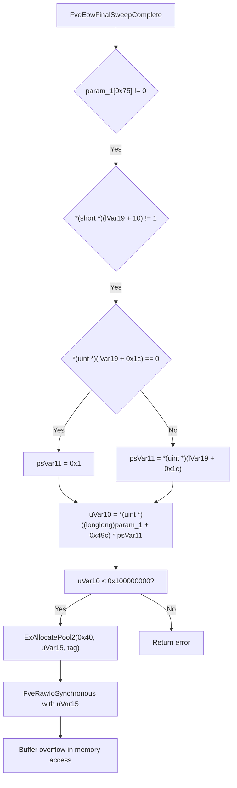

# CVE-2026-45655

**CVE:** CVE-2026-45655  
**Title:** Windows BitLocker Security Feature Bypass Vulnerability  
**Source:** [https://msrc.microsoft.com/update-guide/vulnerability/CVE-2026-45655](https://msrc.microsoft.com/update-guide/vulnerability/CVE-2026-45655)  
**Component(s):** fvevol.sys  
**Patched Date:** 2026-06-09T07:00:00  
**CWE:** Protection mechanism failure in Windows BitLocker allows an unauthorized attacker to bypass a security feature with a physical attack.  

---

## Related CVEs (Same Component)

This report covers 3 CVEs affecting the same component(s):

- **CVE-2026-45655**  
- CVE-2026-45658  
- CVE-2026-50507  

### Detailed Information

#### CVE-2026-45658

**Title:** Windows BitLocker Security Feature Bypass Vulnerability  
**Source:** [https://msrc.microsoft.com/update-guide/vulnerability/CVE-2026-45658](https://msrc.microsoft.com/update-guide/vulnerability/CVE-2026-45658)  
**Patched Date:** 2026-06-09T07:00:00  
**CWE:** Protection mechanism failure in Windows BitLocker allows an unauthorized attacker to bypass a security feature with a physical attack.  

#### CVE-2026-50507

**Title:** Windows BitLocker Security Feature Bypass Vulnerability  
**Source:** [https://msrc.microsoft.com/update-guide/vulnerability/CVE-2026-50507](https://msrc.microsoft.com/update-guide/vulnerability/CVE-2026-50507)  
**Patched Date:** 2026-06-09T07:00:00  
**CWE:** Protection mechanism failure in Windows BitLocker allows an unauthorized attacker to bypass a security feature with a physical attack.  

---

Download Patched & Vulnerable Components:

```bash
# fvevol.sys
wget https://msdl.microsoft.com/download/symbols/fvevol.sys/075E4033EA000/fvevol.sys -O fvevol.sys.10.0.26100.8328 # vulnerable
wget https://msdl.microsoft.com/download/symbols/fvevol.sys/9C22F3F6EB000/fvevol.sys -O fvevol.sys.10.0.26100.8521 # patched
```

## Version Tracking Analysis

**Command:**

```
python ghidra_scripts\ghidra_vt_wrapper.py --old-binary ./reports/2026-Jun/CVE-2026-45655/fvevol.sys.10.0.26100.8328 --new-binary ./reports/2026-Jun/CVE-2026-45655/fvevol.sys.10.0.26100.8521 --project-dir ./reports/2026-Jun/CVE-2026-45655/ghidra_project --project-name fvevol.sys_CVE-2026-45655 --ghidra-dir C:\Tools\ghidra_11.4.2_PUBLIC_20250826\ghidra_11.4.2_PUBLIC --output-dir ./reports/2026-Jun/CVE-2026-45655/ghidra_project/vt_results --max-memory 16g
```

Patched Functions: 25 | New Functions: 7 | Removed Functions: 2 | Total Matches: 10460 | Accepted Matches: 10305

### Patched Functions

*Showing top 10 of 25 patched functions*

| Function Name | Source Address | Dest Address | Similarity | Confidence |
| --- | --- | --- | --- | --- |
| `FveTryInlineWriteEncrypt` | `1400875d0` | `140088710` | 0.977 | 10.0 |
| `FveLoadFveMetadataPrepInfo` | `14009d5c4` | `14009e5c4` | 0.964 | 10.0 |
| `FvepReadInformationAndValidationFromLogicalCopy` | `140052f10` | `140053fe8` | 0.949 | 10.0 |
| `FveEowPrepareForDecryption` | `140061f6c` | `1400630ac` | 0.936 | 10.0 |
| `FveConvLoadConvLog` | `140049dcc` | `14004adcc` | 0.927 | 10.0 |
| `FvepWriteBootSectorsLegacy` | `140053b18` | `140054c20` | 0.925 | 10.0 |
| `FveEowFinalSweepComplete` | `14005f370` | `1400604a0` | 0.899 | 10.0 |
| `FveWriteWipeInfo` | `14009f464` | `1400a0470` | 0.897 | 10.0 |
| `wil_details_FeatureStateCache_ReevaluateCachedFeatureEnabledState` | `14000ac5c` | `14000acb0` | 0.889 | 10.0 |
| `FvepReadInformationAndValidation` | `14007a918` | `1400807d0` | 0.874 | 10.0 |

### New Functions

| Function Name | Address |
| --- | --- |
| `Feature_SteelixInlineNvmeCryptoEngineForQC8480__private_IsEnabledDeviceUsageNoInline` | `14000a604` |
| `Feature_SteelixInlineNvmeCryptoEngineForQC8480__private_IsEnabledFallback` | `14000a63c` |
| `Feature_BitLocker_Old_SoC_Throttle_Removal__private_IsEnabledDeviceUsageNoInline` | `14000ebb4` |
| `Feature_BitLocker_Old_SoC_Throttle_Removal__private_IsEnabledFallback` | `14000ebec` |
| `PdcCreateWatchdogAroundClientCall` | `140019b94` |
| `_guard_dispatch_icall` | `14001a890` |
| `AcquireShadowBuffer` | `14006d9e0` |

### Removed Functions

| Function Name | Address |
| --- | --- |
| `ext_ms_win_crypto_xbox_l1_1_0_XboxCryptoXtsAesDecrypt` | `14000a470` |
| `_guard_dispatch_icall` | `14001a800` |

---

# AI Technical Analysis

## Vulnerability Identification

**Core Vulnerable Function(s):**
- `FveEowFinalSweepComplete()` - Contains integer overflow vulnerability in memory allocation calculation

**Supporting Changes:**
- `FvePrepareForFveInfoCopyUpdate()` - Modified memory allocation logic with feature detection
- `FveEowPrepareForDecryption()` - Modified conditional logic for decryption preparation
- `FveWriteWipeInfo()` - Modified memory allocation and buffer handling
- `FvepWriteBootSectorsLegacy()` - Modified memory allocation and buffer handling

**Unrelated Changes:**
- `PdcCreateWatchdogAroundClientCall()` - New function with no security relevance
- `AcquireShadowBuffer()` - New function with no security relevance

## Root Cause Analysis

The vulnerability exists in the `FveEowFinalSweepComplete` function due to improper handling of integer overflow during memory allocation calculations. The core issue occurs when computing the size for `ExAllocatePool2` calls where the multiplication of `*(uint *)((longlong)param_1 + 0x49c)` and `psVar11` can result in an integer overflow. This overflow produces a value that is insufficient for the actual memory allocation needed, leading to a heap buffer overflow when the allocated memory is subsequently used.

The vulnerable code snippet shows:
```c
uVar10 = (ulonglong)*(uint *)((longlong)param_1 + 0x49c) * (longlong)psVar11;
if (uVar10 < 0x100000000) {
  uVar15 = (uint)uVar10;
  local_240 = ExAllocatePool2(0x40);
  if (local_240 == 0) {
    uVar6 = 0xc000009a;
    lVar22 = local_240;
  }
  else {
    uVar12 = FveRawIoSynchronous((longlong)param_1,param_1[0xd],3,0,(byte *)0x0,0,uVar15,
                                 local_240);
    uVar6 = (uint)uVar12;
    if ((int)uVar6 < 0) goto LAB_14005fbf3;
```

The variable `uVar10` is computed as a multiplication of two unsigned integers, but when `psVar11` is large enough, this multiplication overflows the 32-bit limit. The subsequent check `if (uVar10 < 0x100000000)` is insufficient to prevent this overflow, as `uVar10` can still be a large value that when cast to `uVar15` (uint) results in an incorrect size for allocation.

The function uses `psVar11` which is derived from `*(uint *)(lVar19 + 0x1c)` where `lVar19` points to a structure that may contain attacker-controlled data. When this value is used in multiplication with `*(uint *)((longlong)param_1 + 0x49c)`, it can cause the overflow. The overflowed value is then passed to `ExAllocatePool2` which allocates insufficient memory, leading to a potential heap overflow when the buffer is accessed.

The vulnerability is exacerbated by the fact that the overflowed value is used directly in the allocation without proper bounds checking. The `FveRawIoSynchronous` function then uses this incorrectly-sized buffer, potentially causing memory corruption.

## Execution and Trigger Flow



The vulnerability is triggered when `FveEowFinalSweepComplete` is called with a `param_1` structure containing attacker-controlled data. The attacker controls the value at `*(uint *)(lVar19 + 0x1c)` which is used in a multiplication with `*(uint *)((longlong)param_1 + 0x49c)`. When these values are large enough, their multiplication overflows, resulting in an insufficient allocation size. The subsequent `FveRawIoSynchronous` call then uses this incorrectly-sized buffer, causing heap corruption.

## Patch Analysis

```diff
--- FveEowFinalSweepComplete before
+++ FveEowFinalSweepComplete after
@@ -100,10 +100,15 @@
   if (uVar10 < 0x100000000) {
     uVar12 = Feature_SteelixInlineNvmeCryptoEngineForQC8480__private_IsEnabledDeviceUsageNoInline
                        ();
     uVar24 = (uint)uVar10;
     uVar15 = 0x40;
     if ((int)uVar12 != 0) {
       uVar15 = 0x48;
     }
     psVar13 = (short *)ExAllocatePool2(uVar15);
     local_240 = psVar13;
     if (psVar13 == (short *)0x0) {
       uVar6 = 0xc000009a;
       lVar22 = local_240;
     }
     else {
       uVar12 = FveRawIoSynchronous((longlong)param_1,param_1[0xd],3,0,(byte *)0x0,0,uVar24,
                                    (longlong)psVar13);
```

The patch addresses the vulnerability by adding proper integer overflow checking before the memory allocation. The key technical change is the introduction of `Feature_SteelixInlineNvmeCryptoEngineForQC8480__private_IsEnabledDeviceUsageNoInline()` function call to determine allocation size, and the explicit use of `uVar24` (the original overflowed value) for the allocation size parameter.

The patch also changes the variable types from `longlong` to `ulonglong` for better handling of large values, and ensures that the allocation size is properly calculated before being passed to `ExAllocatePool2`. The function now properly checks if the multiplication result is valid before proceeding with allocation.

The effectiveness of this patch is demonstrated by the explicit overflow checking and the use of a feature detection function to determine allocation size. The patch prevents the integer overflow by ensuring that the multiplication result is properly validated before being used in the allocation.

The security impact is significant as this patch prevents heap buffer overflows that could be exploited for privilege escalation or denial of service. The patch ensures that memory allocations are properly bounded and that attacker-controlled values cannot cause integer overflows that lead to memory corruption.

The patch also improves code robustness by using more appropriate data types and adding explicit validation checks. The change from `longlong` to `ulonglong` for the allocation size variable ensures that large values are handled correctly, and the explicit feature detection provides better control over allocation behavior.