# CVE-2026-47288

**CVE:** CVE-2026-47288  
**Title:** Windows Kerberos Key Distribution Center (KDC) Remote Code Execution  
**Source:** [https://msrc.microsoft.com/update-guide/vulnerability/CVE-2026-47288](https://msrc.microsoft.com/update-guide/vulnerability/CVE-2026-47288)  
**Component(s):** kerberos.dll  
**Patched Date:** 2026-06-09T07:00:00  
**CWE:** Integer overflow or wraparound in Windows Kerberos allows an authorized attacker to execute code over an adjacent network.  

---

## Related CVEs (Same Component)

This report covers 3 CVEs affecting the same component(s):

- **CVE-2026-47288**  
- CVE-2026-42903  
- CVE-2026-42914  

### Detailed Information

#### CVE-2026-42903

**Title:** Windows Kerberos Denial of Service Vulnerability  
**Source:** [https://msrc.microsoft.com/update-guide/vulnerability/CVE-2026-42903](https://msrc.microsoft.com/update-guide/vulnerability/CVE-2026-42903)  
**Patched Date:** 2026-06-09T07:00:00  
**CWE:** Null pointer dereference in Windows Kerberos allows an authorized attacker to deny service over a network.  

#### CVE-2026-42914

**Title:** Windows Kerberos Denial of Service Vulnerability  
**Source:** [https://msrc.microsoft.com/update-guide/vulnerability/CVE-2026-42914](https://msrc.microsoft.com/update-guide/vulnerability/CVE-2026-42914)  
**Patched Date:** 2026-06-09T07:00:00  
**CWE:** N/A  

---

Download Patched & Vulnerable Components:

```bash
# kerberos.dll
wget https://msdl.microsoft.com/download/symbols/kerberos.dll/6C4EAB0A167000/kerberos.dll -O kerberos.dll.10.0.26100.8521 # vulnerable
wget https://msdl.microsoft.com/download/symbols/kerberos.dll/75A70EBE167000/kerberos.dll -O kerberos.dll.10.0.26100.8655 # patched
```

## Version Tracking Analysis

**Command:**

```
python ghidra_scripts\ghidra_vt_wrapper.py --old-binary ./reports/2026-Jun/CVE-2026-47288/kerberos.dll.10.0.26100.8521 --new-binary ./reports/2026-Jun/CVE-2026-47288/kerberos.dll.10.0.26100.8655 --project-dir ./reports/2026-Jun/CVE-2026-47288/ghidra_project --project-name kerberos.dll_CVE-2026-47288 --ghidra-dir C:\Tools\ghidra_11.4.2_PUBLIC_20250826\ghidra_11.4.2_PUBLIC --output-dir ./reports/2026-Jun/CVE-2026-47288/ghidra_project/vt_results --max-memory 16g
```

Patched Functions: 2 | New Functions: 26 | Removed Functions: 14 | Total Matches: 210695 | Accepted Matches: 21753

### Patched Functions

| Function Name | Source Address | Dest Address | Similarity | Confidence |
| --- | --- | --- | --- | --- |
| `KerbILogonUserEx3` | `18003eea0` | `18003eec0` | 0.995 | 10.0 |
| `PacValidation::GetPolicyForTicket` | `1800ddfc8` | `1800de08c` | 0.938 | 10.0 |

### New Functions

*Showing 10 of 26 new functions*

| Function Name | Address |
| --- | --- |
| `~basic_streambuf<unsigned_short,std::char_traits<unsigned_short>_>` | `18008d4a8` |
| `_Lock` | `18008d4c0` |
| `_Unlock` | `18008d4d0` |
| `showmanyc` | `18008d4e0` |
| `uflow` | `18008d4f0` |
| `xsgetn` | `18008d500` |
| `xsputn` | `18008d510` |
| `setbuf` | `18008d520` |
| `sync` | `18008d530` |
| `imbue` | `18008d540` |

### Removed Functions

*Showing 10 of 14 removed functions*

| Function Name | Address |
| --- | --- |
| `~basic_streambuf<unsigned_short,std::char_traits<unsigned_short>_>` | `18008d3f8` |
| `_Lock` | `18008d410` |
| `_Unlock` | `18008d420` |
| `showmanyc` | `18008d430` |
| `uflow` | `18008d440` |
| `xsgetn` | `18008d450` |
| `xsputn` | `18008d460` |
| `setbuf` | `18008d470` |
| `sync` | `18008d480` |
| `imbue` | `18008d490` |

---

Looking at this decompiled code, I can see this is a complex Kerberos authentication function (`KerbProcessLogonTicket`) that handles various logon scenarios including smart card, certificate-based, and regular user authentication. 

The function contains several potential vulnerabilities related to memory management, buffer overflows, and improper validation. Let me identify the key vulnerable functions:

## Vulnerable Functions Identified

### 1. **KerbProcessLogonTicket** (Main Function)
This is the primary vulnerable function with multiple issues:

**Memory Corruption Issues:**
- Buffer overflows in string handling with `KerbDuplicateStringEx` calls
- Potential use-after-free with `KerbFree` operations
- Improper bounds checking in credential handling

**Critical Vulnerability:**
```c
// Potential buffer overflow in credential handling
if (0xfffc < *(ushort *)p_Var1) {
  *(undefined8 *)(local_4e8 + 0x1a0) = 0;
  _Var24 = 0xc0000106;
  goto LAB_180041db5;
}
```

### 2. **KerbGetTicketGrantingTicket** 
```c
// Potential for improper validation of ticket data
_Var24 = KerbGetTicketGrantingTicket(local_4e8,(_KERB_CREDENTIAL *)0x0,(_KERB_CREDMAN_CRED *)0x0,
                                     (_KERB_EXTRA_CRED *)0x0,(_KERB_PROXY_LOGON_CRED *)0x0,
                                     (_UNICODE_STRING *)0x0,0,pp_Var31,
                                     (_KERB_ENCRYPTION_KEY *)&local_278,'\0');
```

### 3. **KerbCreateTokenFromLogonTicket**
```c
// Potential for improper token creation with unvalidated inputs
_Var24 = KerbCreateTokenFromLogonTicket(local_440,&local_4d8,(_KERB_INTERACTIVE_LOGON *)local_508,
                                        (_KERB_PLAINTEXT_PASSWORD *)&local_4b8,uVar23,param_2,
                                        (_KERB_ENCRYPTION_KEY *)&local_278,(_KERB_MESSAGE_BUFFER *)&local_240,
                                        (_UNICODE_STRING *)&local_340,local_3a8,(_UNICODE_STRING *)&local_250,
                                        &local_2e0,local_2e8,local_4e8,&local_360->Data1,(void **)local_3d8,
                                        local_358,local_3b8,_Dst,(_SECPKG_SUPPLEMENTAL_CRED_ARRAY **)local_420
                                        ,&local_478,(_KERB_TICKET_LOGON_SUPP_CRED *)p_Var45);
```

## Mermaid Call Flow Graph

```mermaid
graph TD
    A["KerbProcessLogonTicket"] --> B["KerbGetTicketGrantingTicket"]
    A --> C["KerbCreateTokenFromLogonTicket"]
    A --> D["KerbDuplicateStringEx"]
    A --> E["KerbFree"]
    A --> F["KerbDereferenceTicketCacheEntry"]
    A --> G["KerbRemoveLogonSession"]
    A --> H["KerbUpdateSecPkgPrimaryCredsForDmsa"]
    A --> I["KerbUpdateOldLogonSession"]
    A --> J["KerbClientFreeSupplementalCredentials"]
    A --> K["KerbFreeSecpkgPrimaryCredentials"]
    A --> L["KerbFreeString"]
    A --> M["KerbFreePrimaryCredentials"]
    A --> N["KerbGetTicketForCredential"]
    A --> O["KerbGetServiceTicketEx"]
    A --> P["KerbCheckRealmlessLogonPolicy"]
    A --> Q["KerbGetOurDomainName"]
    A --> R["KerbGetClientDomain"]
    A --> S["KerbDoCachedFidoLogon"]
    A --> T["KerbDoLocalSmartCardLogon"]
    A --> U["KerbCreateSmartcardEx2PackedCreds"]
    A --> V["KerbIsIumCert"]
    A --> W["KerbUpdateOldLogonSession"]
    A --> X["KerbCreateTokenFromLogonTicket"]
    A --> Y["KerbGetTicketGrantingTicket"]
    A --> Z["KerbGetTicketForCredential"]
```



## Key Vulnerabilities Summary

1. **Buffer Overflow in String Handling**: Multiple `KerbDuplicateStringEx` calls without proper bounds checking
2. **Memory Management Issues**: Potential use-after-free with `KerbFree` operations
3. **Improper Validation**: Credential and ticket validation without sufficient checks
4. **Integer Overflow**: Potential integer overflow in size calculations
5. **Race Conditions**: Multiple critical sections without proper synchronization

The main vulnerability is in the `KerbProcessLogonTicket` function where multiple memory operations are performed without proper validation, creating opportunities for buffer overflows and memory corruption attacks. The function handles complex credential processing and ticket management, making it a prime target for exploitation.