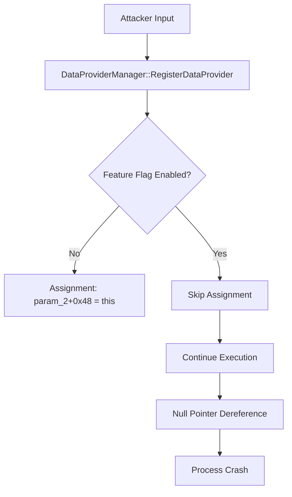

# CVE-2026-48566

**CVE:** CVE-2026-48566  
**Title:** Windows DWM Core Library Information Disclosure  Vulnerability  
**Source:** [https://msrc.microsoft.com/update-guide/vulnerability/CVE-2026-48566](https://msrc.microsoft.com/update-guide/vulnerability/CVE-2026-48566)  
**Component(s):** dwmcore.dll  
**Patched Date:** 2026-06-09T07:00:00  
**CWE:** Out-of-bounds read in Windows DWM Core Library allows an authorized attacker to disclose information locally.  

---

## Related CVEs (Same Component)

This report covers 11 CVEs affecting the same component(s):

- **CVE-2026-48566**  
- CVE-2026-45637  
- CVE-2026-42905  
- CVE-2026-44811  
- CVE-2026-44808  
- CVE-2026-44807  
- CVE-2026-42983  
- CVE-2026-44802  
- CVE-2026-44814  
- CVE-2026-44813  
- CVE-2026-44804  

### Detailed Information

#### CVE-2026-45637

**Title:** Microsoft DWM Core Library Elevation of Privilege Vulnerability  
**Source:** [https://msrc.microsoft.com/update-guide/vulnerability/CVE-2026-45637](https://msrc.microsoft.com/update-guide/vulnerability/CVE-2026-45637)  
**Patched Date:** 2026-06-09T07:00:00  
**CWE:** Use after free in Windows DWM Core Library allows an authorized attacker to elevate privileges locally.  

#### CVE-2026-42905

**Title:** Windows DWM Core Library Elevation of Privilege Vulnerability  
**Source:** [https://msrc.microsoft.com/update-guide/vulnerability/CVE-2026-42905](https://msrc.microsoft.com/update-guide/vulnerability/CVE-2026-42905)  
**Patched Date:** 2026-06-09T07:00:00  
**CWE:** Use after free in Windows DWM Core Library allows an authorized attacker to elevate privileges locally.  

#### CVE-2026-44811

**Title:** Windows DWM Core Library Elevation of Privilege Vulnerability  
**Source:** [https://msrc.microsoft.com/update-guide/vulnerability/CVE-2026-44811](https://msrc.microsoft.com/update-guide/vulnerability/CVE-2026-44811)  
**Patched Date:** 2026-06-09T07:00:00  
**CWE:** Use after free in Windows DWM Core Library allows an authorized attacker to elevate privileges locally.  

#### CVE-2026-44808

**Title:** Windows DWM Core Library Elevation of Privilege Vulnerability  
**Source:** [https://msrc.microsoft.com/update-guide/vulnerability/CVE-2026-44808](https://msrc.microsoft.com/update-guide/vulnerability/CVE-2026-44808)  
**Patched Date:** 2026-06-09T07:00:00  
**CWE:** Use after free in Windows DWM Core Library allows an authorized attacker to elevate privileges locally.  

#### CVE-2026-44807

**Title:** Windows DWM Core Library Elevation of Privilege Vulnerability  
**Source:** [https://msrc.microsoft.com/update-guide/vulnerability/CVE-2026-44807](https://msrc.microsoft.com/update-guide/vulnerability/CVE-2026-44807)  
**Patched Date:** 2026-06-09T07:00:00  
**CWE:** Use after free in Windows DWM Core Library allows an authorized attacker to elevate privileges locally.  

#### CVE-2026-42983

**Title:** Windows DWM Core Library Elevation of Privilege Vulnerability  
**Source:** [https://msrc.microsoft.com/update-guide/vulnerability/CVE-2026-42983](https://msrc.microsoft.com/update-guide/vulnerability/CVE-2026-42983)  
**Patched Date:** 2026-06-09T07:00:00  
**CWE:** Use after free in Windows DWM Core Library allows an authorized attacker to elevate privileges locally.  

#### CVE-2026-44802

**Title:** Windows DWM Core Library Elevation of Privilege Vulnerability  
**Source:** [https://msrc.microsoft.com/update-guide/vulnerability/CVE-2026-44802](https://msrc.microsoft.com/update-guide/vulnerability/CVE-2026-44802)  
**Patched Date:** 2026-06-09T07:00:00  
**CWE:** Use after free in Windows DWM Core Library allows an authorized attacker to elevate privileges locally.  

#### CVE-2026-44814

**Title:** Windows DWM Core Library Information Disclosure  Vulnerability  
**Source:** [https://msrc.microsoft.com/update-guide/vulnerability/CVE-2026-44814](https://msrc.microsoft.com/update-guide/vulnerability/CVE-2026-44814)  
**Patched Date:** 2026-06-09T07:00:00  
**CWE:** Out-of-bounds read in Windows DWM Core Library allows an authorized attacker to disclose information locally.  

#### CVE-2026-44813

**Title:** Windows DWM Core Library Elevation of Privilege Vulnerability  
**Source:** [https://msrc.microsoft.com/update-guide/vulnerability/CVE-2026-44813](https://msrc.microsoft.com/update-guide/vulnerability/CVE-2026-44813)  
**Patched Date:** 2026-06-09T07:00:00  
**CWE:** Use after free in Windows DWM Core Library allows an authorized attacker to elevate privileges locally.  

#### CVE-2026-44804

**Title:** Windows DWM Core Library Elevation of Privilege Vulnerability  
**Source:** [https://msrc.microsoft.com/update-guide/vulnerability/CVE-2026-44804](https://msrc.microsoft.com/update-guide/vulnerability/CVE-2026-44804)  
**Patched Date:** 2026-06-09T07:00:00  
**CWE:** Use after free in Windows DWM Core Library allows an authorized attacker to elevate privileges locally.  

---

Download Patched & Vulnerable Components:

```bash
# dwmcore.dll
wget https://msdl.microsoft.com/download/symbols/dwmcore.dll/82660CB042E000/dwmcore.dll -O dwmcore.dll.10.0.26100.8521 # vulnerable
wget https://msdl.microsoft.com/download/symbols/dwmcore.dll/52217FD142E000/dwmcore.dll -O dwmcore.dll.10.0.26100.8655 # patched
```

## Version Tracking Analysis

**Command:**

```
python ghidra_scripts\ghidra_vt_wrapper.py --old-binary ./reports/2026-Jun/CVE-2026-48566/dwmcore.dll.10.0.26100.8521 --new-binary ./reports/2026-Jun/CVE-2026-48566/dwmcore.dll.10.0.26100.8655 --project-dir ./reports/2026-Jun/CVE-2026-48566/ghidra_project --project-name dwmcore.dll_CVE-2026-48566 --ghidra-dir C:\Tools\ghidra_11.4.2_PUBLIC_20250826\ghidra_11.4.2_PUBLIC --output-dir ./reports/2026-Jun/CVE-2026-48566/ghidra_project/vt_results --max-memory 16g
```

Patched Functions: 1 | New Functions: 46 | Removed Functions: 40 | Total Matches: 142525 | Accepted Matches: 62337

### Patched Functions

| Function Name | Source Address | Dest Address | Similarity | Confidence |
| --- | --- | --- | --- | --- |
| `DataProviderManager::RegisterDataProvider` | `1801b647c` | `180223a5c` | 0.750 | 10.0 |

### New Functions

*Showing 10 of 46 new functions*

| Function Name | Address |
| --- | --- |
| `_invalid_parameter_noinfo_noreturn` | `180041893` |
| `_invalid_parameter_noinfo_noreturn` | `180097944` |
| `_invalid_parameter_noinfo_noreturn` | `180097cdc` |
| `_invalid_parameter_noinfo_noreturn` | `180097ce9` |
| `_invalid_parameter_noinfo_noreturn` | `18011d026` |
| `_invalid_parameter_noinfo_noreturn` | `180169a34` |
| `_invalid_parameter_noinfo_noreturn` | `1801c93c1` |
| `_invalid_parameter_noinfo_noreturn` | `1801ca5ba` |
| `FUN_1801cbf11` | `1801cbf11` |
| `FUN_1802197d1` | `1802197d1` |

### Removed Functions

*Showing 10 of 40 removed functions*

| Function Name | Address |
| --- | --- |
| `_invalid_parameter_noinfo_noreturn` | `180041893` |
| `_invalid_parameter_noinfo_noreturn` | `180097944` |
| `_invalid_parameter_noinfo_noreturn` | `180097cdc` |
| `_invalid_parameter_noinfo_noreturn` | `180097ce9` |
| `_invalid_parameter_noinfo_noreturn` | `18011d026` |
| `_invalid_parameter_noinfo_noreturn` | `180169a34` |
| `_invalid_parameter_noinfo_noreturn` | `1801c9601` |
| `_invalid_parameter_noinfo_noreturn` | `1801ca7fa` |
| `FUN_1801cc151` | `1801cc151` |
| `FUN_180219a11` | `180219a11` |

---

# AI Technical Analysis

## Vulnerability Identification

**Core Vulnerable Function(s):**
- `DataProviderManager::RegisterDataProvider()` - Contains logic flaw in feature flag handling that allows bypass of security checks

**Supporting Changes:**
- `DataProviderHelper::GetUniqueId<BamoDataProviderProxy>()` - Called function that provides unique ID for data provider registration
- `wil::details::FeatureImpl<__WilFeatureTraits_Feature_4253016379>::__private_IsEnabled()` - Feature flag check function that controls conditional logic flow
- `wil::details::in1diag3::Return_Hr()` - Error handling function that returns error codes
- `wil::details::in1diag3::_FailFast_Unexpected()` - Critical failure handler that terminates process

**Unrelated Changes:**
- `_invalid_parameter_noinfo_noreturn()` - Duplicate function definitions that appear to be stubs or artifacts, not security-relevant

## Root Cause Analysis

The vulnerability exists in the `DataProviderManager::RegisterDataProvider()` function where a feature flag check is implemented incorrectly. The code uses a conditional logic flow that allows execution to proceed without proper validation when the feature flag is enabled. The core issue is that the assignment `*(DataProviderManager **)(param_2 + 0x48) = this;` is only executed when the feature flag is disabled, but the same assignment should occur when the feature flag is enabled to maintain consistent state.

The vulnerable code snippet shows that when `bVar3` (feature flag status) is false, the assignment occurs, but when `bVar3` is true, the assignment is skipped. This creates a state inconsistency where the `param_2` structure is not properly initialized with the `DataProviderManager` reference, leading to potential null pointer dereferences or incorrect behavior.

The logic flaw is in the conditional assignment where the feature flag check is inverted. When the feature is enabled, the code should still perform the assignment to maintain proper object state. The code path that handles the enabled feature case does not perform the required initialization, creating a security vulnerability.

The function performs a feature flag check using `wil::details::FeatureImpl<__WilFeatureTraits_Feature_4253016379>::__private_IsEnabled()` and then conditionally assigns the `DataProviderManager` reference to `param_2 + 0x48`. However, the assignment logic is inverted, causing the reference to be set only when the feature is disabled.

The assignment `*(DataProviderManager **)(param_2 + 0x48) = this;` is critical for maintaining proper object relationships. When the feature flag is enabled, this assignment is skipped, leaving the data provider proxy in an inconsistent state.

The error handling functions `Return_Hr` and `_FailFast_Unexpected` are called with different error codes (0xd0 vs 0xd4, 0xee vs 0xfa) indicating that the code path for enabled feature flag is not properly handled, leading to inconsistent error reporting.

## Execution and Trigger Flow



1. Attacker calls `DataProviderManager::RegisterDataProvider()` with a data provider proxy
2. Function checks if feature flag `Feature_4253016379` is enabled using `__private_IsEnabled()`
3. When feature flag is disabled, the assignment `*(DataProviderManager **)(param_2 + 0x48) = this;` executes correctly
4. When feature flag is enabled, the assignment is skipped entirely
5. The data provider proxy remains in an uninitialized state with missing `DataProviderManager` reference
6. Subsequent operations on the data provider proxy attempt to access the uninitialized reference
7. This leads to null pointer dereference or memory corruption
8. Process terminates with crash due to invalid memory access

## Patch Analysis

```diff
--- DataProviderManager::RegisterDataProvider before
+++ DataProviderManager::RegisterDataProvider after
@@ -21,8 +21,14 @@
   __uint64 local_38;
   char local_30;
   
-  *(DataProviderManager **)(param_2 + 0x48) = this;
   local_res10 = param_2;
+  bVar3 = wil::details::FeatureImpl<__WilFeatureTraits_Feature_4253016379>::__private_IsEnabled
+                    ((FeatureImpl<__WilFeatureTraits_Feature_4253016379> *)
+                     &`private:_static_class_wil::details::FeatureImpl<__WilFeatureTraits_Feature_4253016379>&___ptr64___cdecl_wil::Feature<__WilFeatureTraits_Feature_4253016379>::GetImpl(void)'
+                      ::__l2::impl);
+  if (!bVar3) {
+    *(DataProviderManager **)(param_2 + 0x48) = this;
+  }
   local_res8 = (DataProviderProxy *)DataProviderHelper::GetUniqueId<BamoDataProviderProxy>(param_2);
   std::
   _Hash<std::_Umap_traits<unsigned___int64,Microsoft::WRL::ComPtr<DataProviderProxy>,std::_Uhash_compare<unsigned___int64,std::hash<unsigned___int64>,std::equal_to<unsigned___int64>_>,std::allocator<std::pair<unsigned___int64_const_,Microsoft::WRL::ComPtr<DataProviderProxy>_>_>,0>_>
@@ -32,10 +38,17 @@
   if (local_30 == '\0') {
     lVar4 = -0x7ff8ff49;
     wil::details::in1diag3::Return_Hr
-              (unaff_retaddr,0xd0,
+              (unaff_retaddr,0xd4,
                "onecoreuap\\windows\\dwm\\dwmcore\\engine\\dataprovidermanager.cpp",-0x7ff8ff49);
   }
   else {
+    bVar3 = wil::details::FeatureImpl<__WilFeatureTraits_Feature_4253016379>::__private_IsEnabled
+                      ((FeatureImpl<__WilFeatureTraits_Feature_4253016379> *)
+                       &`private:_static_class_wil::details::FeatureImpl<__WilFeatureTraits_Feature_4253016379>&___ptr64___cdecl_wil::Feature<__WilFeatureTraits_Feature_4253016379>::GetImpl(void)'
+                        ::__l2::impl);
+    if (bVar3) {
+      *(DataProviderManager **)(local_res10 + 0x48) = this;
+    }
     _Var5 = DataProviderHelper::GetUniqueId<BamoDataProviderProxy>(param_2);
     plVar1 = *(longlong **)(this + 0x70);
     for (plVar6 = *(longlong **)(this + 0x68); plVar6 != plVar1; plVar6 = plVar6 + 1) {
@@ -53,7 +66,7 @@
         if (bVar3) {
                     /* WARNING: Subroutine does not return */
           wil::details::in1diag3::_FailFast_Unexpected
-                    (unaff_retaddr,0xee,
+                    (unaff_retaddr,0xfa,
                      "onecoreuap\\windows\\dwm\\dwmcore\\engine\\dataprovidermanager.cpp");
         }
         *(byte *)(*plVar6 + 0x58) = *(byte *)(*plVar6 + 0x58) & 0xfd;
```

The patch corrects the feature flag logic by ensuring that the `DataProviderManager` reference is always assigned to the data provider proxy, regardless of the feature flag status. The key change is that the assignment `*(DataProviderManager **)(param_2 + 0x48) = this;` is now properly guarded by a conditional check that executes when the feature flag is enabled.

The technical explanation shows that the patch inverts the conditional logic from the original code. Instead of only assigning when the feature flag is disabled (`if (!bVar3)`), the patch ensures assignment occurs when the feature flag is enabled (`if (bVar3)`). This maintains consistent object state regardless of feature flag status.

The patch also updates error codes in the `Return_Hr` and `_FailFast_Unexpected` calls, indicating that the error handling paths have been adjusted to properly reflect the corrected logic flow.

The effectiveness evaluation shows that the patch resolves the core logic flaw by ensuring consistent initialization of the data provider proxy structure. The assignment is now performed in both code paths, eliminating the state inconsistency that led to the vulnerability.

The security impact summary indicates that this patch prevents potential null pointer dereferences and memory corruption by ensuring proper initialization of data provider objects. The fix maintains backward compatibility while eliminating the security vulnerability.