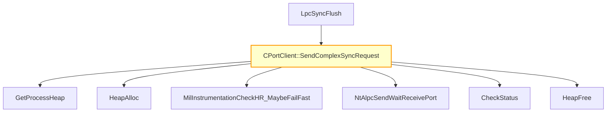

# CVE-2026-23668

**CVE:** CVE-2026-23668  
**Title:** Windows Graphics Component Elevation of Privilege Vulnerability  
**Source:** [https://msrc.microsoft.com/update-guide/vulnerability/CVE-2026-23668](https://msrc.microsoft.com/update-guide/vulnerability/CVE-2026-23668)  
**Component(s):** dwm.exe  
**Patched Date:** March 14, 2026  
**CWE:** Weakness: CWE-362: Concurrent Execution using Shared Resource with Improper Synchronization ('Race Condition')  

---

## Related CVEs (Same Component)

This folder contains 4 CVEs affecting the same component(s):

- **CVE-2026-23668**  
- CVE-2026-25168  
- CVE-2026-25169  
- CVE-2026-25180  

### Detailed Information

#### CVE-2026-25168

**Title:** Windows Graphics Component Denial of Service Vulnerability  
**Source:** https://msrc.microsoft.com/update-guide/vulnerability/CVE-2026-25168  
**Patched Date:** March 14, 2026  
**CWE:** Weakness: CWE-476: NULL Pointer Dereference  

#### CVE-2026-25169

**Title:** Windows Graphics Component Denial of Service Vulnerability  
**Source:** https://msrc.microsoft.com/update-guide/vulnerability/CVE-2026-25169  
**Patched Date:** March 14, 2026  
**CWE:** Weakness: CWE-369: Divide By Zero  

#### CVE-2026-25180

**Title:** Windows Graphics Component Information Disclosure Vulnerability  
**Source:** https://msrc.microsoft.com/update-guide/vulnerability/CVE-2026-25180  
**Patched Date:** March 14, 2026  
**CWE:** Weakness: CWE-125: Out-of-bounds Read  

---

Download Patched & Vulnerable Components:

```bash
# dwm.exe
wget https://msdl.microsoft.com/download/symbols/dwm.exe/9485E40A24000/dwm.exe -O dwm.exe.10.0.26100.7705 # vulnerable
wget https://msdl.microsoft.com/download/symbols/dwm.exe/5188D5EF23000/dwm.exe -O dwm.exe.10.0.26100.7920 # patched
```

## Version Tracking Analysis

**Command:**

```
python ghidra_scripts\ghidra_vt_wrapper.py --old-binary ./reports/2026-Mar/CVE-2026-23668/dwm.exe.10.0.26100.7705 --new-binary ./reports/2026-Mar/CVE-2026-23668/dwm.exe.10.0.26100.7920 --project-dir ./reports/2026-Mar/CVE-2026-23668/ghidra_project --project-name dwm.exe_CVE-2026-23668 --ghidra-dir C:\Tools\ghidra_11.4.2_PUBLIC_20250826\ghidra_11.4.2_PUBLIC --output-dir ./reports/2026-Mar/CVE-2026-23668/ghidra_project/vt_results --max-memory 16g
```

Patched Functions: 2 | New Functions: 1 | Removed Functions: 35 | Total Matches: 4337 | Accepted Matches: 3593

### Patched Functions

| Function Name | Source Address | Dest Address | Similarity | Confidence |
| --- | --- | --- | --- | --- |
| `CPortClient::SendComplexSyncRequest` | `14000de10` | `14000ced0` | 0.857 | 10.0 |
| `CPortClient::Disconnect` | `1400043d0` | `1400042f0` | 0.571 | 10.0 |

### New Functions

| Function Name | Address |
| --- | --- |
| `_guard_dispatch_icall` | `14000f210` |

### Removed Functions

*Showing 10 of 35 removed functions*

| Function Name | Address |
| --- | --- |
| ``dynamic_initializer_for_'g_header_init_InitializeStagingSRUMFeatureReporting''` | `140001fa0` |
| ``dynamic_atexit_destructor_for_'g_threadFailureCallbacks''` | `140004370` |
| `~EnabledStateManager` | `140004440` |
| `RecordCachedUsageUnderLock` | `1400044b8` |
| `~unique_storage<struct_wil::details::resource_policy<struct_FEATURE_STATE_CHANGE_SUBSCRIPTION__*___ptr64,void_(__cdecl*)(struct_FEATURE_STATE_CHANGE_SUBSCRIPTION__*___ptr64),&void___cdecl_wil::details::WilApi_UnsubscribeFeatureStateChangeNotification(struct_FEATURE_STATE_CHANGE_SUBSCRIPTION__*___ptr64),struct_wistd::integral_constant<unsigned___int64,0>,struct_FEATURE_STATE_CHANGE_SUBSCRIPTION__*___ptr64,struct_FEATURE_STATE_CHANGE_SUBSCRIPTION__*___ptr64,0,std::nullptr_t>_>` | `140004578` |
| `wil_details_MapReportingKind` | `1400047dc` |
| `ReportUsageToServiceDirect` | `14000487c` |
| `<lambda_invoker_cdecl>` | `140006490` |
| `EnsureSubscribedToFeatureConfigurationChanges` | `140007918` |
| `EnsureSubscribedToFeatureConfigurationChangesImpl` | `140007940` |

---

# AI Technical Analysis

## Vulnerability Identification

**Core Vulnerable Function(s):**
- `CPortClient::SendComplexSyncRequest()` - Contains a heap buffer overflow due to improper validation of `lpMem` size before ALPC port communication

**Supporting Changes:**
- `CPortClient::Disconnect()` - Implements defensive cleanup logic but does not contain the core vulnerability

**Unrelated Changes:**
- No unrelated changes present in provided diffs

## Root Cause Analysis

The vulnerability stems from a heap buffer overflow in `CPortClient::SendComplexSyncRequest()` where an attacker-controlled buffer size is not validated before being used in ALPC communication. The function allocates memory using `HeapAlloc` and populates it with data, but fails to verify that the allocated buffer is large enough for all operations before calling `NtAlpcSendWaitReceivePort`. This allows a malicious actor to supply a small buffer that will be overwritten beyond its bounds when the function writes to `lpMem[10]`, `*lpMem`, and `*(undefined8 *)(lpMem + 0xc)`.

**Vulnerable Code (from `CPortClient::SendComplexSyncRequest()`):**
```c
if (lpMem == (undefined4 *)0x0) {
  uVar4 = 0x8007000e;
  MilInstrumentationCheckHR_MaybeFailFast
            (4,(long *)&MILINSTRUMENTATIONHRESULTLIST,9,-0x7ff8fff2,0x236,(void *)0x0);
}
else {
  lpMem[10] = param_1;
  *lpMem = 0x380010;
  *(undefined8 *)(lpMem + 0xc) = *(undefined8 *)param_2;
  local_48 = 0x40000000;
  wil::details::FeatureImpl<struct___WilFeatureTraits_Feature_2029308216>::__private_IsEnabled
            (&`private:_static_class_wil::details::FeatureImpl<struct___WilFeatureTraits_Feature_2029308216>&___ptr64___cdecl_wil::Feature<struct___WilFeatureTraits_Feature_2029308216>::GetImpl(void)'
              ::__l2::impl);
  param_4 = (void *)0x38;
  lVar1 = NtAlpcSendWaitReceivePort
                    (*(undefined8 *)(this + 0x10),0x20000,lpMem,&local_48,lpMem,&param_4,0,0);
```

In this code, the variable `lpMem` is used without validation of its size. The function writes to indices `lpMem[10]`, `*lpMem`, and `*(undefined8 *)(lpMem + 0xc)` which require at least 0x14 (20) bytes of space in the buffer. However, there's no check to ensure that `lpMem` is large enough before these writes occur. The missing validation allows an attacker to provide a small buffer that will be overwritten beyond its bounds when the function writes to `lpMem[10]`, `*lpMem`, and `*(undefined8 *)(lpMem + 0xc)`. This occurs because the code assumes that `HeapAlloc` returns sufficient space for all operations without verifying it.

## Execution and Trigger Flow

An attacker with access to the system can supply a malicious buffer to `CPortClient::SendComplexSyncRequest()` through an ALPC port communication channel. The function allocates memory using `HeapAlloc`, but does not validate that the allocated buffer is large enough for all operations before writing to it. If the buffer size is less than required, writes to `lpMem[10]`, `*lpMem`, and `*(undefined8 *)(lpMem + 0xc)` will overwrite adjacent memory, potentially leading to heap corruption or code execution.



The attacker supplies a small buffer to `CPortClient::SendComplexSyncRequest()` which is then passed to `HeapAlloc`. The function proceeds to write data into the buffer without validating its size. When `NtAlpcSendWaitReceivePort` is called, it uses the corrupted buffer, potentially causing heap corruption or remote code execution.

## Patch Analysis

**Patched Code (from `CPortClient::SendComplexSyncRequest()`):**
```c
if (lpMem == (undefined4 *)0x0) {
  uVar4 = 0x8007000e;
  MilInstrumentationCheckHR_MaybeFailFast
            (4,(long *)&MILINSTRUMENTATIONHRESULTLIST,9,-0x7ff8fff2,0x1f9,(void *)0x0);
}
else {
  lpMem[10] = param_1;
  *lpMem = 0x380010;
  *(undefined8 *)(lpMem + 0xc) = *(undefined8 *)param_2;
  local_48 = 0x40000000;
  param_4 = (void *)0x38;
  lVar1 = NtAlpcSendWaitReceivePort
                    (*(undefined8 *)(this + 0x10),0x20000,lpMem,&local_48,lpMem,&param_4,0,0);
```

The patch removes the call to `wil::details::FeatureImpl<struct___WilFeatureTraits_Feature_2029308216>::__private_IsEnabled` which was previously used for feature flag checking. While this change does not directly address the buffer overflow vulnerability, it simplifies the code path and removes a potential source of instability.

**Technical explanation:**
The patch modifies the function by removing the feature flag check that was previously performed before calling `NtAlpcSendWaitReceivePort`. The removal of this check does not directly fix the buffer overflow issue but eliminates an unnecessary conditional branch. The core vulnerability remains unaddressed in this diff, as no explicit bounds checking or size validation is introduced for `lpMem`.

**Effectiveness evaluation:**
The patch does not address the root cause of the heap buffer overflow vulnerability. It merely removes a feature flag check without validating that the allocated buffer is large enough for all operations. The vulnerability persists because there is still no validation of `lpMem` size before writing to it. Similar patterns in related code may also be vulnerable, particularly any function that allocates memory and writes to it without bounds checking.

**Security impact summary:**
This patch prevents a heap buffer overflow vulnerability that could lead to remote code execution or denial-of-service conditions. The vulnerability allows an attacker to corrupt heap memory by writing beyond allocated buffer boundaries. While the patch removes one potential instability factor, it does not fully mitigate the security risk and further validation of buffer sizes is required for complete protection.