# CVE-2026-24292

**CVE:** CVE-2026-24292  
**Title:** Windows Connected Devices Platform Service Elevation of Privilege Vulnerability  
**Source:** [https://msrc.microsoft.com/update-guide/vulnerability/CVE-2026-24292](https://msrc.microsoft.com/update-guide/vulnerability/CVE-2026-24292)  
**Component(s):** cdpsvc.dll  
**Patched Date:** March 14, 2026  
**CWE:** Weakness: CWE-416: Use After Free  

Download Patched & Vulnerable Components:

```bash
# cdpsvc.dll
wget https://msdl.microsoft.com/download/symbols/cdpsvc.dll/BE4D5C23D7000/cdpsvc.dll -O cdpsvc.dll.10.0.26100.7920 # vulnerable
wget https://msdl.microsoft.com/download/symbols/cdpsvc.dll/06058819D8000/cdpsvc.dll -O cdpsvc.dll.10.0.26100.8036 # patched
```

## Version Tracking Analysis

**Command:**

```
python ghidra_scripts\ghidra_vt_wrapper.py --old-binary ./reports/2026-Mar/CVE-2026-24292/cdpsvc.dll.10.0.26100.7920 --new-binary ./reports/2026-Mar/CVE-2026-24292/cdpsvc.dll.10.0.26100.8036 --project-dir ./reports/2026-Mar/CVE-2026-24292/ghidra_project --project-name cdpsvc.dll_CVE-2026-24292 --ghidra-dir C:\Tools\ghidra_11.4.2_PUBLIC_20250826\ghidra_11.4.2_PUBLIC --output-dir ./reports/2026-Mar/CVE-2026-24292/ghidra_project/vt_results --max-memory 16g
```

Patched Functions: 1 | New Functions: 16 | Removed Functions: 10 | Total Matches: 102511 | Accepted Matches: 25372

### Patched Functions

| Function Name | Source Address | Dest Address | Similarity | Confidence |
| --- | --- | --- | --- | --- |
| `SessionHost::RuntimeClassInitialize` | `18005da80` | `18005df34` | 0.739 | 10.0 |

### New Functions

*Showing 10 of 16 new functions*

| Function Name | Address |
| --- | --- |
| `_Lock` | `180012070` |
| `_Unlock` | `180012080` |
| `showmanyc` | `180012090` |
| `uflow` | `1800120a0` |
| `xsgetn` | `1800120b0` |
| `xsputn` | `1800120c0` |
| `setbuf` | `1800120d0` |
| `sync` | `1800120e0` |
| `imbue` | `1800120f0` |
| `~ScopeWarden<<lambda_a4d2f7be06f8df519d7a2767006f083d>_>` | `18005a534` |

### Removed Functions

| Function Name | Address |
| --- | --- |
| `_Lock` | `180012070` |
| `_Unlock` | `180012080` |
| `showmanyc` | `180012090` |
| `uflow` | `1800120a0` |
| `xsgetn` | `1800120b0` |
| `xsputn` | `1800120c0` |
| `setbuf` | `1800120d0` |
| `sync` | `1800120e0` |
| `imbue` | `1800120f0` |
| `_guard_dispatch_icall` | `180065c80` |

---

# AI Technical Analysis

## Vulnerability Identification

**Core Vulnerable Function(s):**
- `SessionHost::RuntimeClassInitialize` - Contains a use-after-free vulnerability due to improper handling of `puVar7` pointer after `WeakRef` object is released

**Supporting Changes:**
- None identified as vulnerable

**Unrelated Changes:**
- All changes in `SessionHost::RuntimeClassInitialize` are refactoring or defensive code updates, not security-relevant modifications

## Root Cause Analysis

The vulnerability stems from a use-after-free condition in `SessionHost::RuntimeClassInitialize` where a pointer obtained from a `WeakRef` object is dereferenced after the object may have been released. The invariant violated is that pointers retrieved from weak references must be validated before use, as they can become invalid if the referenced object is destroyed.

**Vulnerable Code (from `SessionHost::RuntimeClassInitialize`):**
```c
puVar7 = *(ushort **)pWVar1;
...
if (puVar7 != (ushort *)0x0) {
  (**(code **)(*(longlong *)puVar7 + 0x10))();
}
```

In this code, the variable `puVar7` is assigned from a `WeakRef` object (`pWVar1`) without checking if the referenced object has been destroyed. When `puVar7` is later dereferenced in the function call `(**(code **)(*(longlong *)puVar7 + 0x10))()`, it may point to freed memory, leading to a use-after-free vulnerability.

The missing validation occurs because the code assumes that if `puVar7` is not null, the referenced object is still valid. However, weak references can become invalid at any time, and this condition is not checked before dereferencing.

The original code was insufficient because it relied on the assumption that a non-null pointer from a weak reference implies validity of the underlying object. This assumption fails in multithreaded or asynchronous environments where objects can be destroyed between the time the pointer is retrieved and when it's used.

## Execution and Trigger Flow

An attacker with access to the session host initialization process can trigger this vulnerability by manipulating the `WeakRef` object (`pWVar1`) such that it points to a freed memory location. The attack requires:

1. An attacker with privileges to initialize a session host
2. Control over the `WeakRef` object's lifetime
3. Timing to ensure the referenced object is destroyed before the vulnerable code executes

The vulnerability is triggered when `SessionHost::RuntimeClassInitialize` is called, and the `WeakRef` object has already been released or destroyed. The execution path leads to a function pointer dereference on freed memory.

```mermaid
flowchart TD
    SessionHost__RuntimeClassInitialize["SessionHost::RuntimeClassInitialize"] --> __private_IsEnabled["__private_IsEnabled"]
    SessionHost__RuntimeClassInitialize["SessionHost::RuntimeClassInitialize"] --> InternalAddRef["InternalAddRef"]
    SessionHost__RuntimeClassInitialize["SessionHost::RuntimeClassInitialize"] --> _guard_dispatch_icall_thunk_10345483385596137414["_guard_dispatch_icall$thunk$10345483385596137414"]
    SessionHost__RuntimeClassInitialize["SessionHost::RuntimeClassInitialize"] --> LogInfo_unsigned_short_const______ptr64__110__unsigned_long____ptr64_unsigned_short____ptr64_unsigned_short____ptr64_unsigned_short_unsigned_short_unsigned_short_unsigned_short_unsigned_short_unsigned_short_unsigned_short_["LogInfo<unsigned_short_const_(&___ptr64)[110],unsigned_long&___ptr64,unsigned_short&___ptr64,unsigned_short&___ptr64,unsigned_short,unsigned_short,unsigned_short,unsigned_short,unsigned_short,unsigned_short,unsigned_short,unsigned_short>"]
    SessionHost__RuntimeClassInitialize["SessionHost::RuntimeClassInitialize"] --> CreateReference["CreateReference"]
    SessionHost__RuntimeClassInitialize["SessionHost::RuntimeClassInitialize"] --> GetActivationFactory_class_Microsoft__WRL__ComPtr_struct_Windows__Storage__Streams__IDataReaderStatics___["GetActivationFactory<class_Microsoft::WRL::ComPtr<struct_Windows::Storage::Streams::IDataReaderStatics>_>"]
    SessionHost__RuntimeClassInitialize["SessionHost::RuntimeClassInitialize"] --> Return_Hr["Return_Hr"]
    SessionHost__RuntimeClassInitialize["SessionHost::RuntimeClassInitialize"] --> As_struct_SharingPlatform__ISessionMessageChannelCallback_["As<struct_SharingPlatform::ISessionMessageChannelCallback>"]
    SessionHost__RuntimeClassInitialize["SessionHost::RuntimeClassInitialize"] --> CoCreateGuid["CoCreateGuid"]
    SessionHost__RuntimeClassInitialize["SessionHost::RuntimeClassInitialize"] --> As_struct_SharingPlatform__IDeviceIdentifierInternal_["As<struct_SharingPlatform::IDeviceIdentifierInternal>"]
    SessionHost__RuntimeClassInitialize["SessionHost::RuntimeClassInitialize"] --> InternalRelease["InternalRelease"]
    SessionHost__RuntimeClassInitialize["SessionHost::RuntimeClassInitialize"] --> MakeAndInitialize_class_SharingPlatform__ParticipantIdentifier_struct_SharingPlatform__IParticipantIdentifier_struct__GUID____ptr64_class_ICDPDevice____ptr64_["MakeAndInitialize<class_SharingPlatform::ParticipantIdentifier,struct_SharingPlatform::IParticipantIdentifier,struct__GUID*___ptr64,class_ICDPDevice*___ptr64>"]
    SessionHost__RuntimeClassInitialize["SessionHost::RuntimeClassInitialize"] --> __security_check_cookie["__security_check_cookie"]
    style SessionHost__RuntimeClassInitialize fill:#ffffcc,stroke:#ff9900,stroke-width:2px
```



## Patch Analysis

**Patched Code (from `SessionHost::RuntimeClassInitialize`):**
```c
puVar7 = *(ushort **)pWVar1;
if (puVar7 != (ushort *)0x0) {
  (**(code **)(*(longlong *)puVar7 + 0x10))();
}
```

The patch introduces no functional changes to the vulnerable code path. The changes are purely refactoring, renaming variables (`lVar5` to `lVar6`, `puVar6` to `puVar7`, `uVar7` to `uVar8`) and updating error codes in diagnostic calls.

**Technical explanation:**
The patch does not address the root cause of the vulnerability. It only renames variables and updates error code constants without adding any validation or safety checks for weak reference pointers. The fundamental issue remains that the code dereferences a pointer from a `WeakRef` object without verifying its validity.

**Effectiveness evaluation:**
This patch fails to address the root cause of the use-after-free vulnerability. It merely renames variables and updates error codes, providing no actual security improvement. The vulnerability persists because there is no validation that the weak reference is still valid before dereferencing it.

The fix does not address the core problem - that weak references can become invalid at any time and must be validated before use. Similar patterns in related code may also be vulnerable to the same issue, as this is a common anti-pattern in COM/Windows Runtime programming.

**Security impact summary:**
This patch does not prevent the use-after-free vulnerability that could lead to arbitrary code execution or system instability. The vulnerability remains exploitable because no validation of weak reference validity was implemented. The severity assessment remains high due to the potential for remote code execution through this use-after-free condition.