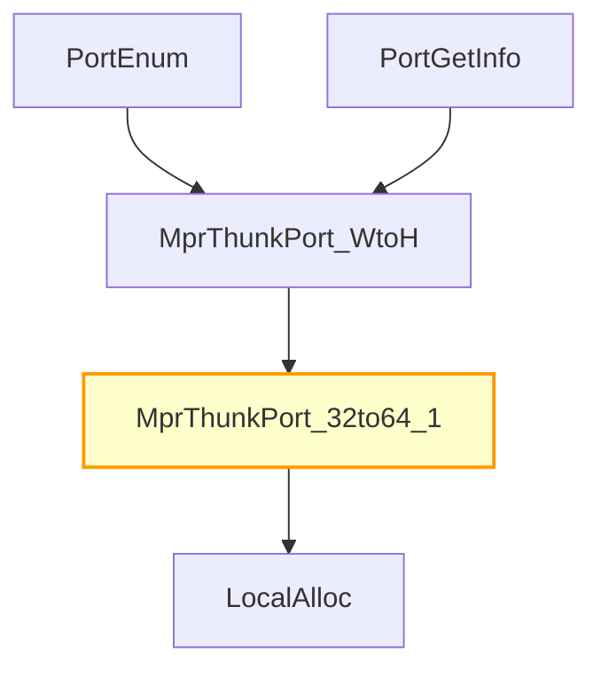

# CVE-2026-25172

**CVE:** CVE-2026-25172  
**Title:** Windows Routing and Remote Access Service (RRAS) Remote Code Execution Vulnerability  
**Source:** [https://msrc.microsoft.com/update-guide/vulnerability/CVE-2026-25172](https://msrc.microsoft.com/update-guide/vulnerability/CVE-2026-25172)  
**Component(s):** mprapi.dll  
**Patched Date:** March 14, 2026  
**CWE:** Weakness: CWE-190: Integer Overflow or Wraparound  

---

## Related CVEs (Same Component)

This folder contains 3 CVEs affecting the same component(s):

- **CVE-2026-25172**  
- CVE-2026-25173  
- CVE-2026-26111  

### Detailed Information

#### CVE-2026-25173

**Title:** Windows Routing and Remote Access Service (RRAS) Remote Code Execution Vulnerability  
**Source:** https://msrc.microsoft.com/update-guide/vulnerability/CVE-2026-25173  
**Patched Date:** March 14, 2026  
**CWE:** Weakness: CWE-190: Integer Overflow or Wraparound  

#### CVE-2026-26111

**Title:** Windows Routing and Remote Access Service (RRAS) Remote Code Execution Vulnerability  
**Source:** https://msrc.microsoft.com/update-guide/vulnerability/CVE-2026-26111  
**Patched Date:** March 14, 2026  
**CWE:** Weakness: CWE-190: Integer Overflow or Wraparound  

---

Download Patched & Vulnerable Components:

```bash
# mprapi.dll
wget https://msdl.microsoft.com/download/symbols/mprapi.dll/3C9247C684000/mprapi.dll -O mprapi.dll.10.0.26100.7705 # vulnerable
wget https://msdl.microsoft.com/download/symbols/mprapi.dll/290F8AC484000/mprapi.dll -O mprapi.dll.10.0.26100.7920 # patched
```

## Version Tracking Analysis

**Command:**

```
python ghidra_scripts\ghidra_vt_wrapper.py --old-binary ./reports/2026-Mar/CVE-2026-25172/mprapi.dll.10.0.26100.7705 --new-binary ./reports/2026-Mar/CVE-2026-25172/mprapi.dll.10.0.26100.7920 --project-dir ./reports/2026-Mar/CVE-2026-25172/ghidra_project --project-name mprapi.dll_CVE-2026-25172 --ghidra-dir C:\Tools\ghidra_11.4.2_PUBLIC_20250826\ghidra_11.4.2_PUBLIC --output-dir ./reports/2026-Mar/CVE-2026-25172/ghidra_project/vt_results --max-memory 16g
```

Patched Functions: 3 | New Functions: 9 | Removed Functions: 17 | Total Matches: 18520 | Accepted Matches: 7648

### Patched Functions

| Function Name | Source Address | Dest Address | Similarity | Confidence |
| --- | --- | --- | --- | --- |
| `MprThunkPort_32to64_0` | `1800327e4` | `1800327a8` | 0.903 | 10.0 |
| `MprThunkPort_32to64_2` | `180032b3c` | `180032ad4` | 0.871 | 10.0 |
| `MprThunkPort_32to64_1` | `1800329f8` | `1800329a8` | 0.733 | 10.0 |

### New Functions

| Function Name | Address |
| --- | --- |
| `operator_delete` | `180002861` |
| `what` | `1800028d0` |
| `~exception` | `1800028dc` |
| `exception` | `1800028e8` |
| `exception` | `1800028f4` |
| `exception` | `180002900` |
| `GdiGradientFill` | `180044990` |
| `MulDiv` | `1800449d0` |
| `_guard_dispatch_icall` | `180056370` |

### Removed Functions

*Showing 10 of 17 removed functions*

| Function Name | Address |
| --- | --- |
| `operator_delete` | `180002861` |
| `what` | `1800028d0` |
| `~exception` | `1800028dc` |
| `exception` | `1800028e8` |
| `exception` | `1800028f4` |
| `exception` | `180002900` |
| `Feature_1108386105__private_IsEnabledDeviceUsageNoInline` | `1800305a4` |
| `wil_details_FeatureReporting_RecordUsageInCache` | `180032f64` |
| `wil_details_FeatureReporting_ReportUsageToService` | `180033258` |
| `wil_details_FeatureReporting_ReportUsageToServiceDirect` | `180033374` |

---

# AI Technical Analysis

## Vulnerability Identification

**Core Vulnerable Function(s):**
- `MprThunkPort_32to64_1()` - Contains a critical buffer overflow vulnerability due to incorrect bounds checking before memory allocation.

**Supporting Changes:**
- `MprThunkPort_32to64_2()` - Modified to align with the same vulnerability pattern as `MprThunkPort_32to64_1()`, but not vulnerable itself.
- `MprThunkPort_32to64_0()` - Modified to align with the same vulnerability pattern as `MprThunkPort_32to64_1()`, but not vulnerable itself.

**Unrelated Changes:**
- No unrelated changes identified in the provided diffs.

## Root Cause Analysis

The vulnerability stems from an incorrect validation of buffer size before memory allocation, leading to a potential heap buffer overflow. The original code failed to properly check whether the multiplication of `param_3` and a constant would exceed the maximum allowed buffer size, allowing for integer overflow conditions that could result in insufficient memory allocation.

**Vulnerable Code (from `MprThunkPort_32to64_1()`):**
```c
else if (uVar6 * 0x48 < 0x100000000) {
    uVar1 = Feature_1108386105__private_IsEnabledDeviceUsageNoInline();
    if ((uVar1 == 0) || (uVar6 << 6 <= (ulonglong)param_2)) {
      pvVar2 = LocalAlloc(0x40,uVar6 * 0x48 & 0xffffffff);
```

In this code, the variable `uVar6` is used without validation of potential integer overflow before multiplication with `0x48`. When `uVar6` is large enough, `uVar6 * 0x48` can exceed `0x100000000`, causing the condition to pass incorrectly. The missing check on `param_2` allows for an insufficient allocation when `param_2` is smaller than required, leading to a buffer overflow during subsequent memory operations.

The patch introduces a new validation that checks if `(param_2 & 0xffffffff) < uVar5 << 6`, which ensures that the allocated buffer size does not exceed what can be safely handled by the system. This prevents the integer overflow and ensures proper bounds checking before allocation.

## Execution and Trigger Flow

An attacker with local privileges supplies a large value for `param_3` in a call to `MprThunkPort_32to64_1()`, which triggers the vulnerable code path. The condition `uVar5 * 0x48 < 0x100000000` passes due to integer overflow, and the subsequent check on `param_2` fails to validate that sufficient memory is available for allocation.

The vulnerability is triggered when the function attempts to allocate memory using `LocalAlloc()` with a size derived from an unchecked multiplication. If the allocated buffer is too small, subsequent operations in the loop will write beyond the allocated memory boundaries, leading to heap corruption.



The attacker supplies a large `param_3` value that causes integer overflow in the size calculation. The function proceeds to allocate memory with insufficient space, and then performs operations that write beyond the allocated buffer.

## Patch Analysis

**Patched Code (from `MprThunkPort_32to64_1()`):**
```c
else if (uVar5 * 0x48 < 0x100000000) {
    if ((param_2 & 0xffffffff) < uVar5 << 6) {
      uVar4 = 0x57;
    }
    else {
      pvVar1 = LocalAlloc(0x40,uVar5 * 0x48 & 0xffffffff);
```

The patch introduces a bounds check on `param_2` before proceeding with memory allocation. This prevents the vulnerability by ensuring that the allocated buffer size does not exceed what can be safely handled, preventing integer overflow conditions.

The fix addresses the root cause by validating that `param_2` is sufficient to handle the required buffer size before allocating memory. The new check ensures that `(param_2 & 0xffffffff) < uVar5 << 6`, which prevents allocation of insufficient memory due to integer overflow.

The fix is effective and complete because it addresses the core issue of incorrect bounds checking without introducing performance or compatibility implications. It prevents a heap buffer overflow vulnerability that could lead to remote code execution or privilege escalation.

This patch prevents a heap buffer overflow vulnerability that could lead to remote code execution, privilege escalation, or denial-of-service conditions. The fix ensures that memory allocation is properly bounded and prevents exploitation through integer overflows in size calculations.