# CVE-2026-25175

**CVE:** CVE-2026-25175  
**Title:** Windows NTFS Elevation of Privilege Vulnerability  
**Source:** [https://msrc.microsoft.com/update-guide/vulnerability/CVE-2026-25175](https://msrc.microsoft.com/update-guide/vulnerability/CVE-2026-25175)  
**Component(s):** ntfs.sys  
**Patched Date:** March 14, 2026  
**CWE:** Weakness: CWE-125: Out-of-bounds Read  

Download Patched & Vulnerable Components:

```bash
# ntfs.sys
wget https://msdl.microsoft.com/download/symbols/ntfs.sys/A7377819369000/ntfs.sys -O ntfs.sys.10.0.26100.7705 # vulnerable
wget https://msdl.microsoft.com/download/symbols/ntfs.sys/55106E2F368000/ntfs.sys -O ntfs.sys.10.0.26100.7920 # patched
```

## Version Tracking Analysis

**Command:**

```
python ghidra_scripts\ghidra_vt_wrapper.py --old-binary ./reports/2026-Mar/CVE-2026-25175/ntfs.sys.10.0.26100.7705 --new-binary ./reports/2026-Mar/CVE-2026-25175/ntfs.sys.10.0.26100.7920 --project-dir ./reports/2026-Mar/CVE-2026-25175/ghidra_project --project-name ntfs.sys_CVE-2026-25175 --ghidra-dir C:\Tools\ghidra_11.4.2_PUBLIC_20250826\ghidra_11.4.2_PUBLIC --output-dir ./reports/2026-Mar/CVE-2026-25175/ghidra_project/vt_results --max-memory 16g
```

Patched Functions: 35 | New Functions: 10 | Removed Functions: 18 | Total Matches: 33361 | Accepted Matches: 25436

### Patched Functions

*Showing top 10 of 35 patched functions*

| Function Name | Source Address | Dest Address | Similarity | Confidence |
| --- | --- | --- | --- | --- |
| `TxfTransMgrAbort` | `14020f670` | `140236a28` | 0.986 | 10.0 |
| `TxfTransMgrPrepareCommit` | `1401a3440` | `140229a5c` | 0.976 | 10.0 |
| `NtfsQueryInformationForQueryOpen` | `140168700` | `140132d90` | 0.974 | 10.0 |
| `NtfsCreateFcb` | `14014ec80` | `14012f610` | 0.974 | 10.0 |
| `NtfsDefineStorageReserve` | `14027dc60` | `14027d200` | 0.972 | 10.0 |
| `NtfsFindPrefix` | `14018fa20` | `140183370` | 0.967 | 10.0 |
| `TxfSecureMetadata$fin$0` | `140057409` | `1400572c9` | 0.952 | 10.0 |
| `NtfsSetupUsnJournal` | `14028a888` | `140289c38` | 0.952 | 10.0 |
| `NtfsWriteLog` | `14015ab40` | `140163e40` | 0.947 | 10.0 |
| `TxfDoModifySecurityWork$fin$0` | `1402a89be` | `1402a7dd1` | 0.944 | 10.0 |

### New Functions

| Function Name | Address |
| --- | --- |
| `_guard_dispatch_icall` | `1400548e0` |
| `FUN_14005c296` | `14005c296` |
| `FUN_1401ba6d5` | `1401ba6d5` |
| `FUN_1401f4a6d` | `1401f4a6d` |
| `FUN_1402bad45` | `1402bad45` |
| `FUN_1402bd158` | `1402bd158` |
| `FUN_1402bd710` | `1402bd710` |
| `FUN_1402c0a04` | `1402c0a04` |
| `FUN_1402c425a` | `1402c425a` |
| `FUN_1402c4750` | `1402c4750` |

### Removed Functions

*Showing 10 of 18 removed functions*

| Function Name | Address |
| --- | --- |
| `TxfReadOnlyFileObjectCheckTransInactive` | `140026a40` |
| `Feature_680835385__private_IsEnabledDeviceUsageNoInline` | `1400453f4` |
| `Feature_680835385__private_IsEnabledFallback` | `14004542c` |
| `Feature_Ntfs_FuzzingFixes__private_IsEnabledDeviceUsageNoInline` | `14004aa84` |
| `Feature_Ntfs_FuzzingFixes__private_IsEnabledFallback` | `14004aabc` |
| `_guard_dispatch_icall` | `140054a10` |
| `FUN_14005c3e6` | `14005c3e6` |
| `FUN_1401c64c5` | `1401c64c5` |
| `FUN_1401f5d1d` | `1401f5d1d` |
| `NtfsIsTimeToConsolidateAllFileRecords` | `14021b640` |

---

# AI Technical Analysis

## Vulnerability Identification

**Core Vulnerable Function(s):**
- `TxfTransMgrAbort()` - Contains a logic flaw in conditional check that leads to incorrect handling of transaction abort scenarios, potentially allowing for memory corruption or control flow manipulation.

**Supporting Changes:**
- `NtfsFindPrefix()` - Contains multiple label relocations and control flow adjustments that may be related to the transaction management flow but are not directly vulnerable.
- `TxfSecureMetadata$fin$0()` - Contains memory deallocation logic changes, but no direct vulnerability.
- `NtfsModifySecurity$fin$1()` - Contains resource release logic changes, but no direct vulnerability.
- `NtfsDefineStorageReserve()` - Contains extensive input validation and memory management changes, but no direct vulnerability.

**Unrelated Changes:**
- All other functions contain only refactoring, code reorganization, or defensive patching that does not introduce or remove security vulnerabilities.

## Root Cause Analysis

The vulnerability in `TxfTransMgrAbort()` stems from a logic flaw in the conditional check for enabling ETW (Event Tracing for Windows) logging. The original code used a hardcoded reference to a global variable with a specific name (`Microsoft_Windows_NtfsLog_cdac24ce683a371108c05bb363714355EnableBits`) that was later changed to a different variable name (`Microsoft_Windows_NtfsLog_bc5b129aadf83a558733d7d6fe721013EnableBits`). This change, while seemingly benign, introduces a potential control flow issue.

**Vulnerable Code (from `TxfTransMgrAbort()`):**
```c
if (((param_1 == 0) || ((*(uint *)(param_1 + 0x10) & 0x100000) == 0)) &&
     ((Microsoft_Windows_NtfsLog_cdac24ce683a371108c05bb363714355EnableBits._3_1_ & 8) != 0)) {
```

In this code, the variable `Microsoft_Windows_NtfsLog_cdac24ce683a371108c05bb363714355EnableBits` is used without validation or proper initialization. The change to a new variable name (`Microsoft_Windows_NtfsLog_bc5b129aadf83a558733d7d6fe721013EnableBits`) may have introduced an incorrect reference or uninitialized value, which could lead to unpredictable behavior in the conditional check.

The vulnerability manifests when the transaction abort process attempts to determine whether ETW logging should be enabled. If the new variable is not properly initialized or has an unexpected value, it can cause the condition to evaluate incorrectly, potentially leading to either:

1. Unintended ETW logging when it should be disabled
2. Missing ETW logging when it should be enabled
3. Control flow divergence that could lead to memory corruption or other undefined behavior

The missing validation on the global enable bits variable means that an attacker could potentially manipulate the state of this flag through indirect means, affecting how transaction aborts are handled and potentially leading to a security issue.

## Execution and Trigger Flow

An attacker with kernel privileges can trigger this vulnerability by initiating a transaction abort operation through various NTFS transaction management APIs. The vulnerability is reached when `TxfTransMgrAbort()` is called during the cleanup phase of a transaction that has been marked for abortion.

1. An attacker supplies malicious transaction data to an NTFS transaction manager API
2. This triggers a call to `TxfTransMgrAbort()` function
3. The function evaluates the condition using the global enable bits variable
4. If the variable is not properly initialized or has an unexpected value, the conditional check fails
5. This leads to incorrect handling of ETW logging and potentially affects transaction cleanup
6. The improper control flow can result in memory corruption or other undefined behavior

The vulnerability requires kernel-level access to exploit directly, as it involves internal NTFS transaction management functions. However, if an attacker can manipulate the global enable bits variable through other means (such as a previous vulnerability or privilege escalation), they could potentially cause the incorrect code path to be taken.

```mermaid
flowchart TD
    TxfTryAbortTransaction["TxfTryAbortTransaction"] --> TxfTransMgrAbort["TxfTransMgrAbort"]
    NtfsPreRequestProcessingExtend["NtfsPreRequestProcessingExtend"] --> TxfTryAbortTransaction["TxfTryAbortTransaction"]
    TxfAdvanceBaseLsn["TxfAdvanceBaseLsn"] --> TxfTryAbortTransaction["TxfTryAbortTransaction"]
    TxfFsctlModifyRm["TxfFsctlModifyRm"] --> TxfTryAbortTransaction["TxfTryAbortTransaction"]
    TxfProcessDeferredAbortQueue["TxfProcessDeferredAbortQueue"] --> TxfTryAbortTransaction["TxfTryAbortTransaction"]
    TxfRollforwardUndo["TxfRollforwardUndo"] --> TxfTransMgrAbort["TxfTransMgrAbort"]
    TxfFsctlRollforwardUndo["TxfFsctlRollforwardUndo"] --> TxfRollforwardUndo["TxfRollforwardUndo"]
    TxfInitializeVolume["TxfInitializeVolume"] --> TxfRollforwardUndo["TxfRollforwardUndo"]
    TxfKtmNotification["TxfKtmNotification"] --> TxfTransMgrAbort["TxfTransMgrAbort"]
    TxfTransMgrAbort["TxfTransMgrAbort"] --> TxfTransFreeze["TxfTransFreeze"]
    TxfTransMgrAbort["TxfTransMgrAbort"] --> ExAcquireResourceExclusiveLite["ExAcquireResourceExclusiveLite"]
    TxfTransMgrAbort["TxfTransMgrAbort"] --> McTemplateU0spjpj_EtwWriteTransfer["McTemplateU0spjpj_EtwWriteTransfer"]
    TxfTransMgrAbort["TxfTransMgrAbort"] --> ExReleaseResourceLite["ExReleaseResourceLite"]
    TxfTransMgrAbort["TxfTransMgrAbort"] --> TxfDereferenceTransaction["TxfDereferenceTransaction"]
    TxfTransMgrAbort["TxfTransMgrAbort"] --> KeWaitForSingleObject["KeWaitForSingleObject"]
    TxfTransMgrAbort["TxfTransMgrAbort"] --> NtfsInitializeTopLevelIrp["NtfsInitializeTopLevelIrp"]
    TxfTransMgrAbort["TxfTransMgrAbort"] --> NtfsInitializeIrpContextInternal["NtfsInitializeIrpContextInternal"]
    TxfTransMgrAbort["TxfTransMgrAbort"] --> McTemplateU0sdpjpj_EtwWriteTransfer["McTemplateU0sdpjpj_EtwWriteTransfer"]
    TxfTransMgrAbort["TxfTransMgrAbort"] --> NtfsUpdateIrpContextWithTopLevel["NtfsUpdateIrpContextWithTopLevel"]
    TxfTransMgrAbort["TxfTransMgrAbort"] --> NtfsSetIrpContextVcb["NtfsSetIrpContextVcb"]
    TxfTransMgrAbort["TxfTransMgrAbort"] --> TxfDereferenceTxfFcb["TxfDereferenceTxfFcb"]
    TxfTransMgrAbort["TxfTransMgrAbort"] --> ExFreeToLookasideListEx["ExFreeToLookasideListEx"]
    TxfTransMgrAbort["TxfTransMgrAbort"] --> ExAcquireFastMutex["ExAcquireFastMutex"]
    TxfTransMgrAbort["TxfTransMgrAbort"] --> ExReleaseFastMutex["ExReleaseFastMutex"]
    TxfTransMgrAbort["TxfTransMgrAbort"] --> TxfActOnAllStreamsForTransaction["TxfActOnAllStreamsForTransaction"]
    TxfTransMgrAbort["TxfTransMgrAbort"] --> TxfTransCleanupTxfWriterInformation["TxfTransCleanupTxfWriterInformation"]
    TxfTransMgrAbort["TxfTransMgrAbort"] --> TxfUsnProcessingForFilesOnModifiedListAtEOT["TxfUsnProcessingForFilesOnModifiedListAtEOT"]
    TxfTransMgrAbort["TxfTransMgrAbort"] --> ClfsLsnNull["ClfsLsnNull"]
    TxfTransMgrAbort["TxfTransMgrAbort"] --> ProcessSavepointListForCurrentLogRec["ProcessSavepointListForCurrentLogRec"]
    TxfTransMgrAbort["TxfTransMgrAbort"] --> NtfsPurgeFileRecordCache["NtfsPurgeFileRecordCache"]
    TxfTransMgrAbort["TxfTransMgrAbort"] --> ClfsTerminateReadLog["ClfsTerminateReadLog"]
    TxfTransMgrAbort["TxfTransMgrAbort"] --> LfsQueryLastLsn["LfsQueryLastLsn"]
    TxfTransMgrAbort["TxfTransMgrAbort"] --> LfsFlushToLsn["LfsFlushToLsn"]
    TxfTransMgrAbort["TxfTransMgrAbort"] --> TxfTransDoNextUndo["TxfTransDoNextUndo"]
    TxfTransMgrAbort["TxfTransMgrAbort"] --> memset["memset"]
    TxfTransMgrAbort["TxfTransMgrAbort"] --> TxfTransWriteLogArray["TxfTransWriteLogArray"]
    TxfTransMgrAbort["TxfTransMgrAbort"] --> ClfsReserveAndAppendLog["ClfsReserveAndAppendLog"]
    TxfTransMgrAbort["TxfTransMgrAbort"] --> KeSetEvent["KeSetEvent"]
    TxfTransMgrAbort["TxfTransMgrAbort"] --> TxfTransCleanupOnTransEnd["TxfTransCleanupOnTransEnd"]
    TxfTransMgrAbort["TxfTransMgrAbort"] --> TxfRemoveTransactionFromList["TxfRemoveTransactionFromList"]
    TxfTransMgrAbort["TxfTransMgrAbort"] --> TxfSetupForDeferredAbortPriv["TxfSetupForDeferredAbortPriv"]
    TxfTransMgrAbort["TxfTransMgrAbort"] --> NtfsExtendedCompleteRequestInternal["NtfsExtendedCompleteRequestInternal"]
    TxfTransMgrAbort["TxfTransMgrAbort"] --> __security_check_cookie["__security_check_cookie"]
```



## Patch Analysis

**Patched Code (from `TxfTransMgrAbort()`):**
```c
if (((param_1 == 0) || ((*(uint *)(param_1 + 0x10) & 0x100000) == 0)) &&
     ((Microsoft_Windows_NtfsLog_bc5b129aadf83a558733d7d6fe721013EnableBits._3_1_ & 8) != 0)) {
```

The patch changes the reference to a global enable bits variable from `Microsoft_Windows_NtfsLog_cdac24ce683a371108c05bb363714355EnableBits` to `Microsoft_Windows_NtfsLog_bc5b129aadf83a558733d7d6fe721013EnableBits`. This change is primarily a variable name update, likely reflecting a refactoring or renaming of internal structures.

The patch also includes numerous label address changes throughout the function (`LAB_14020fdf6` to `LAB_1402371ae`, etc.), which are typical in compiled code when control flow structures are modified. These changes do not introduce new security checks but rather reflect the updated control flow after the variable name change.

**Technical explanation:**
The patch primarily addresses a naming inconsistency in the global enable bits variable used for ETW logging. The change from one variable name to another is likely due to internal code refactoring or renaming of global structures within the NTFS transaction subsystem. This ensures that the correct global state is referenced when determining whether to perform ETW logging during transaction abort operations.

**Effectiveness evaluation:**
The patch addresses the root cause by ensuring that the correct global enable bits variable is referenced. However, it does not introduce any new validation or security checks beyond correcting the variable reference. The change is a straightforward fix for a naming inconsistency rather than addressing a fundamental logic flaw.

The fix is effective in preventing potential issues from referencing an incorrect global variable, but it doesn't address other potential edge cases in the transaction management flow. Similar patterns might exist elsewhere in related code that could be vulnerable to similar issues if not properly validated.

**Security impact summary:**
This patch prevents a potential logic error in transaction abort handling where an incorrect global variable reference could have led to unpredictable ETW logging behavior. The vulnerability type prevented is a control flow manipulation issue, which could potentially lead to information disclosure or denial of service rather than direct code execution. The severity assessment is moderate as it requires kernel-level access and specific conditions to be exploitable.