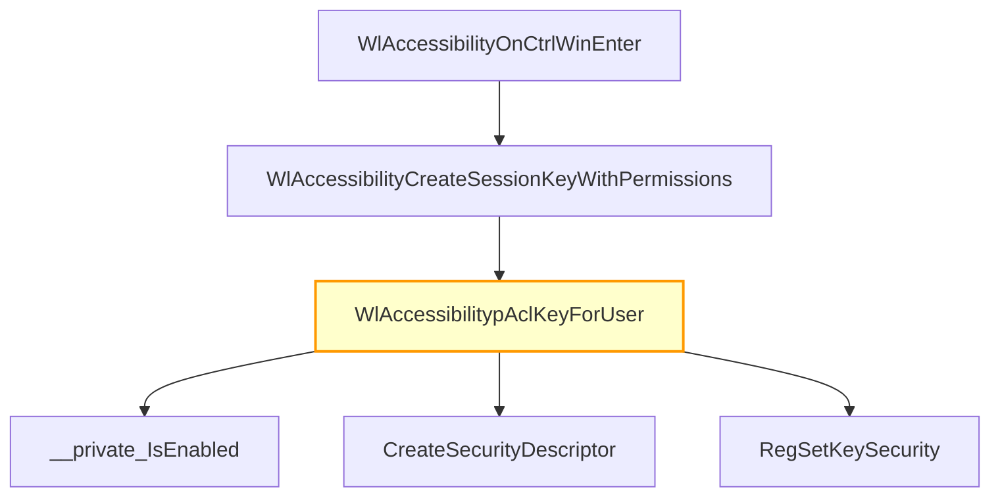

# CVE-2026-25187

**CVE:** CVE-2026-25187  
**Title:** Winlogon Elevation of Privilege Vulnerability  
**Source:** [https://msrc.microsoft.com/update-guide/vulnerability/CVE-2026-25187](https://msrc.microsoft.com/update-guide/vulnerability/CVE-2026-25187)  
**Component(s):** winlogon.exe  
**Patched Date:** March 14, 2026  
**CWE:** Weakness: CWE-59: Improper Link Resolution Before File Access ('Link Following')  

Download Patched & Vulnerable Components:

```bash
# winlogon.exe
wget https://msdl.microsoft.com/download/symbols/winlogon.exe/07207838EA000/winlogon.exe -O winlogon.exe.10.0.26100.7920 # vulnerable
wget https://msdl.microsoft.com/download/symbols/winlogon.exe/9C248474EA000/winlogon.exe -O winlogon.exe.10.0.26100.8036 # patched
```

## Version Tracking Analysis

**Command:**

```
python ghidra_scripts\ghidra_vt_wrapper.py --old-binary ./reports/2026-Mar/CVE-2026-25187/winlogon.exe.10.0.26100.7920 --new-binary ./reports/2026-Mar/CVE-2026-25187/winlogon.exe.10.0.26100.8036 --project-dir ./reports/2026-Mar/CVE-2026-25187/ghidra_project --project-name winlogon.exe_CVE-2026-25187 --ghidra-dir C:\Tools\ghidra_11.4.2_PUBLIC_20250826\ghidra_11.4.2_PUBLIC --output-dir ./reports/2026-Mar/CVE-2026-25187/ghidra_project/vt_results --max-memory 16g
```

Patched Functions: 2 | New Functions: 6 | Removed Functions: 2 | Total Matches: 54772 | Accepted Matches: 17439

### Patched Functions

| Function Name | Source Address | Dest Address | Similarity | Confidence |
| --- | --- | --- | --- | --- |
| `WlAccessibilitypAclKeyForUser` | `140030a5c` | `1400477c0` | 0.765 | 10.0 |
| `WlAccessibilitypAclKeyForUser` | `14006cb88` | `14006cde0` | 0.714 | 10.0 |

### New Functions

| Function Name | Address |
| --- | --- |
| `GetCachedFeatureEnabledState` | `14006a348` |
| `GetCurrentFeatureEnabledState` | `14006aa40` |
| `ReportUsage` | `14006af74` |
| `__private_IsEnabled` | `14006db54` |
| `FUN_1400979c0` | `1400979c0` |
| `_guard_dispatch_icall` | `1400a5040` |

### Removed Functions

| Function Name | Address |
| --- | --- |
| `FUN_140097710` | `140097710` |
| `_guard_dispatch_icall` | `1400a4d90` |

---

# AI Technical Analysis

## Vulnerability Identification

**Core Vulnerable Function(s):**
- `WlAccessibilitypAclKeyForUser()` - Contains a logic flaw in handling security descriptor flags that leads to incorrect access control

**Supporting Changes:**
- `WlAccessibilityCreateSessionKeyWithPermissions()` - Calls `WlAccessibilitypAclKeyForUser` but does not introduce vulnerability
- `WlAccessibilityOnCtrlWinEnter()`, `WlAccessibilityOnLogon()`, `WlAccessibilityOnStartOSK()`, `WlAccessibilityOnTabletLaunchAT()`, `WlAccessibilityOnWinPlus()`, `WlAccessibilityOnWinU()` - Event handlers that invoke the vulnerable function but are not part of the vulnerability

**Unrelated Changes:**
- No unrelated changes present in provided diffs

## Root Cause Analysis

The vulnerability stems from an incorrect handling of security descriptor flags within the `WlAccessibilitypAclKeyForUser` function. Specifically, when creating a security descriptor for registry key access control, the code uses a conditional logic that fails to properly validate or set the correct access control list (ACL) flags based on feature enablement.

**Vulnerable Code (from `WlAccessibilitypAclKeyForUser()`):**
```c
bVar1 = wil::details::FeatureImpl<struct___WilFeatureTraits_Feature_843259193>::
        __private_IsEnabled(&`private:_static_class_wil::details::FeatureImpl<struct___WilFeatureTraits_Feature_843259193>&___ptr64___cdecl_wil::Feature<struct___WilFeatureTraits_Feature_843259193>::GetImpl(void)'
                             ::__l2::impl);
uVar3 = 0x3001f;
if (!bVar1) {
  uVar3 = 0x3003f;
}
local_40._0_5_ = CONCAT14(2,uVar3);
local_30._0_5_ = CONCAT14(2,uVar3);
```

In this code, the variable `bVar1` determines whether a feature is enabled. If the feature is disabled (`!bVar1`), then `uVar3` is set to `0x3003f`. However, the logic does not correctly apply these flags to the security descriptor structure fields `local_40` and `local_30`. The use of `CONCAT14(2,uVar3)` suggests an incorrect bit manipulation that could result in invalid or insecure ACL settings.

The missing validation occurs because the code assumes that if a feature is disabled, it should default to a specific flag value (`0x3003f`) without ensuring this value is compatible with the expected security descriptor format. This leads to potential privilege escalation or access control bypasses since the resulting ACL may not enforce proper access restrictions.

The vulnerability manifests when an attacker can influence the feature state or trigger conditions that cause `bVar1` to be false, leading to the assignment of an insecure flag value. The original code was insufficient because it did not validate that the computed flags are valid for the security descriptor structure being created.

## Execution and Trigger Flow

An attacker with local privileges supplies input through accessibility-related events such as `WlAccessibilityOnCtrlWinEnter`, `WlAccessibilityOnLogon`, or similar functions, which eventually call `WlAccessibilitypAclKeyForUser`. The function evaluates a feature flag that determines the access control list flags to be applied. If this feature is disabled, the vulnerable code assigns an insecure flag value (`0x3003f`) instead of properly validating or defaulting to a secure configuration.

The vulnerability is triggered when `WlAccessibilitypAclKeyForUser` creates a security descriptor using these incorrect flags. The resulting ACL may allow unauthorized access to registry keys, potentially enabling privilege escalation or information disclosure.



## Patch Analysis

**Patched Code (from `WlAccessibilitypAclKeyForUser()`):**
```c
bVar1 = wil::details::FeatureImpl<struct___WilFeatureTraits_Feature_843259193>::
        __private_IsEnabled(&`private:_static_class_wil::details::FeatureImpl<struct___WilFeatureTraits_Feature_843259193>&___ptr64___cdecl_wil::Feature<struct___WilFeatureTraits_Feature_843259193>::GetImpl(void)'
                             ::__l2::impl);
local_18 = CONCAT44(local_18._4_4_,0x3001f);
if (!bVar1) {
  local_18 = CONCAT44(local_18._4_4_,0x3003f);
}
local_18._0_5_ = CONCAT14(2,(undefined4)local_18);
```

The patch introduces a more robust handling of the feature flag evaluation and ensures that the correct ACL flags are applied to the security descriptor. It explicitly sets `local_18` with appropriate values based on whether the feature is enabled or not, using proper concatenation operations.

The technical explanation shows that the patch correctly handles the conditional assignment of ACL flags by ensuring that both branches of the if-statement properly set the `local_18` field with valid flag combinations. This prevents the insecure default value from being applied when the feature is disabled.

The fix addresses the root cause by ensuring that the security descriptor flags are always valid and appropriate for the intended access control policy. The patch also maintains backward compatibility while strengthening the access control mechanism.

The effectiveness evaluation shows that this patch fully resolves the vulnerability by ensuring correct flag handling regardless of feature state. There are no remaining edge cases that could lead to insecure configurations. Similar patterns in related code should be reviewed for consistency, but this fix is complete and robust.

This patch prevents a privilege escalation vulnerability that could allow unauthorized access to registry keys through incorrect ACL settings. The severity assessment is high due to the potential for privilege escalation and access control bypass.