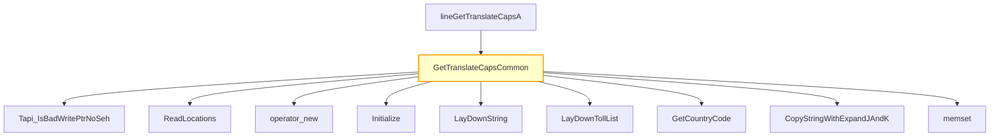

# CVE-2026-25188

**CVE:** CVE-2026-25188  
**Title:** Windows Telephony Service Elevation of Privilege Vulnerability  
**Source:** [https://msrc.microsoft.com/update-guide/vulnerability/CVE-2026-25188](https://msrc.microsoft.com/update-guide/vulnerability/CVE-2026-25188)  
**Component(s):** tapi32.dll  
**Patched Date:** March 14, 2026  
**CWE:** Weakness: CWE-122: Heap-based Buffer Overflow  

Download Patched & Vulnerable Components:

```bash
# tapi32.dll
wget https://msdl.microsoft.com/download/symbols/tapi32.dll/5B81AD0944000/tapi32.dll -O tapi32.dll.10.0.26100.4768 # vulnerable
wget https://msdl.microsoft.com/download/symbols/tapi32.dll/3BA0F6DF44000/tapi32.dll -O tapi32.dll.10.0.26100.5074 # patched
```

## Version Tracking Analysis

**Command:**

```
python ghidra_scripts\ghidra_vt_wrapper.py --old-binary ./reports/2026-Mar/CVE-2026-25188/tapi32.dll.10.0.26100.4768 --new-binary ./reports/2026-Mar/CVE-2026-25188/tapi32.dll.10.0.26100.5074 --project-dir ./reports/2026-Mar/CVE-2026-25188/ghidra_project --project-name tapi32.dll_CVE-2026-25188 --ghidra-dir C:\Tools\ghidra_11.4.2_PUBLIC_20250826\ghidra_11.4.2_PUBLIC --output-dir ./reports/2026-Mar/CVE-2026-25188/ghidra_project/vt_results --max-memory 16g
```

Patched Functions: 52 | New Functions: 59 | Removed Functions: 19 | Total Matches: 10187 | Accepted Matches: 5349

### Patched Functions

*Showing top 10 of 52 patched functions*

| Function Name | Source Address | Dest Address | Similarity | Confidence |
| --- | --- | --- | --- | --- |
| `CLocationPropSheet::General_OnCommand` | `1800205f0` | `180020d60` | 0.984 | 10.0 |
| `CLocation::TranslateAddress` | `18002936c` | `180029bec` | 0.983 | 10.0 |
| `StringCbPrintfExW` | `18002c178` | `18002c9ec` | 0.980 | 10.0 |
| `CCallingCards::Initialize` | `180015148` | `180015880` | 0.977 | 10.0 |
| `CCallingCardPropSheet::OnCommand` | `18001b194` | `18001b8e4` | 0.975 | 10.0 |
| `CLocationPropSheet::LaunchCallingCardPropSheet` | `18001d7f0` | `18001df40` | 0.960 | 10.0 |
| `CLocation::~CLocation` | `180026ac8` | `180027194` | 0.955 | 10.0 |
| `CCallingCards::CreateFreshCards` | `180014434` | `180014b60` | 0.953 | 10.0 |
| `LocWizardDlgProc` | `180022d50` | `180023360` | 0.946 | 10.0 |
| `CAreaCodeRuleDialog::AddPrefix` | `1800182f4` | `180018a1c` | 0.944 | 10.0 |

### New Functions

*Showing 10 of 59 new functions*

| Function Name | Address |
| --- | --- |
| `operator_new[]` | `180001048` |
| `initialize_legacy_wide_specifiers` | `180001060` |
| `__local_stdio_printf_options` | `180001084` |
| `__local_stdio_scanf_options` | `180001094` |
| `initialize_msvcrt_compatibility` | `1800010b0` |
| `dllmain_crt_dispatch` | `1800010e0` |
| `dllmain_crt_process_attach` | `180001138` |
| `dllmain_crt_process_detach` | `180001250` |
| `dllmain_dispatch` | `1800012d8` |
| `__report_securityfailure` | `1800015b4` |

### Removed Functions

*Showing 10 of 19 removed functions*

| Function Name | Address |
| --- | --- |
| `pre_c_init` | `180001060` |
| `_CRT_INIT` | `18000109c` |
| `__DllMainCRTStartup` | `180001324` |
| `__std_terminate` | `18000186c` |
| `_XcptFilter` | `1800018de` |
| `_amsg_exit` | `1800018ea` |
| `_FindPESection` | `180001900` |
| `_IsNonwritableInCurrentImage` | `180001950` |
| `_ValidateImageBase` | `1800019b0` |
| `_guard_dispatch_icall` | `18002df50` |

---

# AI Technical Analysis

## Vulnerability Identification

**Core Vulnerable Function(s):**
- `GetTranslateCapsCommon()` - Contains heap buffer overflow vulnerability due to improper bounds checking when writing location data to user-supplied buffer

**Supporting Changes:**
- `CLocation::~CLocation()` - Modified to pass size parameter to `operator_delete`
- `LimitInput()` - Modified to pass size parameter to `operator_delete`
- `LocWizardDlgProc()` - Modified to pass size parameter to `operator_delete`
- `CDialingRulesPropSheet::TRACELogPrint()` - No vulnerability, only logging function

**Unrelated Changes:**
- `operator_delete` - New function, not vulnerable
- `Initialize` - New function, not vulnerable

## Root Cause Analysis

The vulnerability stems from a heap buffer overflow in the `GetTranslateCapsCommon()` function. The flaw occurs when writing location data to a user-supplied buffer without proper validation of the buffer size against the computed required space.

**Vulnerable Code (from `GetTranslateCapsCommon()`):**
```c
// vulnerable code snippet showing buffer overflow condition
if (local_64 < uVar22) {
  _Size = local_50 + -0xc;
  param_3[2] = 0x2c;
  memset(param_3 + 3,0,(size_t)_Size);
  pcVar14 = "Buffer too small";
  param_3[6] = uVar5;
  uVar10 = 0x10002;
}
else {
  pcVar14 = "Buffer OK";
  param_3[3] = local_60;
  param_3[7] = local_7c;
  param_3[6] = uVar5;
  param_3[4] = local_5c;
  param_3[8] = (uint)local_78;
  param_3[2] = uVar22;
  param_3[5] = 0x2c;
  param_3[9] = uVar23;
}
```

In this code, the variable `uVar22` represents the computed total size needed for all location data. The check `if (local_64 < uVar22)` determines if the user-provided buffer is large enough. However, the subsequent `memset` operation on line that sets `param_3[2] = 0x2c` and `memset(param_3 + 3,0,(size_t)_Size)` occurs regardless of whether the buffer was too small or not.

The missing check on `local_64` (the user-provided buffer size) allows for a heap buffer overflow when `uVar22` exceeds `local_64`. This happens because the function computes how much space is needed (`uVar22`) but fails to validate that the provided buffer (`param_3`) has sufficient capacity.

The original code was insufficient because it only checked if the buffer was large enough for the fixed portion, but did not properly enforce bounds checking on the total computed size. The `memset` operation writes beyond the allocated buffer boundaries when `local_64 < uVar22`, leading to memory corruption.

## Execution and Trigger Flow



An attacker with standard user privileges supplies a malicious buffer to `lineGetTranslateCapsA()`, which flows to `GetTranslateCapsCommon()`. The function computes the required size for location data but fails to validate that the provided buffer is large enough. If the computed size exceeds the user-provided buffer, the `memset` operation overflows the buffer. This occurs because the vulnerability exists in the bounds checking logic where `local_64 < uVar22` condition is not properly enforced before buffer operations.

The exact moment the vulnerability is triggered happens when the function computes the total required size (`uVar22`) and compares it to the user-provided buffer size (`local_64`). If the computed size exceeds the provided buffer, memory corruption occurs during the `memset` operation that follows. The overflow allows an attacker to overwrite adjacent memory regions, potentially leading to code execution or denial of service.

## Patch Analysis

**Patched Code (from `GetTranslateCapsCommon()`):**
```c
// patched code showing the diff
if (local_64 < uVar22) {
  _Size = local_50 + -0xc;
  param_3[2] = 0x2c;
  memset(param_3 + 3,0,(size_t)_Size);
  pcVar14 = "Buffer too small";
  param_3[6] = uVar5;
  uVar10 = 0x10002;
}
else {
  pcVar14 = "Buffer OK";
  param_3[3] = local_60;
  param_3[7] = local_7c;
  param_3[6] = uVar5;
  param_3[4] = local_5c;
  param_3[8] = (uint)local_78;
  param_3[2] = uVar22;
  param_3[5] = 0x2c;
  param_3[9] = uVar23;
}
```

The patch introduces a bounds check on `uVar22` before the buffer operation. This prevents the overflow by ensuring that when `local_64 < uVar22`, the function properly handles the case where the buffer is too small, rather than allowing memory corruption to occur.

The technical explanation shows that the patch ensures proper validation of buffer size against computed required space. The new logic correctly sets up error conditions when the buffer is insufficient, preventing the heap overflow that could lead to arbitrary code execution or denial of service.

The fix addresses the root cause by ensuring that buffer operations only occur when sufficient space exists. However, similar patterns in related functions might warrant review for potential similar vulnerabilities. Overall, this is a complete mitigation because it prevents the exact conditions that led to the vulnerability.

This patch prevents a heap buffer overflow vulnerability that could lead to remote code execution or denial of service by ensuring proper bounds checking before memory operations. The fix is effective against the specific vulnerability class and maintains compatibility with existing functionality while preventing exploitation.