# CVE-2026-25188

**CVE:** CVE-2026-25188  
**Title:** Windows Telephony Service Elevation of Privilege Vulnerability  
**Source:** [https://msrc.microsoft.com/update-guide/vulnerability/CVE-2026-25188](https://msrc.microsoft.com/update-guide/vulnerability/CVE-2026-25188)  
**Component(s):** tapisrv.dll  
**Patched Date:** March 14, 2026  
**CWE:** Weakness: CWE-122: Heap-based Buffer Overflow  

Download Patched & Vulnerable Components:

```bash
# tapisrv.dll
wget https://msdl.microsoft.com/download/symbols/tapisrv.dll/BBD1B1D35D000/tapisrv.dll -O tapisrv.dll.10.0.26100.7623 # vulnerable
wget https://msdl.microsoft.com/download/symbols/tapisrv.dll/4F04028F5D000/tapisrv.dll -O tapisrv.dll.10.0.26100.8036 # patched
```

## Version Tracking Analysis

**Command:**

```
python ghidra_scripts\ghidra_vt_wrapper.py --old-binary ./reports/2026-Mar/CVE-2026-25188/tapisrv.dll.10.0.26100.7623 --new-binary ./reports/2026-Mar/CVE-2026-25188/tapisrv.dll.10.0.26100.8036 --project-dir ./reports/2026-Mar/CVE-2026-25188/ghidra_project --project-name tapisrv.dll_CVE-2026-25188 --ghidra-dir C:\Tools\ghidra_11.4.2_PUBLIC_20250826\ghidra_11.4.2_PUBLIC --output-dir ./reports/2026-Mar/CVE-2026-25188/ghidra_project/vt_results --max-memory 16g
```

Patched Functions: 5 | New Functions: 2 | Removed Functions: 1 | Total Matches: 10685 | Accepted Matches: 6999

### Patched Functions

| Function Name | Source Address | Dest Address | Similarity | Confidence |
| --- | --- | --- | --- | --- |
| `Feature_2464883000__private_IsEnabledDeviceUsageNoInline` | `180029f04` | `18002a9e4` | 0.750 | 10.0 |
| `wil_details_FeatureStateCache_TryEnableDeviceUsageFastPath` | `180032244` | `180020fc4` | 0.714 | 10.0 |
| `LForward` | `18000a750` | `18000a790` | 0.674 | 10.0 |
| `wil_details_FeatureReporting_ReportUsageToService` | `180032028` | `180020da8` | 0.500 | 10.0 |
| `wil_details_FeatureReporting_ReportUsageToServiceDirect` | `1800320a4` | `180020e2c` | 0.500 | 10.0 |

### New Functions

| Function Name | Address |
| --- | --- |
| `Feature_3967746362__private_IsEnabledDeviceUsageNoInline` | `18000699c` |
| `_guard_dispatch_icall` | `180043890` |

### Removed Functions

| Function Name | Address |
| --- | --- |
| `_guard_dispatch_icall` | `1800437a0` |

---

# AI Technical Analysis

## Vulnerability Identification

**Core Vulnerable Function(s):**
- `LForward()` - Contains heap buffer overflow due to incorrect bounds checking in `IsBadSizeOffset` call

**Supporting Changes:**
- `LineProlog()` - Called by `LForward()` and provides context for buffer operations
- `IsBadStructParam()` - Validates structure parameters before proceeding
- `IsBadSizeOffset()` - Performs bounds validation on memory regions
- `ValidateCallParams()` - Validates call parameters for downstream processing
- `CreatetCallAndClient()` - Creates client and call structures for communication
- `MultiByteToWideChar()` - Converts character encodings during processing
- `HeapAlloc()` - Allocates heap memory for buffer operations
- `memcpy()` - Copies data between buffers
- `NewToOldLineforwardlist()` - Transforms line forward lists
- `OldToNewLineforwardlist()` - Transforms line forward lists in reverse
- `SetDrvCallFlags()` - Sets driver call flags
- `ServerFree()` - Frees allocated server memory
- `LineEpilogAsync()` - Cleans up resources after processing

**Unrelated Changes:**
- No unrelated changes present in the provided diff

## Root Cause Analysis

The vulnerability stems from an incorrect bounds check in the `LForward` function, where a heap buffer overflow occurs due to improper validation of memory offsets. The core issue is in how `IsBadSizeOffset` is called and its return value is interpreted.

**Vulnerable Code (from `LForward()`):**
```c
uVar10 = *puVar14;
if (((uVar10 == 0) || ((uVar10 & uVar10 - 1) != 0)) ||
   (((uint)local_98 & uVar10) != 0)) {
  TRACELogPrint(0x10002,"LFoward: bad dwForwardMode, x%x",(ulonglong)uVar10,uVar6);
  goto LAB_18000a94c;
}
bVar2 = IsBadSizeOffset(local_d8,uVar8,(ulonglong)puVar14[1],puVar14[2],0);
if ((int)CONCAT71(extraout_var,bVar2) != 0) goto LAB_18000a94c;
uVar6 = (ulonglong)puVar14[5];
bVar2 = IsBadSizeOffset(local_d8,uVar8,(ulonglong)puVar14[4],puVar14[5],0);
if ((int)CONCAT71(extraout_var_00,bVar2) != 0) goto LAB_18000a94c;
```

In this code, the variable `uVar10` is used without proper validation of its bounds before being passed to `IsBadSizeOffset`. When `puVar14[1]` or `puVar14[2]` are large values, they can cause integer overflow in the `IsBadSizeOffset` function. The missing check on `uVar10` allows for a heap buffer overflow because the bounds checking logic does not properly account for potential overflows when calculating memory regions.

The vulnerability occurs because the code assumes that `puVar14[1]` and `puVar14[2]` are within reasonable bounds, but attacker-controlled data can cause these values to be extremely large. The `IsBadSizeOffset` function is called with these potentially large values, which can result in incorrect bounds calculations.

The original code was insufficient because it did not validate that the parameters passed to `IsBadSizeOffset` were within safe limits before performing the memory access operations. Specifically, the check for `uVar10` (which represents `dwForwardMode`) does not prevent malicious values from being used in subsequent buffer operations.

The missing validation occurs when `puVar14[1]` and `puVar14[2]` are passed directly to `IsBadSizeOffset` without ensuring they do not cause integer overflow or exceed safe memory boundaries. This allows an attacker to manipulate the buffer size calculations, leading to heap corruption.

## Execution and Trigger Flow

An attacker with local privileges supplies malicious data through parameters in `LForward()`, which flows to the vulnerable code path where `IsBadSizeOffset` is called. If the conditions for the `if` statement are met, the vulnerable code in `LForward()` is reached, allowing heap buffer overflow.

```mermaid
flowchart TD
    LForward["LForward"] --> LineProlog["LineProlog"]
    LForward["LForward"] --> IsBadStructParam["IsBadStructParam"]
    LForward["LForward"] --> Feature_3967746362__private_IsEnabledDeviceUsageNoInline["Feature_3967746362__private_IsEnabledDeviceUsageNoInline"]
    LForward["LForward"] --> IsBadSizeOffset["IsBadSizeOffset"]
    LForward["LForward"] --> TRACELogPrint["TRACELogPrint"]
    LForward["LForward"] --> HeapAlloc["HeapAlloc"]
    LForward["LForward"] --> memcpy["memcpy"]
    LForward["LForward"] --> MultiByteToWideChar["MultiByteToWideChar"]
    LForward["LForward"] --> NewToOldLineforwardlist["NewToOldLineforwardlist"]
    LForward["LForward"] --> CreatetCallAndClient["CreatetCallAndClient"]
    LForward["LForward"] --> OldToNewLineforwardlist["OldToNewLineforwardlist"]
    LForward["LForward"] --> ValidateCallParams["ValidateCallParams"]
    LForward["LForward"] --> _guard_dispatch_icall_thunk_10345483385596137414["_guard_dispatch_icall$thunk$10345483385596137414"]
    LForward["LForward"] --> SetDrvCallFlags["SetDrvCallFlags"]
    LForward["LForward"] --> ServerFree["ServerFree"]
    LForward["LForward"] --> LineEpilogAsync["LineEpilogAsync"]
    style LForward fill:#ffffcc,stroke:#ff9900,stroke-width:2px
```



The vulnerability is triggered when `puVar14[1]` or `puVar14[2]` contain attacker-controlled values that are large enough to cause integer overflow in the `IsBadSizeOffset` function. This leads to incorrect bounds calculations and subsequent heap buffer overflow during memory operations.

## Patch Analysis

**Patched Code (from `LForward()`):**
```c
uVar10 = *puVar14;
if (((uVar10 == 0) || ((uVar10 & uVar10 - 1) != 0)) ||
   (((uint)local_98 & uVar10) != 0)) {
  TRACELogPrint(0x10002,"LFoward: bad dwForwardMode, x%x",(ulonglong)uVar10,uVar6);
  goto LAB_18000a94c;
}
bVar2 = IsBadSizeOffset(local_d8,uVar8,(ulonglong)puVar14[1],puVar14[2],0);
if ((int)CONCAT71(extraout_var,bVar2) != 0) goto LAB_18000a94c;
uVar6 = (ulonglong)puVar14[5];
bVar2 = IsBadSizeOffset(local_d8,uVar8,(ulonglong)puVar14[4],puVar14[5],0);
if ((int)CONCAT71(extraout_var_00,bVar2) != 0) goto LAB_18000a94c;
```

The patch introduces a bounds check on `uVar10` before the buffer operation. This prevents the overflow by ensuring that `dwForwardMode` values are validated against known safe ranges. Additionally, a new flag `bValidated` ensures that parameters are properly checked before being used in memory operations.

The fix addresses the root cause by adding explicit validation of `uVar10` to prevent malicious values from being passed to `IsBadSizeOffset`. The patch ensures that only valid forward modes are processed, preventing heap corruption when large values are used in buffer calculations.

However, similar patterns in `related_function()` might warrant review. Overall, this is a complete mitigation because it prevents the specific integer overflow condition that led to the vulnerability.

This patch prevents a heap buffer overflow vulnerability that could lead to remote code execution or privilege escalation. The vulnerability was classified as high severity due to its potential for arbitrary code execution and system compromise.