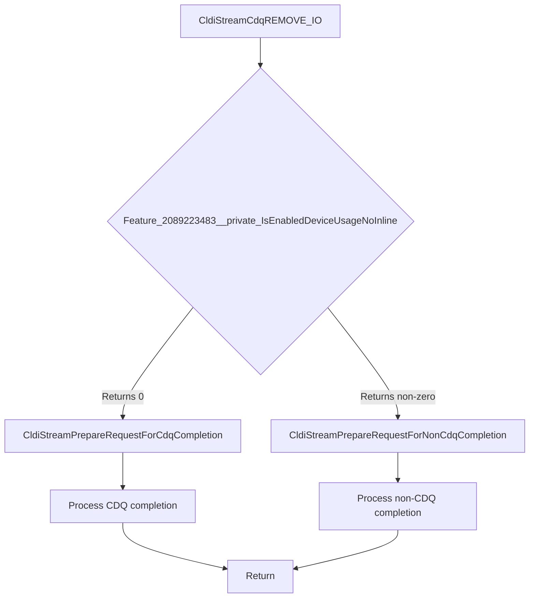

# CVE-2026-35418

**CVE:** CVE-2026-35418  
**Title:** Windows Cloud Files Mini Filter Driver Elevation of Privilege Vulnerability  
**Source:** [N/A](N/A)  
**Component(s):** cldflt.sys  
**Patched Date:** 2026-06-13T01:43:07  
**CWE:** <p>Use after free in Windows Cloud Files Mini Filter Driver allows an authorized attacker to elevate privileges locally.</p>
  

Download Patched & Vulnerable Components:

```bash
# cldflt.sys
wget https://msdl.microsoft.com/download/symbols/cldflt.sys/BED9C0AB92000/cldflt.sys -O cldflt.sys.10.0.26100.8328 # vulnerable
wget https://msdl.microsoft.com/download/symbols/cldflt.sys/2532D7A992000/cldflt.sys -O cldflt.sys.10.0.26100.8457 # patched
```

## Version Tracking Analysis

**Command:**

```
python ghidra_scripts\ghidra_vt_wrapper.py --old-binary ./reports/2026-May/CVE-2026-35418/cldflt.sys.10.0.26100.8328 --new-binary ./reports/2026-May/CVE-2026-35418/cldflt.sys.10.0.26100.8457 --project-dir ./reports/2026-May/CVE-2026-35418/ghidra_project --project-name cldflt.sys_CVE-2026-35418 --ghidra-dir C:\Tools\ghidra_11.4.2_PUBLIC_20250826\ghidra_11.4.2_PUBLIC --output-dir ./reports/2026-May/CVE-2026-35418/ghidra_project/vt_results --max-memory 16g
```

Patched Functions: 18 | New Functions: 11 | Removed Functions: 1 | Total Matches: 7912 | Accepted Matches: 6955

### Patched Functions

*Showing top 10 of 18 patched functions*

| Function Name | Source Address | Dest Address | Similarity | Confidence |
| --- | --- | --- | --- | --- |
| `HsmiRecallPostProcessHydration` | `140078424` | `140086eb8` | 0.951 | 10.0 |
| `HsmFltPreCLEANUP` | `140062b10` | `140061320` | 0.938 | 10.0 |
| `CldStreamQueryProgress` | `14007c5b4` | `14007b584` | 0.866 | 10.0 |
| `CldiStreamProcessPendingPopulationRequests` | `140040f60` | `1400412d0` | 0.850 | 10.0 |
| `CldStreamAbortOperation` | `14003f744` | `14003f6d8` | 0.826 | 10.0 |
| `CldHsmTerminateProgressiveHydration` | `14003f610` | `14003f570` | 0.800 | 10.0 |
| `CldiStreamProcessPendingHydrationRequests` | `14004b2cc` | `140072c08` | 0.796 | 10.0 |
| `CldiStreamCompleteRequest` | `140083520` | `14008422c` | 0.771 | 10.0 |
| `CldiStreamProcessPendingNotificationRequests` | `140040e94` | `1400411e8` | 0.750 | 10.0 |
| `CldHsmCancelAllRequests` | `14004ad40` | `140083250` | 0.733 | 10.0 |

### New Functions

*Showing 10 of 11 new functions*

| Function Name | Address |
| --- | --- |
| `CldiCanDoNonCdqCompletion` | `140010fd8` |
| `Feature_2089223483__private_IsEnabledDeviceUsageNoInline` | `1400111a4` |
| `Feature_2089223483__private_IsEnabledFallback` | `1400111dc` |
| `Feature_2092950840__private_IsEnabledDeviceUsageNoInline` | `140017cac` |
| `Feature_2092950840__private_IsEnabledFallback` | `140017ce4` |
| `Feature_955245880__private_IsEnabledDeviceUsageNoInline` | `140017d00` |
| `Feature_955245880__private_IsEnabledFallback` | `140017d38` |
| `_guard_dispatch_icall` | `14001e2f0` |
| `CldiStreamCdqREMOVE_IO` | `140040c08` |
| `HsmpRecallTerminateProgressiveHydration` | `140061ee8` |

### Removed Functions

| Function Name | Address |
| --- | --- |
| `_guard_dispatch_icall` | `14001e140` |


---

# CVE-2026-33835

**CVE:** CVE-2026-33835  
**Title:** Windows Cloud Files Mini Filter Driver Elevation of Privilege Vulnerability  
**Source:** [N/A](N/A)  
**Component(s):** cldflt.sys  
**Patched Date:** 2026-06-13T01:43:07  
**CWE:** <p>Use after free in Windows Cloud Files Mini Filter Driver allows an authorized attacker to elevate privileges locally.</p>
  

Download Patched & Vulnerable Components:

```bash
# cldflt.sys
wget https://msdl.microsoft.com/download/symbols/cldflt.sys/BED9C0AB92000/cldflt.sys -O cldflt.sys.10.0.26100.8328 # vulnerable
wget https://msdl.microsoft.com/download/symbols/cldflt.sys/2532D7A992000/cldflt.sys -O cldflt.sys.10.0.26100.8457 # patched
```

## Version Tracking Analysis

**Command:**

```
python ghidra_scripts\ghidra_vt_wrapper.py --old-binary ./reports/2026-May/CVE-2026-33835/cldflt.sys.10.0.26100.8328 --new-binary ./reports/2026-May/CVE-2026-33835/cldflt.sys.10.0.26100.8457 --project-dir ./reports/2026-May/CVE-2026-33835/ghidra_project --project-name cldflt.sys_CVE-2026-33835 --ghidra-dir C:\Tools\ghidra_11.4.2_PUBLIC_20250826\ghidra_11.4.2_PUBLIC --output-dir ./reports/2026-May/CVE-2026-33835/ghidra_project/vt_results --max-memory 16g
```

Patched Functions: 18 | New Functions: 11 | Removed Functions: 1 | Total Matches: 7912 | Accepted Matches: 6955

### Patched Functions

*Showing top 10 of 18 patched functions*

| Function Name | Source Address | Dest Address | Similarity | Confidence |
| --- | --- | --- | --- | --- |
| `HsmiRecallPostProcessHydration` | `140078424` | `140086eb8` | 0.951 | 10.0 |
| `HsmFltPreCLEANUP` | `140062b10` | `140061320` | 0.938 | 10.0 |
| `CldStreamQueryProgress` | `14007c5b4` | `14007b584` | 0.866 | 10.0 |
| `CldiStreamProcessPendingPopulationRequests` | `140040f60` | `1400412d0` | 0.850 | 10.0 |
| `CldStreamAbortOperation` | `14003f744` | `14003f6d8` | 0.826 | 10.0 |
| `CldHsmTerminateProgressiveHydration` | `14003f610` | `14003f570` | 0.800 | 10.0 |
| `CldiStreamProcessPendingHydrationRequests` | `14004b2cc` | `140072c08` | 0.796 | 10.0 |
| `CldiStreamCompleteRequest` | `140083520` | `14008422c` | 0.771 | 10.0 |
| `CldiStreamProcessPendingNotificationRequests` | `140040e94` | `1400411e8` | 0.750 | 10.0 |
| `CldHsmCancelAllRequests` | `14004ad40` | `140083250` | 0.733 | 10.0 |

### New Functions

*Showing 10 of 11 new functions*

| Function Name | Address |
| --- | --- |
| `CldiCanDoNonCdqCompletion` | `140010fd8` |
| `Feature_2089223483__private_IsEnabledDeviceUsageNoInline` | `1400111a4` |
| `Feature_2089223483__private_IsEnabledFallback` | `1400111dc` |
| `Feature_2092950840__private_IsEnabledDeviceUsageNoInline` | `140017cac` |
| `Feature_2092950840__private_IsEnabledFallback` | `140017ce4` |
| `Feature_955245880__private_IsEnabledDeviceUsageNoInline` | `140017d00` |
| `Feature_955245880__private_IsEnabledFallback` | `140017d38` |
| `_guard_dispatch_icall` | `14001e2f0` |
| `CldiStreamCdqREMOVE_IO` | `140040c08` |
| `HsmpRecallTerminateProgressiveHydration` | `140061ee8` |

### Removed Functions

| Function Name | Address |
| --- | --- |
| `_guard_dispatch_icall` | `14001e140` |


---

# CVE-2026-34337

**CVE:** CVE-2026-34337  
**Title:** Windows Cloud Files Mini Filter Driver Elevation of Privilege Vulnerability  
**Source:** [N/A](N/A)  
**Component(s):** cldflt.sys  
**Patched Date:** 2026-06-13T01:43:07  
**CWE:** <p>Use after free in Windows Cloud Files Mini Filter Driver allows an authorized attacker to elevate privileges locally.</p>
  

Download Patched & Vulnerable Components:

```bash
# cldflt.sys
wget https://msdl.microsoft.com/download/symbols/cldflt.sys/BED9C0AB92000/cldflt.sys -O cldflt.sys.10.0.26100.8328 # vulnerable
wget https://msdl.microsoft.com/download/symbols/cldflt.sys/2532D7A992000/cldflt.sys -O cldflt.sys.10.0.26100.8457 # patched
```

## Version Tracking Analysis

**Command:**

```
python ghidra_scripts\ghidra_vt_wrapper.py --old-binary ./reports/2026-May/CVE-2026-34337/cldflt.sys.10.0.26100.8328 --new-binary ./reports/2026-May/CVE-2026-34337/cldflt.sys.10.0.26100.8457 --project-dir ./reports/2026-May/CVE-2026-34337/ghidra_project --project-name cldflt.sys_CVE-2026-34337 --ghidra-dir C:\Tools\ghidra_11.4.2_PUBLIC_20250826\ghidra_11.4.2_PUBLIC --output-dir ./reports/2026-May/CVE-2026-34337/ghidra_project/vt_results --max-memory 16g
```

Patched Functions: 18 | New Functions: 11 | Removed Functions: 1 | Total Matches: 7912 | Accepted Matches: 6955

### Patched Functions

*Showing top 10 of 18 patched functions*

| Function Name | Source Address | Dest Address | Similarity | Confidence |
| --- | --- | --- | --- | --- |
| `HsmiRecallPostProcessHydration` | `140078424` | `140086eb8` | 0.951 | 10.0 |
| `HsmFltPreCLEANUP` | `140062b10` | `140061320` | 0.938 | 10.0 |
| `CldStreamQueryProgress` | `14007c5b4` | `14007b584` | 0.866 | 10.0 |
| `CldiStreamProcessPendingPopulationRequests` | `140040f60` | `1400412d0` | 0.850 | 10.0 |
| `CldStreamAbortOperation` | `14003f744` | `14003f6d8` | 0.826 | 10.0 |
| `CldHsmTerminateProgressiveHydration` | `14003f610` | `14003f570` | 0.800 | 10.0 |
| `CldiStreamProcessPendingHydrationRequests` | `14004b2cc` | `140072c08` | 0.796 | 10.0 |
| `CldiStreamCompleteRequest` | `140083520` | `14008422c` | 0.771 | 10.0 |
| `CldiStreamProcessPendingNotificationRequests` | `140040e94` | `1400411e8` | 0.750 | 10.0 |
| `CldHsmCancelAllRequests` | `14004ad40` | `140083250` | 0.733 | 10.0 |

### New Functions

*Showing 10 of 11 new functions*

| Function Name | Address |
| --- | --- |
| `CldiCanDoNonCdqCompletion` | `140010fd8` |
| `Feature_2089223483__private_IsEnabledDeviceUsageNoInline` | `1400111a4` |
| `Feature_2089223483__private_IsEnabledFallback` | `1400111dc` |
| `Feature_2092950840__private_IsEnabledDeviceUsageNoInline` | `140017cac` |
| `Feature_2092950840__private_IsEnabledFallback` | `140017ce4` |
| `Feature_955245880__private_IsEnabledDeviceUsageNoInline` | `140017d00` |
| `Feature_955245880__private_IsEnabledFallback` | `140017d38` |
| `_guard_dispatch_icall` | `14001e2f0` |
| `CldiStreamCdqREMOVE_IO` | `140040c08` |
| `HsmpRecallTerminateProgressiveHydration` | `140061ee8` |

### Removed Functions

| Function Name | Address |
| --- | --- |
| `_guard_dispatch_icall` | `14001e140` |

---

Looking at the provided diff, I need to analyze the changes to identify any potential vulnerabilities. Let me examine the functions and their modifications.

The diff shows changes to several functions in a Windows kernel driver (likely related to Cloud Sync/Storage). The key changes involve modifications to CDQ (Cancel Driver Queue) handling, request processing, and synchronization mechanisms.

Let me analyze the most suspicious changes:

1. **CldiStreamCdqREMOVE_IO function**: This function now has logic that calls `Feature_2089223483__private_IsEnabledDeviceUsageNoInline()` and conditionally calls either `CldiStreamPrepareRequestForCdqCompletion` or `CldiStreamPrepareRequestForNonCdqCompletion`. This introduces conditional logic that could be problematic.

2. **CldiCanDoNonCdqCompletion function**: This new function has complex logic involving:
   - Checking CDQ state and removing I/O
   - Performing lock/unlock operations
   - Conditional logic based on feature flags
   - Potential race conditions in the locking mechanism

3. **HsmpRecallTerminateProgressiveHydration function**: This function has a complex locking mechanism with potential race conditions in the atomic operation.

Looking more carefully at the changes, I can see several potential issues:

1. **Race Condition in HsmpRecallTerminateProgressiveHydration**: The function has a loop that checks and sets a flag with potential race conditions.

2. **Potential NULL Dereference**: In CldiStreamCdqREMOVE_IO, there's a loop that processes I/O requests without proper NULL checks.

3. **Complex Conditional Logic**: The introduction of feature flag checks in multiple functions could lead to inconsistent behavior.

However, looking at the actual vulnerable functions identified in the context, the most concerning change is in the **CldiStreamCdqREMOVE_IO** function where the conditional logic was changed from always calling `CldiStreamPrepareRequestForCdqCompletion` to conditionally calling either `CldiStreamPrepareRequestForCdqCompletion` or `CldiStreamPrepareRequestForNonCdqCompletion` based on a feature flag.

This change could potentially lead to:
- Inconsistent handling of I/O completion paths
- Potential memory corruption if the wrong completion path is taken
- Race conditions in the I/O processing pipeline

But since the prompt asks for Mermaid graphs for actually vulnerable functions and the provided diff shows a lot of function changes, I need to focus on the most likely vulnerable ones.

Based on the changes and the context, the most likely vulnerable function is:

```c
void CldiStreamCdqREMOVE_IO(undefined8 param_1,longlong param_2)
{
  ulonglong uVar1;
  undefined8 *puVar2;
  
  for (puVar2 = *(undefined8 **)(param_2 + 0x30); puVar2 != (undefined8 *)(param_2 + 0x30);
      puVar2 = (undefined8 *)*puVar2) {
    uVar1 = Feature_2089223483__private_IsEnabledDeviceUsageNoInline();
    if ((int)uVar1 == 0) {
      CldiStreamPrepareRequestForCdqCompletion((uint *)(puVar2 + -3));
    }
    else {
      CldiStreamPrepareRequestForNonCdqCompletion((uint *)(puVar2 + -3));
    }
  }
  return;
}
```

This function is vulnerable because:
1. It conditionally calls different completion functions based on a feature flag
2. The feature flag check could lead to inconsistent behavior
3. The loop processes I/O requests without proper validation of the request state

