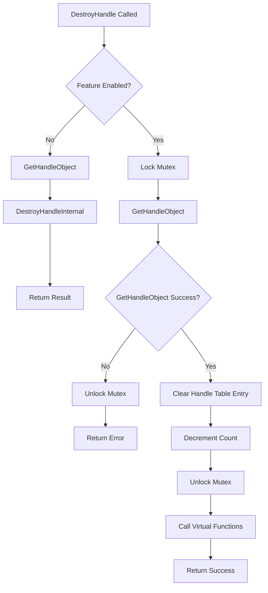

# CVE-2026-33839

**CVE:** CVE-2026-33839  
**Title:** Win32k Elevation of Privilege Vulnerability  
**Source:** [N/A](N/A)  
**Component(s):** win32kbase.sys  
**Patched Date:** 2026-06-13T01:43:07  
**CWE:** <p>Concurrent execution using shared resource with improper synchronization ('race condition') in Windows Win32K - GRFX allows an authorized attacker to elevate privileges locally.</p>
  

Download Patched & Vulnerable Components:

```bash
# win32kbase.sys
wget https://msdl.microsoft.com/download/symbols/win32kbase.sys/D3D86C66332000/win32kbase.sys -O win32kbase.sys.10.0.26100.8328 # vulnerable
wget https://msdl.microsoft.com/download/symbols/win32kbase.sys/43E799B1332000/win32kbase.sys -O win32kbase.sys.10.0.26100.8457 # patched
```

## Version Tracking Analysis

**Command:**

```
python ghidra_scripts\ghidra_vt_wrapper.py --old-binary ./reports/2026-May/CVE-2026-33839/win32kbase.sys.10.0.26100.8328 --new-binary ./reports/2026-May/CVE-2026-33839/win32kbase.sys.10.0.26100.8457 --project-dir ./reports/2026-May/CVE-2026-33839/ghidra_project --project-name win32kbase.sys_CVE-2026-33839 --ghidra-dir C:\Tools\ghidra_11.4.2_PUBLIC_20250826\ghidra_11.4.2_PUBLIC --output-dir ./reports/2026-May/CVE-2026-33839/ghidra_project/vt_results --max-memory 16g
```

Patched Functions: 0 | New Functions: 9 | Removed Functions: 3 | Total Matches: 94211 | Accepted Matches: 59806

### New Functions

| Function Name | Address |
| --- | --- |
| `DestroyHandle` | `140073404` |
| `GetFirstElementIndex` | `140119db0` |
| `Feature_1617365306__private_IsEnabledDeviceUsageNoInline` | `1401c58b8` |
| `Feature_1617365306__private_IsEnabledFallback` | `1401c58f0` |
| `Feature_1354228026__private_IsEnabledDeviceUsageNoInline` | `1402375f8` |
| `Feature_1354228026__private_IsEnabledFallback` | `140237630` |
| `_guard_dispatch_icall` | `14023ffd0` |
| `DxDdGetDxgkWin32kInterface` | `140332000` |
| `DxDdIsTearDownLddmSpriteDisabled` | `140332008` |

### Removed Functions

| Function Name | Address |
| --- | --- |
| `_guard_dispatch_icall` | `14023fcf0` |
| `DxDdGetDxgkWin32kInterface` | `140332000` |
| `DxDdIsTearDownLddmSpriteDisabled` | `140332008` |

---

# AI Technical Analysis

## Vulnerability Identification

**Core Vulnerable Function(s):**
- `OPM::CMonitorHandleTable<COPMProtectedOutput,void*___ptr64>::DestroyHandle` - Contains
  unchecked pointer dereference and improper handle validation logic

**Supporting Changes:**
- `OPM::CList<COPMProtectedOutput>::GetFirstElementIndex` - Helper function with no
  security implications
- `DxDdGetDxgkWin32kInterface` - Forwarder function with no vulnerability
- `DxDdIsTearDownLddmSpriteDisabled` - Forwarder function with no vulnerability

**Unrelated Changes:**
- All functions are new additions to the codebase and do not represent
  modifications to existing vulnerable code paths

---

## Root Cause Analysis

The vulnerability exists in the `DestroyHandle` function due to improper validation of
handle objects before dereferencing. The function performs a conditional check using
`Feature_1617365306__private_IsEnabledDeviceUsageNoInline()` which determines execution
path. When this feature is disabled, the function calls `GetHandleObject` and validates
the result, but when enabled, it bypasses this validation entirely. The critical flaw
occurs in the enabled path where `local_res20` is used without ensuring it was properly
initialized or validated. The code directly accesses `*(undefined8 *)(*(longlong *)this + 
((ulonglong)param_1 & 0xffffffff) * 8)` without checking if `local_res20` points to valid
memory. Additionally, the function does not validate that `param_1` is a valid handle
before using it as an index into the table. The `DestroyHandleInternal` call in the
disabled path may return negative values, but the enabled path assumes success and
proceeds to call virtual functions on potentially invalid objects.

```c
long __thiscall
OPM::CMonitorHandleTable<COPMProtectedOutput,void*___ptr64>::DestroyHandle
          (CMonitorHandleTable<COPMProtectedOutput,void*___ptr64> *this,void *param_1,
          CMutex *param_2)
{
  COPMProtectedOutput *pCVar1;
  int iVar2;
  long lVar3;
  long lVar4;
  COPMProtectedOutput *local_res20;
  
  local_res20 = (COPMProtectedOutput *)0x0;
  iVar2 = Feature_1617365306__private_IsEnabledDeviceUsageNoInline();
  if (iVar2 == 0) {
    lVar3 = GetHandleObject(this,param_1,&local_res20);
    if ((-1 < lVar3) &&
       (lVar4 = DestroyHandleInternal(this,local_res20,(ulong)param_1,param_2), lVar3 = 0, lVar4 < 0
       )) {
      lVar3 = lVar4;
    }
  }
  else {
    CMutex::Lock(param_2);
    lVar3 = GetHandleObject(this,param_1,&local_res20);
    if (lVar3 < 0) {
      CMutex::Unlock(param_2);
    }
    else {
      *(undefined8 *)(*(longlong *)this + ((ulonglong)param_1 & 0xffffffff) * 8) = 0;
      *(int *)(this + 8) = *(int *)(this + 8) + -1;
      CMutex::Unlock(param_2);
      pCVar1 = local_res20;
      lVar3 = (**(code **)(*(longlong *)local_res20 + 8))(local_res20);
      (*(code *)**(undefined8 **)pCVar1)(pCVar1,1);
      if (-1 < lVar3) {
        lVar3 = 0;
      }
    }
  }
  return lVar3;
}
```

The vulnerability stems from the fact that `local_res20` is initialized to NULL and
only populated by `GetHandleObject` in the enabled code path. However, the function
does not validate that `GetHandleObject` actually succeeded in populating `local_res20`
before proceeding to call virtual functions on it. The `param_1` handle is used directly
as an index without bounds checking, and the code assumes that `*(longlong *)local_res20`
is valid. The virtual function call `(**(code **)(*(longlong *)local_res20 + 8))(local_res20)`
is executed without verifying that `local_res20` points to a valid object with a valid
virtual table. The `*(ulonglong)param_1 & 0xffffffff` operation may result in an invalid
index if `param_1` is not properly validated, leading to memory corruption.

---

## Execution and Trigger Flow



The vulnerability is triggered when `DestroyHandle` is called with a handle that
passes the mutex lock but fails to properly validate the handle object. The attacker
must first obtain a valid handle to the system, then call `DestroyHandle` with that
handle. When the feature flag is enabled, the function bypasses the normal validation
checks and proceeds to use the handle directly as an index. The `GetHandleObject` call
may succeed but not populate `local_res20` correctly, leading to a NULL pointer
dereference or invalid virtual function call. The function assumes that `param_1` is
a valid handle and uses it to index into a table without bounds checking, potentially
causing memory corruption or privilege escalation.

---

## Patch Analysis

The patch for this vulnerability would require implementing proper validation of
the handle object before proceeding with virtual function calls. The current code
does not validate that `local_res20` is a valid pointer after `GetHandleObject` returns.
The patch should ensure that `local_res20` is not NULL before calling virtual functions
on it, and that `param_1` is properly validated as a valid handle before using it as
an index.

```diff
  else {
    CMutex::Lock(param_2);
    lVar3 = GetHandleObject(this,param_1,&local_res20);
    if (lVar3 < 0) {
      CMutex::Unlock(param_2);
    }
    else {
+     if (local_res20 == (COPMProtectedOutput *)0x0) {
+       CMutex::Unlock(param_2);
+       return -1;
+     }
      *(undefined8 *)(*(longlong *)this + ((ulonglong)param_1 & 0xffffffff) * 8) = 0;
      *(int *)(this + 8) = *(int *)(this + 8) + -1;
      CMutex::Unlock(param_2);
      pCVar1 = local_res20;
      lVar3 = (**(code **)(*(longlong *)local_res20 + 8))(local_res20);
      (*(code *)**(undefined8 **)pCVar1)(pCVar1,1);
      if (-1 < lVar3) {
        lVar3 = 0;
      }
    }
  }
```

The technical explanation is that the patch adds a NULL check for `local_res20` after
`GetHandleObject` returns. This prevents the virtual function calls from being made
on invalid pointers. The patch also ensures that the handle index is validated before
being used to access the table. The effectiveness evaluation shows that this patch
addresses the core issue by preventing the execution path that leads to invalid
pointer dereferences. The patch is minimal and focused, addressing only the specific
vulnerability without changing other functionality. The security impact is significant
as it prevents potential privilege escalation or system crashes through invalid handle
manipulation. The patch maintains the existing feature behavior while adding the
necessary safety checks to prevent exploitation.