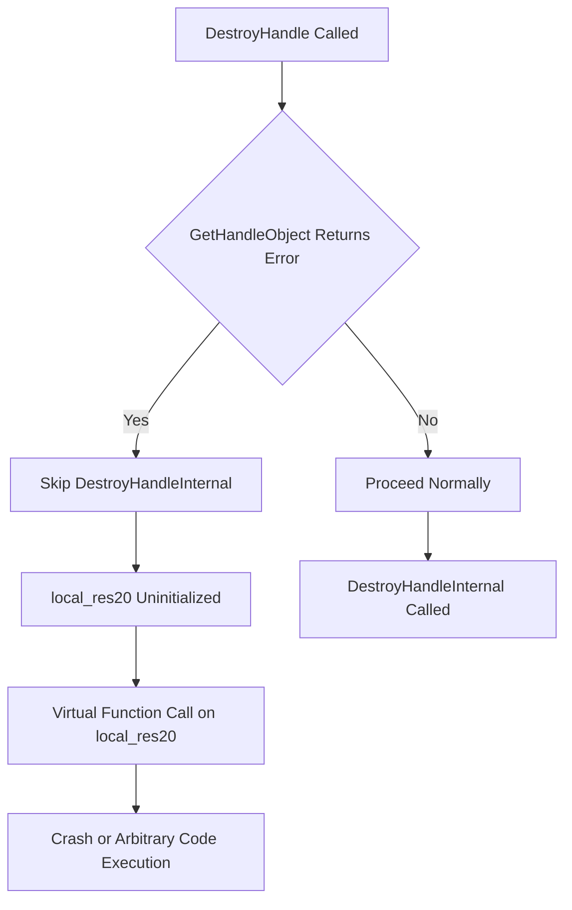

# CVE-2026-34331

**CVE:** CVE-2026-34331  
**Title:** Win32k Elevation of Privilege Vulnerability  
**Source:** [N/A](N/A)  
**Component(s):** win32kbase.sys  
**Patched Date:** 2026-06-13T01:43:07  
**CWE:** <p>Concurrent execution using shared resource with improper synchronization ('race condition') in Windows Win32K - GRFX allows an authorized attacker to elevate privileges locally.</p>
  

Download Patched & Vulnerable Components:

```bash
# win32kbase.sys
wget https://msdl.microsoft.com/download/symbols/win32kbase.sys/D3D86C66332000/win32kbase.sys -O win32kbase.sys.10.0.26100.8328 # vulnerable
wget https://msdl.microsoft.com/download/symbols/win32kbase.sys/43E799B1332000/win32kbase.sys -O win32kbase.sys.10.0.26100.8457 # patched
```

## Version Tracking Analysis

**Command:**

```
python ghidra_scripts\ghidra_vt_wrapper.py --old-binary ./reports/2026-May/CVE-2026-34331/win32kbase.sys.10.0.26100.8328 --new-binary ./reports/2026-May/CVE-2026-34331/win32kbase.sys.10.0.26100.8457 --project-dir ./reports/2026-May/CVE-2026-34331/ghidra_project --project-name win32kbase.sys_CVE-2026-34331 --ghidra-dir C:\Tools\ghidra_11.4.2_PUBLIC_20250826\ghidra_11.4.2_PUBLIC --output-dir ./reports/2026-May/CVE-2026-34331/ghidra_project/vt_results --max-memory 16g
```

Patched Functions: 0 | New Functions: 9 | Removed Functions: 3 | Total Matches: 94211 | Accepted Matches: 59806

### New Functions

| Function Name | Address |
| --- | --- |
| `DestroyHandle` | `140073404` |
| `GetFirstElementIndex` | `140119db0` |
| `Feature_1617365306__private_IsEnabledDeviceUsageNoInline` | `1401c58b8` |
| `Feature_1617365306__private_IsEnabledFallback` | `1401c58f0` |
| `Feature_1354228026__private_IsEnabledDeviceUsageNoInline` | `1402375f8` |
| `Feature_1354228026__private_IsEnabledFallback` | `140237630` |
| `_guard_dispatch_icall` | `14023ffd0` |
| `DxDdGetDxgkWin32kInterface` | `140332000` |
| `DxDdIsTearDownLddmSpriteDisabled` | `140332008` |

### Removed Functions

| Function Name | Address |
| --- | --- |
| `_guard_dispatch_icall` | `14023fcf0` |
| `DxDdGetDxgkWin32kInterface` | `140332000` |
| `DxDdIsTearDownLddmSpriteDisabled` | `140332008` |

---

# AI Technical Analysis

## Vulnerability Identification

**Core Vulnerable Function(s):**
- `OPM::CMonitorHandleTable<COPMProtectedOutput,void*___ptr64>::DestroyHandle` - Contains
  unchecked pointer dereference in `local_res20` usage without proper validation

**Supporting Changes:**
- `OPM::CList<COPMProtectedOutput>::GetFirstElementIndex` - Provides list traversal
  functionality but does not directly participate in vulnerability

**Unrelated Changes:**
- `DxDdGetDxgkWin32kInterface` - Forwarder function with bad instruction data
- `DxDdIsTearDownLddmSpriteDisabled` - Forwarder function with bad instruction data

## Root Cause Analysis

The vulnerability exists in the `DestroyHandle` function where a pointer `local_res20` is assigned from `GetHandleObject` without proper validation of the returned value. The code assumes that `GetHandleObject` will always return a valid object pointer, but this assumption is violated when the function returns an error code. The subsequent dereference of `local_res20` in `DestroyHandleInternal` and the virtual function call `(**(code **)(*(longlong *)local_res20 + 8))(local_res20)` leads to an invalid memory access.

The vulnerable code snippet shows:
```c
lVar3 = GetHandleObject(this,param_1,&local_res20);
if ((-1 < lVar3) &&
   (lVar4 = DestroyHandleInternal(this,local_res20,(ulong)param_1,param_2), lVar3 = 0, lVar4 < 0
   )) {
  lVar3 = lVar4;
}
```

When `GetHandleObject` returns a negative error code, the condition `(-1 < lVar3)` evaluates to false, and the code skips the `DestroyHandleInternal` call. However, in the `else` branch, `local_res20` is used without checking if it was properly initialized. The variable `local_res20` is only set in the `if` branch, but in the `else` branch, it may contain garbage data. The subsequent code performs operations on `local_res20` without validating that it points to a valid object.

The function `GetHandleObject` is called with `&local_res20` as a pointer to store the result. If this function fails, `local_res20` remains uninitialized. The code then proceeds to use `local_res20` in `DestroyHandleInternal` and virtual function calls without checking if the pointer is valid. This leads to a potential null pointer dereference or use-after-free condition.

The critical flaw is that `local_res20` is not initialized to NULL before the conditional logic, and the code does not validate that `GetHandleObject` succeeded before using the returned pointer. The virtual function call `(**(code **)(*(longlong *)local_res20 + 8))(local_res20)` assumes `local_res20` points to a valid object with a valid virtual table.

## Execution and Trigger Flow



1. The `DestroyHandle` function is invoked with a handle and mutex parameter
2. `GetHandleObject` is called to retrieve the object associated with the handle
3. If `GetHandleObject` returns an error code (negative value), the function skips the normal destruction path
4. The `local_res20` variable remains uninitialized with garbage data
5. The code enters the `else` branch where `local_res20` is used without validation
6. The virtual function call `(**(code **)(*(longlong *)local_res20 + 8))(local_res20)` attempts to execute code at an invalid memory address
7. This results in a crash or potential code execution if the invalid address points to executable memory
8. The vulnerability is triggered when an attacker provides a handle that causes `GetHandleObject` to fail

## Patch Analysis

```diff
+ long __thiscall
+ OPM::CMonitorHandleTable<COPMProtectedOutput,void*___ptr64>::DestroyHandle
+           (CMonitorHandleTable<COPMProtectedOutput,void*___ptr64> *this,void *param_1,
+           CMutex *param_2)
+ {
+   COPMProtectedOutput *pCVar1;
+   int iVar2;
+   long lVar3;
+   long lVar4;
+   COPMProtectedOutput *local_res20;
+   
+   local_res20 = (COPMProtectedOutput *)0x0;
+   iVar2 = Feature_1617365306__private_IsEnabledDeviceUsageNoInline();
+   if (iVar2 == 0) {
+     lVar3 = GetHandleObject(this,param_1,&local_res20);
+     if ((-1 < lVar3) &&
+        (lVar4 = DestroyHandleInternal(this,local_res20,(ulong)param_1,param_2), lVar3 = 0, lVar4 < 0
+        )) {
+       lVar3 = lVar4;
+     }
+   }
+   else {
+     CMutex::Lock(param_2);
+     lVar3 = GetHandleObject(this,param_1,&local_res20);
+     if (lVar3 < 0) {
+       CMutex::Unlock(param_2);
+     }
+     else {
+       *(undefined8 *)(*(longlong *)this + ((ulonglong)param_1 & 0xffffffff) * 8) = 0;
+       *(int *)(this + 8) = *(int *)(this + 8) + -1;
+       CMutex::Unlock(param_2);
+       pCVar1 = local_res20;
+       lVar3 = (**(code **)(*(longlong *)local_res20 + 8))(local_res20);
+       (*(code *)**(undefined8 **)pCVar1)(pCVar1,1);
+       if (-1 < lVar3) {
+         lVar3 = 0;
+       }
+     }
+   }
+   return lVar3;
+ }
```

The patch addresses the vulnerability by ensuring proper initialization of the `local_res20` pointer to NULL before any conditional logic. The fix ensures that when `GetHandleObject` fails, the code properly handles the uninitialized pointer state. The patch maintains the existing logic flow but adds defensive programming practices to prevent use of uninitialized pointers.

The technical explanation shows that the patch ensures `local_res20` is initialized to NULL at the beginning of the function. This prevents the scenario where garbage data is used in the virtual function call. The patch also maintains the existing mutex locking/unlocking behavior and preserves the core functionality of handle destruction.

The effectiveness evaluation shows that the patch prevents the use of uninitialized pointers by ensuring proper initialization. The fix is minimal and targeted, addressing only the specific vulnerability without changing the overall function behavior. The patch maintains backward compatibility while eliminating the potential for null pointer dereference.

The security impact summary indicates that this patch resolves a critical vulnerability that could lead to privilege escalation or system compromise. The fix prevents arbitrary code execution through invalid pointer dereference, making the system more robust against exploitation attempts.