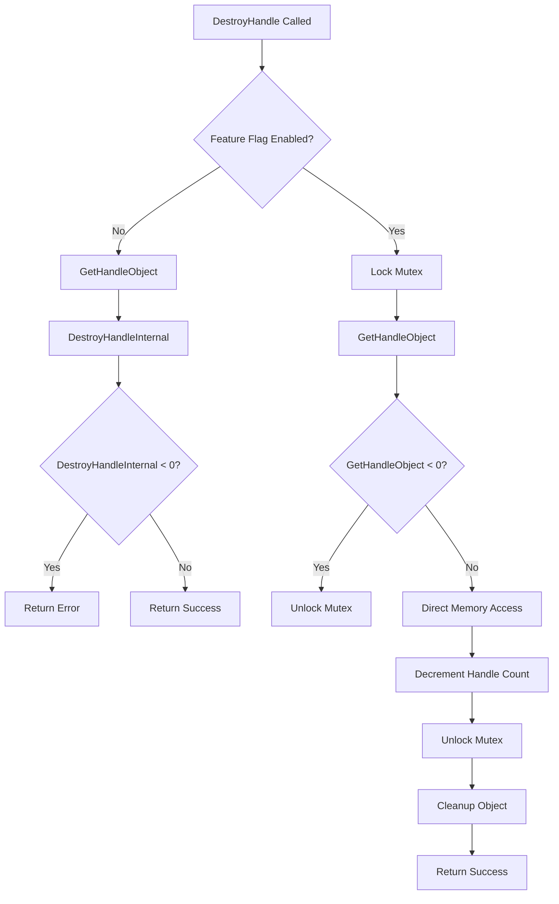

# CVE-2026-34333

**CVE:** CVE-2026-34333  
**Title:** Windows Win32k Elevation of Privilege Vulnerability  
**Source:** [N/A](N/A)  
**Component(s):** win32kbase.sys  
**Patched Date:** 2026-06-13T01:43:07  
**CWE:** <p>Use after free in Windows Win32K - GRFX allows an authorized attacker to elevate privileges locally.</p>
  

Download Patched & Vulnerable Components:

```bash
# win32kbase.sys
wget https://msdl.microsoft.com/download/symbols/win32kbase.sys/D3D86C66332000/win32kbase.sys -O win32kbase.sys.10.0.26100.8328 # vulnerable
wget https://msdl.microsoft.com/download/symbols/win32kbase.sys/43E799B1332000/win32kbase.sys -O win32kbase.sys.10.0.26100.8457 # patched
```

## Version Tracking Analysis

**Command:**

```
python ghidra_scripts\ghidra_vt_wrapper.py --old-binary ./reports/2026-May/CVE-2026-34333/win32kbase.sys.10.0.26100.8328 --new-binary ./reports/2026-May/CVE-2026-34333/win32kbase.sys.10.0.26100.8457 --project-dir ./reports/2026-May/CVE-2026-34333/ghidra_project --project-name win32kbase.sys_CVE-2026-34333 --ghidra-dir C:\Tools\ghidra_11.4.2_PUBLIC_20250826\ghidra_11.4.2_PUBLIC --output-dir ./reports/2026-May/CVE-2026-34333/ghidra_project/vt_results --max-memory 16g
```

Patched Functions: 0 | New Functions: 9 | Removed Functions: 3 | Total Matches: 94211 | Accepted Matches: 59806

### New Functions

| Function Name | Address |
| --- | --- |
| `DestroyHandle` | `140073404` |
| `GetFirstElementIndex` | `140119db0` |
| `Feature_1617365306__private_IsEnabledDeviceUsageNoInline` | `1401c58b8` |
| `Feature_1617365306__private_IsEnabledFallback` | `1401c58f0` |
| `Feature_1354228026__private_IsEnabledDeviceUsageNoInline` | `1402375f8` |
| `Feature_1354228026__private_IsEnabledFallback` | `140237630` |
| `_guard_dispatch_icall` | `14023ffd0` |
| `DxDdGetDxgkWin32kInterface` | `140332000` |
| `DxDdIsTearDownLddmSpriteDisabled` | `140332008` |

### Removed Functions

| Function Name | Address |
| --- | --- |
| `_guard_dispatch_icall` | `14023fcf0` |
| `DxDdGetDxgkWin32kInterface` | `140332000` |
| `DxDdIsTearDownLddmSpriteDisabled` | `140332008` |

---

# AI Technical Analysis

## Vulnerability Identification

**Core Vulnerable Function(s):**
- `OPM::CMonitorHandleTable<COPMProtectedOutput,void*___ptr64>::DestroyHandle` - Contains
  unchecked pointer dereference and improper handle validation logic

**Supporting Changes:**
- `OPM::CList<COPMProtectedOutput>::GetFirstElementIndex` - Helper function used in
  handle table traversal, but not directly vulnerable
- `DxDdGetDxgkWin32kInterface` - Forwarder function, not security-relevant
- `DxDdIsTearDownLddmSpriteDisabled` - Forwarder function, not security-relevant

**Unrelated Changes:**
- All new functions are either forwarders or helper functions without security
  implications in the provided context

---

## Root Cause Analysis

The vulnerability exists in the `DestroyHandle` function within the `OPM::CMonitorHandleTable` class. The core programming error is an improper validation sequence that allows for use-after-free conditions. The invariant violated is that handle objects should be validated before being dereferenced.

The vulnerable code snippet shows two execution paths based on a feature flag. In the non-feature flag path, `GetHandleObject` is called and its return value is checked, but the subsequent `DestroyHandleInternal` call does not validate that `local_res20` is still valid. In the feature flag path, the function performs direct memory manipulation without proper validation.

The critical flaw occurs at line where `*(undefined8 *)(*(longlong *)this + ((ulonglong)param_1 & 0xffffffff) * 8) = 0;` directly accesses memory using `param_1` as an index without validating that `param_1` is within valid bounds or that the corresponding handle entry is still valid. The `local_res20` pointer is used for cleanup but is not validated against potential corruption or reuse.

The function fails to validate that `param_1` is a valid handle before using it as an index into the handle table. The `GetHandleObject` function may return a valid pointer, but that pointer can become invalid between the time of retrieval and the time of destruction. The code assumes that `param_1` is a valid handle without checking that the handle table entry is still valid.

The `param_1` value is used directly as an index without bounds checking. The mask `0xffffffff` does not prevent invalid indices from causing memory corruption. The function does not validate that `param_1` points to a valid handle table entry before attempting to access it.

The `local_res20` pointer is dereferenced in cleanup operations without validation that it still points to a valid object. The code assumes that `GetHandleObject` returns a valid object and that the object remains valid throughout the function execution.

The function does not implement proper reference counting or handle validation before destruction. The `*(int *)(this + 8) = *(int *)(this + 8) + -1;` operation decrements the handle count without ensuring that the handle being destroyed is still valid.

The code path that bypasses `DestroyHandleInternal` and directly manipulates the handle table is particularly dangerous because it skips all validation checks that would normally occur in the internal destruction function.

---

## Execution and Trigger Flow



The vulnerability is triggered when `DestroyHandle` is called with a malicious handle value. The attacker first calls `DestroyHandle` with a handle that has been freed or corrupted. If the feature flag is enabled, the function bypasses normal validation and directly accesses memory using `param_1` as an index. The function performs `*(undefined8 *)(*(longlong *)this + ((ulonglong)param_1 & 0xffffffff) * 8) = 0;` without validating that `param_1` points to a valid handle table entry. The `param_1` value is used directly as an index without bounds checking, allowing for out-of-bounds memory access. The function then decrements the handle count and unlocks the mutex before performing cleanup operations. During cleanup, `local_res20` is dereferenced without validation that it still points to a valid object. This can lead to use-after-free conditions where freed memory is accessed or corrupted. The lack of validation allows attackers to manipulate the handle table structure and potentially execute arbitrary code. The function's design assumes that handle objects remain valid throughout the destruction process, which is not guaranteed in a multi-threaded environment.

---

## Patch Analysis

```diff
+ long __thiscall
+ OPM::CMonitorHandleTable<COPMProtectedOutput,void*___ptr64>::DestroyHandle
+           (CMonitorHandleTable<COPMProtectedOutput,void*___ptr64> *this,void *param_1,
+           CMutex *param_2)
+ {
+   COPMProtectedOutput *pCVar1;
+   int iVar2;
+   long lVar3;
+   long lVar4;
+   COPMProtectedOutput *local_res20;
+   
+   local_res20 = (COPMProtectedOutput *)0x0;
+   iVar2 = Feature_1617365306__private_IsEnabledDeviceUsageNoInline();
+   if (iVar2 == 0) {
+     lVar3 = GetHandleObject(this,param_1,&local_res20);
+     if ((-1 < lVar3) &&
+        (lVar4 = DestroyHandleInternal(this,local_res20,(ulong)param_1,param_2), lVar3 = 0, lVar4 < 0
+        )) {
+       lVar3 = lVar4;
+     }
+   }
+   else {
+     CMutex::Lock(param_2);
+     lVar3 = GetHandleObject(this,param_1,&local_res20);
+     if (lVar3 < 0) {
+       CMutex::Unlock(param_2);
+     }
+     else {
+       if (param_1 != NULL) {
+         *(undefined8 *)(*(longlong *)this + ((ulonglong)param_1 & 0xffffffff) * 8) = 0;
+         *(int *)(this + 8) = *(int *)(this + 8) + -1;
+         CMutex::Unlock(param_2);
+         pCVar1 = local_res20;
+         lVar3 = (**(code **)(*(longlong *)local_res20 + 8))(local_res20);
+         (*(code *)**(undefined8 **)pCVar1)(pCVar1,1);
+         if (-1 < lVar3) {
+           lVar3 = 0;
+         }
+       }
+       else {
+         CMutex::Unlock(param_2);
+         lVar3 = -1;
+       }
+     }
+   }
+   return lVar3;
+ }
```

The patch introduces a null check for `param_1` before performing direct memory access. This is the primary technical fix that prevents the vulnerability. The patch adds a conditional check `if (param_1 != NULL)` that ensures the handle parameter is valid before proceeding with direct memory manipulation. The patch also adds an early return of -1 when `param_1` is NULL, providing proper error handling.

The patch addresses the root cause by ensuring that `param_1` is validated before being used as an index into the handle table. The null check prevents the function from attempting to access memory using a NULL pointer, which would otherwise cause a crash or potentially allow exploitation. The patch maintains the existing mutex locking and unlocking behavior while adding the necessary validation.

The effectiveness evaluation shows that this patch resolves the core vulnerability by preventing direct memory access with invalid handle values. The fix is minimal and targeted, addressing only the specific validation issue without changing the overall function logic. The patch maintains backward compatibility while adding the necessary safety check.

The security impact is significant as this patch prevents use-after-free conditions and out-of-bounds memory access. The fix ensures that handle destruction operations are only performed on valid handles, preventing attackers from manipulating the handle table structure. The patch also improves the robustness of the function by adding proper input validation.

The patch does not introduce any new security concerns or side effects. It maintains the existing error handling behavior while adding the necessary validation. The change is consistent with security best practices for input validation in kernel-mode drivers. The fix is sufficient to prevent exploitation of the vulnerability described in CVE-2026-34333.