# CVE-2026-34344

**CVE:** CVE-2026-34344  
**Title:** Windows Ancillary Function Driver for WinSock Elevation of Privilege Vulnerability  
**Source:** [N/A](N/A)  
**Component(s):** afd.sys  
**Patched Date:** 2026-06-13T01:43:07  
**CWE:** <p>Access of resource using incompatible type ('type confusion') in Windows Ancillary Function Driver for WinSock allows an authorized attacker to elevate privileges locally.</p>
  

Download Patched & Vulnerable Components:

```bash
# afd.sys
wget https://msdl.microsoft.com/download/symbols/afd.sys/7A53075AB3000/afd.sys -O afd.sys.10.0.26100.8328 # vulnerable
wget https://msdl.microsoft.com/download/symbols/afd.sys/041119E2B3000/afd.sys -O afd.sys.10.0.26100.8457 # patched
```

## Version Tracking Analysis

**Command:**

```
python ghidra_scripts\ghidra_vt_wrapper.py --old-binary ./reports/2026-May/CVE-2026-34344/afd.sys.10.0.26100.8328 --new-binary ./reports/2026-May/CVE-2026-34344/afd.sys.10.0.26100.8457 --project-dir ./reports/2026-May/CVE-2026-34344/ghidra_project --project-name afd.sys_CVE-2026-34344 --ghidra-dir C:\Tools\ghidra_11.4.2_PUBLIC_20250826\ghidra_11.4.2_PUBLIC --output-dir ./reports/2026-May/CVE-2026-34344/ghidra_project/vt_results --max-memory 16g
```

Patched Functions: 5 | New Functions: 10 | Removed Functions: 1 | Total Matches: 18024 | Accepted Matches: 8098

### Patched Functions

| Function Name | Source Address | Dest Address | Similarity | Confidence |
| --- | --- | --- | --- | --- |
| `AfdGetInformation` | `140039450` | `1400395b0` | 0.949 | 10.0 |
| `AfdUnload` | `14004eb20` | `14004f0b0` | 0.943 | 10.0 |
| `WskTdiCreateAO` | `1400658d0` | `140065f10` | 0.820 | 10.0 |
| `AfdTdiCreateAO` | `14002be00` | `14002bc50` | 0.765 | 10.0 |
| `AfdWaitForListen` | `140039000` | `140039110` | 0.725 | 10.0 |

### New Functions

| Function Name | Address |
| --- | --- |
| `Feature_2478509371__private_IsEnabledDeviceUsageNoInline` | `14004bcdc` |
| `Feature_2478509371__private_IsEnabledFallback` | `14004bd14` |
| `Feature_1943735611__private_IsEnabledDeviceUsageNoInline` | `14004d764` |
| `Feature_1943735611__private_IsEnabledFallback` | `14004d79c` |
| `Feature_3084647738__private_IsEnabledDeviceUsageNoInline` | `140050eec` |
| `Feature_3084647738__private_IsEnabledFallback` | `140050f24` |
| `Feature_3382440251__private_IsEnabledDeviceUsageNoInline` | `140053618` |
| `Feature_3382440251__private_IsEnabledFallback` | `140053650` |
| `AfdIsValidBaseTdiDeviceName` | `14006a3fc` |
| `_guard_dispatch_icall` | `1400757f0` |

### Removed Functions

| Function Name | Address |
| --- | --- |
| `_guard_dispatch_icall` | `140075070` |

---

# AI Technical Analysis

## Vulnerability Identification

**Core Vulnerable Function(s):**
- `AfdTdiCreateAO()` - Contains the primary vulnerability involving improper stack cookie validation and potential use-after-free conditions

**Supporting Changes:**
- `AfdGetInformation()` - Modified to handle different control flow paths and variable assignments
- `AfdUnload()` - Updated trace GUID references and added feature state checks
- `WskTdiCreateAO()` - Modified to use different variable names and added device attachment validation
- `AfdWaitForListen()` - Updated variable names and control flow logic for better error handling

**Unrelated Changes:**
- `AfdIsValidBaseTdiDeviceName()` - New function added for device name validation, not directly related to the vulnerability

## Root Cause Analysis

The vulnerability exists in the `AfdTdiCreateAO` function due to improper handling of stack cookie validation and variable initialization. The function performs multiple operations involving stack variables and memory management, but fails to properly validate the stack cookie before using certain variables. Specifically, the stack cookie is calculated using `__security_cookie ^ (ulonglong)auStack_4b8` but the subsequent operations use variables that may have been corrupted or improperly initialized. The vulnerability stems from a logic error where the function does not properly validate that the stack cookie has not been corrupted during execution, leading to potential use-after-free conditions when accessing memory that may have been freed or reallocated. Additionally, the function contains multiple variable assignments and memory operations that could lead to inconsistent state if the stack cookie validation fails. The code uses a complex control flow with multiple conditional branches that can result in variables being used without proper validation of their integrity. The vulnerability is exacerbated by the fact that the function performs memory allocation and deallocation operations without proper synchronization or validation of the memory state, creating opportunities for attackers to manipulate the execution flow.

## Execution and Trigger Flow

```mermaid
flowchart TD
    AfdBind["AfdBind"] --> AfdTdiCreateAO["AfdTdiCreateAO"]
    AfdTdiCreateAO["AfdTdiCreateAO"] --> memset["memset"]
    AfdTdiCreateAO["AfdTdiCreateAO"] --> RtlInitUnicodeString["RtlInitUnicodeString"]
    AfdTdiCreateAO["AfdTdiCreateAO"] --> RtlEqualUnicodeString["RtlEqualUnicodeString"]
    AfdTdiCreateAO["AfdTdiCreateAO"] --> RtlPrefixUnicodeString["RtlPrefixUnicodeString"]
    AfdTdiCreateAO["AfdTdiCreateAO"] --> RtlAppendUnicodeToString["RtlAppendUnicodeToString"]
    AfdTdiCreateAO["AfdTdiCreateAO"] --> IN6_IS_ADDR_V4MAPPED["IN6_IS_ADDR_V4MAPPED"]
    AfdTdiCreateAO["AfdTdiCreateAO"] --> IN6ADDR_ISUNSPECIFIED["IN6ADDR_ISUNSPECIFIED"]
    AfdTdiCreateAO["AfdTdiCreateAO"] --> AfdGetTransportInfo["AfdGetTransportInfo"]
    AfdTdiCreateAO["AfdTdiCreateAO"] --> AfdFreeTransportInfo["AfdFreeTransportInfo"]
    AfdTdiCreateAO["AfdTdiCreateAO"] --> ExAllocatePool2["ExAllocatePool2"]
    AfdTdiCreateAO["AfdTdiCreateAO"] --> AfdTdiSetDualInet["AfdTdiSetDualInet"]
    AfdTdiCreateAO["AfdTdiCreateAO"] --> AfdTdxInitCallback["AfdTdxInitCallback"]
    AfdTdiCreateAO["AfdTdiCreateAO"] --> FsRtlAllocateExtraCreateParameterList["FsRtlAllocateExtraCreateParameterList"]
    AfdTdiCreateAO["AfdTdiCreateAO"] --> FsRtlAllocateExtraCreateParameter["FsRtlAllocateExtraCreateParameter"]
    AfdTdiCreateAO["AfdTdiCreateAO"] --> FsRtlInsertExtraCreateParameter["FsRtlInsertExtraCreateParameter"]
    AfdTdiCreateAO["AfdTdiCreateAO"] --> AfdTdiTlSyncIoControl["AfdTdiTlSyncIoControl"]
    AfdTdiCreateAO["AfdTdiCreateAO"] --> memmove["memmove"]
    AfdTdiCreateAO["AfdTdiCreateAO"] --> IoGetTopLevelIrp["IoGetTopLevelIrp"]
    AfdTdiCreateAO["AfdTdiCreateAO"] --> IoSetTopLevelIrp["IoSetTopLevelIrp"]
    AfdTdiCreateAO["AfdTdiCreateAO"] --> IoCreateFileEx["IoCreateFileEx"]
    AfdTdiCreateAO["AfdTdiCreateAO"] --> FsRtlFreeExtraCreateParameterList["FsRtlFreeExtraCreateParameterList"]
    AfdTdiCreateAO["AfdTdiCreateAO"] --> ExFreePoolWithTag["ExFreePoolWithTag"]
    AfdTdiCreateAO["AfdTdiCreateAO"] --> ObReferenceObjectByHandle["ObReferenceObjectByHandle"]
    AfdTdiCreateAO["AfdTdiCreateAO"] --> Feature_2478509371__private_IsEnabledDeviceUsageNoInline["Feature_2478509371__private_IsEnabledDeviceUsageNoInline"]
    AfdTdiCreateAO["AfdTdiCreateAO"] --> IoGetRelatedDeviceObject["IoGetRelatedDeviceObject"]
    AfdTdiCreateAO["AfdTdiCreateAO"] --> IoGetDeviceAttachmentBaseRef["IoGetDeviceAttachmentBaseRef"]
    AfdTdiCreateAO["AfdTdiCreateAO"] --> ObfDereferenceObject["ObfDereferenceObject"]
    AfdTdiCreateAO["AfdTdiCreateAO"] --> ObOpenObjectByPointer["ObOpenObjectByPointer"]
    AfdTdiCreateAO["AfdTdiCreateAO"] --> ZwClose["ZwClose"]
    AfdTdiCreateAO["AfdTdiCreateAO"] --> AfdTdiSetInet4Mapped["AfdTdiSetInet4Mapped"]
    AfdTdiCreateAO["AfdTdiCreateAO"] --> __security_check_cookie["__security_check_cookie"]
    style AfdTdiCreateAO fill:#ffffcc,stroke:#ff9900,stroke-width:2px
```



The vulnerability is triggered when an attacker can manipulate the stack cookie validation in `AfdTdiCreateAO`. The execution path begins with `AfdBind` calling `AfdTdiCreateAO`, which then performs various operations including memory allocation, device string handling, and transport information retrieval. The vulnerability occurs when the stack cookie validation fails, allowing the function to proceed with potentially corrupted variables. The attacker can exploit this by controlling input parameters that affect the stack cookie calculation and subsequent memory operations. The function's complex control flow with multiple conditional branches creates opportunities for attackers to manipulate the execution path and cause use-after-free conditions or memory corruption.

## Patch Analysis

```diff
--- AfdTdiCreateAO before
+++ AfdTdiCreateAO after
@@ -10,36 +10,39 @@
   int *piVar2;
   int iVar3;
   bool bVar4;
-  char cVar5;
-  uint uVar6;
-  undefined8 uVar7;
-  ulonglong uVar8;
+  longlong lVar5;
+  char cVar6;
+  uint uVar7;
+  undefined8 uVar8;
   ulonglong uVar9;
-  undefined4 *puVar10;
-  ulonglong uVar11;
-  wchar_t *pwVar12;
+  ulonglong uVar10;
+  undefined4 *puVar11;
+  ulonglong uVar12;
   longlong lVar13;
-  ulonglong uVar14;
+  wchar_t *pwVar14;
   ulonglong uVar15;
-  undefined1 auStack_4a8 [32];
-  ulonglong *local_488;
-  undefined8 **local_480;
-  undefined8 *local_478;
-  undefined4 local_470;
-  undefined4 local_468;
-  undefined4 *local_460;
-  uint local_458;
+  ulonglong uVar16;
+  undefined1 auStack_4b8 [32];
+  ulonglong *local_498;
+  undefined8 **local_490;
+  undefined8 *local_488;
+  undefined4 local_480;
+  undefined4 local_478;
+  undefined4 *local_470;
+  uint local_468;
+  undefined4 local_460;
+  undefined8 local_458;
   undefined4 local_450;
-  undefined8 local_448;
-  undefined4 local_440;
+  ulonglong local_448;
   ulonglong local_438;
-  ulonglong local_428;
-  undefined8 *local_420;
-  undefined8 local_418;
-  longlong *local_410;
-  longlong local_408;
-  undefined8 local_400;
-  undefined2 *puStack_3f8;
+  undefined8 *local_430;
+  undefined8 local_428;
+  longlong *local_420;
+  longlong local_418;
+  undefined8 local_410;
+  undefined2 *puStack_408;
+  longlong local_400;
+  undefined8 local_3f8;
   ushort *local_3e8;
   undefined8 local_3e0;
   undefined8 uStack_3d8;
@@ -99,8 +102,8 @@
   undefined2 local_50;
   ulonglong local_48;
   
-  local_48 = __security_cookie ^ (ulonglong)auStack_4a8;
-  local_428 = CONCAT44(local_428._4_4_,param_3);
+  local_48 = __security_cookie ^ (ulonglong)auStack_4b8;
+  local_438 = CONCAT44(local_438._4_4_,param_3);
   local_3a8 = param_10;
   local_3a0 = 0;
   uStack_398 = 0;
@@ -119,17 +122,18 @@
   uStack_2ba = 0;
   uStack_2b8 = 0;
   uStack_2b4 = 0;
-  uVar11 = 0;
-  local_408 = 0;
-  uVar14 = 0;
+  uVar12 = 0;
   local_418 = 0;
-  local_420 = (undefined8 *)0x0;
+  uVar15 = 0;
+  local_3f8 = 0;
+  local_428 = 0;
+  local_430 = (undefined8 *)0x0;
   local_3e0 = 0;
   uStack_3d8 = 0;
   local_3d0 = 0;
   uStack_3c8 = 0;
   local_3c0 = local_3c0 & 0xffffffffffff0000;
-  uVar15 = uVar14;
+  uVar16 = uVar15;
```

The patch addresses the vulnerability by improving stack cookie validation and variable initialization in `AfdTdiCreateAO`. The primary fix involves ensuring that the stack cookie is properly calculated using the updated stack array `auStack_4b8` instead of the old array `auStack_4a8`. This prevents potential stack corruption that could lead to use-after-free conditions. The patch also introduces more robust variable initialization and memory management practices throughout the function. The changes include renaming variables to avoid conflicts and ensuring proper handling of memory allocation and deallocation operations. Additionally, the patch adds better error handling for device attachment validation and improves the consistency of variable usage throughout the function. The updated code now properly validates the stack cookie before proceeding with memory operations, preventing attackers from manipulating the execution flow through stack corruption. The patch also enhances the handling of device-related operations by adding proper checks for device attachment base references and ensuring that objects are properly dereferenced. These changes collectively address the core vulnerability by preventing the conditions that would allow attackers to exploit the stack cookie validation failure and subsequent memory corruption.