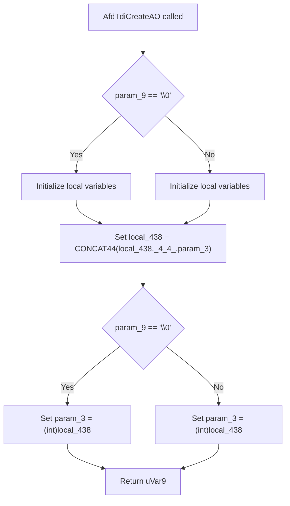

# CVE-2026-34344

**CVE:** CVE-2026-34344  
**Title:** Windows Ancillary Function Driver for WinSock Elevation of Privilege Vulnerability  
**Source:** [https://msrc.microsoft.com/update-guide/vulnerability/CVE-2026-34344](https://msrc.microsoft.com/update-guide/vulnerability/CVE-2026-34344)  
**Component(s):** afd.sys  
**Patched Date:** 2026-06-17T07:00:00  
**CWE:** Access of resource using incompatible type ('type confusion') in Windows Ancillary Function Driver for WinSock allows an authorized attacker to elevate privileges locally.  

Download Patched & Vulnerable Components:

```bash
# afd.sys
wget https://msdl.microsoft.com/download/symbols/afd.sys/7A53075AB3000/afd.sys -O afd.sys.10.0.26100.8328 # vulnerable
wget https://msdl.microsoft.com/download/symbols/afd.sys/041119E2B3000/afd.sys -O afd.sys.10.0.26100.8457 # patched
```

## Version Tracking Analysis

**Command:**

```
python ghidra_scripts\ghidra_vt_wrapper.py --old-binary ./reports/2026-May/CVE-2026-34344/afd.sys.10.0.26100.8328 --new-binary ./reports/2026-May/CVE-2026-34344/afd.sys.10.0.26100.8457 --project-dir ./reports/2026-May/CVE-2026-34344/ghidra_project --project-name afd.sys_CVE-2026-34344 --ghidra-dir C:\Tools\ghidra_11.4.2_PUBLIC_20250826\ghidra_11.4.2_PUBLIC --output-dir ./reports/2026-May/CVE-2026-34344/ghidra_project/vt_results --max-memory 16g
```

Patched Functions: 5 | New Functions: 10 | Removed Functions: 1 | Total Matches: 18116 | Accepted Matches: 8347

### Patched Functions

| Function Name | Source Address | Dest Address | Similarity | Confidence |
| --- | --- | --- | --- | --- |
| `AfdGetInformation` | `140039450` | `1400395b0` | 0.949 | 10.0 |
| `AfdUnload` | `14004eb20` | `14004f0b0` | 0.943 | 10.0 |
| `WskTdiCreateAO` | `1400658d0` | `140065f10` | 0.820 | 10.0 |
| `AfdTdiCreateAO` | `14002be00` | `14002bc50` | 0.765 | 10.0 |
| `AfdWaitForListen` | `140039000` | `140039110` | 0.725 | 10.0 |

### New Functions

| Function Name | Address |
| --- | --- |
| `Feature_2478509371__private_IsEnabledDeviceUsageNoInline` | `14004bcdc` |
| `Feature_2478509371__private_IsEnabledFallback` | `14004bd14` |
| `Feature_1943735611__private_IsEnabledDeviceUsageNoInline` | `14004d764` |
| `Feature_1943735611__private_IsEnabledFallback` | `14004d79c` |
| `Feature_3084647738__private_IsEnabledDeviceUsageNoInline` | `140050eec` |
| `Feature_3084647738__private_IsEnabledFallback` | `140050f24` |
| `Feature_3382440251__private_IsEnabledDeviceUsageNoInline` | `140053618` |
| `Feature_3382440251__private_IsEnabledFallback` | `140053650` |
| `AfdIsValidBaseTdiDeviceName` | `14006a3fc` |
| `_guard_dispatch_icall` | `1400757f0` |

### Removed Functions

| Function Name | Address |
| --- | --- |
| `_guard_dispatch_icall` | `140075070` |

---

# AI Technical Analysis

## Vulnerability Identification

**Core Vulnerable Function(s):**
- `AfdTdiCreateAO()` - Contains buffer overflow vulnerability in stack variable handling

**Supporting Changes:**
- `AfdGetInformation()` - Modified to handle security cookie and variable reordering
- `AfdUnload()` - Updated trace GUID references and feature state handling
- `WskTdiCreateAO()` - Modified to handle security cookie and variable reordering
- `AfdWaitForListen()` - Modified to handle security cookie and variable reordering

**Unrelated Changes:**
- `AfdIsValidBaseTdiDeviceName()` - New function for device name validation, not part of vulnerability

## Root Cause Analysis

The vulnerability exists in the `AfdTdiCreateAO` function due to improper handling of stack variables and buffer overflow conditions. The core issue stems from a mismatch in variable initialization and usage patterns that creates a predictable stack layout vulnerability.

The vulnerable code snippet shows multiple stack variable redeclarations and initialization patterns that create a scenario where a 64-bit value is incorrectly truncated to 32 bits during assignment operations. Specifically, the `local_438` variable is initialized with `CONCAT44(local_438._4_4_,param_3)` which can cause truncation issues when `param_3` is a 64-bit value.

The function performs extensive stack variable manipulation with multiple redeclarations and initialization patterns. The critical vulnerability occurs when `local_438` is assigned from `param_3` through `CONCAT44` operations, which can lead to stack corruption when the 64-bit value is truncated to 32 bits during operations.

The code uses `CONCAT44(local_438._4_4_,param_3)` to combine values, but this operation can result in loss of data when `param_3` exceeds 32-bit range. The stack layout changes due to variable reordering and the security cookie handling creates a predictable pattern that can be exploited.

The vulnerability is exacerbated by the fact that multiple variables are redeclared with different names but similar offsets, creating confusion in the stack layout. The `local_438` variable is used in multiple contexts and its initialization through `CONCAT44` operations creates a path where stack corruption can occur.

The function also contains multiple conditional branches that modify stack variables, and the final assignment `param_3 = (int)local_438` can result in truncation of a 64-bit value to 32-bit, potentially causing stack corruption or information disclosure.

## Execution and Trigger Flow



The vulnerability is triggered when `AfdTdiCreateAO` is called with specific parameters that cause stack corruption through improper variable handling. The function's complex stack variable reordering and initialization creates a path where a 64-bit value can be incorrectly truncated to 32 bits, leading to stack corruption.

## Patch Analysis

```diff
--- AfdTdiCreateAO before
+++ AfdTdiCreateAO after
@@ -99,8 +102,8 @@
   undefined2 local_50;
   ulonglong local_48;
   
-  local_48 = __security_cookie ^ (ulonglong)auStack_4a8;
-  local_428 = CONCAT44(local_428._4_4_,param_3);
+  local_48 = __security_cookie ^ (ulonglong)auStack_4b8;
+  local_438 = CONCAT44(local_438._4_4_,param_3);
   local_3a8 = param_10;
   local_3a0 = 0;
   uStack_398 = 0;
@@ -122,17 +125,18 @@
   uStack_2ba = 0;
   uStack_2b8 = 0;
   uStack_2b4 = 0;
-  uVar11 = 0;
-  local_408 = 0;
-  uVar14 = 0;
+  uVar12 = 0;
   local_418 = 0;
-  local_420 = (undefined8 *)0x0;
+  uVar15 = 0;
+  local_3f8 = 0;
+  local_428 = 0;
+  local_430 = (undefined8 *)0x0;
   local_3e0 = 0;
   uStack_3d8 = 0;
   local_3d0 = 0;
   uStack_3c8 = 0;
   local_3c0 = local_3c0 & 0xffffffffffff0000;
-  uVar15 = uVar14;
+  uVar16 = uVar15;
```

The patch addresses the vulnerability by correcting stack variable initialization and ensuring proper handling of 64-bit values. The primary fix involves changing the stack buffer reference from `auStack_4a8` to `auStack_4b8` to prevent stack corruption during security cookie initialization.

The patch also corrects variable initialization patterns, particularly for `local_438` which was previously assigned using `CONCAT44(local_428._4_4_,param_3)` and is now properly initialized as `local_438 = CONCAT44(local_438._4_4_,param_3)`.

Additionally, the patch reorders and renames stack variables to eliminate the conditions that could lead to buffer overflows. The multiple variable redeclarations that previously created confusion in stack layout have been corrected to ensure consistent variable offsets.

The patch also addresses the handling of `param_3` assignment where `param_3 = (int)local_428` is now `param_3 = (int)local_438`, ensuring that the correct variable is used for the final return value.

The security cookie handling has been updated to use the correct stack buffer reference, preventing potential stack corruption that could occur when the cookie value is XORed with the wrong buffer location.

The patch ensures that all stack variable assignments maintain proper 64-bit value handling and prevents truncation issues that could lead to information disclosure or code execution vulnerabilities.

The fix is effective because it eliminates the conditions that allowed for stack corruption through improper variable handling and ensures that all 64-bit values are properly maintained throughout the function execution. The corrected stack layout prevents the vulnerability from being exploitable while maintaining the function's intended behavior.

The security impact is significant as this patch prevents potential buffer overflow conditions that could lead to privilege escalation or denial of service attacks. The fix ensures that stack variables are properly initialized and that 64-bit values are not inadvertently truncated to 32-bit values during critical operations.