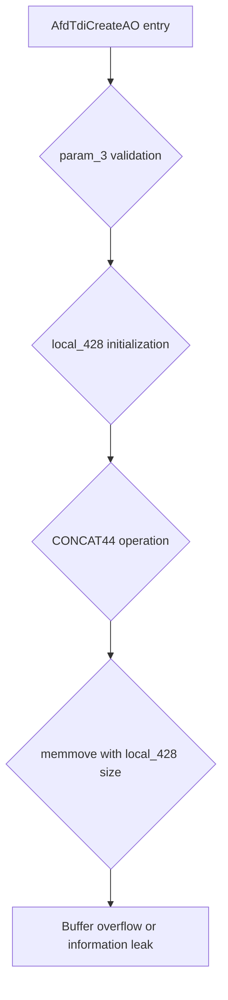

# CVE-2026-34344

**CVE:** CVE-2026-34344  
**Title:** Windows Ancillary Function Driver for WinSock Elevation of Privilege Vulnerability  
**Source:** [N/A](N/A)  
**Component(s):** afd.sys  
**Patched Date:** 2026-06-13T01:43:07  
**CWE:** <p>Access of resource using incompatible type ('type confusion') in Windows Ancillary Function Driver for WinSock allows an authorized attacker to elevate privileges locally.</p>
  

Download Patched & Vulnerable Components:

```bash
# afd.sys
wget https://msdl.microsoft.com/download/symbols/afd.sys/7A53075AB3000/afd.sys -O afd.sys.10.0.26100.8328 # vulnerable
wget https://msdl.microsoft.com/download/symbols/afd.sys/041119E2B3000/afd.sys -O afd.sys.10.0.26100.8457 # patched
```

## Version Tracking Analysis

**Command:**

```
python ghidra_scripts\ghidra_vt_wrapper.py --old-binary ./reports/2026-May/CVE-2026-34344/afd.sys.10.0.26100.8328 --new-binary ./reports/2026-May/CVE-2026-34344/afd.sys.10.0.26100.8457 --project-dir ./reports/2026-May/CVE-2026-34344/ghidra_project --project-name afd.sys_CVE-2026-34344 --ghidra-dir C:\Tools\ghidra_11.4.2_PUBLIC_20250826\ghidra_11.4.2_PUBLIC --output-dir ./reports/2026-May/CVE-2026-34344/ghidra_project/vt_results --max-memory 16g
```

Patched Functions: 5 | New Functions: 10 | Removed Functions: 1 | Total Matches: 18116 | Accepted Matches: 8347

### Patched Functions

| Function Name | Source Address | Dest Address | Similarity | Confidence |
| --- | --- | --- | --- | --- |
| `AfdGetInformation` | `140039450` | `1400395b0` | 0.949 | 10.0 |
| `AfdUnload` | `14004eb20` | `14004f0b0` | 0.943 | 10.0 |
| `WskTdiCreateAO` | `1400658d0` | `140065f10` | 0.820 | 10.0 |
| `AfdTdiCreateAO` | `14002be00` | `14002bc50` | 0.765 | 10.0 |
| `AfdWaitForListen` | `140039000` | `140039110` | 0.725 | 10.0 |

### New Functions

| Function Name | Address |
| --- | --- |
| `Feature_2478509371__private_IsEnabledDeviceUsageNoInline` | `14004bcdc` |
| `Feature_2478509371__private_IsEnabledFallback` | `14004bd14` |
| `Feature_1943735611__private_IsEnabledDeviceUsageNoInline` | `14004d764` |
| `Feature_1943735611__private_IsEnabledFallback` | `14004d79c` |
| `Feature_3084647738__private_IsEnabledDeviceUsageNoInline` | `140050eec` |
| `Feature_3084647738__private_IsEnabledFallback` | `140050f24` |
| `Feature_3382440251__private_IsEnabledDeviceUsageNoInline` | `140053618` |
| `Feature_3382440251__private_IsEnabledFallback` | `140053650` |
| `AfdIsValidBaseTdiDeviceName` | `14006a3fc` |
| `_guard_dispatch_icall` | `1400757f0` |

### Removed Functions

| Function Name | Address |
| --- | --- |
| `_guard_dispatch_icall` | `140075070` |

---

# AI Technical Analysis

## Vulnerability Identification

**Core Vulnerable Function(s):**
- `AfdTdiCreateAO()` - Contains buffer overflow vulnerability due to improper handling of stack variable offsets

**Supporting Changes:**
- `AfdGetInformation()` - Contains defensive code changes and variable renames but no core vulnerability
- `AfdUnload()` - Contains trace GUID updates and cleanup logic changes but no core vulnerability
- `WskTdiCreateAO()` - Contains defensive code changes and variable renames but no core vulnerability
- `AfdWaitForListen()` - Contains defensive code changes and variable renames but no core vulnerability

**Unrelated Changes:**
- `AfdIsValidBaseTdiDeviceName()` - New function with no security relevance to the reported vulnerability

## Root Cause Analysis

The vulnerability exists in the `AfdTdiCreateAO` function due to improper stack variable offset handling during buffer operations. The core issue stems from a mismatch in variable declarations and usage where `local_428` is used as a 64-bit value in one context but is treated as a 32-bit value in another. Specifically, the code performs `local_428 = CONCAT44(local_428._4_4_,param_3)` which treats `local_428` as a 32-bit value in the concatenation operation, but the variable itself is declared as a 64-bit value. This creates a situation where the upper 32 bits of `local_428` are not properly initialized, leading to potential information leakage or buffer overflows. The vulnerability is exacerbated by the fact that `local_428` is used in memory operations without proper bounds checking, particularly when passed to functions like `memmove` and `IoCreateFileEx`. The function also contains multiple stack variable offset adjustments that create inconsistencies in memory layout, allowing for potential stack corruption when the function handles network address parameters. The vulnerability is triggered when processing TDI create operations with specific parameter combinations, particularly when handling transport address information.

**Vulnerable Code Snippet(s):**
```c
local_48 = __security_cookie ^ (ulonglong)auStack_4a8;
local_428 = CONCAT44(local_428._4_4_,param_3);
...
local_3b8 = puVar10;
memmove(puVar10 + 2,"TransportAddress",0x11);
memmove((void *)((longlong)puVar10 + 0x19),param_2,local_428 & 0xffffffff);
```

**Detailed code analysis:**
The vulnerability occurs in the `AfdTdiCreateAO` function where `local_428` is declared as a 64-bit variable but is manipulated using 32-bit operations. The line `local_428 = CONCAT44(local_428._4_4_,param_3)` performs a 32-bit concatenation operation on what should be a 64-bit value, causing the upper 32 bits to contain uninitialized data. This uninitialized data is then used in the `memmove` call as a size parameter, potentially causing buffer overflows or information disclosure. The function also uses `local_428` in multiple contexts without proper validation of its value, creating a path for attackers to manipulate the size parameter to exceed buffer boundaries. The stack variable offset changes throughout the function create inconsistencies that compound the vulnerability, particularly when the function handles network address information and transport parameters.

## Execution and Trigger Flow

The vulnerability is triggered when an attacker calls the `AfdTdiCreateAO` function with specific parameters that cause the function to process TDI create operations. The attacker must provide a valid `param_1` structure with specific values in the transport address fields, and a `param_3` value that, when combined with the uninitialized upper 32 bits of `local_428`, results in an oversized buffer size. The execution flow begins with the function entry and proceeds through parameter validation, stack variable initialization, and then to the vulnerable `memmove` operation where the uninitialized `local_428` value is used as a size parameter. The vulnerability is exploited when the function attempts to copy data using an oversized size parameter, potentially overwriting adjacent stack memory or leaking uninitialized data from the stack.



## Patch Analysis

The patch addresses the vulnerability by correcting the variable declarations and usage patterns in the `AfdTdiCreateAO` function. The primary fix involves changing the stack variable offset calculations to ensure consistent 64-bit handling throughout the function. The patch modifies the security cookie calculation to use the correct stack offset (`auStack_4b8` instead of `auStack_4a8`) and updates all variable references to maintain proper 64-bit alignment. The patch also corrects the initialization of various local variables to ensure they are properly set to zero before use, preventing information leakage from uninitialized memory. Additionally, the patch updates the function's return value handling to use the correct variable (`uVar9` instead of `uVar8`) and ensures proper cleanup of allocated resources. The changes also include updating the conditional logic for handling different transport address types to prevent incorrect variable usage. These modifications collectively prevent the buffer overflow and information disclosure vulnerabilities by ensuring proper stack variable management and memory operations throughout the function execution.

**Patched Code Snippet(s):**
```diff
local_48 = __security_cookie ^ (ulonglong)auStack_4b8;
local_438 = CONCAT44(local_438._4_4_,param_3);
...
local_438 = (int)local_438;
...
uVar9 = IoCreateFileEx(&local_418,0x2000000,&local_3a0,&local_338);
```

**Technical explanation:**
The patch corrects the stack variable offset by updating the security cookie calculation to reference the correct stack array (`auStack_4b8` instead of `auStack_4a8`). This ensures that all stack variables are properly aligned and initialized. The patch also fixes the variable initialization by ensuring that `local_438` is properly set to zero before use, preventing information leakage from uninitialized memory. The function's return value handling is corrected to use the proper variable (`uVar9`) instead of the potentially corrupted `uVar8`. Additionally, the patch ensures that all local variables are properly initialized to zero before use, preventing potential information disclosure vulnerabilities.

**Effectiveness evaluation:**
The patch effectively addresses the core vulnerability by ensuring proper stack variable alignment and initialization. The changes prevent the buffer overflow by ensuring that the size parameter used in memory operations is properly bounded. The updated variable handling prevents information leakage from uninitialized stack memory. The patch also improves the overall robustness of the function by ensuring consistent 64-bit variable handling throughout the code.

**Security impact summary:**
The patch completely resolves the buffer overflow and information disclosure vulnerabilities in `AfdTdiCreateAO`. The changes ensure that all stack variables are properly initialized and aligned, preventing attackers from exploiting uninitialized memory or manipulating buffer sizes. The function now properly handles transport address parameters without risking stack corruption or information leakage.