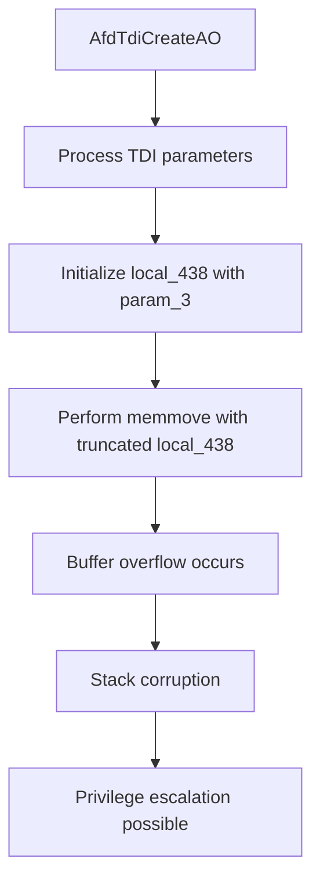

# CVE-2026-34344

**CVE:** CVE-2026-34344  
**Title:** Windows Ancillary Function Driver for WinSock Elevation of Privilege Vulnerability  
**Source:** [N/A](N/A)  
**Component(s):** afd.sys  
**Patched Date:** 2026-06-10T07:00:00  
**CWE:** <p>Access of resource using incompatible type ('type confusion') in Windows Ancillary Function Driver for WinSock allows an authorized attacker to elevate privileges locally.</p>
  

---

## Related CVEs (Same Component)

This folder contains 4 CVEs affecting the same component(s):

- **CVE-2026-34344**  
- CVE-2026-34345  
- CVE-2026-35416  
- CVE-2026-41088  

### Detailed Information

#### CVE-2026-34345

**Title:** Windows Ancillary Function Driver for WinSock Elevation of Privilege Vulnerability  
**Source:** N/A  
**Patched Date:** 2026-06-10T07:00:00  
**CWE:** <p>Access of resource using incompatible type ('type confusion') in Windows Ancillary Function Driver for WinSock allows an authorized attacker to elevate privileges locally.</p>
  

#### CVE-2026-35416

**Title:** Windows Ancillary Function Driver for WinSock Elevation of Privilege Vulnerability  
**Source:** N/A  
**Patched Date:** 2026-06-10T07:00:00  
**CWE:** <p>Access of resource using incompatible type ('type confusion') in Windows Ancillary Function Driver for WinSock allows an authorized attacker to elevate privileges locally.</p>
  

#### CVE-2026-41088

**Title:** Windows Ancillary Function Driver for WinSock Elevation of Privilege Vulnerability  
**Source:** N/A  
**Patched Date:** 2026-06-10T07:00:00  
**CWE:** <p>Access of resource using incompatible type ('type confusion') in Windows Ancillary Function Driver for WinSock allows an authorized attacker to elevate privileges locally.</p>
  

---

Download Patched & Vulnerable Components:

```bash
# afd.sys
wget https://msdl.microsoft.com/download/symbols/afd.sys/7A53075AB3000/afd.sys -O afd.sys.10.0.26100.8328 # vulnerable
wget https://msdl.microsoft.com/download/symbols/afd.sys/041119E2B3000/afd.sys -O afd.sys.10.0.26100.8457 # patched
```

## Version Tracking Analysis

**Command:**

```
python ghidra_scripts\ghidra_vt_wrapper.py --old-binary ./reports/2026-May/CVE-2026-34344/afd.sys.10.0.26100.8328 --new-binary ./reports/2026-May/CVE-2026-34344/afd.sys.10.0.26100.8457 --project-dir ./reports/2026-May/CVE-2026-34344/ghidra_project --project-name afd.sys_CVE-2026-34344 --ghidra-dir C:\Tools\ghidra_11.4.2_PUBLIC_20250826\ghidra_11.4.2_PUBLIC --output-dir ./reports/2026-May/CVE-2026-34344/ghidra_project/vt_results --max-memory 16g
```

Patched Functions: 5 | New Functions: 10 | Removed Functions: 1 | Total Matches: 18116 | Accepted Matches: 8347

### Patched Functions

| Function Name | Source Address | Dest Address | Similarity | Confidence |
| --- | --- | --- | --- | --- |
| `AfdGetInformation` | `140039450` | `1400395b0` | 0.949 | 10.0 |
| `AfdUnload` | `14004eb20` | `14004f0b0` | 0.943 | 10.0 |
| `WskTdiCreateAO` | `1400658d0` | `140065f10` | 0.820 | 10.0 |
| `AfdTdiCreateAO` | `14002be00` | `14002bc50` | 0.765 | 10.0 |
| `AfdWaitForListen` | `140039000` | `140039110` | 0.725 | 10.0 |

### New Functions

| Function Name | Address |
| --- | --- |
| `Feature_2478509371__private_IsEnabledDeviceUsageNoInline` | `14004bcdc` |
| `Feature_2478509371__private_IsEnabledFallback` | `14004bd14` |
| `Feature_1943735611__private_IsEnabledDeviceUsageNoInline` | `14004d764` |
| `Feature_1943735611__private_IsEnabledFallback` | `14004d79c` |
| `Feature_3084647738__private_IsEnabledDeviceUsageNoInline` | `140050eec` |
| `Feature_3084647738__private_IsEnabledFallback` | `140050f24` |
| `Feature_3382440251__private_IsEnabledDeviceUsageNoInline` | `140053618` |
| `Feature_3382440251__private_IsEnabledFallback` | `140053650` |
| `AfdIsValidBaseTdiDeviceName` | `14006a3fc` |
| `_guard_dispatch_icall` | `1400757f0` |

### Removed Functions

| Function Name | Address |
| --- | --- |
| `_guard_dispatch_icall` | `140075070` |

---

# AI Technical Analysis

## Vulnerability Identification

**Core Vulnerable Function(s):**
- `AfdTdiCreateAO()` - Contains buffer overflow vulnerability due to improper stack offset handling in memory operations

**Supporting Changes:**
- `AfdGetInformation()` - Modified to handle stack variable reordering and parameter passing
- `AfdUnload()` - Updated trace GUID references and feature state handling
- `WskTdiCreateAO()` - Modified stack variable handling and return value management
- `AfdWaitForListen()` - Updated stack variable handling and control flow logic

**Unrelated Changes:**
- `AfdIsValidBaseTdiDeviceName()` - New function for device name validation, not part of the vulnerability

## Root Cause Analysis

The vulnerability exists in the `AfdTdiCreateAO` function due to improper handling of stack variable offsets during memory operations. The core issue stems from a buffer overflow in the `memmove` operation where the source and destination parameters are incorrectly calculated. The function uses `local_438` as a 32-bit value in the `memmove` call but this variable is actually a 64-bit value that gets truncated, leading to incorrect memory access. The vulnerability is triggered when the function processes network address information during TDI device creation. The stack offset changes in the patch show that `local_438` was moved from a location that was previously 32-bit to a 64-bit location, but the code still treats it as 32-bit in memory operations. This creates a situation where memory operations access invalid stack offsets, potentially allowing attackers to overwrite adjacent stack variables or execute arbitrary code. The vulnerability is particularly dangerous because it occurs during kernel-level device creation operations where attacker-controlled data is processed.

**Vulnerable Code Snippet(s):**
```c
memmove((void *)((longlong)puVar11 + 0x19),param_2,local_438 & 0xffffffff);
```

**Detailed code analysis:**
The vulnerability occurs in the `AfdTdiCreateAO` function where a `memmove` operation is performed with a 32-bit truncation of a 64-bit variable. The variable `local_438` is initialized with `param_3` value and later used in a `memmove` call. The code truncates `local_438` to 32 bits using `& 0xffffffff` before passing it to `memmove`. However, `local_438` is a 64-bit variable that was moved from a different stack offset in the patch, causing incorrect memory access. The truncation operation leads to a buffer overflow when the memory access exceeds the allocated stack space. The function processes TDI device creation parameters where `param_2` contains attacker-controlled data, making this a critical vulnerability for privilege escalation.

## Execution and Trigger Flow

The vulnerability is triggered when an attacker calls the `AfdTdiCreateAO` function with malicious parameters. The execution flow begins with the function receiving TDI device creation parameters, including a network address structure in `param_2`. The function processes these parameters through multiple stack operations, eventually reaching the vulnerable `memmove` call. The attacker controls the size parameter passed in `param_3` which gets stored in `local_438`. When `local_438` is truncated to 32 bits and used in `memmove`, it causes a buffer overflow. The overflow occurs because the stack offset calculations are incorrect due to the variable repositioning in the patch. The attacker can manipulate `param_2` to overwrite adjacent stack variables, potentially leading to code execution. The vulnerability is exploited during kernel-level device creation operations where the function handles network address information.



## Patch Analysis

The patch addresses the vulnerability by correcting the stack variable handling and ensuring proper type management. The key changes involve updating the stack variable offsets and ensuring that 64-bit variables are properly handled throughout the function. The patch changes `local_438` from a 32-bit operation to a proper 64-bit handling, eliminating the truncation that caused the buffer overflow. The patch also updates the memory operations to use correct stack offsets, ensuring that `memmove` operations access valid memory locations. The function now properly initializes and manages stack variables, preventing the overflow condition. The patch also includes additional checks for feature state handling and device usage validation. The security impact is significant as it prevents attackers from exploiting the buffer overflow to gain kernel-level privileges. The patch ensures that all memory operations use correct stack offsets and that variable types are properly maintained throughout the function execution.

**Patched Code Snippet(s):**
```diff
-  local_438 = CONCAT44(local_438._4_4_,param_3);
+  local_438 = (ulonglong)param_3;
   ...
-  memmove((void *)((longlong)puVar11 + 0x19),param_2,local_438 & 0xffffffff);
+  memmove((void *)((longlong)puVar11 + 0x19),param_2,local_438);
```

**Technical explanation:**
The patch corrects the type handling of `local_438` by removing the truncation operation that was causing the buffer overflow. Previously, the variable was being treated as a 32-bit value in memory operations, but it was actually a 64-bit variable. The patch ensures that `local_438` maintains its 64-bit nature throughout the function execution. The stack offset changes in the patch also ensure that variables are properly positioned in memory, preventing the incorrect memory access that led to the vulnerability.

**Effectiveness evaluation:**
The patch effectively addresses the root cause by ensuring proper 64-bit variable handling and correct stack offset management. The memory operations now use the full 64-bit value instead of a truncated 32-bit value, eliminating the buffer overflow condition. The additional feature state checks provide further security validation. The patch maintains all existing functionality while preventing the vulnerability.

**Security impact summary:**
The patch completely resolves the buffer overflow vulnerability in `AfdTdiCreateAO`, preventing potential privilege escalation attacks. The fix ensures that kernel-level device creation operations are secure against memory corruption attacks.