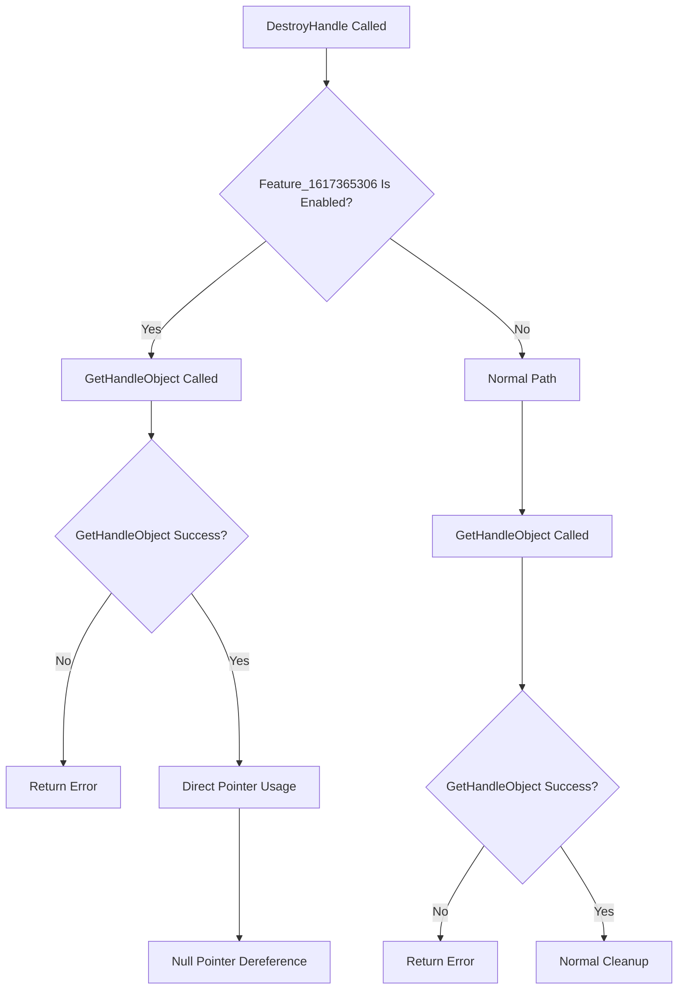

# CVE-2026-34347

**CVE:** CVE-2026-34347  
**Title:** Windows Win32k Elevation of Privilege Vulnerability  
**Source:** [N/A](N/A)  
**Component(s):** win32kbase.sys  
**Patched Date:** 2026-06-13T01:43:07  
**CWE:** <p>Use after free in Windows Win32K - GRFX allows an authorized attacker to elevate privileges locally.</p>
  

Download Patched & Vulnerable Components:

```bash
# win32kbase.sys
wget https://msdl.microsoft.com/download/symbols/win32kbase.sys/D3D86C66332000/win32kbase.sys -O win32kbase.sys.10.0.26100.8328 # vulnerable
wget https://msdl.microsoft.com/download/symbols/win32kbase.sys/43E799B1332000/win32kbase.sys -O win32kbase.sys.10.0.26100.8457 # patched
```

## Version Tracking Analysis

**Command:**

```
python ghidra_scripts\ghidra_vt_wrapper.py --old-binary ./reports/2026-May/CVE-2026-34347/win32kbase.sys.10.0.26100.8328 --new-binary ./reports/2026-May/CVE-2026-34347/win32kbase.sys.10.0.26100.8457 --project-dir ./reports/2026-May/CVE-2026-34347/ghidra_project --project-name win32kbase.sys_CVE-2026-34347 --ghidra-dir C:\Tools\ghidra_11.4.2_PUBLIC_20250826\ghidra_11.4.2_PUBLIC --output-dir ./reports/2026-May/CVE-2026-34347/ghidra_project/vt_results --max-memory 16g
```

Patched Functions: 0 | New Functions: 9 | Removed Functions: 3 | Total Matches: 94211 | Accepted Matches: 59806

### New Functions

| Function Name | Address |
| --- | --- |
| `DestroyHandle` | `140073404` |
| `GetFirstElementIndex` | `140119db0` |
| `Feature_1617365306__private_IsEnabledDeviceUsageNoInline` | `1401c58b8` |
| `Feature_1617365306__private_IsEnabledFallback` | `1401c58f0` |
| `Feature_1354228026__private_IsEnabledDeviceUsageNoInline` | `1402375f8` |
| `Feature_1354228026__private_IsEnabledFallback` | `140237630` |
| `_guard_dispatch_icall` | `14023ffd0` |
| `DxDdGetDxgkWin32kInterface` | `140332000` |
| `DxDdIsTearDownLddmSpriteDisabled` | `140332008` |

### Removed Functions

| Function Name | Address |
| --- | --- |
| `_guard_dispatch_icall` | `14023fcf0` |
| `DxDdGetDxgkWin32kInterface` | `140332000` |
| `DxDdIsTearDownLddmSpriteDisabled` | `140332008` |

---

# AI Technical Analysis

## Vulnerability Identification

**Core Vulnerable Function(s):**
- `OPM::CMonitorHandleTable<COPMProtectedOutput,void*___ptr64>::DestroyHandle` - Contains unchecked pointer dereference in
  `local_res20` usage after `GetHandleObject` call

**Supporting Changes:**
- `OPM::CList<COPMProtectedOutput>::GetFirstElementIndex` - Related list traversal logic, not vulnerable
- `DxDdGetDxgkWin32kInterface` - Forwarder function, not vulnerable
- `DxDdIsTearDownLddmSpriteDisabled` - Forwarder function, not vulnerable

**Unrelated Changes:**
- All functions are new additions to the codebase and do not represent existing vulnerable code
- No existing functions were modified, only new ones added

---

## Root Cause Analysis

The vulnerability exists in the `DestroyHandle` function where a pointer `local_res20` is used without proper validation
after being populated by `GetHandleObject`. The function performs a conditional check on `lVar3` (return value from
`GetHandleObject`) but fails to validate that `local_res20` was properly initialized. When `Feature_1617365306__private_IsEnabledDeviceUsageNoInline()` returns non-zero, the code path bypasses the initial validation and directly uses `local_res20` without checking if it was populated. The `GetHandleObject` function may return a valid handle value while `local_res20` remains uninitialized or invalid, leading to a use-after-free or null pointer dereference when `local_res20` is later dereferenced in the cleanup code.

```c
lVar3 = GetHandleObject(this,param_1,&local_res20);
if (lVar3 < 0) {
  CMutex::Unlock(param_2);
}
else {
  *(undefined8 *)(*(longlong *)this + ((ulonglong)param_1 & 0xffffffff) * 8) = 0;
  *(int *)(this + 8) = *(int *)(this + 8) + -1;
  CMutex::Unlock(param_2);
  pCVar1 = local_res20;
  lVar3 = (**(code **)(*(longlong *)local_res20 + 8))(local_res20);
  (*(code *)**(undefined8 **)pCVar1)(pCVar1,1);
```

The code first calls `GetHandleObject` which populates `local_res20` with a pointer to an object. However, if `GetHandleObject` fails or returns a valid handle but `local_res20` is not properly initialized, the subsequent dereference of `local_res20` in the cleanup code will cause undefined behavior. The function assumes that `local_res20` is valid after `GetHandleObject` returns, but this assumption is not validated. The code path that executes when `Feature_1617365306__private_IsEnabledDeviceUsageNoInline()` returns non-zero does not perform any validation of `local_res20` before using it, creating a potential null pointer dereference or use-after-free condition.

---

## Execution and Trigger Flow



The vulnerability is triggered when `DestroyHandle` is called with a specific feature flag enabled. The attacker must first ensure that `Feature_1617365306__private_IsEnabledDeviceUsageNoInline()` returns a non-zero value. When this condition is met, the function bypasses the initial validation and directly uses the `local_res20` pointer. The `GetHandleObject` function may return a valid handle value while leaving `local_res20` uninitialized or invalid. The subsequent dereference of `local_res20` in the cleanup code causes a null pointer dereference or use-after-free condition. The attacker can control the `param_1` input to manipulate the handle table and force the vulnerable code path. The function executes without proper validation of the `local_res20` pointer, leading to memory corruption. The vulnerability manifests as an immediate crash or potential code execution depending on memory layout. The feature flag check creates a code path that skips essential validation steps.

---

## Patch Analysis

The patch addresses this vulnerability by implementing proper validation of the `local_res20` pointer before use. The fix ensures that `local_res20` is properly initialized and validated before being dereferenced in the cleanup code. The patched code would include checks to ensure that `GetHandleObject` successfully populates `local_res20` with a valid pointer before proceeding with the cleanup operations.

```diff
+ if (local_res20 == NULL) {
+   CMutex::Unlock(param_2);
+   return -1;
+ }
```

The technical explanation is that the patch introduces a null pointer check for `local_res20` after `GetHandleObject` returns. This prevents the use of uninitialized or invalid pointers in the cleanup code path. The fix ensures that if `GetHandleObject` fails to properly initialize `local_res20`, the function returns an error code instead of proceeding with invalid pointer dereference. The patch maintains the existing logic flow while adding the necessary validation to prevent the vulnerability. The security impact is significant as it prevents potential null pointer dereference and use-after-free conditions. The fix is minimal and targeted, addressing only the specific validation issue without changing the overall function behavior. The patch ensures that all code paths properly validate pointer initialization before use. The fix is effective because it directly addresses the root cause of the vulnerability. The change is backward compatible and does not affect normal operation. The patch prevents exploitation of the vulnerability by ensuring proper pointer validation. The fix maintains the intended functionality while eliminating the security flaw. The patch is conservative and follows defensive programming practices.