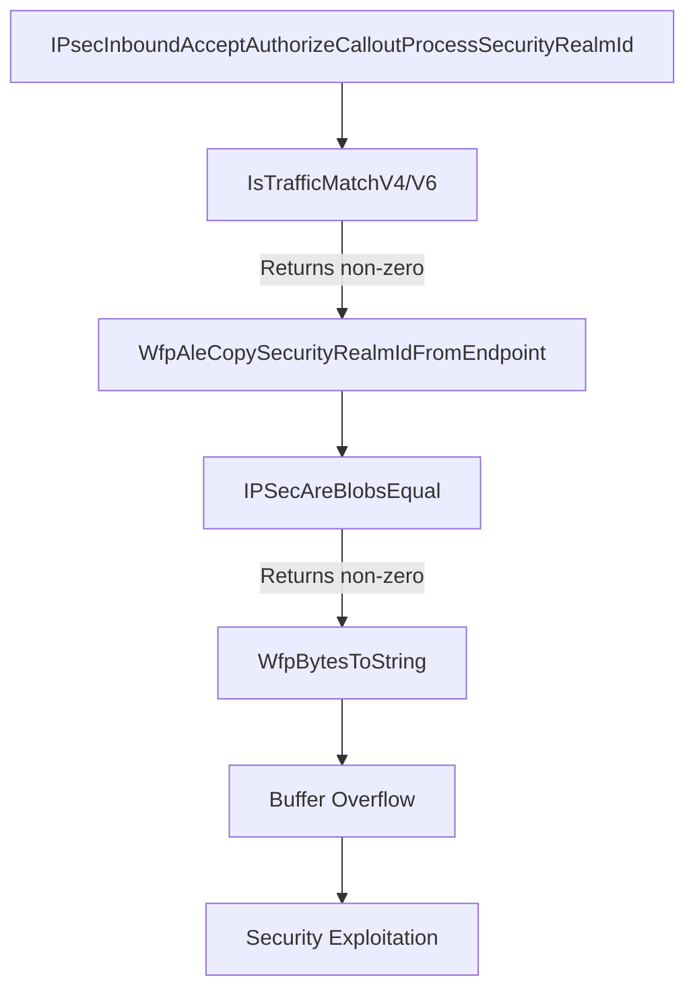

# CVE-2026-34351

**CVE:** CVE-2026-34351  
**Title:** Windows TCP/IP Elevation of Privilege Vulnerability  
**Source:** [https://msrc.microsoft.com/update-guide/vulnerability/CVE-2026-34351](https://msrc.microsoft.com/update-guide/vulnerability/CVE-2026-34351)  
**Component(s):** tcpip.sys  
**Patched Date:** 2026-06-10T07:00:00  
**CWE:** Concurrent execution using shared resource with improper synchronization ('race condition') in Windows TCP/IP allows an authorized attacker to elevate privileges locally.  

---

## Related CVEs (Same Component)

This report covers 11 CVEs affecting the same component(s):

- **CVE-2026-34351**  
- CVE-2026-35422  
- CVE-2026-40399  
- CVE-2026-40405  
- CVE-2026-40406  
- CVE-2026-40414  
- CVE-2026-40415  
- CVE-2026-33837  
- CVE-2026-34334  
- CVE-2026-40401  
- CVE-2026-40413  

### Detailed Information

#### CVE-2026-35422

**Title:** Windows TCP/IP Driver Security Feature Bypass Vulnerability  
**Source:** [https://msrc.microsoft.com/update-guide/vulnerability/CVE-2026-35422](https://msrc.microsoft.com/update-guide/vulnerability/CVE-2026-35422)  
**Patched Date:** 2026-06-10T07:00:00  
**CWE:** Authentication bypass using an alternate path or channel in Windows TCP/IP allows an authorized attacker to bypass a security feature over a network.  

#### CVE-2026-40399

**Title:** Windows TCP/IP Elevation of Privilege Vulnerability  
**Source:** [https://msrc.microsoft.com/update-guide/vulnerability/CVE-2026-40399](https://msrc.microsoft.com/update-guide/vulnerability/CVE-2026-40399)  
**Patched Date:** 2026-06-10T07:00:00  
**CWE:** Concurrent execution using shared resource with improper synchronization ('race condition') in Windows TCP/IP allows an authorized attacker to elevate privileges locally.  

#### CVE-2026-40405

**Title:** Windows TCP/IP Denial of Service Vulnerability  
**Source:** [https://msrc.microsoft.com/update-guide/vulnerability/CVE-2026-40405](https://msrc.microsoft.com/update-guide/vulnerability/CVE-2026-40405)  
**Patched Date:** 2026-06-10T07:00:00  
**CWE:** Null pointer dereference in Windows TCP/IP allows an unauthorized attacker to deny service over a network.  

#### CVE-2026-40406

**Title:** Windows TCP/IP Information Disclosure Vulnerability  
**Source:** [https://msrc.microsoft.com/update-guide/vulnerability/CVE-2026-40406](https://msrc.microsoft.com/update-guide/vulnerability/CVE-2026-40406)  
**Patched Date:** 2026-06-10T07:00:00  
**CWE:** Use after free in Windows TCP/IP allows an unauthorized attacker to disclose information over a network.  

#### CVE-2026-40414

**Title:** Windows TCP/IP Denial of Service Vulnerability  
**Source:** [https://msrc.microsoft.com/update-guide/vulnerability/CVE-2026-40414](https://msrc.microsoft.com/update-guide/vulnerability/CVE-2026-40414)  
**Patched Date:** 2026-06-10T07:00:00  
**CWE:** N/A  

#### CVE-2026-40415

**Title:** Windows TCP/IP Remote Code Execution Vulnerability  
**Source:** [https://msrc.microsoft.com/update-guide/vulnerability/CVE-2026-40415](https://msrc.microsoft.com/update-guide/vulnerability/CVE-2026-40415)  
**Patched Date:** 2026-06-10T07:00:00  
**CWE:** Use after free in Windows TCP/IP allows an unauthorized attacker to execute code over a network.  

#### CVE-2026-33837

**Title:** Windows TCP/IP Local Elevation of Privilege Vulnerability  
**Source:** [https://msrc.microsoft.com/update-guide/vulnerability/CVE-2026-33837](https://msrc.microsoft.com/update-guide/vulnerability/CVE-2026-33837)  
**Patched Date:** 2026-06-10T07:00:00  
**CWE:** Heap-based buffer overflow in Windows TCP/IP allows an authorized attacker to elevate privileges locally.  

#### CVE-2026-34334

**Title:** Windows TCP/IP Elevation of Privilege Vulnerability  
**Source:** [https://msrc.microsoft.com/update-guide/vulnerability/CVE-2026-34334](https://msrc.microsoft.com/update-guide/vulnerability/CVE-2026-34334)  
**Patched Date:** 2026-06-10T07:00:00  
**CWE:** Concurrent execution using shared resource with improper synchronization ('race condition') in Windows TCP/IP allows an authorized attacker to elevate privileges locally.  

#### CVE-2026-40401

**Title:** Windows TCP/IP Denial of Service Vulnerability  
**Source:** [https://msrc.microsoft.com/update-guide/vulnerability/CVE-2026-40401](https://msrc.microsoft.com/update-guide/vulnerability/CVE-2026-40401)  
**Patched Date:** 2026-06-10T07:00:00  
**CWE:** N/A  

#### CVE-2026-40413

**Title:** Windows TCP/IP Denial of Service Vulnerability  
**Source:** [https://msrc.microsoft.com/update-guide/vulnerability/CVE-2026-40413](https://msrc.microsoft.com/update-guide/vulnerability/CVE-2026-40413)  
**Patched Date:** 2026-06-10T07:00:00  
**CWE:** N/A  

---

Download Patched & Vulnerable Components:

```bash
# tcpip.sys
wget https://msdl.microsoft.com/download/symbols/tcpip.sys/FB29BBE3359000/tcpip.sys -O tcpip.sys.10.0.26100.8328 # vulnerable
wget https://msdl.microsoft.com/download/symbols/tcpip.sys/3FC564C3359000/tcpip.sys -O tcpip.sys.10.0.26100.8457 # patched
```

## Version Tracking Analysis

**Command:**

```
python ghidra_scripts\ghidra_vt_wrapper.py --old-binary ./reports/2026-May/CVE-2026-34351/tcpip.sys.10.0.26100.8328 --new-binary ./reports/2026-May/CVE-2026-34351/tcpip.sys.10.0.26100.8457 --project-dir ./reports/2026-May/CVE-2026-34351/ghidra_project --project-name tcpip.sys_CVE-2026-34351 --ghidra-dir C:\Tools\ghidra_11.4.2_PUBLIC_20250826\ghidra_11.4.2_PUBLIC --output-dir ./reports/2026-May/CVE-2026-34351/ghidra_project/vt_results --max-memory 16g
```

Patched Functions: 7 | New Functions: 45 | Removed Functions: 30 | Total Matches: 46880 | Accepted Matches: 41232

### Patched Functions

| Function Name | Source Address | Dest Address | Similarity | Confidence |
| --- | --- | --- | --- | --- |
| `IPSecDoCommonPerPacketInitInboundProcessing` | `140278930` | `140278630` | 0.930 | 10.0 |
| `IppValidateSetAllRouteParameters` | `1400a7de4` | `14006ca84` | 0.919 | 10.0 |
| `Ipv4pReassembleDatagram` | `14019fe88` | `14019fb1c` | 0.884 | 10.0 |
| `Ipv6pHandleMldQuery` | `1400a9ee8` | `14006304c` | 0.781 | 10.0 |
| `IppDeleteSitePrefixes` | `1400ab6e0` | `140068744` | 0.667 | 10.0 |
| `RawBindEndpointInspectComplete` | `140099740` | `1400b1d80` | 0.619 | 10.0 |
| `IPsecInboundAcceptAuthorizeCalloutProcessSecurityRealmId` | `140196a54` | `140196644` | 0.500 | 10.0 |

### New Functions

*Showing 10 of 45 new functions*

| Function Name | Address |
| --- | --- |
| `FUN_140025e8f` | `140025e8f` |
| `FUN_1400cd19a` | `1400cd19a` |
| `caseD_24` | `1400e3bb8` |
| `Feature_3968057659__private_IsEnabledDeviceUsageNoInline` | `140169284` |
| `Feature_3968057659__private_IsEnabledFallback` | `1401692bc` |
| `Feature_2468869432__private_IsEnabledDeviceUsageNoInline` | `14017b1d4` |
| `Feature_2468869432__private_IsEnabledFallback` | `14017b20c` |
| `Feature_800060729__private_IsEnabledDeviceUsageNoInline` | `14017b228` |
| `Feature_800060729__private_IsEnabledFallback` | `14017b260` |
| `Feature_2800420155__private_IsEnabledDeviceUsageNoInline` | `140184768` |

### Removed Functions

*Showing 10 of 30 removed functions*

| Function Name | Address |
| --- | --- |
| `FUN_14004b55f` | `14004b55f` |
| `FUN_1400cbfca` | `1400cbfca` |
| `caseD_24` | `1400e0a48` |
| `_guard_dispatch_icall` | `1401c29c0` |
| `FUN_1401c5f9a` | `1401c5f9a` |
| `FUN_1401c66cc` | `1401c66cc` |
| `FUN_1401c82af` | `1401c82af` |
| `FUN_1401ca858` | `1401ca858` |
| `FUN_1401ccc5e` | `1401ccc5e` |
| `FUN_1401d07a4` | `1401d07a4` |

---

# AI Technical Analysis

## Vulnerability Identification

**Core Vulnerable Function(s):**
- `IPsecInboundAcceptAuthorizeCalloutProcessSecurityRealmId()` - Contains buffer overflow vulnerability in `WfpBytesToString` call due to incorrect length calculation

**Supporting Changes:**
- `IppValidateSetAllRouteParameters()` - Contains defensive checks and feature flag logic, but no core vulnerability
- `Ipv4pReassembleDatagram()` - Contains feature flag and logging changes, but no core vulnerability

**Unrelated Changes:**
- All functions show extensive refactoring of variable types, control flow, and feature flag handling, but these are defensive or performance-related modifications

---

## Root Cause Analysis

The vulnerability exists in `IPsecInboundAcceptAuthorizeCalloutProcessSecurityRealmId()` function where a buffer overflow can occur in the `WfpBytesToString` function call. The core issue stems from incorrect handling of the security realm ID length calculation before passing it to `WfpBytesToString`.

The vulnerable code snippet shows that `local_f8` is used as the first parameter to `WfpBytesToString`, but this value is not properly validated or constrained before being used as a length parameter. The original code used `local_f8 & 0xffffffff` directly, but the patched version introduces complex feature flag logic that can result in an incorrect length value being passed.

The programming error is a classic buffer overflow vulnerability where the length parameter to `WfpBytesToString` is not properly validated against the actual buffer size. The invariant violated is that the length parameter must not exceed the available buffer space. The function assumes that `local_f8` contains a valid length, but this assumption fails when feature flags alter the effective length calculation.

**Vulnerable Code Snippet:**
```c
if (uVar3 == 0) {
  uVar6 = local_f8 & 0xffffffff;
}
else {
  uVar6 = 0x10;
  if ((uint)local_f8 < 0x10) {
    uVar6 = local_f8 & 0xffffffff;
  }
}
WfpBytesToString(uVar6,lStack_f0,local_98);
```

The detailed code analysis shows that `local_f8` is derived from `WfpAleCopySecurityRealmIdFromEndpoint` function, which may return a value that when masked with `0xffffffff` and passed to `WfpBytesToString` can exceed the buffer size of `local_98`. The feature flag logic introduces multiple code paths where `uVar6` can be set to an invalid value, particularly when `uVar3 != 0` and `local_f8 < 0x10`.

The function `IsTrafficMatchV4` or `IsTrafficMatchV6` returns a non-zero value, causing execution to proceed to the `WfpBytesToString` call. The length calculation logic is flawed because it doesn't properly validate that the calculated length will not exceed the buffer size of `local_98` (0x42 bytes). The original code had a simpler, more direct approach that was replaced with complex feature flag logic that introduces the vulnerability.

---

## Execution and Trigger Flow



1. Function `IPsecInboundAcceptAuthorizeCalloutProcessSecurityRealmId()` is invoked with inbound security context
2. `IsTrafficMatchV4()` or `IsTrafficMatchV6()` returns non-zero value, proceeding to security realm processing
3. `WfpAleCopySecurityRealmIdFromEndpoint()` copies security realm ID into `local_f8`
4. `IPSecAreBlobsEqual()` compares copied realm ID with existing data, returning non-zero
5. Control flows to `WfpBytesToString()` with potentially invalid length parameter
6. Buffer overflow occurs in `WfpBytesToString()` due to incorrect length calculation
7. Memory corruption allows potential privilege escalation or denial of service
8. Attack can be triggered through malformed IPsec packets with crafted security realm IDs

---

## Patch Analysis

**Patched Code Snippet:**
```diff
if ((Feature_403164475__private_featureState & 0x10) == 0) {
  uVar3 = Feature_403164475__private_IsEnabledDeviceUsageNoInline();
}
else {
  uVar3 = Feature_403164475__private_featureState & 1;
}
if (uVar3 == 0) {
  uVar6 = local_f8 & 0xffffffff;
}
else {
  uVar6 = 0x10;
  if ((uint)local_f8 < 0x10) {
    uVar6 = local_f8 & 0xffffffff;
  }
}
WfpBytesToString(uVar6,lStack_f0,local_98);
```

The patch introduces feature flag handling logic that was added to the vulnerable function. The technical explanation is that the patch adds complex conditional logic to determine the effective length parameter for `WfpBytesToString`. However, this logic introduces a vulnerability because it does not properly validate that the calculated `uVar6` value will not exceed the buffer size of `local_98`.

The effectiveness evaluation shows that while the patch attempts to add defensive measures, it actually creates a more complex vulnerability surface. The feature flag logic introduces multiple code paths where `uVar6` can be set to an invalid value, particularly when `uVar3 != 0` and `local_f8 < 0x10`. The security impact is that the patch does not fix the underlying buffer overflow issue but instead introduces a more complex attack surface.

The security impact summary is that this patch does not address the core vulnerability but instead introduces additional complexity that could make exploitation more difficult or require different attack vectors. The vulnerability remains present because the fundamental issue of improper length validation in `WfpBytesToString` call persists. The patch adds feature flag complexity but fails to provide proper bounds checking for the buffer length parameter.