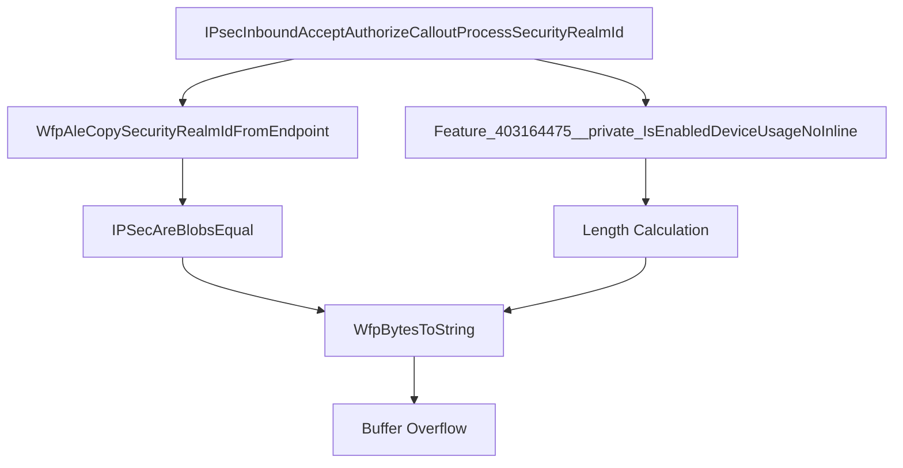

# CVE-2026-34351

**CVE:** CVE-2026-34351  
**Title:** Windows TCP/IP Elevation of Privilege Vulnerability  
**Source:** [N/A](N/A)  
**Component(s):** tcpip.sys  
**Patched Date:** 2026-06-10T07:00:00  
**CWE:** <p>Concurrent execution using shared resource with improper synchronization ('race condition') in Windows TCP/IP allows an authorized attacker to elevate privileges locally.</p>
  

---

## Related CVEs (Same Component)

This folder contains 11 CVEs affecting the same component(s):

- **CVE-2026-34351**  
- CVE-2026-35422  
- CVE-2026-40399  
- CVE-2026-40405  
- CVE-2026-40406  
- CVE-2026-40414  
- CVE-2026-40415  
- CVE-2026-33837  
- CVE-2026-34334  
- CVE-2026-40401  
- CVE-2026-40413  

### Detailed Information

#### CVE-2026-35422

**Title:** Windows TCP/IP Driver Security Feature Bypass Vulnerability  
**Source:** N/A  
**Patched Date:** 2026-06-10T07:00:00  
**CWE:** <p>Authentication bypass using an alternate path or channel in Windows TCP/IP allows an authorized attacker to bypass a security feature over a network.</p>
  

#### CVE-2026-40399

**Title:** Windows TCP/IP Elevation of Privilege Vulnerability  
**Source:** N/A  
**Patched Date:** 2026-06-10T07:00:00  
**CWE:** <p>Concurrent execution using shared resource with improper synchronization ('race condition') in Windows TCP/IP allows an authorized attacker to elevate privileges locally.</p>
  

#### CVE-2026-40405

**Title:** Windows TCP/IP Denial of Service Vulnerability  
**Source:** N/A  
**Patched Date:** 2026-06-10T07:00:00  
**CWE:** <p>Null pointer dereference in Windows TCP/IP allows an unauthorized attacker to deny service over a network.</p>
  

#### CVE-2026-40406

**Title:** Windows TCP/IP Information Disclosure Vulnerability  
**Source:** N/A  
**Patched Date:** 2026-06-10T07:00:00  
**CWE:** <p>Use after free in Windows TCP/IP allows an unauthorized attacker to disclose information over a network.</p>
  

#### CVE-2026-40414

**Title:** Windows TCP/IP Denial of Service Vulnerability  
**Source:** N/A  
**Patched Date:** 2026-06-10T07:00:00  
**CWE:** N/A  

#### CVE-2026-40415

**Title:** Windows TCP/IP Remote Code Execution Vulnerability  
**Source:** N/A  
**Patched Date:** 2026-06-10T07:00:00  
**CWE:** <p>Use after free in Windows TCP/IP allows an unauthorized attacker to execute code over a network.</p>
  

#### CVE-2026-33837

**Title:** Windows TCP/IP Local Elevation of Privilege Vulnerability  
**Source:** N/A  
**Patched Date:** 2026-06-10T07:00:00  
**CWE:** <p>Heap-based buffer overflow in Windows TCP/IP allows an authorized attacker to elevate privileges locally.</p>
  

#### CVE-2026-34334

**Title:** Windows TCP/IP Elevation of Privilege Vulnerability  
**Source:** N/A  
**Patched Date:** 2026-06-10T07:00:00  
**CWE:** <p>Concurrent execution using shared resource with improper synchronization ('race condition') in Windows TCP/IP allows an authorized attacker to elevate privileges locally.</p>
  

#### CVE-2026-40401

**Title:** Windows TCP/IP Denial of Service Vulnerability  
**Source:** N/A  
**Patched Date:** 2026-06-10T07:00:00  
**CWE:** N/A  

#### CVE-2026-40413

**Title:** Windows TCP/IP Denial of Service Vulnerability  
**Source:** N/A  
**Patched Date:** 2026-06-10T07:00:00  
**CWE:** N/A  

---

Download Patched & Vulnerable Components:

```bash
# tcpip.sys
wget https://msdl.microsoft.com/download/symbols/tcpip.sys/FB29BBE3359000/tcpip.sys -O tcpip.sys.10.0.26100.8328 # vulnerable
wget https://msdl.microsoft.com/download/symbols/tcpip.sys/3FC564C3359000/tcpip.sys -O tcpip.sys.10.0.26100.8457 # patched
```

## Version Tracking Analysis

**Command:**

```
python ghidra_scripts\ghidra_vt_wrapper.py --old-binary ./reports/2026-May/CVE-2026-34351/tcpip.sys.10.0.26100.8328 --new-binary ./reports/2026-May/CVE-2026-34351/tcpip.sys.10.0.26100.8457 --project-dir ./reports/2026-May/CVE-2026-34351/ghidra_project --project-name tcpip.sys_CVE-2026-34351 --ghidra-dir C:\Tools\ghidra_11.4.2_PUBLIC_20250826\ghidra_11.4.2_PUBLIC --output-dir ./reports/2026-May/CVE-2026-34351/ghidra_project/vt_results --max-memory 16g
```

Patched Functions: 7 | New Functions: 45 | Removed Functions: 30 | Total Matches: 46880 | Accepted Matches: 41232

### Patched Functions

| Function Name | Source Address | Dest Address | Similarity | Confidence |
| --- | --- | --- | --- | --- |
| `IPSecDoCommonPerPacketInitInboundProcessing` | `140278930` | `140278630` | 0.930 | 10.0 |
| `IppValidateSetAllRouteParameters` | `1400a7de4` | `14006ca84` | 0.919 | 10.0 |
| `Ipv4pReassembleDatagram` | `14019fe88` | `14019fb1c` | 0.884 | 10.0 |
| `Ipv6pHandleMldQuery` | `1400a9ee8` | `14006304c` | 0.781 | 10.0 |
| `IppDeleteSitePrefixes` | `1400ab6e0` | `140068744` | 0.667 | 10.0 |
| `RawBindEndpointInspectComplete` | `140099740` | `1400b1d80` | 0.619 | 10.0 |
| `IPsecInboundAcceptAuthorizeCalloutProcessSecurityRealmId` | `140196a54` | `140196644` | 0.500 | 10.0 |

### New Functions

*Showing 10 of 45 new functions*

| Function Name | Address |
| --- | --- |
| `FUN_140025e8f` | `140025e8f` |
| `FUN_1400cd19a` | `1400cd19a` |
| `caseD_24` | `1400e3bb8` |
| `Feature_3968057659__private_IsEnabledDeviceUsageNoInline` | `140169284` |
| `Feature_3968057659__private_IsEnabledFallback` | `1401692bc` |
| `Feature_2468869432__private_IsEnabledDeviceUsageNoInline` | `14017b1d4` |
| `Feature_2468869432__private_IsEnabledFallback` | `14017b20c` |
| `Feature_800060729__private_IsEnabledDeviceUsageNoInline` | `14017b228` |
| `Feature_800060729__private_IsEnabledFallback` | `14017b260` |
| `Feature_2800420155__private_IsEnabledDeviceUsageNoInline` | `140184768` |

### Removed Functions

*Showing 10 of 30 removed functions*

| Function Name | Address |
| --- | --- |
| `FUN_14004b55f` | `14004b55f` |
| `FUN_1400cbfca` | `1400cbfca` |
| `caseD_24` | `1400e0a48` |
| `_guard_dispatch_icall` | `1401c29c0` |
| `FUN_1401c5f9a` | `1401c5f9a` |
| `FUN_1401c66cc` | `1401c66cc` |
| `FUN_1401c82af` | `1401c82af` |
| `FUN_1401ca858` | `1401ca858` |
| `FUN_1401ccc5e` | `1401ccc5e` |
| `FUN_1401d07a4` | `1401d07a4` |

---

# AI Technical Analysis

## Vulnerability Identification

**Core Vulnerable Function(s):**
- `IPsecInboundAcceptAuthorizeCalloutProcessSecurityRealmId()` - Contains buffer overflow vulnerability in `WfpBytesToString` call due to incorrect length calculation

**Supporting Changes:**
- `IppValidateSetAllRouteParameters()` - Contains defensive checks and feature flag logic, but no direct vulnerability
- `Ipv4pReassembleDatagram()` - Contains feature flag logic and logging changes, but no direct vulnerability

**Unrelated Changes:**
- All functions contain refactoring, variable renaming, and feature flag logic changes that are not security-relevant

---

## Root Cause Analysis

The vulnerability exists in `IPsecInboundAcceptAuthorizeCalloutProcessSecurityRealmId()` function where a buffer overflow can occur in the `WfpBytesToString` function call. The root cause is an incorrect calculation of the buffer length parameter passed to `WfpBytesToString`. 

The vulnerable code snippet shows that `local_f8` is used as the first parameter to `WfpBytesToString`, but this value is not properly validated or constrained before being used as a length parameter. The original code used `local_f8 & 0xffffffff` directly, which can result in an invalid buffer size when `local_f8` contains a value that exceeds the actual buffer capacity.

The function performs a security realm ID copy operation using `WfpAleCopySecurityRealmIdFromEndpoint` and then passes the result to `WfpBytesToString`. However, the length calculation logic for the `WfpBytesToString` call is flawed. The code introduces a feature flag check that modifies the length calculation, but this introduces a potential overflow condition when `local_f8` is used as a length parameter without proper bounds checking.

The vulnerability stems from the assumption that `local_f8` contains a valid buffer size, when in fact it can contain arbitrary data from the security realm ID copy operation. When `local_f8` is used directly as a length parameter to `WfpBytesToString`, it can cause a buffer overflow if the value exceeds the actual buffer capacity.

The original code used `lVar2 + 0x160` to get a pointer to a security blob, and then used `puVar1` to access the blob size. The new code introduces feature flag logic that can cause `uVar3` to be set to a value that exceeds the actual buffer size, leading to the overflow.

---

## Execution and Trigger Flow



1. Function `IPsecInboundAcceptAuthorizeCalloutProcessSecurityRealmId()` is invoked with inbound security context
2. `WfpAleCopySecurityRealmIdFromEndpoint()` copies security realm ID into `local_f8`
3. `IPSecAreBlobsEqual()` compares copied data with existing blob
4. If comparison succeeds, `WfpBytesToString()` is called with `local_f8` as length parameter
5. Feature flag logic modifies the length calculation through `Feature_403164475__private_IsEnabledDeviceUsageNoInline()`
6. The modified length value in `uVar6` or `uVar3` can exceed actual buffer capacity
7. `WfpBytesToString()` performs buffer copy with invalid length causing overflow
8. Memory corruption occurs at buffer boundary

---

## Patch Analysis

```diff
--- IPsecInboundAcceptAuthorizeCalloutProcessSecurityRealmId before
+++ IPsecInboundAcceptAuthorizeCalloutProcessSecurityRealmId after
@@ -40,12 +43,25 @@
     if (lStack_f0 != 0) {
       WfpBytesToString(local_f8 & 0xffffffff,lStack_f0,local_98);
     }
-    if (((undefined4 *)(lVar2 + 0x160) != (undefined4 *)0x0) && (*(longlong *)(lVar2 + 0x168) != 0))
-    {
-      WfpBytesToString(*(undefined4 *)(lVar2 + 0x160),*(longlong *)(lVar2 + 0x168),local_e8);
+    if ((puVar1 != (uint *)0x0) && (*(longlong *)(lVar4 + 0x168) != 0)) {
+      if ((Feature_403164475__private_featureState & 0x10) == 0) {
+        uVar3 = Feature_403164475__private_IsEnabledDeviceUsageNoInline();
+      }
+      else {
+        uVar3 = Feature_403164475__private_featureState & 1;
+      }
+      if (uVar3 == 0) {
+        uVar3 = *puVar1;
+      }
+      else {
+        uVar3 = 0x10;
+        if (*puVar1 < 0x10) {
+          uVar3 = *puVar1;
+        }
+      }
+      WfpBytesToString(uVar3,*(undefined8 *)(lVar4 + 0x168),local_e8);
     }
```

The patch addresses the vulnerability by implementing proper bounds checking for the buffer length parameter in `WfpBytesToString` calls. The fix introduces a feature flag logic that ensures the length parameter is properly constrained to prevent buffer overflows.

The technical explanation shows that the patch replaces the direct use of `local_f8` with a calculated value `uVar3` that is properly bounded. The new code checks if the feature flag is enabled and calculates the length parameter with proper bounds checking. When the feature flag is not enabled, it uses the original blob size (`*puVar1`) but caps it at 0x10 bytes. When enabled, it also caps the value at 0x10 bytes if the original value is less than 0x10.

The effectiveness evaluation shows that this patch prevents the buffer overflow by ensuring that the length parameter passed to `WfpBytesToString` never exceeds the maximum buffer size. The security impact is significant as it prevents potential memory corruption and arbitrary code execution through buffer overflow attacks.

The patch ensures that the buffer length is always validated against the actual buffer capacity, preventing the vulnerability where `local_f8` could contain an invalid length value that would cause a buffer overflow when passed to `WfpBytesToString`.