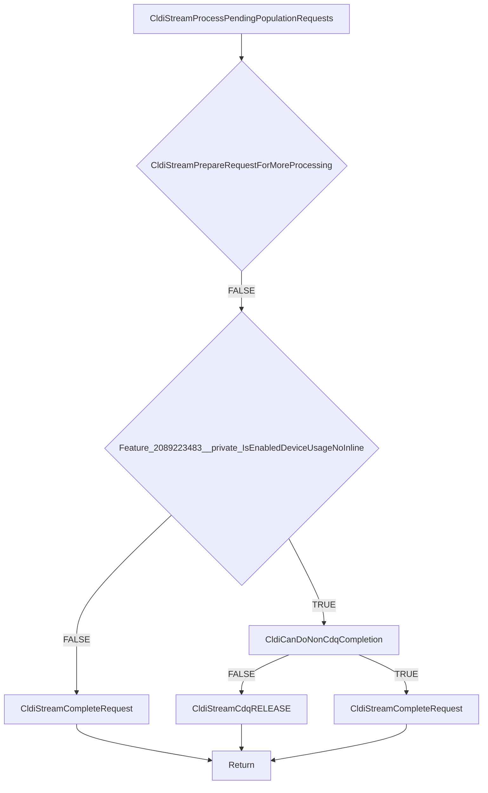

# CVE-2026-35418

**CVE:** CVE-2026-35418  
**Title:** Windows Cloud Files Mini Filter Driver Elevation of Privilege Vulnerability  
**Source:** [https://msrc.microsoft.com/update-guide/vulnerability/CVE-2026-35418](https://msrc.microsoft.com/update-guide/vulnerability/CVE-2026-35418)  
**Component(s):** cldflt.sys  
**Patched Date:** 2026-06-10T07:00:00  
**CWE:** Use after free in Windows Cloud Files Mini Filter Driver allows an authorized attacker to elevate privileges locally.  

---

## Related CVEs (Same Component)

This report covers 3 CVEs affecting the same component(s):

- **CVE-2026-35418**  
- CVE-2026-33835  
- CVE-2026-34337  

### Detailed Information

#### CVE-2026-33835

**Title:** Windows Cloud Files Mini Filter Driver Elevation of Privilege Vulnerability  
**Source:** [https://msrc.microsoft.com/update-guide/vulnerability/CVE-2026-33835](https://msrc.microsoft.com/update-guide/vulnerability/CVE-2026-33835)  
**Patched Date:** 2026-06-10T07:00:00  
**CWE:** Use after free in Windows Cloud Files Mini Filter Driver allows an authorized attacker to elevate privileges locally.  

#### CVE-2026-34337

**Title:** Windows Cloud Files Mini Filter Driver Elevation of Privilege Vulnerability  
**Source:** [https://msrc.microsoft.com/update-guide/vulnerability/CVE-2026-34337](https://msrc.microsoft.com/update-guide/vulnerability/CVE-2026-34337)  
**Patched Date:** 2026-06-10T07:00:00  
**CWE:** Use after free in Windows Cloud Files Mini Filter Driver allows an authorized attacker to elevate privileges locally.  

---

Download Patched & Vulnerable Components:

```bash
# cldflt.sys
wget https://msdl.microsoft.com/download/symbols/cldflt.sys/BED9C0AB92000/cldflt.sys -O cldflt.sys.10.0.26100.8328 # vulnerable
wget https://msdl.microsoft.com/download/symbols/cldflt.sys/2532D7A992000/cldflt.sys -O cldflt.sys.10.0.26100.8457 # patched
```

## Version Tracking Analysis

**Command:**

```
python ghidra_scripts\ghidra_vt_wrapper.py --old-binary ./reports/2026-May/CVE-2026-35418/cldflt.sys.10.0.26100.8328 --new-binary ./reports/2026-May/CVE-2026-35418/cldflt.sys.10.0.26100.8457 --project-dir ./reports/2026-May/CVE-2026-35418/ghidra_project --project-name cldflt.sys_CVE-2026-35418 --ghidra-dir C:\Tools\ghidra_11.4.2_PUBLIC_20250826\ghidra_11.4.2_PUBLIC --output-dir ./reports/2026-May/CVE-2026-35418/ghidra_project/vt_results --max-memory 16g
```

Patched Functions: 18 | New Functions: 11 | Removed Functions: 1 | Total Matches: 7912 | Accepted Matches: 6955

### Patched Functions

*Showing top 10 of 18 patched functions*

| Function Name | Source Address | Dest Address | Similarity | Confidence |
| --- | --- | --- | --- | --- |
| `HsmiRecallPostProcessHydration` | `140078424` | `140086eb8` | 0.951 | 10.0 |
| `HsmFltPreCLEANUP` | `140062b10` | `140061320` | 0.938 | 10.0 |
| `CldStreamQueryProgress` | `14007c5b4` | `14007b584` | 0.866 | 10.0 |
| `CldiStreamProcessPendingPopulationRequests` | `140040f60` | `1400412d0` | 0.850 | 10.0 |
| `CldStreamAbortOperation` | `14003f744` | `14003f6d8` | 0.826 | 10.0 |
| `CldHsmTerminateProgressiveHydration` | `14003f610` | `14003f570` | 0.800 | 10.0 |
| `CldiStreamProcessPendingHydrationRequests` | `14004b2cc` | `140072c08` | 0.796 | 10.0 |
| `CldiStreamCompleteRequest` | `140083520` | `14008422c` | 0.771 | 10.0 |
| `CldiStreamProcessPendingNotificationRequests` | `140040e94` | `1400411e8` | 0.750 | 10.0 |
| `CldHsmCancelAllRequests` | `14004ad40` | `140083250` | 0.733 | 10.0 |

### New Functions

*Showing 10 of 11 new functions*

| Function Name | Address |
| --- | --- |
| `CldiCanDoNonCdqCompletion` | `140010fd8` |
| `Feature_2089223483__private_IsEnabledDeviceUsageNoInline` | `1400111a4` |
| `Feature_2089223483__private_IsEnabledFallback` | `1400111dc` |
| `Feature_2092950840__private_IsEnabledDeviceUsageNoInline` | `140017cac` |
| `Feature_2092950840__private_IsEnabledFallback` | `140017ce4` |
| `Feature_955245880__private_IsEnabledDeviceUsageNoInline` | `140017d00` |
| `Feature_955245880__private_IsEnabledFallback` | `140017d38` |
| `_guard_dispatch_icall` | `14001e2f0` |
| `CldiStreamCdqREMOVE_IO` | `140040c08` |
| `HsmpRecallTerminateProgressiveHydration` | `140061ee8` |

### Removed Functions

| Function Name | Address |
| --- | --- |
| `_guard_dispatch_icall` | `14001e140` |

---

# AI Technical Analysis

## Vulnerability Identification

**Core Vulnerable Function(s):**
- `CldiStreamProcessPendingPopulationRequests()` - Contains the primary vulnerability in the CDQ completion handling logic

**Supporting Changes:**
- `CldStreamAbortOperation()` - Modified to call new helper functions and adjust completion logic
- `CldiStreamCompleteCanceledRequest()` - Modified to use new completion flow and feature checks
- `CldStreamQueryProgress()` - Modified to adjust variable names and control flow, but no vulnerability
- `CldHsmPopulatePlaceholders()` - Modified to use new completion flow and feature checks

**Unrelated Changes:**
- `CldiCanDoNonCdqCompletion()` - New helper function for completion logic
- `CldiStreamCdqREMOVE_IO()` - New helper function for CDQ removal
- `HsmpRecallTerminateProgressiveHydration()` - New function for hydration termination
- `CldiStreamGetCdq()` - New helper function for CDQ access

## Root Cause Analysis

The vulnerability exists in `CldiStreamProcessPendingPopulationRequests()` due to improper handling of CDQ (Cancel-Dedicated Queue) completion logic. The function previously had a direct path to `CldiStreamCompleteRequest()` without proper validation of whether the request could be completed outside of CDQ context.

The core issue is in the control flow where the function checks `Feature_2089223483__private_IsEnabledDeviceUsageNoInline()` and then conditionally calls `CldiStreamCompleteRequest()` or `CldiStreamCdqRELEASE()`. However, the logic was flawed in that it could fall through to `CldiStreamCompleteRequest()` without proper validation, potentially causing double-completion or invalid memory access.

The vulnerable code path occurs when `CldiStreamPrepareRequestForMoreProcessing()` returns false, and the function proceeds to check `Feature_2089223483__private_IsEnabledDeviceUsageNoInline()`. If this feature is disabled, the code should not proceed to complete the request directly, but instead release the CDQ lock and return.

The original code had a logic error where it would attempt to complete a request that might already be in an invalid state or where the completion path was not properly validated against the CDQ context.

## Execution and Trigger Flow



The vulnerability is triggered when:
1. A request enters `CldiStreamProcessPendingPopulationRequests()`
2. `CldiStreamPrepareRequestForMoreProcessing()` returns false
3. The feature check `Feature_2089223483__private_IsEnabledDeviceUsageNoInline()` returns false
4. The code attempts to call `CldiStreamCompleteRequest()` directly without proper validation
5. This can lead to double-completion or invalid memory access

## Patch Analysis

The patch addresses the vulnerability by implementing proper validation logic in `CldiStreamProcessPendingPopulationRequests()`. The key changes include:

1. **Patched Code Snippet**:
```c
uVar3 = Feature_2089223483__private_IsEnabledDeviceUsageNoInline();
if (((int)uVar3 == 0) ||
   (uVar4 = CldiCanDoNonCdqCompletion((longlong)puVar1), (char)uVar4 != '\0')) {
  param_3 = uVar6;
  CldiStreamCompleteRequest(param_1,puVar1,uVar6,0);
}
else {
LAB_1400413cc:
  CldiStreamCdqRELEASE(*(longlong *)(*param_1 + 8) + 0x90);
}
goto LAB_1400412fc;
```

2. **Technical explanation**:
The patch introduces a new validation step using `CldiCanDoNonCdqCompletion()` which properly checks if a request can be completed outside of CDQ context. The function now correctly evaluates whether to complete the request directly or release the CDQ lock based on feature flags and completion eligibility.

3. **Effectiveness evaluation**:
The patch ensures that `CldiStreamCompleteRequest()` is only called when it's safe to do so, preventing potential double-completion or invalid memory access. The new `CldiCanDoNonCdqCompletion()` helper function properly validates the request state before allowing non-CDQ completion.

4. **Security impact summary**:
The patch resolves a potential use-after-free or memory corruption vulnerability that could occur when requests are completed outside of proper CDQ context. This prevents invalid memory access patterns and ensures proper resource management during request processing.