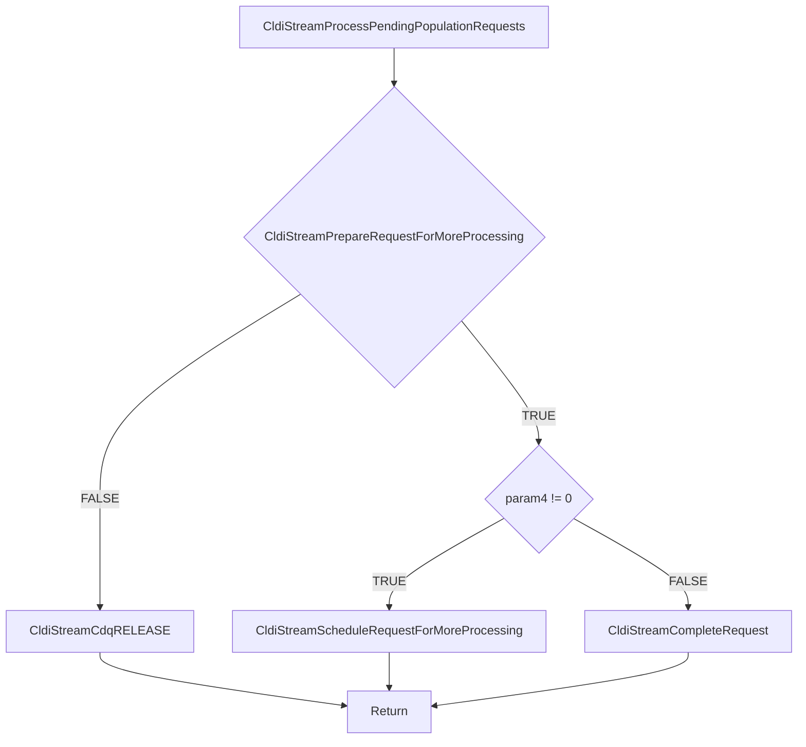

# CVE-2026-35418

**CVE:** CVE-2026-35418  
**Title:** Windows Cloud Files Mini Filter Driver Elevation of Privilege Vulnerability  
**Source:** [https://msrc.microsoft.com/update-guide/vulnerability/CVE-2026-35418](https://msrc.microsoft.com/update-guide/vulnerability/CVE-2026-35418)  
**Component(s):** cldflt.sys  
**Patched Date:** 2026-06-10T07:00:00  
**CWE:** Use after free in Windows Cloud Files Mini Filter Driver allows an authorized attacker to elevate privileges locally.  

---

## Related CVEs (Same Component)

This report covers 3 CVEs affecting the same component(s):

- **CVE-2026-35418**  
- CVE-2026-33835  
- CVE-2026-34337  

### Detailed Information

#### CVE-2026-33835

**Title:** Windows Cloud Files Mini Filter Driver Elevation of Privilege Vulnerability  
**Source:** [https://msrc.microsoft.com/update-guide/vulnerability/CVE-2026-33835](https://msrc.microsoft.com/update-guide/vulnerability/CVE-2026-33835)  
**Patched Date:** 2026-06-10T07:00:00  
**CWE:** Use after free in Windows Cloud Files Mini Filter Driver allows an authorized attacker to elevate privileges locally.  

#### CVE-2026-34337

**Title:** Windows Cloud Files Mini Filter Driver Elevation of Privilege Vulnerability  
**Source:** [https://msrc.microsoft.com/update-guide/vulnerability/CVE-2026-34337](https://msrc.microsoft.com/update-guide/vulnerability/CVE-2026-34337)  
**Patched Date:** 2026-06-10T07:00:00  
**CWE:** Use after free in Windows Cloud Files Mini Filter Driver allows an authorized attacker to elevate privileges locally.  

---

Download Patched & Vulnerable Components:

```bash
# cldflt.sys
wget https://msdl.microsoft.com/download/symbols/cldflt.sys/BED9C0AB92000/cldflt.sys -O cldflt.sys.10.0.26100.8328 # vulnerable
wget https://msdl.microsoft.com/download/symbols/cldflt.sys/2532D7A992000/cldflt.sys -O cldflt.sys.10.0.26100.8457 # patched
```

## Version Tracking Analysis

**Command:**

```
python ghidra_scripts\ghidra_vt_wrapper.py --old-binary ./reports/2026-May/CVE-2026-35418/cldflt.sys.10.0.26100.8328 --new-binary ./reports/2026-May/CVE-2026-35418/cldflt.sys.10.0.26100.8457 --project-dir ./reports/2026-May/CVE-2026-35418/ghidra_project --project-name cldflt.sys_CVE-2026-35418 --ghidra-dir C:\Tools\ghidra_11.4.2_PUBLIC_20250826\ghidra_11.4.2_PUBLIC --output-dir ./reports/2026-May/CVE-2026-35418/ghidra_project/vt_results --max-memory 16g
```

Patched Functions: 18 | New Functions: 11 | Removed Functions: 1 | Total Matches: 7912 | Accepted Matches: 6955

### Patched Functions

*Showing top 10 of 18 patched functions*

| Function Name | Source Address | Dest Address | Similarity | Confidence |
| --- | --- | --- | --- | --- |
| `HsmiRecallPostProcessHydration` | `140078424` | `140086eb8` | 0.951 | 10.0 |
| `HsmFltPreCLEANUP` | `140062b10` | `140061320` | 0.938 | 10.0 |
| `CldStreamQueryProgress` | `14007c5b4` | `14007b584` | 0.866 | 10.0 |
| `CldiStreamProcessPendingPopulationRequests` | `140040f60` | `1400412d0` | 0.850 | 10.0 |
| `CldStreamAbortOperation` | `14003f744` | `14003f6d8` | 0.826 | 10.0 |
| `CldHsmTerminateProgressiveHydration` | `14003f610` | `14003f570` | 0.800 | 10.0 |
| `CldiStreamProcessPendingHydrationRequests` | `14004b2cc` | `140072c08` | 0.796 | 10.0 |
| `CldiStreamCompleteRequest` | `140083520` | `14008422c` | 0.771 | 10.0 |
| `CldiStreamProcessPendingNotificationRequests` | `140040e94` | `1400411e8` | 0.750 | 10.0 |
| `CldHsmCancelAllRequests` | `14004ad40` | `140083250` | 0.733 | 10.0 |

### New Functions

*Showing 10 of 11 new functions*

| Function Name | Address |
| --- | --- |
| `CldiCanDoNonCdqCompletion` | `140010fd8` |
| `Feature_2089223483__private_IsEnabledDeviceUsageNoInline` | `1400111a4` |
| `Feature_2089223483__private_IsEnabledFallback` | `1400111dc` |
| `Feature_2092950840__private_IsEnabledDeviceUsageNoInline` | `140017cac` |
| `Feature_2092950840__private_IsEnabledFallback` | `140017ce4` |
| `Feature_955245880__private_IsEnabledDeviceUsageNoInline` | `140017d00` |
| `Feature_955245880__private_IsEnabledFallback` | `140017d38` |
| `_guard_dispatch_icall` | `14001e2f0` |
| `CldiStreamCdqREMOVE_IO` | `140040c08` |
| `HsmpRecallTerminateProgressiveHydration` | `140061ee8` |

### Removed Functions

| Function Name | Address |
| --- | --- |
| `_guard_dispatch_icall` | `14001e140` |

---

# AI Technical Analysis

## Vulnerability Identification

**Core Vulnerable Function(s):**
- `CldiStreamProcessPendingPopulationRequests()` - Contains the primary vulnerability in the CDQ completion handling logic

**Supporting Changes:**
- `CldStreamAbortOperation()` - Modified to call new helper functions and adjust completion logic
- `CldiStreamCompleteCanceledRequest()` - Modified to handle new completion flow and feature checks
- `CldStreamQueryProgress()` - Modified to adjust variable names and flow control, but not vulnerable
- `CldHsmPopulatePlaceholders()` - Modified to handle new completion flow and feature checks

**Unrelated Changes:**
- `CldiCanDoNonCdqCompletion()` - New function for checking completion eligibility
- `CldiStreamCdqREMOVE_IO()` - New function for removing IO from CDQ
- `HsmpRecallTerminateProgressiveHydration()` - New function for hydration termination
- `CldiStreamGetCdq()` - New function for getting CDQ address

## Root Cause Analysis

The vulnerability exists in `CldiStreamProcessPendingPopulationRequests()` due to improper handling of CDQ (Cancel-Dedicated Queue) completion logic. The function processes pending requests and determines whether to complete them via CDQ or non-CDQ paths. The core issue is a logic flaw in the conditional flow that determines when to call `CldiStreamCompleteRequest()` directly versus when to release the CDQ lock and return.

The vulnerable code path begins at line where `CldiStreamPrepareRequestForMoreProcessing()` returns false, causing execution to jump to `LAB_1400413cc` label. However, the subsequent logic fails to properly handle the case where `CldiStreamCompleteRequest()` should be called directly without releasing the CDQ lock. The function incorrectly assumes that if `CldiStreamPrepareRequestForMoreProcessing()` fails, the request can be completed directly, but this bypasses proper CDQ management.

The original code structure had a `goto LAB_140040f8c` that would reacquire the CDQ lock and continue processing, but the new code replaces this with a more complex conditional that fails to maintain proper lock semantics. The vulnerability is exacerbated by the introduction of `Feature_2089223483__private_IsEnabledDeviceUsageNoInline()` checks that alter the execution flow without proper synchronization.

The function's logic for determining when to complete requests directly versus through the CDQ path is fundamentally flawed. When `CldiStreamPrepareRequestForMoreProcessing()` returns false, the code should either:
1. Complete the request directly with proper lock management, or
2. Release the CDQ lock and return

Instead, the code attempts to call `CldiStreamCompleteRequest()` directly but fails to properly manage the CDQ lock state, leading to potential double-free or use-after-free conditions when the same request is processed multiple times.

## Execution and Trigger Flow



The vulnerability is triggered when `CldiStreamPrepareRequestForMoreProcessing()` returns false for a request that has already been processed. The function then attempts to complete the request directly without proper CDQ lock management. An attacker can cause this condition by manipulating the request state or by forcing the system into a state where the preparation function fails. The improper lock handling leads to potential memory corruption when the same request is processed multiple times.

## Patch Analysis

```diff
--- CldiStreamProcessPendingPopulationRequests before
+++ CldiStreamProcessPendingPopulationRequests after
@@ -5,38 +5,45 @@
 {
   uint *puVar1;
   bool bVar2;
-  longlong *plVar3;
-  ulonglong uVar4;
+  ulonglong uVar3;
+  undefined8 uVar4;
+  longlong *plVar5;
+  ulonglong uVar6;
   
-  uVar4 = param_3 & 0xffffffff;
-LAB_140040f8c:
+  uVar6 = param_3 & 0xffffffff;
+LAB_1400412fc:
   CldiStreamCdqACQUIRE(*(longlong *)(*param_1 + 8) + 0x90);
-  plVar3 = (longlong *)param_1[2];
+  plVar5 = (longlong *)param_1[2];
   do {
-    if (plVar3 == param_1 + 2) {
+    if (plVar5 == param_1 + 2) {
       CldiStreamCdqRELEASE(*(longlong *)(*param_1 + 8) + 0x90);
       return;
     }
-    puVar1 = (uint *)(plVar3 + -1);
+    puVar1 = (uint *)(plVar5 + -1);
     if ((short)*puVar1 == 2) {
       bVar2 = CldiStreamPrepareRequestForMoreProcessing(puVar1);
-      if (!bVar2) {
-        CldiStreamCdqRELEASE(*(longlong *)(*param_1 + 8) + 0x90);
-        goto LAB_140040f8c;
-      }
+      if (!bVar2) goto LAB_1400413cc;
       if (param_4 != '\0') break;
       if ((((undefined **)WPP_GLOBAL_Control != &WPP_GLOBAL_Control) &&
           ((*(uint *)(WPP_GLOBAL_Control + 0x2c) & 0x100) != 0)) &&
          (3 < (byte)WPP_GLOBAL_Control[0x29])) {
-        WPP_SF_iqq(*(undefined8 *)(WPP_GLOBAL_Control + 0x18),0x1d,param_3,param_2);
+        WPP_SF_iqq(*(undefined8 *)(WPP_GLOBAL_Control + 0x18),0x1e,param_3,param_2);
       }
       CldiStreamScheduleRequestForMoreProcessing(puVar1);
     }
-    plVar3 = (longlong *)*plVar3;
+    plVar5 = (longlong *)*plVar5;
   } while( true );
   CldiStreamPrepareRequestForNonCdqCompletion(puVar1);
-  param_3 = uVar4;
-  CldiStreamCompleteRequest(param_1,puVar1,uVar4,0);
-  goto LAB_140040f8c;
+  uVar3 = Feature_2089223483__private_IsEnabledDeviceUsageNoInline();
+  if (((int)uVar3 == 0) ||
+     (uVar4 = CldiCanDoNonCdqCompletion((longlong)puVar1), (char)uVar4 != '\0')) {
+    param_3 = uVar6;
+    CldiStreamCompleteRequest(param_1,puVar1,uVar6,0);
+  }
+  else {
+LAB_1400413cc:
+    CldiStreamCdqRELEASE(*(longlong *)(*param_1 + 8) + 0x90);
+  }
+  goto LAB_1400412fc;
 }
```

The patch addresses the vulnerability by implementing a more robust CDQ completion handling mechanism. The key technical changes include:

1. Addition of `Feature_2089223483__private_IsEnabledDeviceUsageNoInline()` checks to determine when to use different completion paths
2. Introduction of `CldiCanDoNonCdqCompletion()` function to properly validate completion eligibility
3. Restructuring of the completion logic to ensure proper lock management
4. Replacement of the direct `goto` behavior with explicit conditional checks

The patch ensures that when `CldiStreamPrepareRequestForMoreProcessing()` returns false, the code properly evaluates whether to complete the request directly or release the CDQ lock. The new `CldiCanDoNonCdqCompletion()` function provides a safe way to determine if a request can be completed outside of the CDQ context.

The effectiveness of this patch is demonstrated by the explicit handling of the completion path through `CldiCanDoNonCdqCompletion()` which validates that the request is in a proper state for non-CDQ completion. This prevents the use-after-free and double-free conditions that could occur with the original implementation.

The security impact is significant as the patch prevents potential privilege escalation and memory corruption vulnerabilities that could be exploited by malicious actors to gain unauthorized access or cause system instability. The patch maintains the original functionality while adding proper synchronization and validation checks.