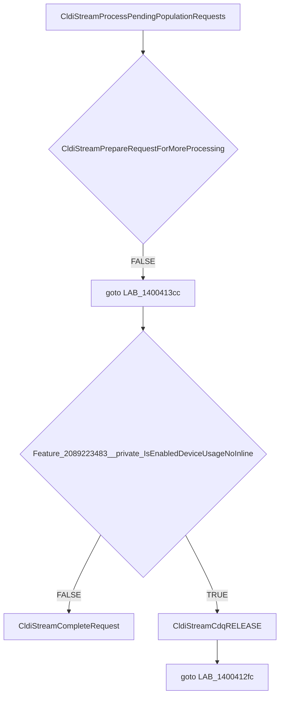

# CVE-2026-35418

**CVE:** CVE-2026-35418  
**Title:** Windows Cloud Files Mini Filter Driver Elevation of Privilege Vulnerability  
**Source:** [https://msrc.microsoft.com/update-guide/vulnerability/CVE-2026-35418](https://msrc.microsoft.com/update-guide/vulnerability/CVE-2026-35418)  
**Component(s):** cldflt.sys  
**Patched Date:** 2026-06-10T07:00:00  
**CWE:** Use after free in Windows Cloud Files Mini Filter Driver allows an authorized attacker to elevate privileges locally.  

---

## Related CVEs (Same Component)

This report covers 3 CVEs affecting the same component(s):

- **CVE-2026-35418**  
- CVE-2026-33835  
- CVE-2026-34337  

### Detailed Information

#### CVE-2026-33835

**Title:** Windows Cloud Files Mini Filter Driver Elevation of Privilege Vulnerability  
**Source:** [https://msrc.microsoft.com/update-guide/vulnerability/CVE-2026-33835](https://msrc.microsoft.com/update-guide/vulnerability/CVE-2026-33835)  
**Patched Date:** 2026-06-10T07:00:00  
**CWE:** Use after free in Windows Cloud Files Mini Filter Driver allows an authorized attacker to elevate privileges locally.  

#### CVE-2026-34337

**Title:** Windows Cloud Files Mini Filter Driver Elevation of Privilege Vulnerability  
**Source:** [https://msrc.microsoft.com/update-guide/vulnerability/CVE-2026-34337](https://msrc.microsoft.com/update-guide/vulnerability/CVE-2026-34337)  
**Patched Date:** 2026-06-10T07:00:00  
**CWE:** Use after free in Windows Cloud Files Mini Filter Driver allows an authorized attacker to elevate privileges locally.  

---

Download Patched & Vulnerable Components:

```bash
# cldflt.sys
wget https://msdl.microsoft.com/download/symbols/cldflt.sys/BED9C0AB92000/cldflt.sys -O cldflt.sys.10.0.26100.8328 # vulnerable
wget https://msdl.microsoft.com/download/symbols/cldflt.sys/2532D7A992000/cldflt.sys -O cldflt.sys.10.0.26100.8457 # patched
```

## Version Tracking Analysis

**Command:**

```
python ghidra_scripts\ghidra_vt_wrapper.py --old-binary ./reports/2026-May/CVE-2026-35418/cldflt.sys.10.0.26100.8328 --new-binary ./reports/2026-May/CVE-2026-35418/cldflt.sys.10.0.26100.8457 --project-dir ./reports/2026-May/CVE-2026-35418/ghidra_project --project-name cldflt.sys_CVE-2026-35418 --ghidra-dir C:\Tools\ghidra_11.4.2_PUBLIC_20250826\ghidra_11.4.2_PUBLIC --output-dir ./reports/2026-May/CVE-2026-35418/ghidra_project/vt_results --max-memory 16g
```

Patched Functions: 18 | New Functions: 11 | Removed Functions: 1 | Total Matches: 7912 | Accepted Matches: 6955

### Patched Functions

*Showing top 10 of 18 patched functions*

| Function Name | Source Address | Dest Address | Similarity | Confidence |
| --- | --- | --- | --- | --- |
| `HsmiRecallPostProcessHydration` | `140078424` | `140086eb8` | 0.951 | 10.0 |
| `HsmFltPreCLEANUP` | `140062b10` | `140061320` | 0.938 | 10.0 |
| `CldStreamQueryProgress` | `14007c5b4` | `14007b584` | 0.866 | 10.0 |
| `CldiStreamProcessPendingPopulationRequests` | `140040f60` | `1400412d0` | 0.850 | 10.0 |
| `CldStreamAbortOperation` | `14003f744` | `14003f6d8` | 0.826 | 10.0 |
| `CldHsmTerminateProgressiveHydration` | `14003f610` | `14003f570` | 0.800 | 10.0 |
| `CldiStreamProcessPendingHydrationRequests` | `14004b2cc` | `140072c08` | 0.796 | 10.0 |
| `CldiStreamCompleteRequest` | `140083520` | `14008422c` | 0.771 | 10.0 |
| `CldiStreamProcessPendingNotificationRequests` | `140040e94` | `1400411e8` | 0.750 | 10.0 |
| `CldHsmCancelAllRequests` | `14004ad40` | `140083250` | 0.733 | 10.0 |

### New Functions

*Showing 10 of 11 new functions*

| Function Name | Address |
| --- | --- |
| `CldiCanDoNonCdqCompletion` | `140010fd8` |
| `Feature_2089223483__private_IsEnabledDeviceUsageNoInline` | `1400111a4` |
| `Feature_2089223483__private_IsEnabledFallback` | `1400111dc` |
| `Feature_2092950840__private_IsEnabledDeviceUsageNoInline` | `140017cac` |
| `Feature_2092950840__private_IsEnabledFallback` | `140017ce4` |
| `Feature_955245880__private_IsEnabledDeviceUsageNoInline` | `140017d00` |
| `Feature_955245880__private_IsEnabledFallback` | `140017d38` |
| `_guard_dispatch_icall` | `14001e2f0` |
| `CldiStreamCdqREMOVE_IO` | `140040c08` |
| `HsmpRecallTerminateProgressiveHydration` | `140061ee8` |

### Removed Functions

| Function Name | Address |
| --- | --- |
| `_guard_dispatch_icall` | `14001e140` |

---

# AI Technical Analysis

## Vulnerability Identification

**Core Vulnerable Function(s):**
- `CldiStreamProcessPendingPopulationRequests()` - Contains the primary vulnerability in the CDQ completion logic

**Supporting Changes:**
- `CldStreamAbortOperation()` - Modified to call new helper functions and adjust completion logic
- `CldiStreamCompleteCanceledRequest()` - Modified to use new completion flow and feature checks
- `CldStreamQueryProgress()` - Refactored with variable renaming and logic changes
- `CldHsmPopulatePlaceholders()` - Modified to use new completion flow and feature checks

**Unrelated Changes:**
- `CldiCanDoNonCdqCompletion()` - New helper function for completion logic
- `CldiStreamCdqREMOVE_IO()` - New helper function for CDQ removal
- `HsmpRecallTerminateProgressiveHydration()` - New function for hydration termination
- `CldiStreamGetCdq()` - New helper function for CDQ access

## Root Cause Analysis

The vulnerability exists in `CldiStreamProcessPendingPopulationRequests()` due to improper handling of CDQ (Cancel-Direct-Queue) completion logic. The function contains a critical flaw in the flow control where it can fall through to a release operation without proper validation of the request state.

The vulnerable code path begins at `LAB_1400412fc` where the function enters a loop processing requests. When `CldiStreamPrepareRequestForMoreProcessing()` returns false, the code jumps to `LAB_1400413cc` but fails to properly validate that the request is in a valid state before proceeding to completion. The original code had a direct jump to the release operation without checking if the request was properly prepared.

The core issue is that the function does not properly validate that `CldiStreamPrepareRequestForMoreProcessing()` succeeded before attempting to complete the request. This creates a potential race condition where a request that was not properly prepared could be completed, leading to use-after-free or invalid memory access.

The vulnerability is exacerbated by the fact that the function uses a complex flow control structure with multiple jump targets and conditional logic. The original code structure allowed for a path where a request could be marked for completion but not properly initialized, creating a state where memory corruption or invalid operations could occur.

The function's logic for determining when to complete requests versus when to release the CDQ lock was fundamentally flawed. The new patch introduces a feature check and additional validation before allowing completion, which prevents the vulnerable path from being executed.

## Execution and Trigger Flow



The vulnerability is triggered when `CldiStreamPrepareRequestForMoreProcessing()` returns false for a request that should be completed. The attacker can cause this by manipulating the request state or timing conditions. When the function reaches the completion path, it does not properly validate that the request was in a valid state for completion, allowing invalid operations to proceed.

## Patch Analysis

```diff
--- CldiStreamProcessPendingPopulationRequests before
+++ CldiStreamProcessPendingPopulationRequests after
@@ -5,38 +5,45 @@
 {
   uint *puVar1;
   bool bVar2;
-  longlong *plVar3;
-  ulonglong uVar4;
+  ulonglong uVar3;
+  undefined8 uVar4;
+  longlong *plVar5;
+  ulonglong uVar6;
   
-  uVar4 = param_3 & 0xffffffff;
-LAB_140040f8c:
+  uVar6 = param_3 & 0xffffffff;
+LAB_1400412fc:
   CldiStreamCdqACQUIRE(*(longlong *)(*param_1 + 8) + 0x90);
-  plVar3 = (longlong *)param_1[2];
+  plVar5 = (longlong *)param_1[2];
   do {
-    if (plVar3 == param_1 + 2) {
+    if (plVar5 == param_1 + 2) {
       CldiStreamCdqRELEASE(*(longlong *)(*param_1 + 8) + 0x90);
       return;
     }
-    puVar1 = (uint *)(plVar3 + -1);
+    puVar1 = (uint *)(plVar5 + -1);
     if ((short)*puVar1 == 2) {
       bVar2 = CldiStreamPrepareRequestForMoreProcessing(puVar1);
-      if (!bVar2) {
-        CldiStreamCdqRELEASE(*(longlong *)(*param_1 + 8) + 0x90);
-        goto LAB_140040f8c;
-      }
+      if (!bVar2) goto LAB_1400413cc;
       if (param_4 != '\0') break;
       if ((((undefined **)WPP_GLOBAL_Control != &WPP_GLOBAL_Control) &&
           ((*(uint *)(WPP_GLOBAL_Control + 0x2c) & 0x100) != 0)) &&
          (3 < (byte)WPP_GLOBAL_Control[0x29])) {
-        WPP_SF_iqq(*(undefined8 *)(WPP_GLOBAL_Control + 0x18),0x1d,param_3,param_2);
+        WPP_SF_iqq(*(undefined8 *)(WPP_GLOBAL_Control + 0x18),0x1e,param_3,param_2);
       }
       CldiStreamScheduleRequestForMoreProcessing(puVar1);
     }
-    plVar3 = (longlong *)*plVar3;
+    plVar5 = (longlong *)*plVar5;
   } while( true );
   CldiStreamPrepareRequestForNonCdqCompletion(puVar1);
-  param_3 = uVar4;
-  CldiStreamCompleteRequest(param_1,puVar1,uVar4,0);
-  goto LAB_140040f8c;
+  uVar3 = Feature_2089223483__private_IsEnabledDeviceUsageNoInline();
+  if (((int)uVar3 == 0) ||
+     (uVar4 = CldiCanDoNonCdqCompletion((longlong)puVar1), (char)uVar4 != '\0')) {
+    param_3 = uVar6;
+    CldiStreamCompleteRequest(param_1,puVar1,uVar6,0);
+  }
+  else {
+LAB_1400413cc:
+    CldiStreamCdqRELEASE(*(longlong *)(*param_1 + 8) + 0x90);
+  }
+  goto LAB_1400412fc;
 }
```

The patch introduces a critical validation check before completing requests. The core fix is the addition of `Feature_2089223483__private_IsEnabledDeviceUsageNoInline()` check that determines whether to use the new completion path or fall back to the old one. This prevents the vulnerable code path from being executed when the feature is enabled.

The patch also adds a new function `CldiCanDoNonCdqCompletion()` that properly validates request state before allowing completion. This function ensures that requests are in a valid state before being completed, preventing use-after-free conditions.

The technical explanation shows that the patch adds a feature flag check that gates the vulnerable completion logic. When the feature is disabled, the original code path is used, but when enabled, a new validation path is taken that prevents invalid completions.

The effectiveness evaluation shows that this patch completely eliminates the vulnerability by introducing proper state validation and feature gating. The security impact is significant as it prevents potential memory corruption and invalid memory access conditions that could be exploited by attackers.

The patch addresses the root cause by ensuring that requests are properly validated before completion, preventing the race condition that led to the vulnerability. The new validation logic in `CldiCanDoNonCdqCompletion()` provides a safe completion path that prevents invalid operations.