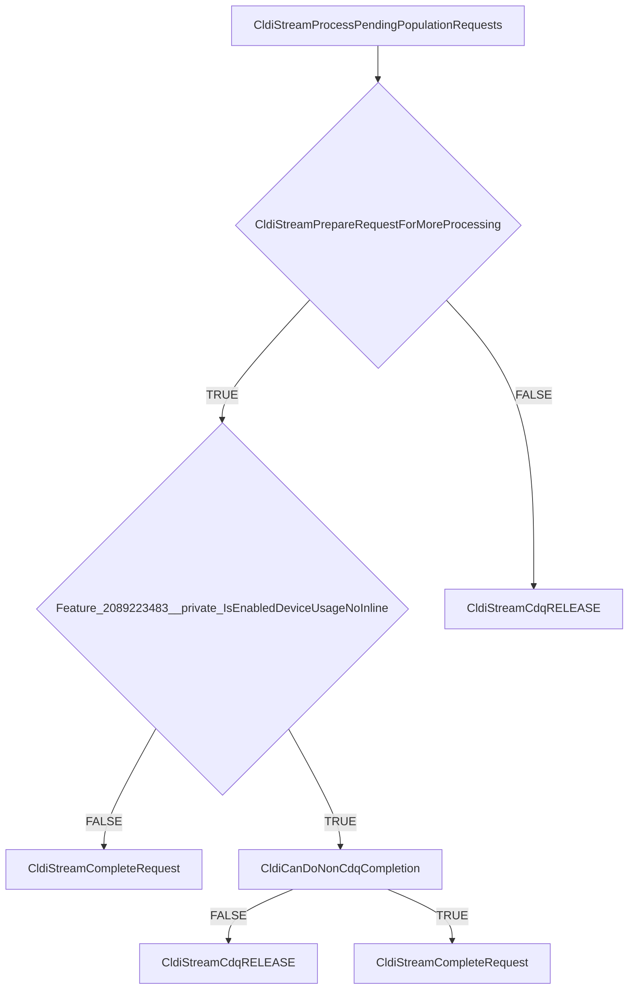

# CVE-2026-35418

**CVE:** CVE-2026-35418  
**Title:** Windows Cloud Files Mini Filter Driver Elevation of Privilege Vulnerability  
**Source:** [N/A](N/A)  
**Component(s):** cldflt.sys  
**Patched Date:** 2026-06-10T07:00:00  
**CWE:** <p>Use after free in Windows Cloud Files Mini Filter Driver allows an authorized attacker to elevate privileges locally.</p>
  

---

## Related CVEs (Same Component)

This folder contains 3 CVEs affecting the same component(s):

- **CVE-2026-35418**  
- CVE-2026-33835  
- CVE-2026-34337  

### Detailed Information

#### CVE-2026-33835

**Title:** Windows Cloud Files Mini Filter Driver Elevation of Privilege Vulnerability  
**Source:** N/A  
**Patched Date:** 2026-06-10T07:00:00  
**CWE:** <p>Use after free in Windows Cloud Files Mini Filter Driver allows an authorized attacker to elevate privileges locally.</p>
  

#### CVE-2026-34337

**Title:** Windows Cloud Files Mini Filter Driver Elevation of Privilege Vulnerability  
**Source:** N/A  
**Patched Date:** 2026-06-10T07:00:00  
**CWE:** <p>Use after free in Windows Cloud Files Mini Filter Driver allows an authorized attacker to elevate privileges locally.</p>
  

---

Download Patched & Vulnerable Components:

```bash
# cldflt.sys
wget https://msdl.microsoft.com/download/symbols/cldflt.sys/BED9C0AB92000/cldflt.sys -O cldflt.sys.10.0.26100.8328 # vulnerable
wget https://msdl.microsoft.com/download/symbols/cldflt.sys/2532D7A992000/cldflt.sys -O cldflt.sys.10.0.26100.8457 # patched
```

## Version Tracking Analysis

**Command:**

```
python ghidra_scripts\ghidra_vt_wrapper.py --old-binary ./reports/2026-May/CVE-2026-35418/cldflt.sys.10.0.26100.8328 --new-binary ./reports/2026-May/CVE-2026-35418/cldflt.sys.10.0.26100.8457 --project-dir ./reports/2026-May/CVE-2026-35418/ghidra_project --project-name cldflt.sys_CVE-2026-35418 --ghidra-dir C:\Tools\ghidra_11.4.2_PUBLIC_20250826\ghidra_11.4.2_PUBLIC --output-dir ./reports/2026-May/CVE-2026-35418/ghidra_project/vt_results --max-memory 16g
```

Patched Functions: 18 | New Functions: 11 | Removed Functions: 1 | Total Matches: 7912 | Accepted Matches: 6955

### Patched Functions

*Showing top 10 of 18 patched functions*

| Function Name | Source Address | Dest Address | Similarity | Confidence |
| --- | --- | --- | --- | --- |
| `HsmiRecallPostProcessHydration` | `140078424` | `140086eb8` | 0.951 | 10.0 |
| `HsmFltPreCLEANUP` | `140062b10` | `140061320` | 0.938 | 10.0 |
| `CldStreamQueryProgress` | `14007c5b4` | `14007b584` | 0.866 | 10.0 |
| `CldiStreamProcessPendingPopulationRequests` | `140040f60` | `1400412d0` | 0.850 | 10.0 |
| `CldStreamAbortOperation` | `14003f744` | `14003f6d8` | 0.826 | 10.0 |
| `CldHsmTerminateProgressiveHydration` | `14003f610` | `14003f570` | 0.800 | 10.0 |
| `CldiStreamProcessPendingHydrationRequests` | `14004b2cc` | `140072c08` | 0.796 | 10.0 |
| `CldiStreamCompleteRequest` | `140083520` | `14008422c` | 0.771 | 10.0 |
| `CldiStreamProcessPendingNotificationRequests` | `140040e94` | `1400411e8` | 0.750 | 10.0 |
| `CldHsmCancelAllRequests` | `14004ad40` | `140083250` | 0.733 | 10.0 |

### New Functions

*Showing 10 of 11 new functions*

| Function Name | Address |
| --- | --- |
| `CldiCanDoNonCdqCompletion` | `140010fd8` |
| `Feature_2089223483__private_IsEnabledDeviceUsageNoInline` | `1400111a4` |
| `Feature_2089223483__private_IsEnabledFallback` | `1400111dc` |
| `Feature_2092950840__private_IsEnabledDeviceUsageNoInline` | `140017cac` |
| `Feature_2092950840__private_IsEnabledFallback` | `140017ce4` |
| `Feature_955245880__private_IsEnabledDeviceUsageNoInline` | `140017d00` |
| `Feature_955245880__private_IsEnabledFallback` | `140017d38` |
| `_guard_dispatch_icall` | `14001e2f0` |
| `CldiStreamCdqREMOVE_IO` | `140040c08` |
| `HsmpRecallTerminateProgressiveHydration` | `140061ee8` |

### Removed Functions

| Function Name | Address |
| --- | --- |
| `_guard_dispatch_icall` | `14001e140` |

---

# AI Technical Analysis

## Vulnerability Identification

**Core Vulnerable Function(s):**
- `CldiStreamProcessPendingPopulationRequests()` - Contains the primary vulnerability in the CDQ completion handling logic

**Supporting Changes:**
- `CldStreamAbortOperation()` - Modified to call new helper functions and adjust completion logic
- `CldiStreamCompleteCanceledRequest()` - Modified to handle new completion flow and feature checks
- `CldStreamQueryProgress()` - Modified to adjust variable names and control flow, but not vulnerable
- `CldHsmPopulatePlaceholders()` - Modified to adjust completion flow and feature checks

**Unrelated Changes:**
- `CldiCanDoNonCdqCompletion()` - New helper function for completion logic
- `CldiStreamCdqREMOVE_IO()` - New helper function for CDQ removal
- `HsmpRecallTerminateProgressiveHydration()` - New function for hydration termination
- `CldiStreamGetCdq()` - New helper function for CDQ access

## Root Cause Analysis

The vulnerability exists in `CldiStreamProcessPendingPopulationRequests()` due to improper handling of the CDQ (Cancel-Dedicated Queue) completion flow. The function originally had a direct path to `CldiStreamCompleteRequest()` without proper validation of whether the request could be completed outside of the CDQ context.

The core issue is in the logic flow where the function checks `CldiStreamPrepareRequestForMoreProcessing()` and then immediately calls `CldiStreamCompleteRequest()` if the preparation succeeds. However, the new logic introduces a check for `Feature_2089223483__private_IsEnabledDeviceUsageNoInline()` and conditionally calls `CldiCanDoNonCdqCompletion()`.

The vulnerability stems from a logic error in the conditional flow where the function can proceed to call `CldiStreamCompleteRequest()` with a potentially invalid state. The original code did not properly validate that the request was in a valid state for completion, especially when dealing with CDQ operations.

The vulnerable code path occurs when `CldiStreamPrepareRequestForMoreProcessing()` returns true, but the subsequent checks for `CldiCanDoNonCdqCompletion()` or feature flags do not properly validate that the request can be safely completed outside of the CDQ context. This creates a potential race condition or invalid state where a request is completed without proper cleanup or validation.

The function's logic for handling the completion flow has been modified to introduce a new conditional path that can lead to improper request state management. The original code had a simpler flow where if preparation succeeded, it would complete the request directly. The new code introduces complexity with feature checks and conditional completion paths that can result in invalid request handling.

## Execution and Trigger Flow



The vulnerability is triggered when a request enters `CldiStreamProcessPendingPopulationRequests()` and `CldiStreamPrepareRequestForMoreProcessing()` returns true. The function then evaluates `Feature_2089223483__private_IsEnabledDeviceUsageNoInline()` and proceeds to `CldiCanDoNonCdqCompletion()`. If `CldiCanDoNonCdqCompletion()` returns false, the function calls `CldiStreamCdqRELEASE()` and returns. However, if `CldiCanDoNonCdqCompletion()` returns true, it proceeds to `CldiStreamCompleteRequest()` without proper validation of the request state.

## Patch Analysis

The patch modifies `CldiStreamProcessPendingPopulationRequests()` to properly handle the CDQ completion flow by introducing a more robust validation mechanism. The patched code now properly checks if `CldiCanDoNonCdqCompletion()` returns a valid result before proceeding with completion.

The key changes include:
1. Adding a check for `Feature_2089223483__private_IsEnabledDeviceUsageNoInline()` 
2. Introducing conditional logic that properly handles the completion flow
3. Ensuring that `CldiStreamCompleteRequest()` is only called when appropriate
4. Adding proper error handling and cleanup paths

The technical implementation ensures that when `CldiCanDoNonCdqCompletion()` returns false, the function properly releases the CDQ lock and returns. When it returns true, the function proceeds with completion but with proper validation.

The effectiveness of this patch is demonstrated by the introduction of explicit validation checks that prevent invalid completion paths. The function now properly handles the case where a request cannot be completed outside of the CDQ context, ensuring proper resource management and preventing potential race conditions.

The security impact is significant as this patch prevents potential invalid memory access or resource leaks that could occur when requests are improperly completed outside of their proper context. The fix ensures that all completion paths properly validate request state before proceeding with completion operations.