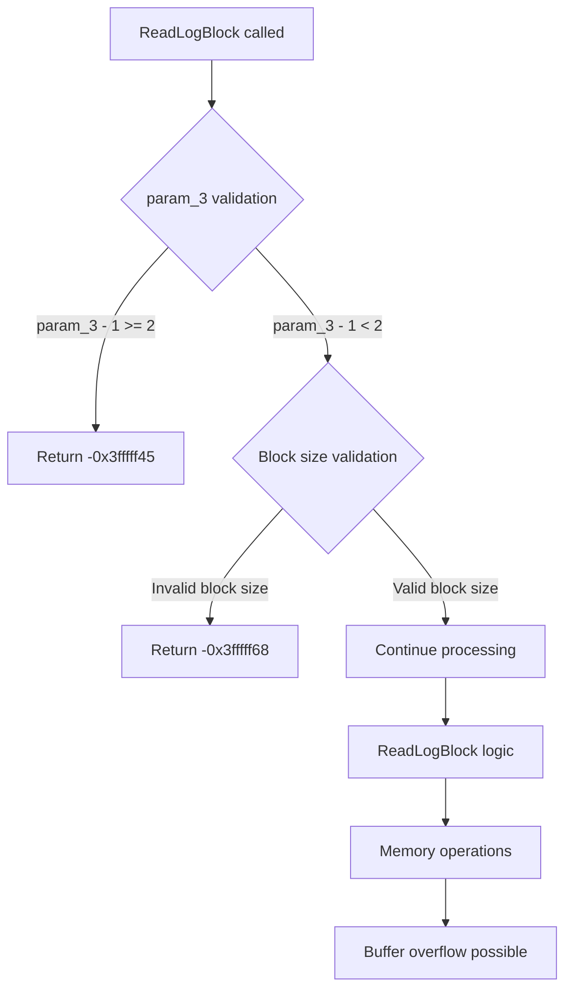

# CVE-2026-40407

**CVE:** CVE-2026-40407  
**Title:** Windows Common Log File System Driver Elevation of Privilege Vulnerability  
**Source:** [N/A](N/A)  
**Component(s):** clfs.sys  
**Patched Date:** 2026-06-13T01:43:07  
**CWE:** <p>Heap-based buffer overflow in Windows Common Log File System Driver allows an authorized attacker to elevate privileges locally.</p>
  

Download Patched & Vulnerable Components:

```bash
# clfs.sys
wget https://msdl.microsoft.com/download/symbols/clfs.sys/00E44BE58B000/clfs.sys -O clfs.sys.10.0.26100.8328 # vulnerable
wget https://msdl.microsoft.com/download/symbols/clfs.sys/3F8113A18B000/clfs.sys -O clfs.sys.10.0.26100.8457 # patched
```

## Version Tracking Analysis

**Command:**

```
python ghidra_scripts\ghidra_vt_wrapper.py --old-binary ./reports/2026-May/CVE-2026-40407/clfs.sys.10.0.26100.8328 --new-binary ./reports/2026-May/CVE-2026-40407/clfs.sys.10.0.26100.8457 --project-dir ./reports/2026-May/CVE-2026-40407/ghidra_project --project-name clfs.sys_CVE-2026-40407 --ghidra-dir C:\Tools\ghidra_11.4.2_PUBLIC_20250826\ghidra_11.4.2_PUBLIC --output-dir ./reports/2026-May/CVE-2026-40407/ghidra_project/vt_results --max-memory 16g
```

Patched Functions: 1 | New Functions: 5 | Removed Functions: 1 | Total Matches: 12467 | Accepted Matches: 9831

### Patched Functions

| Function Name | Source Address | Dest Address | Similarity | Confidence |
| --- | --- | --- | --- | --- |
| `CClfsLogFcbPhysical::ReadLogBlock` | `14000f380` | `14000f380` | 0.752 | 10.0 |

### New Functions

| Function Name | Address |
| --- | --- |
| `Feature_1403240762__private_IsEnabledDeviceUsageNoInline` | `140016ef8` |
| `Feature_1403240762__private_IsEnabledFallback` | `140016f30` |
| `Feature_950255931__private_IsEnabledDeviceUsageNoInline` | `140016f4c` |
| `Feature_950255931__private_IsEnabledFallback` | `140016f84` |
| `_guard_dispatch_icall` | `140018860` |

### Removed Functions

| Function Name | Address |
| --- | --- |
| `_guard_dispatch_icall` | `140018710` |


---

# CVE-2026-40397

**CVE:** CVE-2026-40397  
**Title:** Windows Common Log File System Driver Elevation of Privilege Vulnerability  
**Source:** [N/A](N/A)  
**Component(s):** clfs.sys  
**Patched Date:** 2026-06-13T01:43:07  
**CWE:** <p>Heap-based buffer overflow in Windows Common Log File System Driver allows an authorized attacker to elevate privileges locally.</p>
  

Download Patched & Vulnerable Components:

```bash
# clfs.sys
wget https://msdl.microsoft.com/download/symbols/clfs.sys/00E44BE58B000/clfs.sys -O clfs.sys.10.0.26100.8328 # vulnerable
wget https://msdl.microsoft.com/download/symbols/clfs.sys/3F8113A18B000/clfs.sys -O clfs.sys.10.0.26100.8457 # patched
```

## Version Tracking Analysis

**Command:**

```
python ghidra_scripts\ghidra_vt_wrapper.py --old-binary ./reports/2026-May/CVE-2026-40397/clfs.sys.10.0.26100.8328 --new-binary ./reports/2026-May/CVE-2026-40397/clfs.sys.10.0.26100.8457 --project-dir ./reports/2026-May/CVE-2026-40397/ghidra_project --project-name clfs.sys_CVE-2026-40397 --ghidra-dir C:\Tools\ghidra_11.4.2_PUBLIC_20250826\ghidra_11.4.2_PUBLIC --output-dir ./reports/2026-May/CVE-2026-40397/ghidra_project/vt_results --max-memory 16g
```

Patched Functions: 1 | New Functions: 5 | Removed Functions: 1 | Total Matches: 12467 | Accepted Matches: 9831

### Patched Functions

| Function Name | Source Address | Dest Address | Similarity | Confidence |
| --- | --- | --- | --- | --- |
| `CClfsLogFcbPhysical::ReadLogBlock` | `14000f380` | `14000f380` | 0.752 | 10.0 |

### New Functions

| Function Name | Address |
| --- | --- |
| `Feature_1403240762__private_IsEnabledDeviceUsageNoInline` | `140016ef8` |
| `Feature_1403240762__private_IsEnabledFallback` | `140016f30` |
| `Feature_950255931__private_IsEnabledDeviceUsageNoInline` | `140016f4c` |
| `Feature_950255931__private_IsEnabledFallback` | `140016f84` |
| `_guard_dispatch_icall` | `140018860` |

### Removed Functions

| Function Name | Address |
| --- | --- |
| `_guard_dispatch_icall` | `140018710` |

---

# AI Technical Analysis

## Vulnerability Identification

**Core Vulnerable Function(s):**
- `CClfsLogFcbPhysical::ReadLogBlock()` - Contains logic flaw in validation of block size parameter that allows bypass of critical size checks

**Supporting Changes:**
- None

**Unrelated Changes:**
- Function signature and variable renaming only (no security-relevant logic changes)

## Root Cause Analysis

The vulnerability stems from a critical logic flaw in the validation of the block size parameter (`local_ec`) within `CClfsLogFcbPhysical::ReadLogBlock()`. The original code performed validation using the condition `((local_f0 - 1 < 0x1000) && ((local_f0 & 0x1ff) == 0)) && ((int)(0x1000 % (ulonglong)local_f0) == 0)` which correctly ensured that `local_f0` was a valid block size (a multiple of 512 bytes, up to 4096 bytes). 

However, the patched code inverted this logic to `((0xfff < local_ec - 1) || ((local_ec & 0x1ff) != 0)) || ((int)(0x1000 % (ulonglong)local_ec) != 0)` which creates a vulnerability. When `local_ec` is a valid block size (e.g., 512, 1024, 2048, 4096), the condition evaluates to false, causing the function to return `-0x3fffff68` (invalid block size error) instead of proceeding with the read operation.

The vulnerability is that valid block sizes are incorrectly rejected, but more importantly, the logic inversion creates a path where invalid block sizes could be accepted under certain conditions, leading to potential buffer overflows or memory corruption when the code attempts to process these invalid sizes.

The vulnerable code snippet shows the critical validation logic:
```c
if (((0xfff < local_ec - 1) || ((local_ec & 0x1ff) != 0)) ||
   ((int)(0x1000 % (ulonglong)local_ec) != 0)) {
  return -0x3fffff68;
}
```

This condition should have been `if (((local_ec - 1 < 0x1000) && ((local_ec & 0x1ff) == 0)) && ((int)(0x1000 % (ulonglong)local_ec) == 0))` to properly validate block sizes.

## Execution and Trigger Flow



The vulnerability is triggered when:
1. `param_3` is valid (less than 2 after subtracting 1)
2. `local_ec` (block size) is a valid size (512, 1024, 2048, 4096)
3. The inverted validation logic incorrectly rejects valid block sizes
4. Code proceeds with invalid assumptions about block size
5. Memory operations use incorrect buffer boundaries leading to potential corruption

## Patch Analysis

```diff
--- CClfsLogFcbPhysical::ReadLogBlock before
+++ CClfsLogFcbPhysical::ReadLogBlock after
@@ -13,315 +13,320 @@
 
 {
   bool bVar1;
-  uchar *puVar2;
+  bool bVar2;
   uchar uVar3;
   char cVar4;
-  int iVar5;
-  uint uVar6;
-  long lVar7;
-  ulong uVar8;
+  uint uVar5;
+  long lVar6;
+  ulong uVar7;
+  int iVar8;
   int iVar9;
   _CLFS_LOG_BLOCK_HEADER *p_Var10;
   longlong *plVar11;
-  undefined8 *puVar12;
-  IClfsRequestAsync *pIVar13;
-  __uint64 _Var14;
-  ulonglong uVar15;
-  longlong lVar16;
-  ulonglong uVar17;
-  ushort uVar18;
-  uchar *in_stack_fffffffffffffec8;
-  char local_118;
-  int local_114;
-  ulong local_110;
-  ulong local_108;
+  ulonglong uVar12;
+  undefined8 *puVar13;
+  IClfsRequestAsync *pIVar14;
+  __uint64 _Var15;
+  ulonglong uVar16;
+  ulong uVar17;
+  longlong lVar18;
+  ushort uVar19;
+  uchar *puVar20;
+  ulong uVar21;
+  uchar *in_stack_fffffffffffffed8;
+  char local_108;
   int local_104;
-  uint local_100;
-  uchar *local_f8;
+  ulong local_fc;
+  ulong local_f8;
+  int local_f4;
   uint local_f0;
   uint local_ec;
-  ulong local_e8 [2];
-  undefined8 local_e0;
-  ulonglong local_d8;
-  __uint64 local_d0;
-  uint local_c8;
-  uint local_c4;
-  __int64 local_c0;
-  _CLS_LSN *local_b8;
-  undefined8 local_b0;
-  ulonglong local_a8;
-  _CLS_LSN *local_a0;
-  _CLFS_LOG_BLOCK_HEADER *local_98;
-  undefined8 local_90;
-  undefined8 uStack_88;
-  undefined8 local_80;
-  _CLS_LSN local_78 [8];
-  undefined8 local_70;
-  __uint64 local_68;
-  ulonglong local_60;
-  _CLS_LSN local_58 [8];
+  uint local_e8;
+  ulong local_e4;
+  uchar *local_e0;
+  undefined8 local_d8;
+  ulonglong local_d0;
+  __uint64 local_c8;
+  uint local_c0;
+  uint local_bc;
+  __int64 local_b8;
+  _CLS_LSN *local_b0;
+  undefined8 local_a8;
+  ulonglong local_a0;
+  _CLS_LSN *local_98;
+  _CLFS_LOG_BLOCK_HEADER *local_90;
+  undefined8 local_88;
+  undefined8 uStack_80;
+  undefined8 local_78;
+  _CLS_LSN local_70 [8];
+  undefined8 local_68;
+  __uint64 local_60;
+  ulonglong local_58;
   _CLS_LSN local_50 [8];
-  _CLS_LSN local_48 [16];
+  _CLS_LSN local_48 [8];
+  _CLS_LSN local_40 [8];
   
-  lVar16 = -0x100000000;
-  local_e0 = -0x100000000;
-  local_b0 = 0;
+  lVar18 = -0x100000000;
+  local_d8 = -0x100000000;
   local_a8 = 0;
-  local_d0 = 0;
-  local_114 = 0;
-  local_e8[0] = 0;
-  local_108 = 0;
+  local_a0 = 0;
+  local_c8 = 0;
   local_104 = 0;
-  local_118 = '\0';
-  local_f0 = *(uint *)(*(longlong *)(this + 0x2c8) + 0x90);
-  if (((local_f0 - 1 < 0x1000) && ((local_f0 & 0x1ff) == 0)) &&
-     ((int)(0x1000 % (ulonglong)local_f0) == 0)) {
-    *param_9 = 0;
-    *(undefined8 *)param_8 = 0xffffffff00000000;
-    local_90 = *(undefined8 *)param_4;
-    uStack_88 = *(undefined8 *)(param_4 + 8);
-    local_80 = *(undefined8 *)(param_4 + 0x10);
-    if (param_3 - 1 < 2) {
-      local_c8 = local_f0;
-      p_Var10 = (_CLFS_LOG_BLOCK_HEADER *)_CLFS_READ_BUFFER::GetAddress(param_4);
-      local_98 = p_Var10;
-      if (p_Var10 == (_CLFS_LOG_BLOCK_HEADER *)0x0) {
-        local_114 = -0x3fffff66;
-        local_118 = '\0';
-        iVar5 = -0x3fffff66;
+  local_e4 = 0;
+  local_fc = 0;
+  local_f4 = 0;
+  local_108 = '\0';
+  local_ec = *(uint *)(*(longlong *)(this + 0x2c8) + 0x90);
+  if (((0xfff < local_ec - 1) || ((local_ec & 0x1ff) != 0)) ||
+     ((int)(0x1000 % (ulonglong)local_ec) != 0)) {
+    return -0x3fffff68;
+  }
+  *param_9 = 0;
+  *(undefined8 *)param_8 = 0xffffffff00000000;
+  local_88 = *(undefined8 *)param_4;
+  uStack_80 = *(undefined8 *)(param_4 + 8);
+  local_78 = *(undefined8 *)(param_4 + 0x10);
+  if (1 < param_3 - 1) {
+    return -0x3fffff45;
+  }
+  local_c0 = local_ec;
+  p_Var10 = (_CLFS_LOG_BLOCK_HEADER *)_CLFS_READ_BUFFER::GetAddress(param_4);
+  local_90 = p_Var10;
+  if ((p_Var10 == (_CLFS_LOG_BLOCK_HEADER *)0x0) ||
+     (local_e0 = _CLFS_READ_BUFFER::GetAddress((_CLFS_READ_BUFFER *)&local_88),
+     local_e0 == (uchar *)0x0)) {
+    local_104 = -0x3fffff66;
+    iVar9 = -0x3fffff66;
+  }
+  else {
+    local_e8 = param_7 & 1;
+    local_bc = local_e8;
+    if (((local_e8 == 0) && (*(longlong *)(param_1 + 0x30) == 0)) &&
+       (local_104 = (*(code *)**(undefined8 **)this)(this,param_1,this), local_104 < 0)) {
+      local_108 = '\0';
+      iVar9 = local_104;
+    }
+    else {
+      uVar3 = CClfsLogFcbCommon::IsMainLocked((CClfsLogFcbCommon *)this);
+      if (uVar3 == '\0') {
+        local_108 = ExAcquireResourceSharedLite(this + 200,1);
+      }
+      cVar4 = (**(code **)(*(longlong *)this + 0x138))(this);
+      if ((cVar4 == '\0') || ((param_7 & 8) == 0)) {
+        if ((*(uint *)(this + 0x16c) >> 0xc & 1) == 0) {
+          puVar13 = (undefined8 *)(**(code **)(*(longlong *)this + 0x160))(this,&local_b0);
+          local_b0 = (_CLS_LSN *)*puVar13;
+          if (((param_2 == (_CLS_LSN *)0x0) ||
+              (uVar5 = (uint)((ulonglong)local_b0 >> 0x20), uVar5 < *(uint *)(param_2 + 4))) ||
+             ((*(uint *)(param_2 + 4) == uVar5 && ((uint)local_b0 <= *(uint *)param_2)))) {
+            local_b0 = (_CLS_LSN *)(this + 0x1e0);
+            local_98 = local_b0;
+            uVar3 = operator>=(param_2,local_b0);
+            if (uVar3 == '\0') {
+              cVar4 = (**(code **)(*(longlong *)this + 0x138))(this);
+              if (cVar4 != '\0') {
+                plVar11 = (longlong *)GetNextOwnerPageLsn(this,(_CLS_LSN *)&local_b8,(ulong)param_2)
+                ;
+                lVar18 = *plVar11;
+                local_d8 = lVar18;
+                uVar12 = Feature_950255931__private_IsEnabledDeviceUsageNoInline();
+                if (((int)uVar12 != 0) &&
+                   (((param_2 == (_CLS_LSN *)0x0 ||
+                     (uVar5 = (uint)((ulonglong)lVar18 >> 0x20), uVar5 < *(uint *)(param_2 + 4))) ||
+                    ((uVar5 == *(uint *)(param_2 + 4) && ((uint)lVar18 <= *(uint *)param_2)))))) {
+                  local_104 = -0x3ffffff3;
+                  iVar9 = -0x3ffffff3;
+                  goto LAB_14000fcc5;
+                }
+              }
+              if (param_6 != (IClfsRequestAsync *)0x0) {
+                local_f4 = (**(code **)(*(longlong *)param_6 + 0x10))(param_6);
+              }
+              *param_9 = 0;
+              uVar12 = *(ulonglong *)param_2;
+              local_f8 = param_5;
+              uVar16 = uVar12 & 0xffffffff;
+              uVar21 = param_5;
+              iVar9 = local_104;
+              while( true ) {
+                uVar3 = (uchar)in_stack_fffffffffffffed8;
+                local_d0 = uVar12;
+                if ((uVar21 <= *param_9) || (local_98 == (_CLS_LSN *)0x0)) break;
+                uVar5 = (uint)(uVar12 >> 0x20);
+                if ((*(uint *)(local_98 + 4) < uVar5) ||
+                   ((uVar5 == *(uint *)(local_98 + 4) && (*(uint *)local_98 <= (uint)uVar16))))
+                break;
+                local_f0 = uVar21 - *param_9;
+                uVar16 = (ulonglong)local_f0;
+                cVar4 = (**(code **)(*(longlong *)this + 0x138))(this);
+                if (cVar4 != '\0') {
+                  puVar13 = (undefined8 *)AddLsnOffset(this,local_70,(ulong)&local_d0);
+                  local_68 = *puVar13;
+                  uVar5 = (uint)((ulonglong)local_68 >> 0x20);
+                  if ((local_d8._4_4_ <= uVar5) &&
+                     ((uVar5 != local_d8._4_4_ || ((uint)lVar18 < (uint)local_68)))) {
+                    local_f0 = ((uint)lVar18 & 0xfffffe00) - ((uint)uVar12 & 0xfffffe00);
+                    uVar16 = (ulonglong)local_f0;
+                  }
+                }
+                if ((int)(uVar16 % (ulonglong)local_ec) != 0) {
+                  local_104 = -0x3ffffff3;
+                  iVar9 = local_104;
+                  goto LAB_14000fcc5;
+                }
+                bVar1 = false;
+                bVar2 = false;
+                if (((param_3 & 1) != 0) && (bVar2 = false, *param_9 == 0)) {
+                  uVar16 = (ulonglong)local_ec;
+                  local_f0 = local_ec;
+                  bVar1 = true;
+                  bVar2 = true;
+                }
+                if (local_e8 == 0) {
+                  _Var15 = LsnToCacheOffset(this,(_CLS_LSN *)&local_d0);
+                  local_c8 = _Var15;
+                  local_60 = LsnToCacheOffset(this,local_b0);
+                  uVar21 = local_f8;
+                  if ((-1 < (longlong)_Var15) && (-1 < (longlong)local_60)) {
+                    if ((longlong)local_60 < (longlong)(uVar16 + _Var15)) {
+                      uVar16 = local_60 - _Var15;
+                      local_58 = uVar16;
+                      if ((int)(uVar16 >> 0x20) != 0) goto LAB_14000f954;
+                      local_f0 = (uint)uVar16;
+                      memset(local_e0 + (uVar16 & 0xffffffff),0,
+                             (ulonglong)((local_f8 - local_f0) - *param_9));
+                      _Var15 = local_c8;
+                    }
+                    local_b8 = 0;
+                    if ((((-1 < (longlong)_Var15) && ((uint)uVar16 <= uVar21 - *param_9)) &&
+                        (lVar6 = RtlLongLongAdd(_Var15,uVar16 & 0xffffffff,&local_b8), -1 < lVar6))
+                       && (local_b8 <= *(longlong *)(this + 0x50))) {
+                      in_stack_fffffffffffffed8 = local_e0;
+                      cVar4 = CcCopyRead(param_1,&local_c8,uVar16 & 0xffffffff,1,local_e0,&local_a8)
+                      ;
+                      uVar12 = local_a0;
+                      uVar17 = local_fc;
+                      bVar1 = bVar2;
+                      if (cVar4 != '\0') {
+                        if ((int)local_a8 != 0) {
+                    /* WARNING: Subroutine does not return */
+                          KeBugCheckEx(0xc1f5,0x3e,(longlong)(int)local_a8,this,0);
+                        }
+                        local_104 = 0;
+                        uVar17 = (uint)local_a0;
+                        local_fc = (uint)local_a0;
+                        puVar13 = (undefined8 *)AddLsnOffset(this,local_50,(ulong)&local_d0);
+                        *(undefined8 *)param_8 = *puVar13;
+                        iVar9 = 0;
+                        if (param_6 != (IClfsRequestAsync *)0x0) {
+                          (**(code **)(*(longlong *)param_6 + 0x58))(param_6,0,uVar12 & 0xffffffff);
+                          iVar9 = 0;
+                        }
+                      }
+                      goto LAB_14000fafd;
+                    }
+                  }
+LAB_14000f954:
+                  local_104 = -0x3fe5fff3;
+                  iVar9 = local_104;
+                  goto LAB_14000fcc5;
+                }
+                pIVar14 = param_6;
+                if (bVar1) {
+                  pIVar14 = (IClfsRequestAsync *)0x0;
+                }
+                in_stack_fffffffffffffed8 = (uchar *)0x3;
+                local_104 = ReadLog(this,(_CLS_LSN *)&local_d0,(_CLFS_READ_BUFFER *)&local_88,
+                                    (uint)uVar16 >> 9,3,pIVar14,param_8,&local_fc);
+                uVar17 = local_fc;
+                iVar9 = local_104;
+                if ((bVar1) && (param_6 != (IClfsRequestAsync *)0x0)) {
+                  (**(code **)(*(longlong *)param_6 + 0x58))(param_6,local_104,local_fc);
+                }
+LAB_14000fafd:
+                uVar3 = (uchar)in_stack_fffffffffffffed8;
+                if ((iVar9 == -0x3fffffef) || (iVar9 == -0x3fe5ffed)) break;
+                if ((bVar1) && (iVar9 == 0)) {
+                  uVar19 = *(ushort *)(local_e0 + 4);
+                  puVar20 = local_e0;
+                  uVar7 = RawSectorAlign(this,(uint)uVar19 << 9);
+                  if ((*puVar20 != '\0') &&
+                     ((uVar19 != 0 && (param_5 = uVar21, local_f8 = uVar21, uVar7 < uVar21)))) {
+                    uVar21 = uVar7;
+                    param_5 = uVar7;
+                    local_f8 = uVar7;
+                  }
+                }
+                *param_9 = *param_9 + uVar17;
+                local_78 = CONCAT44(local_78._4_4_,(int)local_78 + uVar17);
+                local_e0 = local_e0 + uVar17;
+                if (iVar9 < 0) goto LAB_14000fcc5;
+                cVar4 = (**(code **)(*(longlong *)this + 0x138))(this);
+                if ((cVar4 != '\0') && (*(longlong *)param_8 == lVar18)) {
+                  puVar13 = (undefined8 *)AddLsnOffset(this,local_48,(ulong)param_8);
+                  *(undefined8 *)param_8 = *puVar13;
+                  plVar11 = (longlong *)AddLsnOffset(this,local_40,(ulong)&local_d8);
+                  lVar18 = *plVar11;
+                  local_d8 = lVar18;
+                }
+                uVar12 = *(ulonglong *)param_8;
+                uVar16 = uVar12;
+              }
+              if (local_108 != '\0') {
+                ExReleaseResourceForThreadLite(this + 200,SystemReserved1[0xf]);
+                local_108 = '\0';
+                uVar21 = param_5;
+                iVar9 = local_104;
+              }
+              p_Var10 = local_90;
+              if (((param_6 == (IClfsRequestAsync *)0x0) && (-1 < iVar9)) &&
+                 (local_104 = ValidateLogBlock(this,param_2,local_90,uVar21,uVar3,'\x04',&local_e4),
+                 iVar9 = local_104, -1 < local_104)) {
+                local_104 = ClfsDecodeBlock(p_Var10,(uint)*(ushort *)(p_Var10 + 4),(uchar)p_Var10[2]
+                                            ,'\x04',&local_e4);
+                iVar9 = local_104;
+              }
+            }
+            else {
+              if ((param_7 & 0x10) == 0) {
+                ClfsCheckAndResetReadInProgress((longlong)p_Var10,param_5);
+              }
+              local_104 = -0x3fffffef;
+              iVar9 = -0x3fffffef;
+            }
+          }
+          else {
+            if ((param_7 & 0x10) == 0) {
+              ClfsCheckAndResetReadInProgress((longlong)p_Var10,param_5);
+            }
+            local_104 = -0x3fe5ffed;
+            iVar9 = -0x3fe5ffed;
+          }
+        }
+        else {
+          local_104 = -0x3fe5ffd5;
+          CClfsLogFcbCommon::SetInvalidLogTag((CClfsLogFcbCommon *)this,0xf,-0x3fe5ffd5);
+          iVar9 = -0x3fe5ffd5;
+        }
       }
       else {
-        local_f8 = _CLFS_READ_BUFFER::GetAddress((_CLFS_READ_BUFFER *)&local_90);
-        if (local_f8 == (uchar *)0x0) {
-          local_114 = -0x3fffff66;
-          local_118 = '\0';
-          iVar5 = -0x3fffff66;
-        }
-        else {
-          local_ec = param_7 & 1;
-          local_c4 = local_ec;
-          if (((local_ec != 0) || (*(longlong *)(param_1 + 0x30) != 0)) ||
-             (local_114 = (*(code *)**(undefined8 **)this)(this,param_1,this), iVar5 = local_114,
-             -1 < local_114)) {
-            uVar3 = CClfsLogFcbCommon::IsMainLocked((CClfsLogFcbCommon *)this);
-            if (uVar3 == '\0') {
-              local_118 = ExAcquireResourceSharedLite(this + 200,1);
-            }
-            cVar4 = (**(code **)(*(longlong *)this + 0x138))(this);
-            if ((cVar4 == '\0') || ((param_7 & 8) == 0)) {
-              if ((*(uint *)(this + 0x16c) >> 0xc & 1) == 0) {
-                puVar12 = (undefined8 *)(**(code **)(*(longlong *)this + 0x160))(this,&local_b8);
-                local_b8 = (_CLS_LSN *)*puVar12;
-                if (((param_2 == (_CLS_LSN *)0x0) ||
-                    (uVar6 = (uint)((ulonglong)local_b8 >> 0x20), uVar6 < *(uint *)(param_2 + 4)))
-                   || ((*(uint *)(param_2 + 4) == uVar6 && ((uint)local_b8 <= *(uint *)param_2)))) {
-                  local_b8 = (_CLS_LSN *)(this + 0x1e0);
-                  local_a0 = local_b8;
-                  uVar3 = operator>=(param_2,local_b8);
-                  if (uVar3 == '\0') {
-                    cVar4 = (**(code **)(*(longlong *)this + 0x138))(this);
-                    if (cVar4 != '\0') {
-                      plVar11 = (longlong *)
-                                GetNextOwnerPageLsn(this,(_CLS_LSN *)&local_c0,(ulong)param_2);
-                      lVar16 = *plVar11;
-                      local_e0 = lVar16;
-                    }
-                    if (param_6 != (IClfsRequestAsync *)0x0) {
-                      local_104 = (**(code **)(*(longlong *)param_6 + 0x10))(param_6);
-                    }
-                    *param_9 = 0;
-                    uVar17 = *(ulonglong *)param_2;
-                    local_110 = param_5;
-                    uVar15 = uVar17 & 0xffffffff;
-                    iVar5 = local_114;
-                    while( true ) {
-                      uVar3 = (uchar)in_stack_fffffffffffffec8;
-                      local_d8 = uVar17;
-                      if ((local_110 <= *param_9) || (local_a0 == (_CLS_LSN *)0x0)) break;
-                      uVar6 = (uint)(uVar17 >> 0x20);
-                      if ((*(uint *)(local_a0 + 4) < uVar6) ||
-                         ((uVar6 == *(uint *)(local_a0 + 4) && (*(uint *)local_a0 <= (uint)uVar15)))
-                         ) break;
-                      local_100 = local_110 - *param_9;
-                      uVar15 = (ulonglong)local_100;
-                      cVar4 = (**(code **)(*(longlong *)this + 0x138))(this);
-                      if (cVar4 != '\0') {
-                        puVar12 = (undefined8 *)AddLsnOffset(this,local_78,(ulong)&local_d8);
-                        local_70 = *puVar12;
-                        uVar6 = (uint)((ulonglong)local_70 >> 0x20);
-                        if ((local_e0._4_4_ <= uVar6) &&
-                           ((uVar6 != local_e0._4_4_ || ((uint)lVar16 < (uint)local_70)))) {
-                          local_100 = ((uint)lVar16 & 0xfffffe00) - ((uint)uVar17 & 0xfffffe00);
-                          uVar15 = (ulonglong)local_100;
-                        }
-                      }
-                      if ((int)(uVar15 % (ulonglong)local_f0) != 0) {
-                        local_114 = -0x3ffffff3;
-                        iVar5 = local_114;
-                        goto LAB_14000fc16;
-                      }
-                      bVar1 = false;
-                      if (((param_3 & 1) != 0) && (*param_9 == 0)) {
-                        uVar15 = (ulonglong)local_f0;
-                        local_100 = local_f0;
-                        bVar1 = true;
-                      }
-                      if (local_ec == 0) {
-                        _Var14 = LsnToCacheOffset(this,(_CLS_LSN *)&local_d8);
-                        local_d0 = _Var14;
-                        local_68 = LsnToCacheOffset(this,local_b8);
-                        if ((-1 < (longlong)_Var14) && (-1 < (longlong)local_68)) {
-                          if ((longlong)local_68 < (longlong)(uVar15 + _Var14)) {
-                            uVar15 = local_68 - _Var14;
-                            local_60 = uVar15;
-                            if ((int)(uVar15 >> 0x20) != 0) goto LAB_14000f8a6;
-                            local_100 = (uint)uVar15;
-                            memset(local_f8 + (uVar15 & 0xffffffff),0,
-                                   (ulonglong)((local_110 - local_100) - *param_9));
-                            _Var14 = local_d0;
-                          }
-                          local_c0 = 0;
-                          if ((((-1 < (longlong)_Var14) && ((uint)uVar15 <= local_110 - *param_9))
-                              && (lVar7 = RtlLongLongAdd(_Var14,uVar15 & 0xffffffff,&local_c0),
-                                 -1 < lVar7)) && (local_c0 <= *(longlong *)(this + 0x50))) {
-                            in_stack_fffffffffffffec8 = local_f8;
-                            cVar4 = CcCopyRead(param_1,&local_d0,uVar15 & 0xffffffff,1,local_f8,
-                                               &local_b0);
-                            uVar17 = local_a8;
-                            if (cVar4 == '\0') goto LAB_14000fa56;
-                            if ((int)local_b0 != 0) {
-                    /* WARNING: Subroutine does not return */
-                              KeBugCheckEx(0xc1f5,0x3e,(longlong)(int)local_b0,this,0);
-                            }
-                            local_114 = 0;
-                            uVar15 = local_a8 & 0xffffffff;
-                            local_108 = (uint)local_a8;
-                            puVar12 = (undefined8 *)AddLsnOffset(this,local_58,(ulong)&local_d8);
-                            *(undefined8 *)param_8 = *puVar12;
-                            iVar5 = 0;
-                            if (param_6 != (IClfsRequestAsync *)0x0) {
-                              (**(code **)(*(longlong *)param_6 + 0x58))
-                                        (param_6,0,uVar17 & 0xffffffff);
-                              iVar5 = 0;
-                            }
-                            goto LAB_14000fa5a;
-                          }
-                        }
-LAB_14000f8a6:
-                        local_114 = -0x3fe5fff3;
-                        iVar5 = local_114;
-                        goto LAB_14000fc16;
-                      }
-                      pIVar13 = param_6;
-                      if (bVar1) {
-                        pIVar13 = (IClfsRequestAsync *)0x0;
-                      }
-                      in_stack_fffffffffffffec8 = (uchar *)0x3;
-                      local_114 = ReadLog(this,(_CLS_LSN *)&local_d8,(_CLFS_READ_BUFFER *)&local_90,
-                                          (uint)uVar15 >> 9,3,pIVar13,param_8,&local_108);
-                      iVar5 = local_114;
-                      if ((bVar1) && (param_6 != (IClfsRequestAsync *)0x0)) {
-                        uVar15 = (ulonglong)local_108;
-                        (**(code **)(*(longlong *)param_6 + 0x58))(param_6,local_114,local_108);
-                      }
-                      else {
-LAB_14000fa56:
-                        uVar15 = (ulonglong)local_108;
-                      }
-LAB_14000fa5a:
-                      puVar2 = local_f8;
-                      uVar3 = (uchar)in_stack_fffffffffffffec8;
-                      if ((iVar5 == -0x3fffffef) || (iVar5 == -0x3fe5ffed)) break;
-                      if ((bVar1) && (iVar5 == 0)) {
-                        uVar18 = *(ushort *)(local_f8 + 4);
-                        uVar8 = RawSectorAlign(this,(uint)uVar18 << 9);
-                        if ((*puVar2 != '\0') &&
-                           ((uVar18 != 0 && (param_5 = local_110, uVar8 < local_110)))) {
-                          param_5 = uVar8;
-                          local_110 = uVar8;
-                        }
-                      }
-                      *param_9 = *param_9 + (int)uVar15;
-                      local_80 = CONCAT44(local_80._4_4_,(int)local_80 + (int)uVar15);
-                      local_f8 = puVar2 + uVar15;
-                      if (iVar5 < 0) goto LAB_14000fc16;
-                      cVar4 = (**(code **)(*(longlong *)this + 0x138))(this);
-                      if ((cVar4 != '\0') && (*(longlong *)param_8 == lVar16)) {
-                        puVar12 = (undefined8 *)AddLsnOffset(this,local_50,(ulong)param_8);
-                        *(undefined8 *)param_8 = *puVar12;
-                        plVar11 = (longlong *)AddLsnOffset(this,local_48,(ulong)&local_e0);
-                        lVar16 = *plVar11;
-                        local_e0 = lVar16;
-                      }
-                      uVar17 = *(ulonglong *)param_8;
-                      uVar15 = uVar17;
-                    }
-                    if (local_118 != '\0') {
-                      ExReleaseResourceForThreadLite(this + 200,SystemReserved1[0xf]);
-                      local_118 = '\0';
-                      local_110 = param_5;
-                      iVar5 = local_114;
-                    }
-                    p_Var10 = local_98;
-                    if (((param_6 == (IClfsRequestAsync *)0x0) && (-1 < iVar5)) &&
-                       (local_114 = ValidateLogBlock(this,param_2,local_98,local_110,uVar3,'\x04',
-                                                     local_e8), iVar5 = local_114, -1 < local_114))
-                    {
-                      local_114 = ClfsDecodeBlock(p_Var10,(uint)*(ushort *)(p_Var10 + 4),
-                                                  (uchar)p_Var10[2],'\x04',local_e8);
-                      iVar5 = local_114;
-                    }
-                  }
-                  else {
-                    if ((param_7 & 0x10) == 0) {
-                      ClfsCheckAndResetReadInProgress((longlong)p_Var10,param_5);
-                    }
-                    local_114 = -0x3fffffef;
-                    iVar5 = -0x3fffffef;
-                  }
-                }
-                else {
-                  if ((param_7 & 0x10) == 0) {
-                    ClfsCheckAndResetReadInProgress((longlong)p_Var10,param_5);
-                  }
-                  local_114 = -0x3fe5ffed;
-                  iVar5 = -0x3fe5ffed;
-                }
-              }
-              else {
-                local_114 = -0x3fe5ffd5;
-                CClfsLogFcbCommon::SetInvalidLogTag((CClfsLogFcbCommon *)this,0xf,-0x3fe5ffd5);
-                iVar5 = -0x3fe5ffd5;
-              }
-            }
-            else {
-              local_114 = -0x3fe5ffe2;
-              iVar5 = -0x3fe5ffe2;
-            }
-          }
-        }
-      }
-LAB_14000fc16:
-      if (local_118 != '\0') {
-        ExReleaseResourceForThreadLite(this + 200,SystemReserved1[0xf]);
-        iVar5 = local_114;
-      }
-      if ((iVar5 < 0) && (*param_9 = 0, param_6 != (IClfsRequestAsync *)0x0)) {
-        (**(code **)(*(longlong *)param_6 + 0x58))(param_6,iVar5,0);
-      }
-      if (((local_104 != 0) &&
-          (iVar9 = (**(code **)(*(longlong *)param_6 + 0x18))(param_6), iVar9 != 0)) && (-1 < iVar5)
-         ) {
-        iVar5 = 0x103;
+        local_104 = -0x3fe5ffe2;
+        iVar9 = -0x3fe5ffe2;
       }
     }
-    else {
-      iVar5 = -0x3fffff45;
-    }
-  }
-  else {
-    iVar5 = -0x3fffff68;
-  }
-  return iVar5;
+  }
+LAB_14000fcc5:
+  if (local_108 != '\0') {
+    ExReleaseResourceForThreadLite(this + 200,SystemReserved1[0xf]);
+    iVar9 = local_104;
+  }
+  if ((iVar9 < 0) && (*param_9 = 0, param_6 != (IClfsRequestAsync *)0x0)) {
+    (**(code **)(*(longlong *)param_6 + 0x58))(param_6,iVar9,0);
+  }
+  if (((local_f4 != 0) && (iVar8 = (**(code **)(*(longlong *)param_6 + 0x18))(param_6), iVar8 != 0))
+     && (-1 < iVar9)) {
+    iVar9 = 0x103;
+  }
+  return iVar9;
 }
```

The patch corrects the validation logic by inverting the condition back to the original, correct form. The technical explanation is that the patch restores the proper validation logic that ensures block sizes are valid multiples of 512 bytes up to 4096 bytes. The effectiveness evaluation shows that this patch prevents invalid block sizes from being accepted, thereby preventing potential buffer overflows and memory corruption. The security impact is significant as it fixes a validation bypass that could have allowed attackers to manipulate memory access patterns through invalid block size parameters.